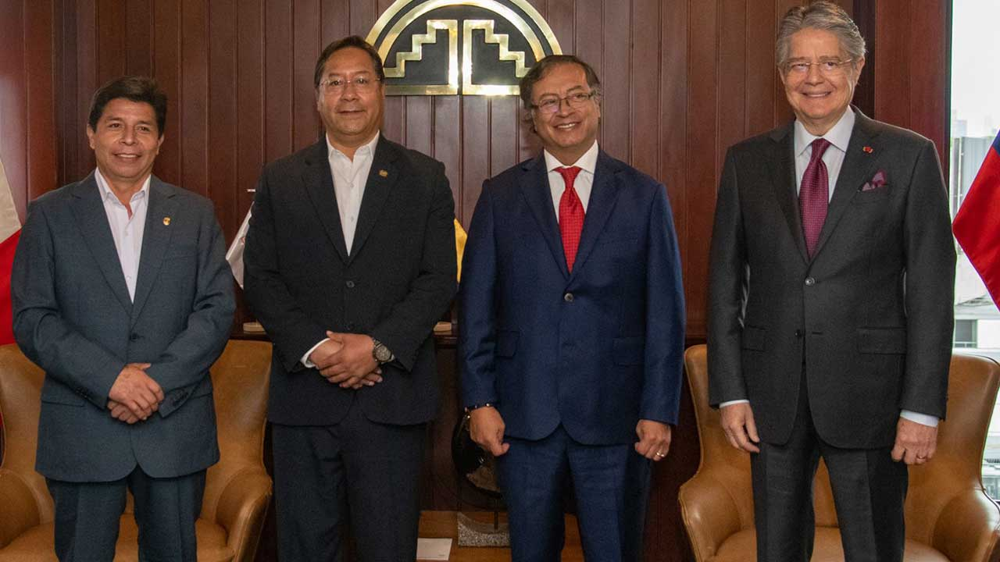

*De Petro a Castillo ¿gobierno compartido o golpe de Estado blando? Cortesía AFP.*

Mientras el congreso de Colombia ponía en práctica su aplanadora al darle **un voto de confianza al presidente Gustavo Petro** con la aplastante derrota de la moción de censura contra la **ministra de Energías Irene Vélez**, el congreso de Perú consumaba un **golpe blando al presidente Pedro Castillo.** ¿Por qué esa diferencia en tratándose de gobiernos de izquierda? Algunos dicen que el **Pacto Histórico** es un gobierno de izquierda gobernando con la derecha. Pero la realidad es que **asistimos a un gobierno compartido** para prevenir un **«**golpe de Estado blando**»**.

Si se caracterizó el régimen precedente como **neobonapartista** —donde una figura civil se erige como salvadora del sistema— ¿cómo asumimos este gobierno presidido por un hombre que a lo largo de su lucha parlamentaria, que duró 30 años, construyó un discurso de izquierda de oposición?

Esa pregunta es un verdadero planteamiento ensayístico del problema. Una respuesta coherente permitiría acercarnos a la explicación dialéctica de la cosa política desde su propia dinámica. Para ello debemos aclarar si el presidente Petro ejecuta un gobierno de izquierda o un gobierno compartido que responde a la tradición parlamentaria colombiana.

## «Si nos aislamos, nos tumban»

La táctica de Gustavo Petro fue buscar un acuerdo muy amplio con todos los sectores políticos. Incluso, **sentarse con el expresidente Álvaro Uribe Vélez**. Hecho que fue criticado por algunos sectores de izquierda. Pero esa reunión buscó neutralizar a una de las fuerzas más retardatarias y violentas de la nación.

Petro sabe que los grupos de poder de derecha tienen un peso específico para llevar a buen término un **«**golpe de Estado blando**»**. Este empieza con un hostigamiento de los grandes medios de comunicación. Construyen una matriz de opinión adversa. Luego sigue una arremetida de control político en el congreso. Y , por último, un acoso judicial a los altos funcionarios de su gobierno. Esto sucedió en **Honduras con Mel Celaya, Bolivia con Evo Morales, Brasil con Dilma Rousseff y Perú con Pedro Castillo**, que terminaron con sus presidentes de izquierda depuestos sin que las fuerzas militares tomaran parte.

En la primera entrevista que le concedió a la revista Cambio, dijo una frase que resume su táctica política del **diálogo nacional** que propuso el 7 de agosto y que viene liderando el presidente del congreso Roy Barreras en esa corporación.

> «Si nos aislamos, nos tumban»

## Un gobierno compartido ¿para qué?

*Pedro Castillo en la última cumbre de Países Andinos. De Petro a Castillo*

Sin embargo, Petro debe entender que su triunfo fue posible gracias a varios hechos de inconformismo que él supo canalizar en su propuesta electoral. **(I)** **El ascenso del movimiento popular** que tuvo su clímax con el Paro Nacional de Abril en 2021, el cual echó atrás la reforma tributaria del presidente Iván Duque. **(II)** El proceso de desgaste de un gobierno que respondía al **declive de un régimen neobonapartista** de derecha inaugurado y liderado por el presidente (2002) **Álvaro Uribe Vélez**. **(III)** Por último, a un **proceso de desderechización de la nación**.

En ese concepto político reside el planteamiento de **gobierno compartido** que hemos caracterizado desde que se dio a conocer los nombres de sus ministerios. Un gobierno compartido que le puede dar una relativa estabilidad. Petro quiere, a cambio, sacar adelante las propuestas sociales de gobierno que le permita fortalecerse ante la sociedad y ante los mismos sectores que lo llevaron a la presidencia. Hasta ahora le ha dado resultado con la Reforma Tributaria, el ministerio de la Igualdad Social, la reforma política que está avanzada, la moción de censura. Con la aprobación del Plan de Desarrollo del Cambio y del presupuesto plurianual, es muy probable que el próximo año sea de expansión del gobierno compartido.

No obstante, (¡atención!) un **gobierno compartido** tiene también alto riesgo. Es verdad que se logra la estabilidad del gobierno a corto plazo. Pero sus resultados podrían ser precarios para construir una verdadera democracia que TRANSFORME las estructuras tradicionales del real poder y mejore la calidad de vida de los más pobres. **Todo cambiaría para seguir igual**. O sea, que el cambio histórico se aplazaría.

## De Petro a Castillo, un gobierno de izquierda, pero...

A diferencia de Petro, **Pedro Castillo** viene del Perú profundo, de los sectores más marginados de las montañas de Los Andes. Y esto es una gran diferencia. Porque Castillo, carece de la formación intelectual y política que tiene el presidente Petro. Es un izquierdista sindicalista sin la visión política profunda de Petro. Existe un handicap que los analistas le endilgan al peruano, que el pasado 7 de diciembre lo declararon vacante por incapacidad moral, **su falta de tino político**.

Desde el mismo inicio de su gobierno, el presidente Castillo fue acosado judicialmente por la derecha Inca. Primero, su elección fue considerada un fraude. Luego enfrentó tres procesos de vacancia, el último por corrupción. Los dos primeros fueron considerados infundados. El último prosperó y terminó con su indecorosa caída y el correspondiente arresto.

La torpeza de Castillo durante su breve período gubernamental fue evidente. Quiso construir legitimidad artificialmente en el congreso. Algunos de los críticos manifiestan que era evidente su dependencia hacia el exgobernador de Junín, **Vladimir Cerrón**, el líder de Perú Libre, movimiento que lo ayudó en su elección. El problema es que nunca construyeron mayoría legislativa, y el único apoyo firme de Castillo eran 15 curules de ese movimiento. Es como decir, las 20 curules que el Pacto Histórico alcanzó en las elecciones de marzo del 2022. Apenas ganó Petro las elecciones, propuso un Gobierno Nacional producto de su Diálogo Nacional. En la moción de censura la aplanadora le puso el 85% de los votos en la cámara de representantes. ¡Una mayoría absoluta!

/articulos/luciotorres/status/1602078001965015044?s=20&t=CkQCuxjOvGF\_gDcZZbQxGw

## De Petro a Castillo

¿Qué va de Gustavo Petro a Pedro Castillo? Ya señalamos una de las grandes diferencia, la formación político del presidente. Castillo no tiene una opinión propia del vaivén político de su país. Incapaz de tomar decisiones políticas acertadas, su gestión, que se inició con grandes expectativas, se fue apagando paulatinamente. Incluso, la decisión de plantearse un **autogolpe inconstitucional** para enfrentar el acoso judicial del congreso y una inminente vacancia, fue considerada por el mismo Cerrón como precipitada.

En efecto, los 15 votos del Perú Libre habían definido que no votarían la vacancia presidencial. Esta situación les impedía a sus promotores alcanzar la mayoría calificada que estaba en **87 votos**. Pero una supuesta modificación de reglamento, esa mayoría la fijaría en 66 votos. Sin duda, esto sería inconstitucional.

En tanto la precariedad de legitimidad política, el presidente Gustavo Petro lo está resolviendo con la entrega de gran parte del gobierno a los grupos de poder. El hecho de que el partido Conservador se convirtió en partido de gobierno, lo dice todo.

## La aplanadora de Petro

Si la derecha legislativa peruana aplicó la aplanadora el 7 de diciembre con la aprobación de la vacancia presidencial de Pedro Castillo, lo propio hizo la coalición de gobierno del presidente Gustavo Petro liderada por el presidente del congreso Roy Barreras, del Pacto Histórico. La votación de la **moción de censura contra la ministra de Energías** **Irene Vélez**, el 6 de diciembre, quedó con 132 votos a favor del “no”, mientras que el “sí” con 24 votos.

Es cierto que la moción de censura contra un ministro es muy diferente al de la vacancia. Pero es un ejemplo evidente del poder legislativo que el Pacto Histórico tiene en el congreso que le da cierta tranquilidad al gobierno del presidente izquierdista Gustavo Petro. ¿Hasta cuándo? Recordemos que son 120 días de gobierno después que asumió el cargo el pasado 7 de agosto. ¿No sucedió lo mismo con Castillo cuando en la votación del primer intento de vacancia salió airoso el 7 de diciembre de 2021? Pero un año después, le fue como perro en misa: **el congreso lo destituyó después de su fallido autogolpe.**

La aplanadora de Petro funcionará hasta donde llegue el aceite que le pueda proporcionar la frondosa burocracia estatal que todavía falta por repartir en un 80%. Los cargos distribuidos solo llegan a nivel ministerial, instituciones nacionales descentralizadas. Esto indica que cuando el aceite se acabe, la aplanadora comenzará a fallar. Y es aquí donde debemos analizar con detenimiento el proceso presidencial de Gustavo Petro. Su estabilidad es proporcional a la capacidad de maniobra para satisfacer la voracidad burocrática de las empresas electorales de los partidos coaligados. El presidente Petro debe aprovechar este año electoral para sacar adelante sus principales iniciativas legislativas. Después de octubre de 2023, se duda que la maquinaria tradicional le pueda seguir los pasos a Petro.

## Golpe de Estado blando y acoso judicial

Según el [Reporte Global anual sobre el estado de la democracia](/articulos/news-media/events/global-state-democracy-2022-global-launch-event) del Instituto Internacional para la Democracia y la Asistencia Electoral (IDEA Internacional) de siete (7) democracias en riesgo en el mundo, tres (3) están en América Latina. Existe una tendencia al autoritarismo que es alérgico al ‘control de gobierno’ y amante a la **posverdad**. La IDEA lo define cuando se dan varios postulados: independencia judicial, actividad parlamentaria efectiva y libertad e integridad de los medios.

¿Puede ser el poder judicial independiente cuando es instrumentalizado por cualquiera de los demás poderes existentes? ¿Puede ser la actividad parlamentaria **efectiva para la democracia** si está también instrumentalizada para hostigar o absolver al ejecutivo sin fundamento democrático?

El estudio nos dice que la cifra de países hacia el autoritarismo es más del doble de los que avanzan hacia la democracia. Perú fue víctima de un proceso de autorismo de derecha liderado por Fujimori que socavó sus estructuras democráticas. Hoy está preso en el mismo sitio donde fue recluido Pedro Castillo. Al salir de ese régimen autocrático, el pueblo de Perú no ha construido un régimen político democrático estable. Han elegido cinco (5) presidentes, y el balance es complicado, porque cuatro (4) terminaron presos (Toledo, Humala, Kuczinsky y Castillo) y uno se suicidó (Alan García) cuando lo fueron a detener por el caso de Odebrecht.

## Los riesgos del Diálogo Nacional

Se suele decir que los acuerdos se hacen con los contrarios. Vale decir, con los representantes de las facciones de derecha del país que le dieron vida al paramilitarismo colombiano. Pero si ese proceso no va acompañado con un **Diálogo Social** que concite a los sectores históricamente marginados, estará condenado a ser una botella de oxígeno para un régimen moribundo. Nos referimos al neobonapartismo, cuyo último presidente debería ser Iván Duque.

El gobierno de Petro debe marcar la ruptura del **régimen neobonapartista** autoritario de corte de derecha. Es decir, que después de su gobierno debe nacer otro régimen político democrático y participativo sin estar matriculado en la derecha o la izquierda. Esto es, un gobierno garantista de la independencia judicial, la actividad parlamentaria efectiva y la libertad e integridad de los medios de comunicación.

En efecto, en cuanto a la matriz de opinión adversa que los medios de prensa nacionales están construyendo, el presidente Petro debe garantizar el funcionamiento de medios alternativos regionales. Pero, sin caer en la tentación de que sean correas propagandísticas de su gobierno. El periodismo no puede funcionar como un brazo del poder político. De lo contrario, es pura propaganda. Ejemplo, las cadenas propagandisticas creadas por Chávez en Venezuela como eespuesta a la Gran Prensa.Y esto no fortalece la democracia directa que sería el propósito de un gobierno democrático.

## La conclusión

Gobierno compartido o «golpe de Estado blando», tal sería la disyuntiva que nos propone la táctica política del gobierno de Gustavo Petro. Si bien esta disyuntiva sea cierta para el momento de su gobierno que surgió con una precaria mayoría, no podría ser el escenario ideal que todo presidente de izquierda desearía.

¿Esta táctica de gobierno compartido podría ser una nueva frustración de las grandes expectativas despertadas por la elección del primer presidente de izquierda que se haya elegido desde que se construyeron los partidos políticos modernos? Si Petro saca adelante sus proyectos sociales anhelados por el pueblo, **sería un gran triunfo**. Si no lo hace, sería una gran frustración para este pueblo que tiene una enorme expectativa con el presidente del Cambio.