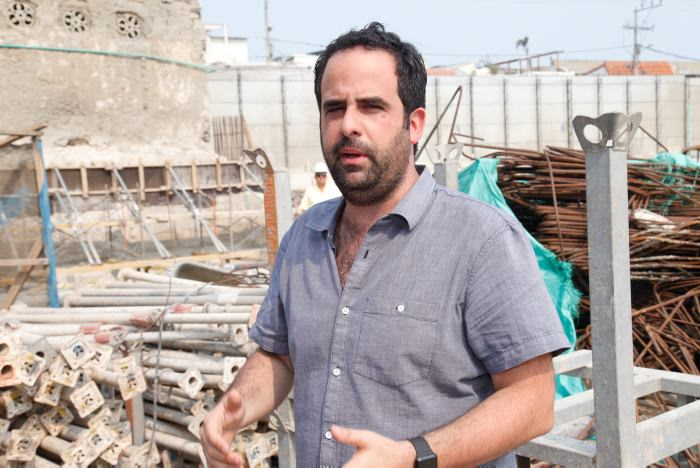
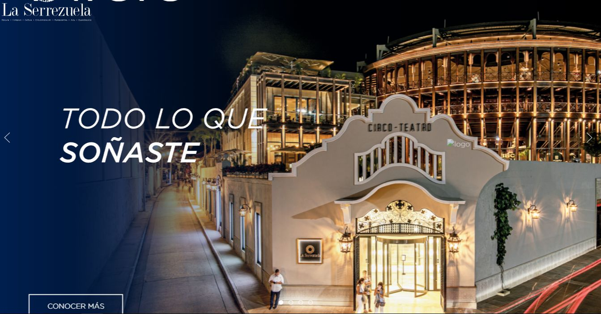

*Aaron Cohen el que está detrás de La Serrezuela. Gentrificación urbana. Foto cortesía.*

Sin duda, La Serrezuela es un lindo proyecto de gentrificación urbana dirigido por **Carlos Dunoyer González**, representante de la **Promotora Cohen**. Son cinco familias de la Calle del Jardín que fueron arrinconadas quizás con la intención de buscar la desvalorización de su patrimonio y así ponerle precios como si fueran tierras conquistadas. Este proceso se está dando por la expansión de ese proyecto urbanístico privado en el histórico barrio de San Diego.

De hecho, La Serrezuela es un **proyecto que de la maqueta aprobada a su materialización se encontraron serias irregularidades y esenciales diferencias.** Pero no fueron obstáculos para producir un daño social más profundo e irreversible que no es compensado por el dinero. Este fenómeno se llama **gentrificación**. Las sanciones sufridas por el proyecto por esas irregularidades se convirtieron en una venia a la bandera. (Lea: **[El acuarelazo de Manga](http://«El acuarelazo» que perturba el patrimonio cultural de Manga: Astorga 414 \(I\)): Astorga 414).**

## Promotora A Cohen y la gentrificación urbana

*Cuando estaban comenzando a ejecutar el proyecto de la Serrezuela como proceso de gentrificación urbana. En el fondo se puede apreciar algunas de las casas que ahora quiere comprar a precio de huevo. Foto cortesía.*

Una de las principales entidades privadas que están haciendo este proceso de gentrificación urbana es la **Promotora A Cohen**. Señalan en uno de sus publireportajes que el proyecto de La Serrezuela fue acometido por un equipo multidisciplinar de arquitectos e ingenieros liderados por el restaurador Álvaro Barrera. Este equipo diseñó, desarrolló, construyó y gerencia un espacio donde se combina el patrimonio de la ciudad con actividades culturales, de entretenimiento y un centro comercial.

Se entiende por gentrificación a los procesos de **renovación de viejos centros urbanos mediante transformaciones materiales** e inmateriales (económicas, sociales y culturales) conducidas por agentes privados y/o públicos. Esto provoca la subida del valor de las propiedades y el consiguiente desplazamiento y/o sustitución, directo e indirecto, de la población residente por otros grupos sociales con poder adquisitivo más elevado. Así lo establecieron los investigadores **Paula Luciana Boldrini y Matilde Malizia** en su investigación del Gran San Miguel de de Tucumán.

La misma Promotora A Cohen tiene otro ambicioso proyecto muy cerca del Circo Teatro La Serrezuela, el antiguo predio de la cárcel distrital de mujeres de San Diego. Según la rectora de la Universidad Bellas Artes, **Sacra Nader**, ese edificio donde funcionó en primer lugar el Monopolio de Licores de Bolívar y luego la cárcel distrital, fue producto de un contrato de concesión entre la gobernación y el arquitecto belga José Martens. [La construcción costó $23.321](/articulos/suplementos/facetas/el-edificio-de-la-carcel-de-san-diego-es-de-joseph-martens-KG6080408).

No obstante, la **Promotora A. Cohen** sería demandada por la firma panameña **Sun Coast Inc**, ya que, según ella, es dueña de la sociedad Huerta San Diego del 30% de las acciones. Empero, Sacra Nader considera que el verdadero dueño es José Martens. Tiene el contrato suscrito entre el secretario de Hacienda de Bolívar y el belga.

## La gentrificación urbana en centros históricos

Sin embargo, el fenómeno de gentrificación no se ha entendido como un hecho negativo por el Estado colombiano. Lo concibe como parte del desarrollo esperado del espacio y de lo social. Esto se explica por las medidas de control que se refieren meramente al aspecto normativo de las construcciones urbanísticas y no al impacto cultural y social que la nueva obra pueda producir.

En Cartagena el proceso de gentrificación se dio a conocer a lo largo de la década de los 80 con la intervención de Chambacú, el barrio más miserable de la ciudad. Esto originó una diáspora, cuya población fue repartida en diferentes zonas extramuros de la ciudad sin el debido acompañamiento social y cultural. Esta situación impulsó las diferencias sociales, la pobreza y, en consecuencia, la delincuencia en toda la ciudad.

Hoy, el tugurio donde se concentraba la pobreza más grande de **La Heroica**, se valorizó con proyectos como el **Edificio Inteligente y el Mall Plaza**. Pero este caso no fue pacífico. Se debe recordar el último aliento de Chambacú con la lucha librada por los propietarios de Papayal. Le siguieron los procesos que están en el Centro Histórico como San Diego y Getsemaní. Pero estos últimos son procesos menos violentos y ceñidos a un aparente apego a la ley y al «desarrollo» de la ciudad.

«»—

> «Los Bienes Materiales de interés Cultural del país, se encuentran cobijados bajo el Régimen Especial de Protección consagrado en la Ley General de Cultura, 397 de 1997, modificada y adicionada por la Ley 1185 de 2008, en virtud del cual toda intervención en un bien de interés cultural, en su área de influencia o en inmuebles colindantes con éste, debe contar con la autorización de la autoridad que hubiere efectuado la respectiva declaratoria».

## Andrés Carne de Res y La Serrezuela, gentrificación urbana

*En su portal web, así presentan a La Serrezuela. Proceso de gentrificación urbana.*

Estos son hechos evidentemente irregulares. Los principales cómplices son el IPCC y el Ministerio de Cultura, cuyos procesos sancionatorios se constituyen en una completa impunidad disfrazada de aplicación de justicia. **Dichas sanciones son inocuas**: ¡10 salarios mínimos legales! para un proyecto multimillonario es una venia a la bandera. Se convierten en la legalización del despojo. Es cierto que el ministerio de Cultura hizo una una **visita a la construcción el 19 de octubre de 2017**. Allí pudieron comprobar que la intervención en La Serrezuela no se ajustaba a lo aprobado, ya que vincularon sin autorización al proyecto tres predios: **Carrera 10 # 39-86, Carrera 10 # 39-82 y Carrera 10 # 39-24**, colindantes al **Circo de Toros**. En esa misma visita se constató que el sótano que se viene construyendo tiene una medida superior a la autorizada en razón a la vinculación de estos tres inmuebles. 

Además, la construcción del restaurante **Andrés Carne de Res**, anexado al proyecto de La Serrezuela, si bien recibió una sanción dentro del proceso **No 18/2020 del Instituto de Patrimonio y Cultura de Cartagena (IPCC),** ello no ha sido óbice para que continué afectando el patrimonio cultural. Pero también está ocasionando afectaciones a los predios vecinos habitados por familias tradicionales del barrio histórico de San Diego. Esto lo hacen con su hecho pensado. Es decir, intencionalmente. Así presionan para que los propietarios vendan a precios fijados por los compradores y no un acuerdo libre de las partes. En la práctica, se convierte en un proceso de despojo urbano.

## Mincultura interviene y Distrito sanciona

El proceso se le siguió por presunta falta contra el patrimonio cultural del distrito. Hubo una indebida intervención del inmueble ubicado en el Barrio San Diego Calle del Jardín No 39-118. Está identificado con la **matrícula inmobiliaria No. 060-34070** y la referencia catastral **No. 01-01-0105-0010-000**.

Esta decisión obedece a que el [Ministerio de Cultura](/articulos/prensa/noticias/Paginas/MinCultura-suspende-obras-de-La-Serrezuela-en-Cartagena.aspx#:~:text=El%20Ministerio%20de%20Cultura%20oficiar%C3%A1%20al%20Alcalde%20Mayor%20de%20Cartagena%20de%20Indias%2C%20para%20que%2C%20en%20cumplimiento%20de%20lo%20dispuesto%20en%20la%20Ley%20General%20de%20Cultura%2C%20proceda%20de%20manera%20inmediata%20a%20ejecutar%20la%20orden%20impartida.%C2%A0) evidenció en una de sus últimas visitas de inspección a las obras, que efectivamente se habían vinculado tres inmuebles colindantes que no estaban contemplados en las dos resoluciones (2009 y 2016) que le dieron vida al proyecto de La Serrezuela.

La historia de la sanción indica que el ministerio de Cultura ofició al Alcalde Mayor de Cartagena de Indias en 2017 para que adoptara en el menor tiempos posible la respectiva sanción. Pero a regañadientes el director de Patrimonio de la época, **Alfonso Cabrera Cruz**, debió adoptar la resolución sancionatoria con una sanción irrelevante. Este procedimiento es de conformidad con lo dispuesto en la **Ley General de Cultura**.

## Las sanciones

La resolución **No 2208** del 27 de Octubre de 2009, y **No 2100** del 2 de Agosto de 2016 autorizaron el proyecto de La Serrezuela como un uso comercial de los predios. Pero de lo autorizado a lo ejecutado existe una gran diferencia. En esta diferencia el Ministerio de Cultura y el IPCC se hace de la vista gorda.

Empecemos por señalar que se suprimió más de cincuenta parqueaderos que el Centro Comercial debe disponer para los vehículos de sus visitantes. Anexó en forma ilegal varios predios. Esas autorizaciones contravinieron lo señalado en el Plan de Ordenamiento Territorial-POT. Allí en el artículo 451 del decreto No 0977 de 2001 y resolución 043 de 1994 de Colcultura en su artículo 93, establecen que la **manzana 105 del Barrio San Diego es residencial**, y de segundo uso institucional. En ningún sentido el POT dice que sean predios de índole comercial.

Las sanciones impuestas y notificadas a **William Alfonso Montes Dedillo** por el jefe de Patrimonio del IPCC de ese entonces, **Alfonso Cabrera Cruz**, evidenciaron que las obras se estaban ejecutando contrario a lo autorizado. ¿Qué dice la actual ministra de Cultura, Patricia Ariza?

## Las vías públicas como parqueaderos

No se niega la recuperación de espacios que yacían mustios y abandonados como el Circo de Teatro. Pero estas iniciativas no pueden ser incompatibles con el desarrollo integral de los espacios físicos y sociales que integren el desarrollo a la cultura. Es más, la recuperación de esos espacios deben convertirse en iniciativas integradoras y no en un pretexto de despojo urbano de nuestro patrimonio histórico.

En ese sentido, la Promotora A Cohen debe adquirir los predios aprisionados con su construcción para que se conviertan en espacios vitales para la cultura y el comercio que no pueden ser fenómenos incompatibles. Lo único que demanda es un poco más de la inversión capitalista. Esto es lo que se quieren ahorrar en la inversión de un lindo proyecto como La Serrezuela.

Por el contrario, han generado un impacto negativo para los residentes del sector. Hoy existe un uso abusivo del espacio público como parqueadero privado. Además de los ruidos provenientes del alto trafico comercial que genera el restaurante **Andrés Carne de Res**. Así se afecta el medio ambiente y la tranquilidad de los vecinos. Este restaurante, por ejemplo, no se entiende cómo fue insertado en el proyecto de La Serrezuela, pues ocupa dos predios sin autorización alguna ni del IPCC ni de Mincultura. Tiene la anuencia de la Secretaría de Planeación Distrital la que extrañamente con un acto administrativo ambiguo, permitió el uso comercial de la manzana 105 de San Diego, lo cual no estaba permitido.

## Colofón

Sin embargo, el **Circo Teatro** fue convertido en un gran **Centro Comercial** **La Serrezuela**. Hermoso, por cierto. Pero, sus promotores ajustaron la ley a los intereses económicos de la **Promotora A Cohen** y a sus inversionistas y no lo contrario. De esta manera, el proceso de **gentrificación urbana** responde a los intereses de los más poderosos que jalonan el desarrollo voraz del capitalismo. Para esto arrasan el patrimonio histórico de la humanidad en nombre del desarrollo capitalista.