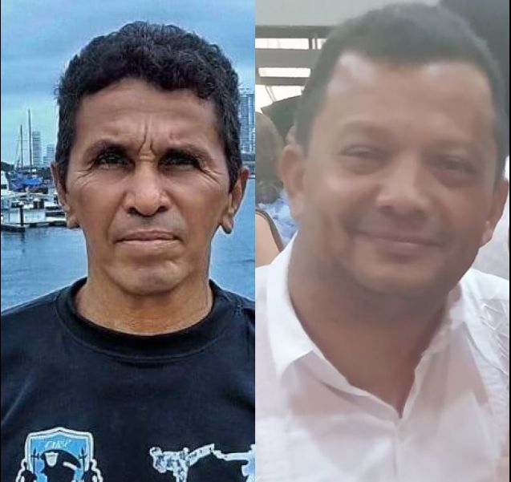
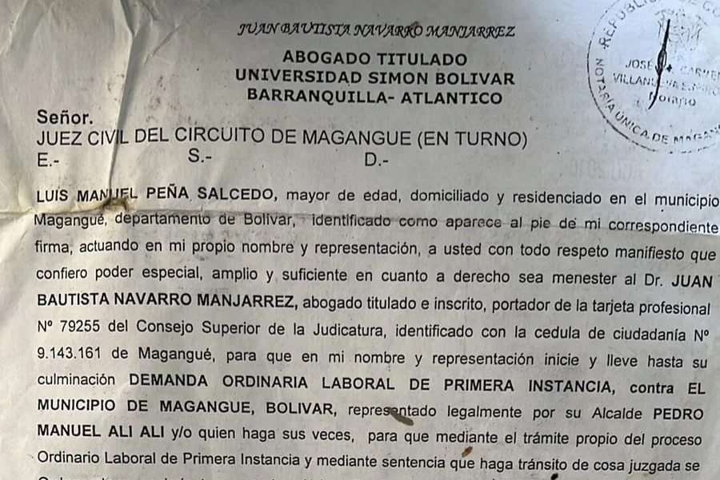
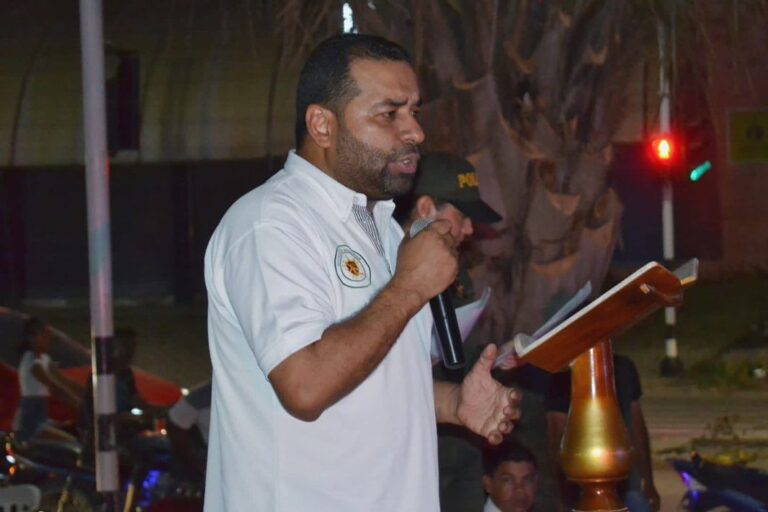

*¿Por qué asesinaron a "Lucho Loco" y su abogado?*

¿Por qué asesinaron a "Lucho Loco" y su abogado Juan Bautista Navarro? ¿Existe alguna conexidad directa de estos dos asesinatos que conmovieron a Magangué y su región? ¿Cuáles son las hipótesis que los investigadores deben plantearse para construir una teoría científica del crimen? ¿Microtráfico?¿Corrupción política? ¿Descomposición social? Los homicidios cometidos el 7 y 10 de diciembre 2022 de estos activistas políticos, despertó una serie de suspicacias. ¿Hay alguna relación con sus actividades sociales, políticas o profesionales? **Desde el presidente Gustavo Petro hasta congresistas condenaron este crimen y exige su esclarecimiento.**

En esta primera entrega realizaremos un abordaje global del doble crimen que debe tener consecuencias penales, sociales y políticas en un municipio cuya descomposición social, política y moral es degradante. Los indicios analizados señalan que no se trata de una sistemática persecución contra los líderes del Pacto Histórico y del petrismo. Existen otros elementos que están íntimamente relacionados con los homicidios.

## «Lucho Loco» y su abogado

**Luis Manuel Peña Salcedo y Juan Bautista Navarro Manjarrez** estaban unidos por el cordón que une al profesional del derecho y su cliente. ¿Qué negocios había entre las víctimas? ¿Por qué se produjeron sus asesinatos con una diferencia de menos de tres días? ¿La orden de su ejecución fue tomada en el mismo lugar y por la misma persona? ¿La causa de este doble crimen es política o social? ¿Obedece al bajo mundo del microtráfico que en Magangué tiene un peso específico en la vida cotidiana? ¿O tiene que ver con el litigio laboral que los dos tenían con la alcaldía de Magangué desde cuando el alcalde Pedro Alí despidió a Lucho Loco?

La construcción de las hipótesis de estos asesinatos, no puede hacerse descontextualizadamente de la realidad política de Magangué. Es una población que en las dos últimas décadas viene sufriendo un gran deterioro político, social y moral que la pone como ejemplo negativo del proceso de degradación de la violencia que vive el país. Proceso que advertimos en 1999 y que publicamos (2016) en el libro [¿Adiós a la guerra? Cinco Claves para la paz](/articulos/politica/lanzan-libro-adios-la-guerra-234510-CXEU341715).

Se debe indicar que Peña era un activista político. Fue candidato al concejo por el partido de la U. Últimamente estuvo vinculado a algunas de las organizaciones que agrupan al **Pacto Histórico**. Era un activista de barrio sin rol de dirigente de esa coalición. Por su parte, Navarro Manjarrez era un profesional del derecho, cuya esposa, **Yaneidis Toscano**, es una lideresa de la **Alianza Verde** que hace parte del Pacto Histórico de ese municipio. Ella contribuyó en el gobierno de la alcaldía de **Marcelo Torres**, de acuerdo a la información suministrada por líderes de esa agrupación.

## Pedro Alí, «Lucho Loco» y su abogado Navarro

*Cortesía, Anastasio Bedoya.*

Vale decir, que hasta donde tenemos entendido, se menciona al exalcalde **Pedro Alí Alí** dentro de este doloroso caso por las reclamaciones de las acreencias hechas en vida por **«Lucho Loco»**. La reclamación se le hizo a Pedro Alí, en su momento, como representante legal de la alcaldía de Magangué.

Debemos recordar que Peña Salcedo contrató los servicios profesionales de Navarro Manjarrez para reclamar —por la vía administrativa y judicial— a la alcaldía municipal de Magangué unas acreencias de tipo laboral. Esta reclamación, como se dijo, se la hizo **Pedro Manuel Alí Alí** cuando este era el alcalde.

De acuerdo con una persona cercana a la alcaldía, casi todos los abogados de la ciudad tienen pleitos con la alcaldía. Es más, sus ingresos muchas veces dependen del litigio que realizan contra el municipio. Sus administradores violan demasiado las leyes, por lo que los procesos en lo contencioso son demasiados y costosos para las mismas comunidades.

«»—

## El doble crimen de «Lucho Loco» y su abogado

Si hacemos una remembranza, debemos precisar que Peña Salcedo fue asesinado **al filo de las 7:00 dela noche. Según indicaron algunos testigos, se encontraba jugando dominó con algunos de sus amigos y vecinos en la puerta de su casa ubicada en el barrio Dos de Noviembre** de Magangué.

Por su parte, el homicidio de **Juan Bautista Navarro Manjarrez, de 56 años, se produjo tres días después en el barrio Montercarlos en horas de la noche del sábado 10 de diciembre. Los sicarios se movilizaron en una motocicleta.**

Existen dos elementos que se deben tener en cuenta para analizar este doble asesinato. El primero es el factor tiempo. Es decir, menos de 72 horas entre uno y el otro. El segundo, es que había una conexidad entre las dos víctimas. Esto sugiere que los autores intelectuales le estarían cobrando alguna "deuda" a los dos. Esta hipótesis la analizaremos en las próximas entregas.

## Los congresistas y el doble crimen

*El representante conservador Yamilito Arana y el presidente del Pacto Histórico reclaman la militancia de Juan Navarro en sus respectivas organizaciones políticas. El alcalde Cabrales tiene un gran compromiso para entender lo que sucede y tomar las decisiones necesarias. (Fotoefectos).*

El presidente del congreso, Roy Barreras Montealegre y el representante a la cámara por el partido Conservador nacido y criado en esta ciudad, **Yamilito Arana Padauí**, reaccionaron enérgicamente pidiendo justicia con sus mensajes vía tuit. Esto dijo Yamilito Arana:

> ¡Maldita Violencia! Otro amigo que se nos va, 12 años haciendo parte de nuestro equipo, lealtad, humildad y nobleza. Magangué te extrañará Juancho.
> 
> Yamilito Arana

/articulos/luciotorres/status/1605163845085204480?s=20&t=5kcrz7LF4NVNlIkj8iEXbg

De otra parte, el presidente del congreso Roy Barreras Montealegre y líder máximo del Pacto Histórico reivindicó el nombre de Navarro como si fuera de esa coalición, dijo:

> «El asesinato de Juan Navarro Manjarrez, líder del [@PactoCol](https://twitter.com/PactoCol?ref_src=twsrc%5Etfw%7Ctwcamp%5Etweetembed%7Ctwterm%5E1602982073773731840%7Ctwgr%5E360258bd1726573556d6dc8938cca4d65bc0b337%7Ctwcon%5Es2_&ref_url=https%3A%2F%2Fvoxpopuli.digital%2Fwp-admin%2Fpost.php%3Fpost%3D19802action%3Dedit) en Magangué exige captura de autores intelectuales e identificación de los grupos sucesores del paramilitarismo que están asesinando a líderes sociales y que pueden de dia enviar mensajes de paz y de noche seguir asesinando».

/articulos/luciotorres/status/1602982073773731840?s=20&t=WiLS1Lsh5373nTsvQLbiBg

## El alcalde Cabrales y la policía

*Carlos Cabrales, alcalde de Magangué, anunciando nuevas medidas de seguridad para esta época luego del doble crimen de «Lucho Loco» y su abogado Navarro.*

Luego del doble crimen, las autoridades locales, departamentales y nacionales expresaron sus respectivas reacciones a los medios de comunicación. Incluso, se hizo un encuentro de seguridad donde se analizó el caso y se tomaron algunas decisiones. Entre estas, aumentar la recompensa para dar con los autores materiales e intelectuales del doble crimen.

El Departamento de Policía Bolívar dijo en un comunicado:

> «A través de policía judicial, Inteligencia policial en coordinación de la Fiscalía General de la Nación continuamos adelantando las investigaciones correspondiente y labores de vecindario a fin de dar con la ubicación, individualización y captura de los autores, cómplices y facilitadores de los asesinos».
> 
> Coronel José Abdón Galindo Sánchez.

Los autoridades ofrecieron $30 millones como recompensa luego del consejo de seguridad que se realizó en la ciudad de Magangué. El alcalde Carlos Cabrales Isaac, junto con la policía, lanzó el pasado fin de semana la estrategia de seguridad con motivo de estos hechos y de las fiestas de Navidad y de Fin de Año. En la próxima entrega una de las hipótesis de este doble crimen.