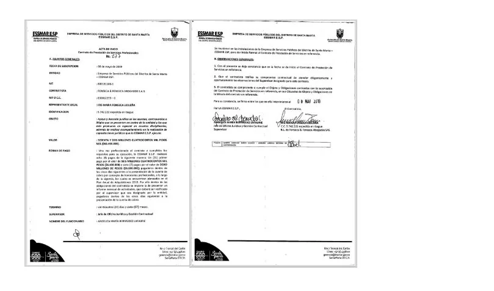

*Caso Mamatoco, un monumento de la corrupción de Fuerza Ciudadana. Aquí está la evidencia. Cortesía.*

El Caso Mamatoco, no solo es la mácula del pequeño imperio del gobernador del Magdalena, **Carlos Eduardo Caicedo Omar**, y de su lugarteniente **Rafael Alejandro Martínez**, sino que será la _**piedra de tropiezo**_ que marcaría la caída de su pequeño imperio en este 2023. **El puesto de salud de Mamatoco es un monumento de corrupción de izquierda** de las dos primeras alcaldías de **Fuerza Ciudadana**, el movimiento que en las pasadas elecciones a congreso fracasó para elegir senador al mismo Martínez.

Son 5 centros de salud, en cuyo proyecto **desaparecieron por arte de magia $3 mil millones**, de los $6.5 mil millones que inicialmente invirtieron en una obra hasta ahora inconclusa. Este proyecto fue contratado dos veces sin el lleno de requisitos, que de $6,5 mil millones pasó a costar **$11,5 mil millones**. El ilícito lo pudieron cometer cuando ambos dirigentes ocuparon la alcaldía de Santa Marta en períodos sucesivos 2014**—**2019.

## El origen del Caso Mamatoco

**El 5 de junio de 2014** se realizó una reunión de la junta directiva presidida por el alcalde de Santa Marta, Carlos Caicedo Omar. **En ella se aprobó la ejecución de un contrato de refacción de los cinco puestos de salud: Mamatoco, La Paz, Taganga, Maria Eugenia y Bastidas**. La nota sobresaliente de esta decisión, es que el alcalde autorizó el contrato sin que el gerente tuviera en la mesa los estudios previos, tal como lo dice el **Manual de Contratación**. Es decir, que violó el principio de planeación y de eficiencia, hecho que le da la condición de requisito legal previo. **Esto quedó sentado en el acta de esa fecha**, como prueba reina para procesar a Carlos Caicedo. Todo esto está en el expediente de este caso que corre el riesgo de quedar en la impunidad.

De esa manera firmaron e**l contrato 004 del 18 de noviembre de 2014**. Fue suscrito entre el gerente de la **ESE Distrital Alejandro Próspero Reverend** y su homólogo de **Mediredes S.A.S**, **Harry Villalobos Tejada**, quien fue capturado y le dieron casa por cárcel. Pero luego quedó en libertad. Además de Caicedo y Martínez, son 4 funcionarios más procesados por estos presuntos delitos. Los otros son: **Carlos Fabián Slebi Palacio**, interventor del contrato; **Jesús Enrique Navarro Brito**, contratista; **Édgar Charris Salcedo**, gerente encargado de la E.S.E., y **Gregorio Antonio Domínguez Fonseca**, gerente de la E.S.E. Lo curioso es que después de **6 años del proceso**, nadie está en la cárcel. Reina la más completa impunidad con la complicidad del poder judicial de Santa Marta.

Y ese hecho de evidente corrupción administrativa al cuadrado **—**pues lo cometieron dos veces con los mismos puestos de salud**—** no es un invento de sus enemigos políticos de derecha como lo quieren presentar. Por el contrario, es una conducta seriamente cuestionada por el fiscal que conoció el hecho al imputarle dos delitos: **peculado por apropiación agravado con provecho de tercero y contratación sin el cumplimiento de los requisitos legales**. Ambos alcanzaron a tener medidas de detención preventiva en 2018, la cual fue levantada, presuntamente, por soborno a jueces y magistrados.

## Un embuste para provecho electoral

*¿Caicedo Omar y Johnson Salcedo se eligieron en 2019 con la plata de la corrupción? La sociedad exige una explicación. Caso Mamatoco. Cortesía.*

Este hecho lo aprovecharon políticamente para engañar a los más incautos de sus seguidores que le creyeron la carreta de persecución política en 2019. Se victimizaron. Con esta conducta lograron concitar las diferentes fuerzas de izquierda. Este hecho de corrupción lo transformaron en un **hecho político** que les permitió elegir a **Virna Johnson a la alcaldía y Carlos Caicedo a la gobernación**. ¿Sucederá esto en 2023? (Leer: [Carlos Caicedo se siente perseguido en su gobernación](/articulos/carlos-caicedo-se-siente-perseguido-en-su-gobernacion/)).

Recordemos que en 2014 demolieron los cinco puestos de salud. Lo hicieron sin permiso de la Curaduría ni de Planeación del Ministerio de Salud. Tampoco lo contemplaron en la planeación ni el pliego de condiciones. Caicedo terminó su administración y dejó esos cinco elefantes blancos en escombros. Llegó Rafael Martínez como alcalde y también hizo lo mismo. En este caso realizó otro contrato con $5 mil millones más para cubrir la falta de la administración anterior. Pero, Martínez solo pudo entregar cuatro de los cinco puestos de salud en 2019. Se volvieron a _mamar la plata_ de Mamatoco, **obra que hoy —**8 años más tarde— **es una sinfonía inconclusa de la corrupción de Fuerza Ciudadana**. ¿Votaría la gente de Mamatoco por los candidatos de este movimiento de izquierda cercano al Pacto Histórico que no es nada diferente a la mafia política que había estado incrustada en el poder público de Santa Marta y Magdalena?

## Los sobornos del Caso Mamatoco

*Captura de pantalla de uno de los seis contratos entregados a la hermana del Magistrado Carlos Milton Fonseca Lidueña. Ella se llama Iris María Fonseca Lidueña.*

De manera que este 2023, dicha acusación —que la están dilatando al mejor estilo de los corruptos tradicionales— la debe resolver el **Juez Tercero Penal del Circuito de Conocimiento de Santa Marta, Jairo Villalba De Ángel** y la **Corte Suprema de Justicia—CSJ**. Pero el proceso está plagado de una serie de hechos donde hay denuncias serias de sobornos al poder judicial. Se teme que la Fiscalía 12 Delegada ante la Corte Suprema de Justicia le eche escopolamina al proceso para ponerlo a dormir eternamente. Es decir, **quieren archivarlo indebidamente como ha sucedido con otros procesos**.

El Caso Mamatoco en el 2021, luego de un accidentado proceso donde los sindicados lograron quitarse una medida de aseguramiento, el sindicado Caicedo pasó a la Fiscalía 12 ante el magistrado **Jorge Caldas Vera** de la Corte Suprema de Justicia (CSJ). En su calidad de aforado, la condena o absolución debe proferirla ese alto tribunal. La primera audiencia virtual se hizo en noviembre de ese año sin la presencia del procesado. Por esta razón, los medios de comunicación libres y la Procuraduría, así como la veeduría de Santa Marta, deben ejercer una vigilancia estrecha sobre los cincos puestos de salud.

Cabe resaltar que existen pruebas de soborno contra dos magistrados del Tribunal Superior de Santa Marta. Ellos son: **Carlos Milton Fonseca Lidueña y David Vanegas González**. Dicen algunos funcionarios que conocen a Fonseca, que en esta administración de Caicedo y de Johnson se enriquecieron en forma mágica. Una de las pruebas son los seis contratos recibidos por la firma de la **hermana del magistrado Carlos Milton Fonseca con la administración distrital**. Se trata de **Iris María Fonseca Lidueña**, gerente de Fonseca & Fonseca S.A.S, que firmó seis contratos en el **período 2017-2019** con la Empresa de Servicios Públicos del Distrito de Santa Marta**—Essmar E.S.P** y la empresa Sistema Estratégico de Transporte Público de Santa Marta**—SEPT**. Ni siquiera se declaró impedido para fallar una tutela que favoreció a los implicados.

## Mamatoco, 5 mil usuarios sin salud

Mientras tanto, la verdad _monda y lironda_ es que se apropiaron indebidamente de **$3 mil millones en el primer contrato autorizado por el alcalde de entonces, Carlos Eduardo Caicedo Omar.** El 50% lo desaparecieron a dentelladas. Y no dejaron ni siquiera para pegar un ladrillo en los cinco puestos de salud demolidos. Este contrato adjudicado a **Mediredes S.A**. fue tipo sastre para que la firma ganadora hiciera y deshiciera con los recursos. Su objeto no fue para resolver la caótica situación de los puestos de salud de los samarios más pobres, descuidados por la politiquería tradicional, sino para robarse el dinero. Todo indica, a juzgar por las pruebas presentadas por las fuentes, que el dinero de la salud lo «invirtieron» en la campaña de **Virna Johnson** a la alcaldía, y **Carlos Eduardo Caicedo** a la gobernación **de 2019**.

No obstante, lo más perverso de esta corrupción política**—**administrativa, esto es lo más importante, fue que la comunidad histórica de Mamatoco, la más desprotegida de Santa Marta, se quedó sin la prestación de este servicio esencial. Por ende, **el puesto de Salud de Mamatoco es un monumento de corrupción del pequeño imperio de Carlos Caicedo y sus acólitos.** Más de 5 mil usuarios pobres no son atendidos adecuadamente en salud, y todo porque alguién se quedó con más de $3 mil millones. **Esto está demostrado**. No es una hipótesis. Es la verdad de la gestión de Carlos Caicedo como alcalde. Lo demás es propaganda barata de sus áulicos.

En cambio, la fiscalía demostró con pruebas de peritos idóneos que **Rafael Martínez** también cometió el mismo delito que su antecesor **Carlos Caicedo**, siendo presidentes, respectivamente, de la junta directiva de la Empresa de Salud del Estado**—ESE Distrital Alejandro Próspero Reverend**. Cometieron tres irregularidades. **Primero**, no hicieron estudios previos antes de realizar el contrato. Se violó el principio de planificación. **Segundo**, que en el momento de contrato se hizo sin llenar los requisitos legales vigentes. **Tercero,** que se apropiaron más de $ 3 mil millones. Los investigadores y las pruebas técnicas llevaron a la Fiscalía a concluir que la empresa contratada no justificó la inversión de esos $3 mil millones. En algún bolsillo privado se quedaron.

## Dilatar, dilatar

La estrategia de los procesados es dilatar, dilatar. Y cuando no lo puede hacer, recurren al soborno. Esto se colige del mismo proceso. La conclusión de la Fiscalía indica que ese dinero se lo apropiaron indebidamente por los ejecutores del contrato con la complicidad directa de los funcionarios procesados. **Es un hecho que está demostrado**.

Pero, esa verdad demostrada se estrella con un poder judicial samario permeado por la corrupción descarada. Una corrupción que va desde un simple notificador hasta a algunos magistrados. Ciertos fiscales, que no han sido comprados, dicen que jueces corruptos venden los procesos al mejor postor, como sucedió con Caicedo. Hay fiscales expertos en adormecer los procesos para archivarlos. Otras veces, recurren a la tutela para obtener resultados. Por ejemplo, la tutela que les falló **Carlos Milton Fonseca Lidueña y David Vanegas González** interpuesta ante el Tribunal Superior de Santa Marta donde se le "obligó" al juez pronunciarse sobre la libertad de Martínez. Lograron su cometido, el juzgado falló a favor de los procesados con una tesis peregrina. El fallo fue impugnado y declarado como improcedente por el juez superior.

El proceso de los puestos de salud **—**como se dijo**—** está siendo dilatado por los presuntos implicados. Pero existen evidencias de sobornos a jueces, magistrados y altos funcionarios públicos del poder judicial. Este caso presenta el típico comportamiento de las diferentes mafias políticas incrustadas en la administración pública.

## Plata en cajas de zapatos

Para lograr ese fallo de tutela, pagaron un soborno por **$800 millones.** Lo hicieron en dos entregas al secretario del juzgado donde se debía definir la libertad de los implicados: **Carlos Caicedo y Rafael Martínez.** El fallo ya había sido proyectado por el veterano juez que se fue de licencia. Según uno de los testimonios, que pidió reserva por razones obvias, el primer pago fue por **$500 millones en efectivo**, entregados en varias cajas de zapatos. Los otros $300 millones restantes, lo hicieron en una calle céntrica de Santa Marta.

Este hecho lo desarrollaremos con pelos y señales en próximas entregas. Se trata de que la opinión pública comprenda que la corrupción, que no es de derecha ni de izquierda, es un derivado de la mala conducta de individuos inescrupulosos en la administración pública y en el poder judicial. Próxima entrega: **Preguntas urgentes por Mamatoco.**