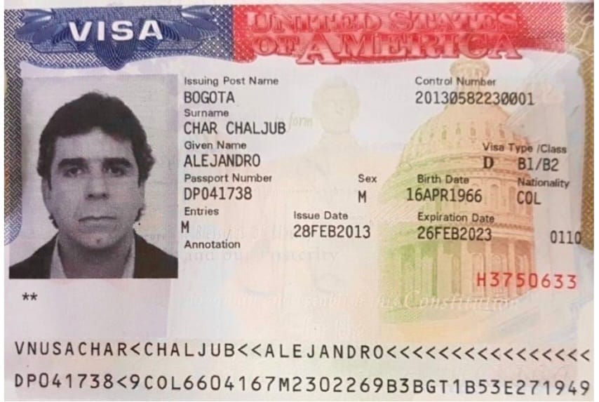

*¿Por qué le negaron la visa a Estados Unidos a Alejandro Char? Cunde el pánico en el Clan Daes—Char*

Cunde el pánico en el Clan Daes—Char. Son tres fantasmas que le acechan en este 2023 como una **_espada de Damocles_** que pende sobre la cabeza de Fuad Char, sus cachorros y sus aliados más íntimos, los hermanos José Manuel «Yuyo» y «Tío» Christian Daes. El primer fantasma causó mucho ruido: la negación del visado de turista a Estados Unidos de **Alejandro Char Chaljub**. El segundo, la audiencia pública de **«Jorge 40»** ante la JEP el 26 y 27 de enero está por reventar. El tercero, la repatriación de la condenada **Aida Merlano,** «**_la exbaby sugar_** del clan», quien declarará por el caso de **Casa Blanca** y otros hechos de corrupción electoral. \[**Lea con atención**: [Caída de «Casa Blanca» ¿fin del califato Daes—Char? (I)](/articulos/caida-de-casa-blanca-fin-del-califato-daes-char-i/)\].

El expresidente del congreso Arturo Char es uno de los implicados, porque **entregó cerca de 500 millones de pesos que fueron utilizados para obtener votos de manera irregular** . Está citado para indagatoria ante la **Corte Suprema de Justicia**. \[Lea: [¿Fuad Char y sus hijos responderán por «Casa Blanca»? (II)](/articulos/fuad-char-y-sus-hijos-responderan-por-casa-blanca/)\].

¿Cómo enfrentará el Clan Daes—Char esos tres fantasmas que los tiene en pánico? ¿Soportará las presiones nacionales e internacionales que cada día sube de nivel? ¿Cuál será la conducta del presidente Petro? ¿Qué papel asumirá el nuevo fiscal general que elegirá el congreso este año? En esta primera entrega presentaremos algunas pistas de la suerte que correrá Fuad Char y sus socios. La negación de la visa de su más visible figura política tiene una trascendencia única. **Indicaría que los Estados Unidos colaboraría para un eventual caso de lavado de activo que pende sobre esa organización político—empresarial.** ¿La entrega de la hermana de los jefes del Cartel de Cali, Amparo Rodríguez Orejuela, tendrá que ver con esta situación?

El caso del clan Daes—Char pone en alerta a otros clanes que tienen un pasado **_non sancto_**. Oros fueron condenados por la parapolítica y narcotráfico.

## Cunde el pánico de la visa

El rumor se había regado como pólvora: negación de la visa de turista a varios miembros de la familia Char. En horas de la tarde de hoy 24 de enero, los medios publicaron la noticia: le negaron la renovación de visa al exgobernador, exalcalde Barranquilla dos veces y Consejero Presidencial, **Alejandro Char Chaljub**. Pero, todo indica que no es el único de esa familia que sufrirá esa medida discrecional de la embajada norteamericana.

Una fuente de entero crédito allegada a la familia Char, le dijo a **VoxPopuli Digital** que se sospecha que la medida no solo afectaría a Alejandro Char. Existen otros integrantes a quienes se les notificaría la no renovación de su visado a los Estados Unidos.

Algunos miembros de los Char y los Daes comenzaron a hacer movimientos con el fin de saber si la embajada norteamericano les renovará la visa de turista. **Antonio Char**, hermano de Alejandro y presidente del atlético **Junior**, es la cabeza visible de la familia en los negocios internacionales. Algunas de sus empresas tienen sede en Panamá y Delaware. De hecho, Antonio Char debe tener visa de negocios. ¿Qué pasaría si se la niegan? ¿Sería una catástrofe económica para la expansión financiera de los Char en los Estados Unidos y Centroamérica? ¿Cómo afectaría el aparato ideológico que gira en torno al Junior de Barranquilla? \[**Lea**: [Barranquilla, el Califato Daeschariano es insostenible](/articulos/barranquilla-el-califato-daeschariano-se-hace-insostenible/)\].

> La oficina de prensa de la embajada de ese país le dijo a Caracol que esa entidad "no comenta sobre casos de visas individuales”.

## La audiencia de "Jorge 40" ante la JEP

Recordemos que **Rodrigo Tovar Pupo**, de un gris personaje en Valledupar, pasó a ser uno de los criminales más temido de todo el Caribe. Entró a Barranquilla con **Laino Scopetta «Ojitos Azules»** en 1998 asesinando a supuestos lideres de la guerrilla. Este periodista se salvó de la politica de exterminio de estos criminales. Pero, está demostrado, que su verdadero motivo era la economía y la política barranquillera. En esta ciudad no había acción guerrillera. La clase política y los grandes empresarios emergentes como los Daes y Char debieron aliarse con el nuevo jefe criminal. (Lea: [El retorno de «Jorge 40», sus aliados y sus muertos (I)](/articulos/el-retorno-de-jorge-40-sus-aliados-y-sus-muertos/)\]

Esta semana será crucial para este clan que ejerce un dominio total en la Barranquilla, ahora llamada por ellos **«La Ventana del Mundo»**, porque es la publicidad perenne de las ventanas de Tecnoglass. Dejó de ser **«La Puerta de Oro de Colombia»** o **«La Arenosa»**. \[[La paradoja de la justicia. **«Ojitos Azules»**, empresario criminal (I)](/articulos/la-paradoja-de-la-justicia-una-madre-esposada-y-un-criminal-endiosado/)\]

Estar sin visa a Estados Unidos para estos empresarios y políticos es una desgracia. Es condenarlos a ser _**parias internacionales**._ Quedan en la categoría de un **Nicolás Maduro** o un **Manuel Antonio Noriega**, el ex hombre fuerte de Panamá que languideció en una cárcel norteamericana acusado de lavado de activos y narcotráfico.

En la próxima entrega lo que dirá «Jorge 40». No se lo pierda, porque será un artículo **«King Tero»**. Se lo prometo.