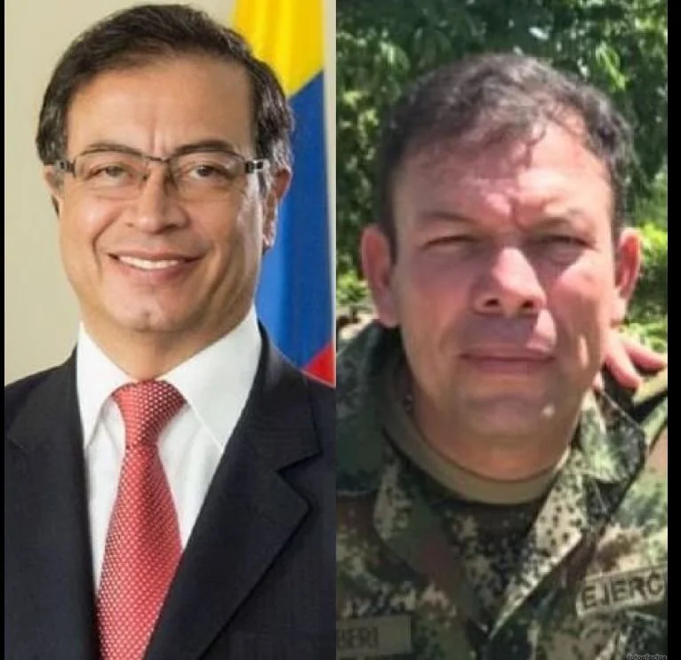
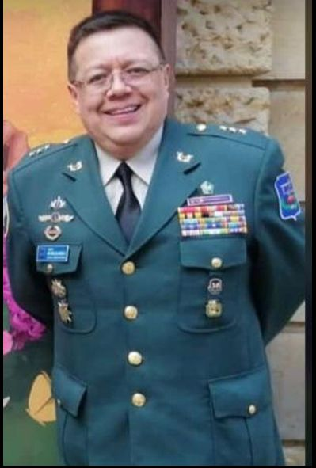

*¿Denuncia temeraria de Bejarano?: «Petro y Barberi, caterva peligrosa de criminales». Es una acusación peligrosa que las autoridades deben esclarecer de inmediato.*

¿La denuncia evidentemente temeraria del fiscal Bejarano contra un Fiscal Especializado por venganza personal o interés de la mafia, se le podría devolver como un bumerang? Los hechos —y las pruebas que el periodista posee— sugieren que es una denuncia temeraria y de mala fe. Temeraria, porque la presentó dos veces sin ninguna justificación jurídica. De mala fe, porque son falsas acusaciones contra el fiscal Barberi por el simple hecho de que este expresó que le simpatizaba las propuestas del hoy presidente Petro, a quien Bejarano considera **«jefe de una caterva peligrosa de criminales»**.

Se percibe en esas dos denuncias, con el mismo objeto y sujeto, la existencia de una mezcla de venganza personal y una motivación que va más allá de la sed de justicia y del deber ciudadano de denunciar el delito. Por tanto, el controvertido y pintoresco fiscal **Ricardo Bejarano Beltrán** estaría incurso en una conducta típica de **denuncia temeraria**, injuria y calumnia en perjuicio del fiscal **José Fernando Barberi Forero, pero también del presidente Gustavo Petro.** Además, violentaría la ley y el reglamento interno de las fuerzas militares, ya que se ufana de ser alto oficial en uso de buen retiro, cuando solo es oficial de la reserva de profesionales. Podría ser procesado administrativa, penal y disciplinariamente.

**Lean con atención.** La declaración del fiscal Bejarano es una corriente de pensamiento político dominante al interior de la Fiscalía General de la República y de las Fuerzas Armadas. Esta sola declaración ante el director nacional de Fiscalía es una prueba irrefutable que demandaría una respuesta inmediata del fiscal General Francisco Barbosa, del comandante de las Fuerzas Militares y del propio presidente Gustavo Petro. Esta corriente de pensamiento es peligrosa que se podría traducir en el futuro como **caldo de cultivo para un golpe de Estado blando** mediante el hostigamiento y acoso judicial contra el presidente Petro.

## Bejarano: «Petro y Barberi, caterva peligrosa de criminales»

Eso lo dijo Ricardo Bejarano en su condición de fiscal delegado ante el director ejecutivo de Fiscalía. Además, es uno de los elementos conceptuales y, por tanto, subjetivos en su denuncia contra Barberi ante el director ejecutivo de Fiscalía, **José Tobías Betancur Ladino**. La denuncia, datada el 23 de abril de 2019, fue una diatriba contra el buen nombre de Barberi y del hoy presidente de la república, **Gustavo Petro**, quien en aquellos momentos había sido derrotado por Iván Duque. Este era el tenor de dicha denuncia:

> «Llama la atención del suscrito fiscal delegado, que un oficial retirado de la Armada Nacional se declare fiel seguidor de los postulados de Gustavo Petro, fiero militante de la izquierda terrorista que participó en el incendio del Palacio de Justicia y homicidio de los más altos magistrados de la Corte Suprema de Justicia y del Consejo de Estado».

No obstante, la diatriba del fiscal Bejarano contra Barberi y el hoy presidente Petro no quedó allí. Trascendió todo tipo de respeto en las personas, en el servidor público y en la ley y reglamento que las mismas Fuerzas Militares deben prodigarse. ¿Puede atacarse impúdicamente a un servidor público sin que la justicia disciplinaria caiga contra él?

> «Subrayar que un oficial en uso de retiro deshonroso de la Armada Nacional, que en la actualidad ostenta una alta dignidad del Estado (Fiscal Especializado) se declara fiel seguidor de una caterva de criminales que tanto daño le ha causado al país».

¿Qué propósitos tiene el fiscal Bejarano para presentar esta presunta denuncia temeraria? Los antecedentes indicarían que sus intenciones no estarían motivadas por el deber de perseguir el delito del otro. En realidad, su verdadero propósito es causar daño. ¿Cuál es el verdadero motivo que este fiscal tiene para presentar, por lo menos dos veces, la misma denuncia en diferentes instancias de la Fiscalía? ¿Por inquina? ¿A quien le está haciendo el mandado? Tal hecho tiene como finalidad moverle el piso a uno de los Fiscales Especializados de Extinción de Dominio que mejor resultados tiene en su accionar contra la mafia de toda pelambre. O lo persigue porque, estando retirado de la Armada Nacional, se declaró seguidor de las ideas expuestas por Gustavo Petro. ¿Es un crimen profesar unas ideas, una opinión? Si la respuesta es sí, Bejarano no debería estar un segundo más en la Fiscalía.

## Bejarano, un tibio fiscal con denuncia temeraria

En este informe se explicará la principal hipótesis que se puede construir de un posible delito que busca inducir al error a los administradores de justicia. Pero, sobre todo, busca hacerle daño moral y material a un fiscal como Barberi Forero quien había sido injustamente involucrado en un complot diseñado y ejecutado para dañar al vicealmirante **Gabriel Arango Bacci**. Pero también afecta al buen nombre del presidente de la república y crea las condiciones para acciones inconstitucionales que podría desestabilizar al país con un **«golpe de Estado blando»**.

Sea lo primero decir que **Ricardo Bejarano Beltrán** es un abogado de la Universidad Nacional, graduado con la distinción **Summa Cum Laude**. Inteligente. Habilidoso y brillante. Ultraderechista. Según la resolución **N° 0 2358 de la Fiscalía General de la República**, que define la planta de personal, es **fiscal delegado**. A lo largo de su historia como funcionario público (23 años), además de ser un personaje pintoresco que en su interior se debate entre ser abogado o ser artista del vallenato, se caracteriza por ser polémico en sus actuaciones extraproceso. No es la primera vez que se ve enfrentado a otro fiscal. Vale decir, se le conoce por ser un **fiscal complaciente con la mafia**, manipulador de los sujetos procesales para beneficio propio. Esto lo denunció públicamente la fiscal **Jenny Ortiz Landino** dentro del proceso del homicidio del hijo de **Carlos Rodríguez**, un narco confeso residente en Barranquilla.

¿Por qué es un fiscal manipulador? Según Ortiz Landino, mientras se bajaba en Barranquilla en la casa de **Carlos Rodríguez**, alias «el Sastre» —y hasta lloraba con él por la muerte de su hijo— Bejarano le suministraba ilegalmente información a los posibles autores intelectuales del homicidio, entre ellos al **«Ñene» Hernández** y, de contera, a **«Marquitos» Figueroa**, un sanguinario criminal guajiro condenado tres veces por diferentes asesinatos. Entre ellos la de **Óscar Eduardo Rodríguez Pomar**, hijo de Carlos Rodríguez. Hace un año, el 11 de enero de 2022, **Figueroa fue condenado a 36 años de prisión**. Además, en marzo de ese mismo año, lo condenaron por el asesinato de tres funcionarios del Ministerio del Transporte, entre ellos a **Elkin de Jesús Becerra Ramírez,** asesor jurídico de esa cartera.

## Antecedentes non sancto de Bejarano

¿Por qué un abogado brillante termina con tan mala fama como la que ganó el tristemente célebre Zar Anticorrupción, el barranquillero **Luis Gustavo Moreno**, condenado por corrupción en el ejercicio de sus funciones como fiscal? Escudriñando un poco en la gran estela dejada como funcionario público, nos encontramos que Bejarano y Moreno tienen rasgos similares que encuadran en un comportamiento patológico con inclinación al crimen. Bejarano saltó a la fama no tanto por haber ganado un juicio contra la mafia, sino por ser un fiscal complaciente con ella. Verbigracia, los orígenes de la **«Ñenepolítica»**. Es decir, **no es un persecutor de la mafia sino un aliado de ella**, según las denuncias muy bien documentadas en su contra.

Y los denunciantes contra este fiscal de fácil habla, poder de convencimiento y buena escritura argumentativa, no vienen del inframundo del crimen organizado. Tampoco los denunciantes son agentes mafiosos ni personas que tengan interés en hacerle mala fama. ¡No! Son personas honorables como **Claudia Carrasquilla**, conocida como la **«Fiscal de Hierro»** o la **«Dama de Hierro».** O la del capitán **Carlos Favián Vargas Miranda**, quien fuera una pieza fundamental para desmantelar, en 2015, la banda denominada **«Los Rudos»** en Bogotá. La fiscalía de Bejarano quería dejar libre al jefe de esta banda criminal, a pesar del material probatorio recolectado por los investigadores de la Policía Nacional.

## Abreboca de las andaduras torcidas del fiscal Bejarano

En ese sentido, sólo citemos algunas denuncias que serán objetos de investigación y análisis de este periodista en las próximas entregas sobre las **andaduras torcidas del fiscal Bejarano.** Al final, sus disciplinadores y determinadores de su cargo, tomarán la decisión que mejor le convenga a la sociedad colombiana. Vale la pena hacerse esta pregunta. ¿Quién es más criminal, un fiscal al servicio de la mafia o el mismo mafioso?

El fiscal Bejarano tiene más de 20 denuncias serias en su contra. Cuando uno pregunta por Bejarano en la Fiscalía es como si fuera sinónimo de **«vencimiento de términos»**. Otros dicen que **«le falta un tornillo»**, por lo que es un paciente psiquiátrico, con el perdón de los que adolecen de enfermedades mentales. También lo conocen como **«el Cardón Guajiro»** o el **parrandero amigo de la mafia**. ¿Se ganó esa fama injustificadamente? ¿Acaso es un **«santo parrandero»** que despertó la envidia de sus colegas fiscales? ¿Está calumniado? Los hechos escandalosos donde se ha revolcado, enlodando sus charreteras de oficial de la reserva, son evidentemente sobresalientes.

## ¿«El fiscal de la mafia»?

¿En qué quedaron esas denuncias? Hoy, solo presentaré una pequeña dosis de la **«baba del toro»**, como dicen los manteros de Sincelejo. La embestida viene después. Citemos la denuncia que en su contra presentó la que fuera la «Dama de Hierro de la Fiscalía», **Claudia Carrasquilla**. Igualmente la denuncia penal de 2015 entablada por el periodista **Gonzalo Guillén** ante el fiscal **Eduardo Montealegre**, quien lo acusó con pruebas de ser un fiscal al servicio de la mafia. O la del capitán de policía **Carlos Favián Vargas Miranda**.

De la misma manera, debemos recordar las denuncias de la periodista **Amalfi Rosales** de sus actuaciones como fiscal contra el Crimen Organizado cuando asesinaron al **«hijo del Sastre»** por parte de otro sector de la mafia de La Guajira asentada en Barranquilla. O de la misma fiscal **Jenny Ortiz Landino**, quien le sucedió en este proceso cuando lo relevaron por ser un fiscal complaciente y alcahueta del crimen. Ortiz lo acusó de recibir dádivas o indebidas atenciones de las partes del conflicto.

En esa época parrandeaba con el difunto **Jorge Oñate**, quien se lo llevó el Covid cuando estaba siendo procesado junto a Jorge 40 por el asesinato de **Rubén Darío Quintero y su escolta Rafael Ovalle Daza**. El hecho sucedió el 14 de octubre de 1999 en Bogotá. Ellos habían viajado desde Valledupar para cumplir una cita en la Fiscalía General de la Nación. Pero minutos antes fueron víctimas de sicarios pagados por Oñate y **Rodrigo Tovar Pupo**, según el fallo condenatorio a 40 años dado en febrero del 2022.

Entonces, ¿cómo se ganó ese remoquete de ser **«el fiscal de la mafia»**? Precisamente por falta de operancia contra la mafia y el crimen organizado. Los que conocen un poco la criminalidad organizada en Colombia saben perfectamente que el bajo mundo está lleno de conflictos sangrientos entre facciones. Por ejemplo, en La Guajira existen diferentes organizaciones mafiosas asociadas al narcotráfico, el contrabando, el tráfico de armas y a la corrupción política. Dicen sus denunciantes que Bejarano se mueve entre esas facciones mafiosas como pez en el agua. No solo porque es de Villanueva sino porque parrandea con algunos de ellos, ¿Qué talito?

## ¿Denuncia temeraria del fiscal Bejarano?

*¿Denuncia temeraria de Bejarano? «Petro y Barberi, caterva peligrosa de criminales». El juramento de Bejarano en su segunda denuncia con radicado 39640 de octubre 2019. La primera la hizo eñ 23 de abril de 2022. El documento está a disposición de las autoridades.*

Dicho lo anterior —que es una relación de evidentes hechos del lado oscuro del fiscal Bejarano— se pasa a responder la segunda parte de la pregunta problemática propuesta en el titular de este informe periodístico de investigación y análisis. ¿Es una denuncia temeraria la del fiscal Bejarano contra el fiscal Barberi? Como lo explicamos y comprobamos en la primera entrega, las denuncias supuestamente anónimas conocidas por la **Fiscalía seccional 186 en 2019** fueron declaradas infundadas. No tenían hechos evidentes de delitos. Ni siquiera había asomo de contravención disciplinaria alguna. \[Por favor, lea la primera entrega: **[¿Por qué le mueven el piso al fiscal Barberi?](/articulos/por-que-le-mueven-el-piso-al-fiscal-barberi/)** [(I)](/articulos/por-que-le-mueven-el-piso-al-fiscal-barberi/)\]

Sin embargo, en forma extraña el fiscal Bejarano aparece como denunciante por los mismos hechos en el proceso que lleva a cabo actualmente la Fiscalía 90 de Bogotá. La primera denuncia la hizo mediante oficio **FGN-DSC-F-4 # 077** dirigida al doctor **José Tobías Betancur Ladino en el año 2019**. La segunda con el radicado 39640 del 2019 del 16 de octubre del mismo año. Solo estas pruebas indicarían que es una denuncia temeraria en procura de hacer caer en error a la misma justicia.

En la segunda denuncia juró que no había presentado la misma denuncia contra el fiscal Barberi. Pero, como es evidente, no es cierto. El oficio citado así lo indica. ¿Qué sanción puede tener este funcionario público por mentirle a la justicia? ¿Se configura el falso testimonio y la falsa denuncia?

## Denuncia temeraria y suplantación

*Estas son las charreteras de un fiscal que estaría incurso en un delito y denuncia temeraria. ¿Enlodó el uniforme de reserva de las Fuerzas Armadas y de la Fiscalía?*

Entonces, asistimos a un concurso de posibles delitos cometidos por la conducta del fiscal delegado Ricardo Bejarano Beltrán. Pero sobre todo, **observamos una clara expresión política antidemocrática y violatoria del derecho de expresión. Es lo que se presenta en esta denuncia temeraria contra el fiscal Barberi. De carambola, es un atentado al buen nombre del presidente de la república que se convierte en un combustible para un posible golpe de estado blando procedente de la Fiscalía General de la República y de las mismas Fuerzas Armadas**. Es una corriente de pensamiento dominante en esas dos instituciones. (Por favor lea: **[De Petro a Castillo ¿gobierno compartido o golpe blando?](/articulos/de-petro-a-castillo-gobierno-compartido-o-golpe-blando-i/)** [(I)](/articulos/de-petro-a-castillo-gobierno-compartido-o-golpe-blando-i/))

Pero, además, Bejarano estaría incurso en un abuso del uso del uniforme del ejército y suplantación de algún grado militar que falsamente ostenta. Él dijo que es un oficial de uso de buen retiro. No es cierto, Bejarano es capitán como reserva profesional de la reserva, que no es lo mismo. Aquí violaría el Manual de Profesionales de la Reserva.

Esta segunda entrega es la **«baba del toro»**. La embestida está en las siguientes entregas donde se demostrará cada una de las acciones del fiscal Ricardo Bejarano que lo hacen **«el fiscal de la mafia»**. ¿Es digno de este remoquete que le puso el periodista Gonzalo Guillén en una denuncia ante la Fiscalía? En la próxima entrega dedicada **al hijo de «el Sastre»** veremos el posible perfil criminal de **Ricardo Bejarano Beltrán**, el fiscal delegado que podría caer en desgracia como el Zar anticorrupción, **Luis Gustavo Moreno.**