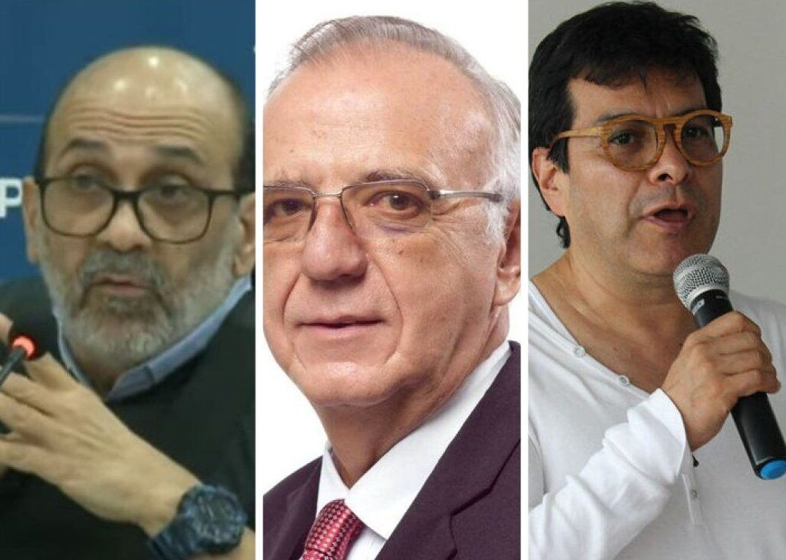
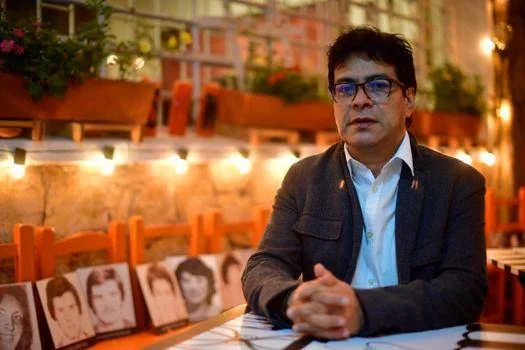

*«Jorge 40» en la JEP dejó de ser un fantasma del Clan Daes—Char para convertirse en la farsa de la gestión de paz del alto gobierno.*

Por ahora, la comparecencia de «Jorge 40» en la JEP dejó de ser un fantasma para el **Clan Daes—Char** para convertirse en la farsa de la gestión de paz del alto gobierno. La cita judicial fue una burla a la justicia restaurativa y a las víctimas que buscan la verdad. En realidad fue un sainete que pretende instrumentalizar la justicia restaurativa. Uno de los posibles libretista sería el **Comisionado Nacional de Paz, Danilo Rueda Rodriguez**.

En tanto, está demostrado que el verdadero móvil de **«Jorge 40»** y sus secuaces no fue la autodefensa —como dijo en la JEP— sino la captura del aparato político para ponerlo al servicio del lavado de activos del narcotráfico y de la corrupción administrativa.

## Tovar Pupo, narco vestido de combatiente

En los dos días de audiencia no dijo nada relevante para la verdad. Hizo lo mismo que antes de que fuera extraditado en 2008 por delitos de narcotráfico. Su desprecio a las víctimas y a la verdad es diciente. Fue la razón por la cual no colaboró con Justicia y Paz. En esta oportunidad se presentó como víctima.

Si bien Rodrigo Tovar Pupo se desmovilizó en el corregimiento de la Meza, se expandió hasta el sur del Cesar y Magdalena. Pero ejercía un dominio por gran parte del sur del Magdalena. En Pueblito Primavera había una señora de la tercera edad que vendía chicha, café. La pretensión del sanguinario criminal era que todos se desplazaran de sus lugares de arraigo. Pero, la señora le dijo:

> «Yo no me voy de aquí. ¡Esta es mi tierra y aquí me quedaré!»

Acto seguido, Rodrigo Tovar la hizo arrodillar, sacó su pistola, que siempre llevaba al cinto, y le vacío el proveedor sobre el cuerpo inerme de la humilde señora. Al tiempo que le dijo:

> «Te vas a quedar aquí para siempre, ¡hijueputa!»

Esto lo hizo Rodrigo Tovar porque le habían informado que era la madre de José Luis, un guerrillero del ELN.

## Tovar Pupo calló frente a la narcoeconomía

Tampoco «Jorge 40» habló sobre la cadena de testaferros que tiene y de las alianzas que hizo con el Clan Daes—Char en el Atlántico y otros clanes que participaron en el **Pacto Caribe** en Cesar, La Guajira, Magdalena y Atlántico. No se refirió a la narcoeconomía de Barranquilla y de toda la región Caribe. Tampoco a la toma a sangre y fuego de las universidades del Magdalena o el Atlántico. ¿Por qué? Todo parece indicar que es un oportunismo jurídico para lavar su verdadera catadura de narco puro.

**Los $2.500 millones** que el jefe paramilitar le entregó a la campaña de **Guillermo Hoenigsberg en 2003** por intermedio del **narcotraficante**, venido a empresario, **Eduardo José Losada Manotas**, asesinado en 2004, es un botón de muestra de esta aseveración. ¿Qué consecuencia tienen sus 300 masacres y sus 700 mil desplazados? A **Rodrigo Tovar Pupo** la justicia le documentó 500 homicidios. ¿Se justificó la existencia de la AUC en Barranquilla? Por ejemplo, en el Atlántico no había estructuras armadas de la guerrilla. ¿Cómo pueden justificar 500 homicidios en el período 1998-2004? Allí cayeron gentes valiosas para el movimiento social y sindical. ¿Qué hacemos con esas víctimas? \[Lea: **[La narcoeconomía: el atentado a «Yuyo» Daes y asesinato de Losada (IV)](/articulos/el-atentado-a-yuyo-daes-y-el-asesinato-de-losada-clave-de-la-narcoeconomia/)\]**

## Reconocimiento

Esta entrega es posible con el apoyo de la periodista **Amalfy Rosales**, directora del portal [El Espacio Noticias](/articulos/sitio/estamos-en-un-pais-excluyente-y-pedimos-que-nos-tengan-en-cuenta-en-los-dialogos-nacionales-en-exclusiva-habla-el-exjefe-politico-de-las-auc-mario-marenco-vocero-de-alias-jorge-40/), a quien reconozco los créditos.

## Marenco chupando Rueda al comisionado

*Danilo Rueda es el Comisionado de Paz que pudo firmar el Pacto de La Picota. Está cumpliendo con lo prometido a los jefes del paramilitarismo colombiano. Llevar a «Jorge 40» en la JEP, Cortesía.*

El que fuera designado vocero político por el mismo **«Jorge 40»** o **«Papa»**, cuando traficaban con droga y asesinaban sindicalistas docentes y estudiantes, **Mario Marenco**, alias **«el Gordo»**, dinamizó la campaña presidencial de Gustavo Petro en el Atlántico. Una vez posesionado como presidente y nombrado Danilo Rueda Comisionado de Paz, Marenco se convirtió en gestor de paz. Su desmovilización se produjo en 2006 y jugó un papel muy importante para el éxito de los **procesos de la parapolitica**. Desde esos momentos entabló una excelente relación con el hoy ministro de la Defensa y el Comisionado de Paz en su papel de defensor de los derechos humanos y presidente de la Comunidades Eclesiales de Base.

El exvocero del paramilitarismo anda como Pedro por su casa en Bogotá donde trabaja de la mano de Danilo Rueda. Tanto como cuando en época electoral buscaron el perdón social a los jefes criminales en las cárceles del país.

Una fuente de entero crédito de **VoxPopuli Digita**l indicó un hecho grave de toda gravedad. El hoy Comisionado de Paz, **Danilo Rueda**, fue transportado durante la campaña presidencial de Gustavo Petro en vehículos blindados que pertenecían a las empresas del narcotraficante y asesino **Darío Laino Scopetta**, recientemente condenado por varios homicidios durante el período 1998—2002.

## El ministro de Defensa

Pero, Marenco no solo está pegadito a Danilo Rueda. Una fuente señala que el viejo amigo de Marenco es el actual ministro de Defensa, **Iván Velásquez Gómez**. Velásquez cobró notoriedad por su papel de investigador del proceso de la parapolítica que llevó a más de 48 parlamentarios a las cárceles. El desmovilizado Marenco, quien tenía las relaciones políticas de Rodrigo Tovar Pupo, probablemente le entregó una información selectiva, segmentada y acomodaticia a los investigadores de la parapolitica.

Algunos exparamilitares que están presos hoy, consultados por este periodista, indicaron que tienen la esperanza de que el presidente Petro cumpla con el **Pacto de La Picota**. Para sorpresa de los colombianos, al decir de esas fuentes, quien estaba entre bambalinas detrás de las visitas a las cárceles durante la campaña política, era precisamente el mismo Iván Velásquez. El decir de las fuentes son coherentes, ya que el hoy ministro de la Defensa debió recorrer las cárceles del país buscando testimonios para incriminar a los parlamentarios implicados en sus apoyos a los paramilitares.

## Danilo Rueda y el Pacto de La Picota

¿Quién estuvo en el Pacto de la Picota? ¿Recuerdan el escándalo que se suscitó cuando en abril se demostró que el hermano del hoy presidente, **Juan Fernando Petro**, visitó La Picota para encontrarse con parapolíticos? Todos los focos, cámaras y flashes estaban concentrados en el hermano del hoy presidente. Pero había un personaje detrás de él. Quizás anónimo. Pero efectivo en la construcción de relaciones de confianza con ese bajo mundo. Pasó desapercibido para los medios de comunicación. Se trata del hoy flamante Comisionado de Paz, **Iván Danilo Rueda Rodríguez**.

En su condición de presidente de la ONG Comisión Intereclesial de Justicia y Paz (J&P) estuvo en cárceles gringas en 2009 acompañando al hoy senador Iván Cepeda, al padre Francois Houtar y Rafael Barrios en sus reuniones con el Mono Mancuso y el Tuso Sierra para conseguir declaraciones sobre el tema de la parapolítica. También estuvo en La Habana (2015) asesorando a Piedad Córdoba en el diálogo con las FARC.

Otro hecho que demuestra que la audiencia de **«Jorge 40»** o **«Papa»** ante la JEP fue un sainete, es que el jefe de los escuadrones de muerte de la Costa Caribe llegó a ese tribunal gracias al apoyo de Danilo Rueda. ¿Podría la JEP aceptar este embuchado como lo hizo con **David Char**, quien es un narcotraficante puro venido a empresario y político, como lo señalaron sus viejos aliados?

## Los testaferros de **«Jorge 40»** o **«Papa»**

Varios de los testaferros de **«Jorge 40»** o **«Papa»** son respetados empresarios en los departamentos donde alcanzó a forjar su poder militar y económico. Verbigracia, Darío Laino Scopetta. Pero como Laino cayó en desgracia con las tres condenas que tiene, lo mencionó en la versión de la JEP. Pero no habló nada de los Char ni de los Daes donde existen pruebas de las relaciones económicas y políticas que entablaron en la época de terror de Barranquilla. \[[Ventanas a Trump e «ingresos ficticios» ¿la verdad de Tegnoglass en Nasdaq?](/articulos/hasta-hace-unos-dias-tecnoglass-se-mostraba-como-el-orgullo-barranquillero-hoy-sus-acciones-en-la-bolsa-de-nueva-york-han-caido-estrepitosamente-como-resultado-del-informe-que-se-publica-a-continuac/)\]

Por ejemplo, el _nido de ratas_ en que se convirtió la ya extinta Dirección Nacional de Estupefacientes (DNE) que le vendió a los empresarios **Leo Eisenband** (dueño de Fedco) y **Luis Fernando Vásquez** (dueño de Autotropical y cuñado de Laino Scopetta) el centro comercial Villa Country, en Barranquilla, muy por debajo de su avalúo. Según fuentes de exparamilitares, **«Jorge 40»** acordó no delatar a sus socios económicos.

¿Por qué **«Jorge 40»** o **«Papa»** no dijo ni mú de la narcoeconomía? ¿Por qué no contextualizó el hecho de que cuando llegó a Barranquilla debió desplazar lo que quedaba del Cartel de la Costa que había dejado Orlandéz, alias el **«Caracol»** socio de Fuad Char, según el **expediente No 114** del cual dimos cuenta en otra oportunidad? El 90% de los empresarios emergentes, según dice uno de los exparamilitares que se encargaba de las finanzas, tributaban a los paracos.

## «Jorge 40» en la JEP, _una santa paloma_

*La magistrada Sandra Ospino Castro debió interrumpir en varias ocasiones al declarante «Jorge 40» en la JEP para solicitarle que precisara sus declaraciones que no dijo nada nuevo en los dos días de la audiencia. (Captura de pantalla).*

De manera que este criminal ahora aparece como una _santa paloma_ víctima del **«**desplazamiento**»** de docentes del **Liceo Loperena** (Valledupar) que adoctrinaron a sus estudiantes con ideas de lucha de clases. Él no se acordó que en los años 50 y 60 los terratenientes de valledupar expandieron sus propiedades más allá de la **«**línea negra**»** que le pertenecía a las comunidades indígenas arhuacas, kogis, arzarios, kankuamos. Estas comunidades debieron remontarse en la Sierra Nevada arrinconados por las presiones de los pájaros financiados por los terratenientes de Valledupar.

Tampoco se refirió a los autores intelectuales de la masacre de los primeros líderes espirituales arhuacos el 28 de noviembre de 1990. Ese día en un paraje conocido como Iturco se reportó la desaparición de **Ángel María Torres, Antonio Hugues Chaparro y Luis Napoleón Torres**. Sus cuerpos aparecieron el **2 de diciembre de ese año** en las poblaciones de El Paso, Bosconia y San José de Ariguaní. Fue una masacre. Fue uno de los peores crímenes contra la población civil que marcó el exterminio a esa población.

## La irrupción de «Jorge 40» en Barranquilla

Si bien «Jorge 40» en la JEP reconoció su primer encuentro con Salvatore Mancuso y Darío Laino Scopetta cuando viajaron a Estados Unidos a comprar armas y equipos de radiocomunicaciones, no dijo toda la verdad. Pero algo sucedió en ese período que los magistrados de la JEP deben saber para que no se dejen _meter el dedo_ en la boca del **«Papa»**.

En los años 90 el **Clan Daes—Char** ya se había tomado el Junior, el sector eléctrico, la Triple A, la telefonía. Serfinanzas se transformó en banco. Las olímpicas se expandieron hasta Bogotá. ntre el año 1997 y 2002 se produjeron los principales asesinatos de sindicalistas, docentes, estudiantes y políticos reconocidos de la izquierda en Barranquilla y el Atlántico. \[Lea: [Expediente No 114: La fortuna de los Char proviene de su sociedad con «el Caracol»](/articulos/expediente-no-114-la-fortuna-de-los-char-proviene-de-su-sociedad-con-el-caracol/)\]

Al mismo tiempo, el negocio del narcotráfico sufría una transformación particular con la captura (1998) y posterior extradición (2000) del jefe del Cartel de la Costa, **Alberto Orlandez Gamboa, alias «el Caracol»**. Los centros de exportación y las rutas de comercialización de la droga pasaron a ser manejadas por **«Jorge 40» y sus secuaces**, de acuerdo a la información documentadas en los procesos de **Justicia y Paz**. Pero donde se consolidó esa alianza fue al final del período de Humberto Caiaffa y el triunfo de Guillermo Hoenigsberg. El año clave fue el 2003.

## El encuentro de **«el Caracol»**, **Fuad Char y los Daes**

En ciertos círculos íntimos de la política y la economía emergente de Barranquilla se habían olvidado que alias **«el Caracol»**, **Fuad Char y los Daes** habían coincidido en el Rincón Latino en uno de los cumpleaños del padre **Bernardo Hoyos Montoya**, de acuerdo a la información de algunas personas que asistieron en ese evento. En esa primera administración también entraron fuerzas del narcotráfico que mantenían un poder considerable en la Barranquilla de los años 80 cuando el dinero de la marimba y de la cocaína cambiaron para siempre el aire fresco y pacífico de **«La Arenosa»**.

Diez años más tarde, con el triunfo de Guillermo Hoenigsberg en la alcaldía de Barranquilla (2003) se consolidó la captura de la alcaldía por parte de los empresarios emergentes y del paramilitarismo. Pero también se repartieron la red financiera y económica del narcotráfico. Todos los astros que gravitaban en torno a la ya alianza Daes—Char se alinearon en torno al nuevo alcalde. Se creó el Acuerdo Social Caribe, una versión barranquillera del **Pacto Caribe** para repartirse el poder político de Barranquilla y el Atlántico en 2006. Este pacto macabro con los victimarios y los empresarios del crimen y de la narcoeconomía, se concibió luego de que el paramilitarismo exterminara y desplazara a todos sus opositores, entre los cuales se encuentra este periodista. Fue una réplica de mayor proporción de los pactos de Pivijay y de Chivolo.

## La esperanza

Pero en medio de ese olvido, **surge la esperanza** de miles de víctimas de conocer quiénes dieron la orden de agonía. Sabemos —por los testimonios judiciales de sus lugartenientes— que fue **«Jorge 40» y sus esbirros** encargados de ejecutar cada orden. ¿Al servicio de quien estaba Tovar Pupo? ¿De sí mismo? ¿O representaba un conglomerado que se beneficiaba de cada muerte y de cada territorio capturado?

No hay duda, **las élites de Barranquilla, Santa Marta, Riohacha y Valledupar** fueron las que realmente dieron la orden. Esa élite hoy es más rica que ayer. Determinaron y señalaron a quién exterminar. ¿Por qué ninguno de los miembros de esas élites esta siendo procesados por estos delitos? He aquí la razón de ser del gran temor que le tienen al tribunal Justicia Especial de Paz (JEP).

Esas mismas élites triunfan en cada elección. De hecho, la «**Ñeñepolítica»** y el mismo escándalo de la condenada senadora **Aida Merlano,** muestran la miseria del quehacer político nacional**.** Son ejemplos dicientes donde se involucra la economía formal con las economías del bajo mundo. Una economía que se arropa con los detentadores del poder.

En la próxima entrega veremos cómo la Paz Total podría terminar en el cumplimiento de la promesa electoral de perdonar los crímenes de lesa humanidad a los perpetradores sin conocer la verdad. Se analizará el papel del ministro de la Defensa y del Comisionado de Paz en este despropósito.