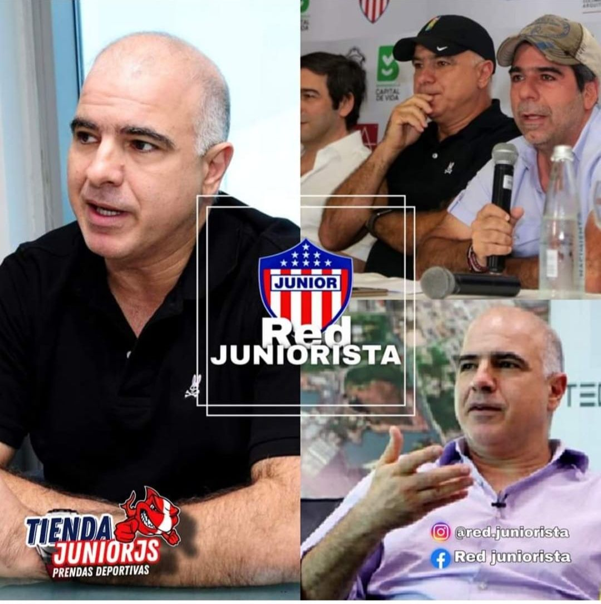

*Son los dueños de todo. La Triple A, Inassa, el nulo contrato y el «tío Christian». Como en la bonanza marimbera, los dueños del balón. Cortesía.*

El presidente de la república, **Gustavo Petro Urrego**, tiene en sus manos la solución del descarado robo de la Triple A. Los autores son **empresarios emergentes** —ligados al narcotráfico y al lavado de activos. ¿La solución? Que la SAE declare —¡_**ipso facto**_!— la nulidad del contrato mediante el cual **Alumbrado Público de Barranquilla** (APBAQ) le compró el **82.1% de las acciones** adquiridas, a su vez, fraudulentamente por INASSA. Este espurio negocio fue aupado por el **«tío Christian» Dae**s, quien posteriormente posó de **Santa Teresa de Calcuta** cediendo el 7%.

La venta que hizo la SAE, en diciembre de 2021, **fue ilegal y nula en forma absoluta**. Así coincidieron varios jurisconsultos consultados por este medio periodístico. Este mismo criterio es compartido por dirigentes del **Pacto Histórico como Cristóbal Padilla**. Aunque otros, como **Alfonso Camerano**, abogan por la liquidación de la Triple A. **Lo fundamental ahora es declarar la nulidad de ese contrato por carencia de base legal**. La posición del abogado Camerano es muy explicable, porque estuvo muy cerca de Edgar George el alcalde que permitió el cambio de estructura accionaria de la Triple A y, por ende, de su robo.

/articulos/luciotorres/status/1614055983432536064?s=20

## «Tío Christian» y la Triple A

¿Cómo sacaron, **_cash money_, $250 mil millones** de los $500 mil millones que debían pagar por la Triple A? ¿Con qué facilidad sacaron esa plata de una empresa del Distrito para cerrar un negocio donde el alcalde **Jaime Pumarejo** y el **«tío Christian»** aparecieron como desinteresados animadores de un negocio que buscaba supuestamente retornar un bien oficial? ¿Qué dice la Supersociedades de la firma **[Deloitte](/articulos/co/es/pages/careers/careers/life-at-deloitte.html)** que avaluó a la Triple A en **$800 mil millones** cuando su costo real es superior a **$2.5 billones**, tal como oficialmente se demostró? ¿No le van a presentar siquiera una denuncia? A los aupadores de este sucio negocio se les olvidó decir que en la APBAQ, empresa de economía mixta, existen tres buitres con el pico bien afilado: **Los Daes, los Char y los Vélez**. Ellos son los verdaderos dueños. El alcalde Jaime Pumarejo solo es un perrito faldero de ellos.

¿Esos tres grandes de la contratación oficial y de los negocios sucios, dirigidos por «tío Christian», pudieron sacar de la relojera **_cash money_ $250 mil millones** para casar el negocio? ¿Cómo lo hicieron? ¿Empréstito? ¿Cómo lo respaldaron? ¿Pusieron en peligro financiero a APBAQ?

Si la Unidad de Información y Análisis Financiero—UIAF de **Luis Eduardo Llinás Chica** metiese la nariz, seguramente encontrará demasiadas sorpresas en la trazabilidad de ese **_cash money_**. ¿Lo puede hacer? Por supuesto. Pero este no es el problema. La pregunta es si se atreve. Y si se atreviera ¿lo dejarían? Mejor dicho, ¿Petro lo respaldaría? Este es el punto que desataría el eslabón perdido del cual dimos cuenta en algunas otras entregas sobre la narcoeconomía barranquillera y que te invito a leer y ver el documental.

## ¿Ya viste el Eslabón Perdido?

> Para comprender los negocios de empresarios emergentes, deberías ver este documental del origen de la fortuna de los Char.

https://youtu.be/ftCUAXmfe98

## «Tío Christian», la Triple A y Al Capone

¿Que tiene que ver «Tío Christian» con Al Capone y la mafia italiana de Estados Unidos? Nada. Se tiene entendido que «Tío Christian» abandonó los negocios turbios por los cuales supuestamente llegó a un acuerdo con la justicia norteamericana. Pero con la justicia colombiana no han resuelto nada respecto al lavado de activos. ¿Por qué los Daes y los Char están en casi todos los negocios chuecos de Barranquilla? Uno de ellos es la Triple. ¿Esa torcida la pueden lavar con una supuesta donación del 7% de sus acciones en Barranquilla Capital de Luz S.A.S.' - Alubaq al Distrito?

Si **Al Capone**, el legendario criminal de la era prohibicionista de Estados Unidos, no fue condenado por sus homicidios o por el tráfico ilegal de alcohol, sino por evasión de impuestos ¿esta es la oportunidad para que caigan los buitres de la economía subterránea **por lavado de activos** incrustados en la economía barranquillera? La condena contra **Al Capone** fue de 11 años que lo llevó a morir en la prisión de Alcatraz. ¿Podrá ocurrir lo mismo con los buitres financieros que manejan a Barranquilla, cuya labor principal es lavar el dinero del narcotráfico y de la corrupción política—administrativa?

Estas preguntas se hacen al oído del presidente Petro. Empero, hay más. ¿Puede el gobierno nacional **diseñar y ejecutar una política antifraude y antimafia** persiguiendo los grandes negocios fraudulentos que se constituyen en una cadena de lavanderías del dinero sucio procedentes del narcotráfico y de la corrupción? Está demostrado hasta la saciedad, que la mafia del narcotráfico se acaba atacando por donde más les duele, la plata. Tiene varias herramientas: Superintendencia de Sociedades, Unidad de Información y Análisis Financiero—UIAF y Sociedad de Activos Especiales—SAE.

## Un negocio sucio desde su origen

/articulos/luciotorres/status/1614057019643772935?s=20

Recordemos que la Triple A vino a la vida jurídica en 1992 mediante el **acuerdo 023 de 1991**. La estructura accionaria estaba constituida por **dos tipos de acciones A y B**, distribuida de esta manera: **85.16%** el Distrito de Barranquilla y el resto, es decir el **14.86%** accionistas privados, incluyendo a miembros del sindicato de las antiguas **Empresas Públicas de Barranquilla—EPMB**. Esta empresa fue destruida por la misma clase política que la hizo inviable en su operatividad y en sus finanzas. Así hicieron en Cartagena y Santa Marta.

Según el artículo 73 de los estatutos de la empresa, actualizados hasta el 2019, el Distrito o el Estado no podría tener más del 89% de las acciones. Si por cualquier situación tuviere más, debería ponerla en venta. Pero no tuvieron ningún empacho de hacer lo contrario. Es decir, quitarle fraudulentamente las acciones a los curramberos hasta dejarlo con una participación del 15%.

> En ningún evento los aportes estatales, directos o indirectos, podrán exceder del ochenta y nueve por ciento (89%) del capital suscrito. Cuando sea del caso, el Municipio o las entidades estatales deberán poner en venta las acciones necesarias para mantener el porcentaje máximo indicado.
> 
> Estatutos actualizados hasta 2019. Sus estatutos (documento no disponible))

La verdadera intención de ese artículo es perpetuar el control de los privados sobre la Triple AAA. ¿Es constitucional ese dique que le pusieron a las acciones del municipio de Barranquilla? Sin duda, es anticonstitucional. Porque la única exigencia para una empresa de economía mixta es que su participación accionaria sea superior al 50%. ¿Por qué la llevaron hasta tener solo el 15%? Desnaturalizaron la empresa Triple A.

## ¿Lo operadores privados son eficientes?

En aquella época vivimos esa situación como periodista, pero también como conocer de las dinámicas sindicales y políticas de mi querida Barranquilla. Había una crisis estructural de los servicios públicos. Los diagnósticos de los gremios económicos era que el problema estaba en la operatividad. No en vano se apoyó el proceso de transformación de una empresa descentralizada del Estado (EPMB) a una de economía mixta como Triple A. Se nos vendió la idea de que de esa forma se evitaba que la corrupción política llevara a la debacle a la empresa y se robaran la plata de los servicios públicos.

Sin embargo, 5 años más tarde, los españoles y algunos colombianos torcidos (INASSA S.A.) operadores privados, se compincharon con uno de los gobiernos del Movimiento Ciudadano (**Edgar George González**) y algunos accionistas minoritarios para **modificar ilegalmente la estructura tarifaria**. Y así robarle el dinero a los barranquilleros. En esta asamblea de 1996, como si saliera del cubilete de un mago, **fue creada la acción tipo C**. Fueron **8.385.324 acciones Clase C**. o sea, el **43.31%** del total accionario, que suscribió a partir de la correspondiente oferta privada.

De manera que para lograr ese cometido, modificaron el artículo 82 de los estatutos que se elevó a **escrituras públicas Nos. 2845 del 21 de octubre de 1996 y 2988** del 1o. de noviembre de 1996 de la Notaría Tercera de Barranquilla, respectivamente. (Ver sus estatutos (documento no disponible)).

## **«Tío Christian»** y la toma de Triple A

¿Cómo un operador privado se iba a convertir en dueño de la empresa? Así se despojó gradualmente al Distrito de Barranquilla de la **_joya de la corona_**. En esa época, se metió en este negocio sucio uno de los financistas y mecenas de **Bernardo Hoyos Montoya** y **Edgar George González**, José **«Yuyo»** Daes, hermano mayor del **«tío Christian»**.

En la próxima entrega te contaré la historia de cómo **«tío Christian»** se apoderó de la Triple A y por qué el negocio que hicieron con la SAE carece de principios legales y, por tanto, es nulo de toda nulidad.

Nota. Recibo observaciones: lucio@voxpopuli.com.co