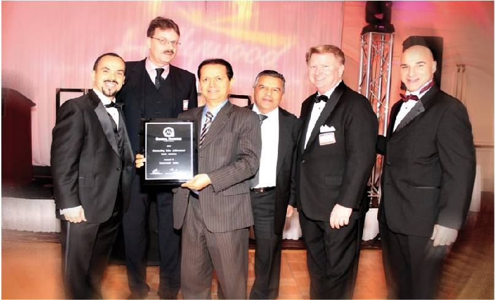

*Algunos de los directivos de Insurcol en un homenaje por los servicios prestados.*

La empresa petrolera **Insurcol** viene realizando un papel inverso a lo que hizo la **Andian** en el siglo pasado. Cerca de 30 hectáreas de tierras públicas que esa empresa donó a la gobernación de Bolívar en Turbana y del área de Pasacaballos, se lo está apropiando Insurcol Ltda. Al parecer, esa apropiación es indebida, ilegal e inconstitucional. Existe varios procesos, uno de los cuales está en el Juzgado 4° Civil del Circuito. Allí existe un proceso de pertenencia espurio. Lo mismo que otros procesos que están tramitando en varios juzgados civiles de Cartagena.

La pregunta que surge de esa situación, que proponemos en esta primera entrega, **¿por qué razón la gobernación de Bolívar** no ha desarrollado una estrategia de defensa de los terrenos públicos que le pertenecen? ¿Por qué está permitiendo que una empresa privada se esté apoderando de esas tierras revertidas en la primera mitad del siglo XX por la Andian cuando cumplió su objeto contractual en esta región? ¿Por qué la tierra está en manos de particulares?

Esas preguntas van dirigidas a la Directora de Logística de la gobernación de Bolívar, Karen Matorel Bello y al director de la Oficina de Jurídica, Juan Mauricio González Negrete.

## Petrolera Insurcol compra a un concejal

El lema de Insurcol es: _Gente que sabe lo que hace_. Es una empresa colombiana, líder en el sector oil&gas. Tiene más de 30 años de experiencia, dentro de la cual resalta la capacidad de fabricación e integración de soluciones tecnológicas desarrolladas del sector petrolero y gas. Su expansión la logró en el período del gobierno de Álvaro Uribe Vélez, quien también impulsó empresas como la canadiense Pacific Rubiales a costa del patrimonio y consolidación de la estatal Ecopetrol.

Siempre la codicia revienta el saco. Resulta que existe un proceso de compra de Insurcol al exconcejal de Turbana **Alex Castro** de una tierra en jurisdicción de ese municipio. De acuerdo a la documentación existente, existe un área de un poco más de 5 hectáreas que viene poseyendo la Asociación Campesina de Afrodescendientes de Bolívar-Asocafrobol. La referencia catastral de ese predio es la No 00-02-00010615-000. De esa posesión existe media hectárea más. Un poco más de 5 mil metros cuadrados.

De acuerdo con un escrito radicado por el presidente de **Asocafrobol, Lisardo Suárez Hurtado**, ese predio lo vienen poseyendo pacíficamente desde hace 10 años, en concordancia con el artículo **No 277 de la ley 1955 de 2019**. Aducen que lo vienen explotando para la producción agrícola, ya que no está en una zona de alto riesgo. (Leer: [¿Qué quiere hacer la SAE en Cachenche](/articulos/que-quiere-hacer-la-sae-en-cachenche/)?).

## Proceso de pertenencia

*Algunos de los directivos de Insurcol en un homenaje por los servicios prestados.*

Dentro de esa escalada de apropiación, la petrolera Insurcol inició un proceso de pertenencia en el **Juzgado 4° Civil del Circuito**. La empresa viene comprando una serie de predios que campesinos u otros propietarios las habían escriturado en forma irregular, dado a que son predios fiscales.

Como se sabe, las tierras públicas o que pertenecen al Estado son imprescriptibles. Por ejemplo, así lo señala la sentencia C-530 de 1996 de la Corte Constitucional.

> «_Los bienes fiscales comunes o bienes estrictamente fiscales dejaron de ser prescriptibles, **se convirtieron en bienes imprescriptibles**_**.** _Si no procede la declaración de pertenencia en relación con los bienes de propiedad de las entidades de derecho público, tampoco procede oponer la excepción de prescripción ante la demanda reinvindicatoria de uno de tales bienes. Hoy día los bienes fiscales comunes o bienes estrictamente fiscales son imprescriptibles. Lo relativo a los bienes públicos o de uso público: siguen siendo imprescriptibles_**,** _al igual que los fiscales adjudicables que tampoco pueden adquirirse por prescripción_».
> 
> Lea la sentencia [C-530-96](/articulos/sentencias/1996/C-530-96.rtf).

Como se puede observar la normatividad vigente busca impedir _que los particulares se apropien de los bienes fiscales, se asegura o garantiza la capacidad fiscal para atender las necesidades de la comunidad. No hay acción para que se declare que se ha ganado por prescripción el dominio de un bien que la ley declara imprescriptible, porque no hay derecho_.

Entonces ¿sobre qué base legal y constitucional Insurcol está solicitando la prescripción de un gran segmento de las 30 hectáreas que tenía la gobernación de Bolívar? ¿Qué sentido tiene ese proceso de pertenencia que adelanta en el **Juzgado 4° Civil del Circuito de Cartagena?** Son interrogantes que despejaremos en las próximas entregas.