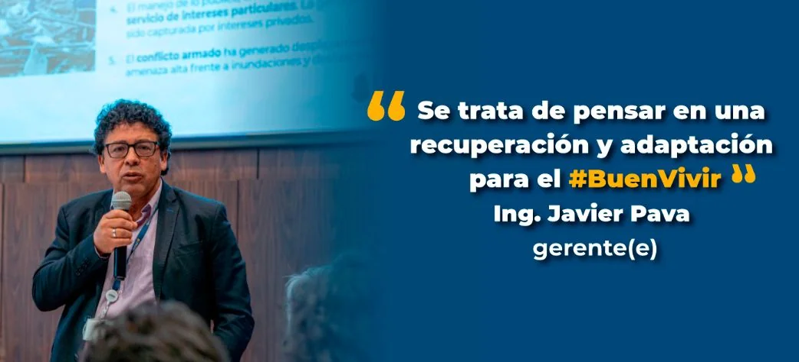
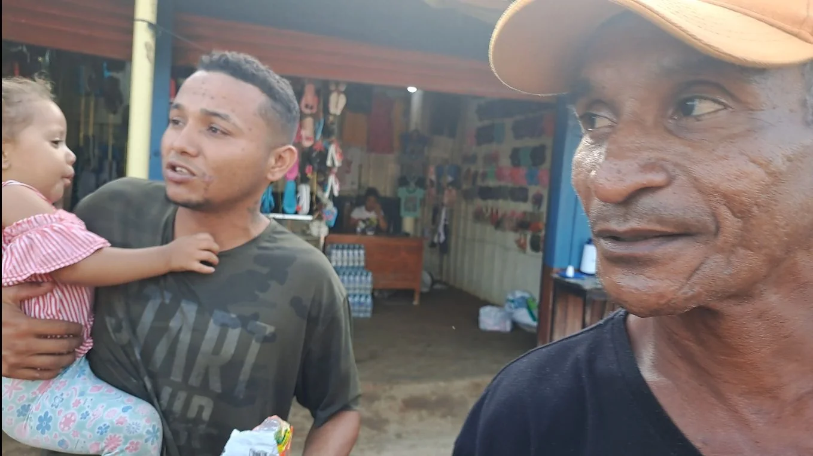
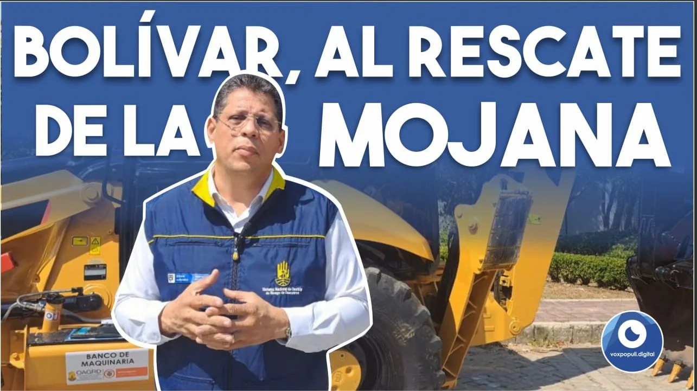

*Las pavoneadas de Pava. #BuenVivir. Para los mojaneros es el #MalVivir.*

Recorrer La Mojana con **«Caregato»** abierto es encontrarse a un pueblo que soporta el desastre ambiental por causa antrópica y de las **_pavoneadas_** de Pava, representante del gobierno nacional. Es la expresión de la vanidad causada por posturas intelectuales de funcionarios del Estado que pueden darle salida a los anhelos populares y no lo hacen. Tienen los recursos y la capacidad. **Pero su mente —cegada por el poder— no les permiten actuar conforme a la realidad sino a sus ideas preconcebidas.**

En efecto, es el caso de la postura ambivalente del director de la **Unidad Nacional para la Gestión del Riesgo y Desastre**, **Javier Pava Sánchez**. **La vanidad del poder los hace más ciego** y, por tanto, ineptos para el ejercicio del poder. Esta alienación es proporcional a su preparación intelectual. Entre más estudiados, son más vanidosos. **El ego sustituye la conciencia**, la cual queda contaminada por la subjetividad. Ellos no pueden ver que la rotura del río Cauca a la altura del corregimiento de Bermúdez del municipio de San Jacinto del Cauca, Sur de Bolívar, tiene condenada a más de **400 mil personas a la pobreza y tristeza**. Están ciegos aunque vean. Si los funcionarios obraran en conciencia, verían esta realidad.

\[Puede leer: [¿El desastre de «Caregato» o el Gobierno del Cambio? (II)](/articulos/caregato-o-el-gobierno-del-cambio/)\]

## Las pavoneadas de Pava, esclavos de las ideas

¿Por qué el ser humano cuando tiene el poder del Estado no lo ejerce en función de la sociedad sino en contra de ella? Analicemos **las pavoneadas de Pava** con relación a este caso concreto de La Mojana. La idea preconcebida del presidente Petro es la libertad de los ríos. Considera que ese río debe ser intocable. Que si rompió por **«Caregato»** hay que dejarlo ser. No hay que encajonarlo. No se puede confinar. En principio uno está de acuerdo con el Presidente. Pero, cuando la idea es preconcebida y no corresponde con la realidad concreta, pierde su fuerza revolucionaria, transformadora y creadora para darle paso a su poder de destrucción.

Hoy, el desastre ambiental podría ser 10 veces más grande que el producido por la **«Boca del Cura»** abierto por la comunidad en 1938. En aquella época, el también gobierno del cambio **Alfonso López Pumarejo** (la Revolución en Marcha), se negaba a darle solución a la sequía de La Mojana. La misma comunidad abrió el río Cauca. Fue un alivio y una solución inmediata. Pero, a mediano plazo, fue un nuevo desastre ambiental que se vive hasta hoy. No hubo el acompañamiento técnico y de infraestructura necesario del gobierno nacional. La cura fue peor que la enfermedad.

¿Por qué el Presidente Petro y Pava no escuchan a las comunidades? ¿Cómo puede ser un gobierno del cambio si no oye a sus verdaderos protagonistas? ¿Será que Pava sufre el síndrome del **_Ciudadano Kane_** de Orson Welles? En un estudio científico sobre un Grupo Focal se llegó a la conclusión consensuada, que la película El Ciudadano Kane es útil para la enseñanza de los síntomas mentales: megalomanía/ egolatría, dictatorial, engañoso y dominante. ¿O será que Pava tiene una falsa conciencia ambiental?

> **«**La voz interior ya no pertenece a las reflexiones autónomas y a la deliberación del propio individuo. El poder de sí mismo ha dado paso a una subjetividad contaminada por el poder del Estado**»**.
> 
> Bruno Maduro. La teoría del poder.

## Las pavoneadas de Pava agrandarán el desastre

En el recorrido que hicimos hablando con la gente, constatamos cómo miles de personas viven aún en cambuches improvisados a la vera de las carreteras y cuanto jarillones encuentran, especialmente en La Mojana sucreña. Lo hacen sin la asistencia de los gobiernos territoriales locales. Por ejemplo, en los municipios de San Marcos, San Benito de Abad, Guamal, Guaranda, Achí, entre otros.

Ante este evidente hecho, en plena época de verano, es inaudito que las autoridades dejen pasar este tiempo, ya que en abril vendría la época de lluvia y la cota del río Cauca aumentaría. Si cuando rompió **«Caregato»** llegó a **5,20 mts,** se debe estar pensando en crear un dique cuya altura sea superior. Hoy la cota está en **2,5 mts**, de acuerdo a la inspección ocular que hicimos en el sitio. Pero Javier Pava no la aprovechó para cerrar el rompedero. Se limitó a _**mamarle gallo**_ a las comunidades con un fallido diálogo nacional donde participaron los ministros del Interior Alfonso Prada y Medio Ambiente Susana Muhamad.

\[Puedes leer: [Presidente Petro: ¡Cierre Caregato! (I](/articulos/presidente-petro-cierre-caregato/))\]-

## Las comunidades

*Habitantes de La Sierpe, en el corazón de La Mojana, solo quieren trabajar. «Caregato» no se los permite,*

En estos momentos, las comunidades organizadas se aprestan a cerrar el kilómetro de ancho que alcanzó la rotura del río cauca denominado **«Caregato»**. Pero el cierre solo es un paso. Se necesita una infraestructura hidraúlica y una intervención integral de los ríos Cauca, San Jorge, Magdalena y del sistema de ciénagas y caños de la depresión Momposina para garantizar cierta estabilidad ambiental a La Mojana. La mayor parte de esta tierra tiene un desnivel de dos metros, de acuerdo con los estudios realizados.

Así como la apertura de la «Boca del Cura» trajo beneficios inmediatos a la ecorregión que se debatía en medio de una calamidad ambiental por la fuerte sequía, la hambruna y la enfermedad, de la misma manera cerrar **«Caregato»** no sería una solución definitiva a largo plazo. Se necesitará una intervención de segundo y tercer nivel.

Es decir, una vez cerrado **«Caregato»**, se debe iniciar un conjunto de obras de mitigación para la adaptación al cambio climático. En tercer nivel, se deberá poner en práctica un plan especial de desarrollo integral para La Mojana. Esto implicaría tomar en cuenta el Plan de Desarrollo Nacional para implementar los planes, programas y actividades pertinentes.

## La visión de gobierno y las pavoneadas de Pava

*Las pavoneadas del gobierno de Petro.*

Lo cierto es que el gobierno central a través de la **UNGR**, el Fondo de Adaptación (**Javier Pava Sánchez**) y los ministerios de Medio Ambiente (**Susana Muhamad**) y del Interior (**Alfonso Prada**) asumieron una posición contraria a la voluntad popular que exige el cierre del chorro. Los representantes del gobierno atrincherados en una concepción que desconoce la realidad ambiental de La Mojana, **convirtieron el Diálogo Social en un instrumento demagógico para aplacar y desmovilizar la acción de las poblaciones afectadas.**

La teoría ambientalista del gobierno es que los ríos no pueden ser confinados sino que es necesario liberarlos. Y, en realidad, lo que querían era liberar el río Cauca a través de **«Caregato»** y mantener controlada un área inundada. Ello no solo afectará 30 mil predios sino toda la región. Por esta razón, surge la intención de una reubicación masiva de la población. Desaparecería el mítico corregimiento de La Sierpe como muchas otras poblaciones. Por esa razón, le _**mamaron gallo**_ a los líderes y a las comunidades cuando firmaron **tres acuerdos** (noviembre, diciembre 2022 y enero 2023) que no tuvieron ninguna intención de cumplir. Fue un engaño del gobierno de Petro ni siquiera Iván Duque se atrevió a hacerlo.

## La gobernación de Bolívar al rescate

*Las pavoneadas de Pava no les permiten ver la realidad de La Mojana. En cambio José Ricaurte lidera el cierre de «Caregato». ¿Lo lograrán?*

Ante la infructuosa gestión del gobierno para cerrar el chorro, este lunes 27 de febrero se realizará un Puesto de Mando Unificado (PMU) interdepartamental. Desde las 10:00 de la mañana concurrirán los tres departamentos más afectados: **Bolívar, Sucre y Córdoba**.

Como el sitio de la rotura pertenece a Bolívar, el gobernador **Vicente Blel** y el director de la Oficina para la gestión del Riesgo de Bolívar, **José Ricaurte Gómez**, vienen liderando un proceso de concertación interdepartamental para hacer una intervención unificada en el sitio crítico. Si el gobierno nacional del presidente Petro y el director de la **UNGRD** y el Fondo de Adaptación, **Javier Pava Sánchez**, se mantienen en su visión errónea de un ambientalismo fundamentalista, le tocará a los gobiernos locales y regionales en conjunto con la misma comunidad asumir una solución al rompedero de **«Caregato»**.

Es más, la misma comunidad creó un fondo comunitario que le permitió alquilar maquinarias, comprar megabolsas que ahora están llenando con arena. La idea es llenar dos mil megabolsas de dos toneladas cada una. Luego transportarlas al sitio crítico y tapar el hueco.

Seguramente los gobernadores de Bolívar, **Vicente Blel; de Sucre, Héctor Olimpo Espinosa y Córdoba, Orlando Benítez Mora,** le darán una excelente lección del ejercicio del poder del Estado a los que gobiernan el país en estos momentos. **¿«Caregato» será una oportunidad para los gobernantes regionales?**

/wp-content/uploads/2023/02/CONVOCATORIA-PMU.pdf