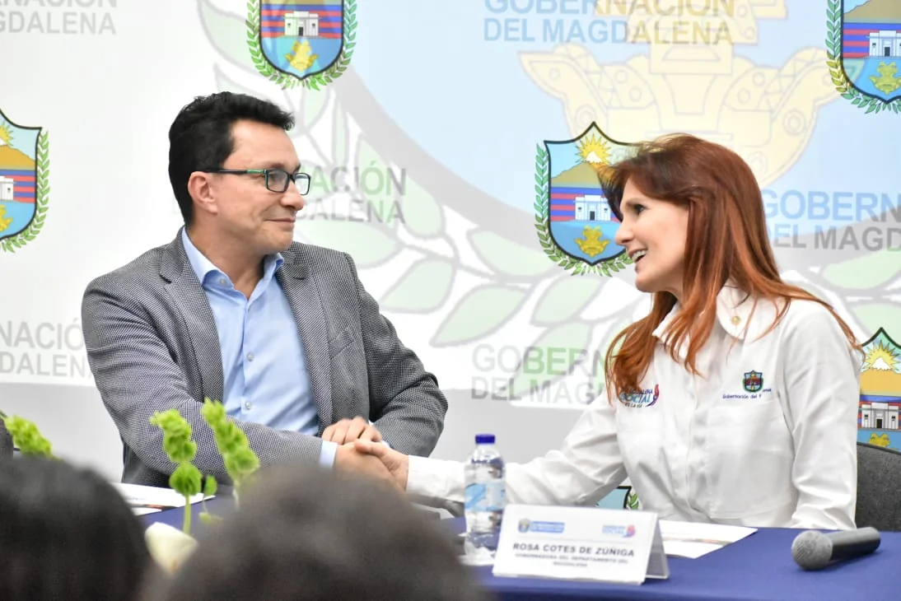
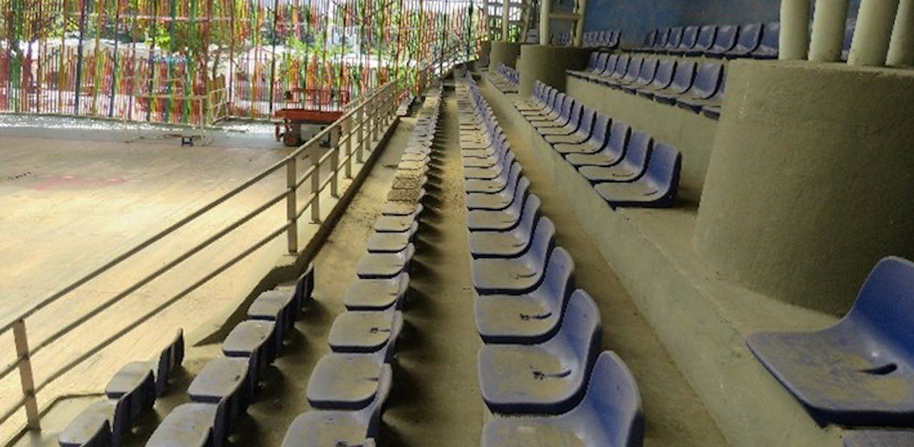
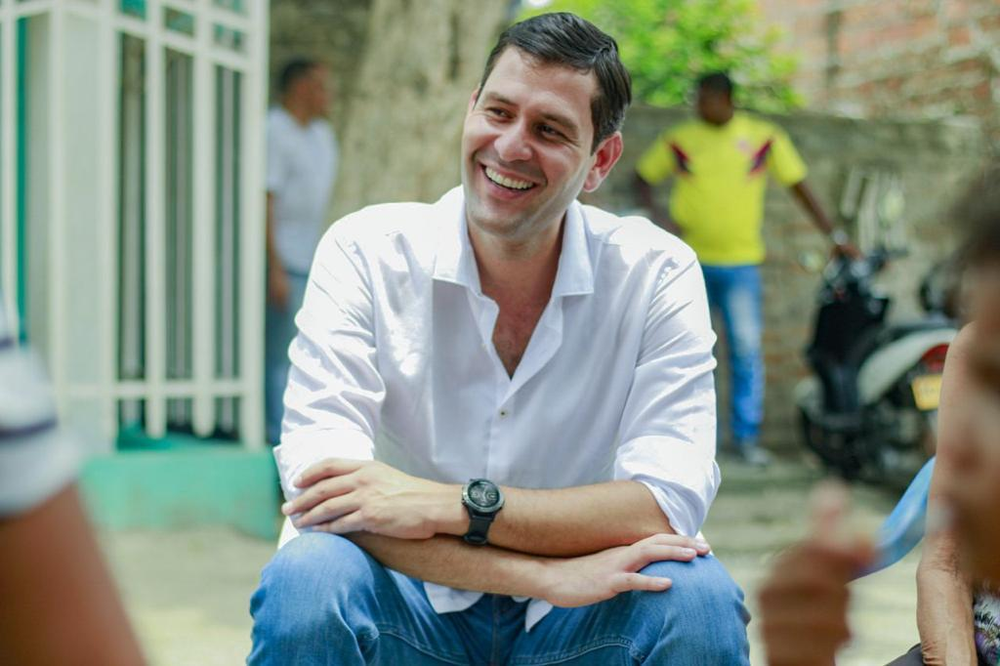

*La Fiscalía metió en el mismo saco de la corrupción a Caicedo y los Cotes. Aquí con la exgobernadora Rosa Cotes de Zúñiga, la compañera de infortunio. ¿Terminarán en la cárcel?*

En el ocaso de su mandato, la Fiscalía metió en el mismo saco de la corrupción a Caicedo. Si le dictan medida de aseguramiento, jamás regresaría a la gobernación. En efecto, por lo que llamaron **_Robo al Magdalena_**, el ente acusador pedirá medida de aseguramiento contra el gobernador **Carlos Eduardo Caicedo Omar**. Estas irregularidades, presuntamente, las cometió cuando se desempeñó como alcalde de Santa Marta en 2014**. Se le sindica de tres delitos:** peculado por apropiación para beneficio de terceros, contrato sin los requisitos legales y falsedad. Asimismo, los exgobernadores **Luis Miguel **«**el Mello**»** Cotes Habeych y Rosa Cotes de Zúñiga**, quienes presuntamente se robaron **$73 mil millones** de la «Vía de la Prosperidad».

Son seis casos que se presentarán en los próximos días ante la **Sala Penal del Tribunal Superior de Bogotá**. Tres contra Carlos Caicedo, dos contra Cotes Zúñiga y uno contra su sobrino **«**el Mello**» Cotes**, según lo sustenta la Fiscalía en el **[Boletín No 47677](/articulos/colombia/noticias/fiscalia-presenta-resultados-investigativos-y-judiciales-en-el-caso-denominado-robo-de-magdalena/)**. De esta manera, Fuerza Ciudadana queda reducida a un nuevo clan de la corrupción como los Cotes, los Granados, entre otros. Si la Fiscalía archivó varios graves procesos al gobernador Carlos Caicedo, quien reaccionó con un grito de batalla triunfalista ¿por qué ahora calla cuando será llamado por la misma Fiscalía por el presunto robo de **$1.600 millones** de los niños pobres?

> Al respecto, el mandatario de los magdalenenses no se pronunció. Fijó en su tuit un comunicado que no se refiere a la imputación y medida de aseguramiento anunciada por la Fiscalía sino al archivo de varias de las investigaciones que se le seguía por concierto para delinquir y homicidios. Solo señala que vendrán nuevas batallas.

*Así luce el coliseo de Gaira. El tablado deteriorado. Todo indica que nunca se ha usado. Obra de Caicedo como alcalde. Con razón lo metieron en el mismo saco de la corrupción.*

/articulos/carlosecaicedo/status/1625104232318750720?s=20&t=RGwlHo-\_KUsQbBfwkQX3gA

## Los Cotes desaparecieron 34 km

*Luis Miguel Cotes, el archienemigo de Caicedo, en el mismo saco de la corrupción.*

El presunto robo más descarado fue el de los Cotes. El 4 de octubre de 2013, según el ente investigador, **Luis Miguel Cotes**, siendo gobernador, suscribió un contrato de infraestructura vial para el mejoramiento de la vía **Palermo – Sitionuevo – Remolino – Guáimaro** (Magdalena). El costo inicial de la obra lo suscribieron por un valor a **$432.010 millones**. El contrato estuvo lleno de una serie de anomalías. Los estudios previos adolecieron de inconsistencia así como la estructuración del presupuesto.

> «Las actuaciones de los dos exmandatarios habrían generado al departamento millonarias pérdidas económicas que configurarían un **peculado que asciende a más de 73.109 millones de pesos**. Finalmente, está acreditado que la denominada **‘Vía de la Prosperidad’** pasó de ser un corredor de 52 kilómetros a un proyecto de apenas 18 kilómetros. Es decir, se ejecutó el 34% de lo planeado».

Cuando Rosa Cotes de Zúñiga asumió la gobernación, celebró varias adiciones al contrato original entre septiembre de 2017 y octubre de 2019. De esta manera le entregaron más dinero al contratista de la «Vía de la Prosperidad». Esto significó un detrimento patrimonial tasado en más de $73 mil millones, según recalca la entidad.

Ante esa situación, los exmandatarios de Magdalena serán imputados por los delitos de contrato sin cumplimiento de requisitos legales y peculado por apropiación a favor de terceros. Ambas conductas son agravadas, por lo que si los hallan culpables, las penas se incrementarían.

## La Fiscalía y el saco de la corrupción

https://twitter.com/FiscaliaCol/status/1625111419573219329?s=20&t=84MCNb9pmQ4LVJ5ALKmSjw

Estos hechos sucedieron entre 2013 y 2019 los metieron en el mismo saco de la corrupción. . **El caso se conoció como el Robo del Magdalena.** Para acometer la investigación, la Fiscalía General de la nación (FGN) dispuso un operativo con un equipo de fiscales e investigadores del CTI.

Por esa razón, el ente anunció:

> «Ante este panorama de criminalidad, considerado como una de las mayores evidencias de corrupción y desviación ilegal de dineros en Magdalena, la Fiscalía solicitará ante la Judicatura audiencias de imputación. Una de las diligencias será contra el exgobernador Luis Miguel Cotes Habeych; dos más contra la exgobernadora Rosa Cotes de Zúñiga; y tres en contra del exalcalde de Santa Marta y actual gobernador del departamento Carlos Eduardo Caicedo Omar».

\[Te puede interesar: [Carlos Caicedo se siente perseguido en su gobernación](/articulos/carlos-caicedo-se-siente-perseguido-en-su-gobernacion/)\]

## ¿La izquierda es tan corrupta como la derecha?

¿Fue un despropósito meter en el mismo saco de la corrupción a Carlos Caicedo? Por estos hechos, la Fiscalía puso en evidencia que el gobierno de izquierda de **Fuerza Ciudadana** fue simplemente un _pase de mano_ con respecto al entramado de corrupción en manos de los Cotes y de sus aliados. Nos hace concluir que el problema no es de ideología sino de la esencia del ser humano. Los dirigentes políticos deben estar guiados de principios inalterables al servicio de la sociedad y no de sus propios intereses. **El hecho de que a Caicedo se le impute la apropiación indebida de $1600 millones en la alcaldía de 2014 y a los Cotes $73 mil millones, no significa que uno sea más corrupto que el otro**.

Se entiende que para la administración pública la gravedad de un delito no consiste en la cantidad de lo robado sino de su tipicidad. A Caicedo se le acusa de haberse apropiado ilegalmente (robado) la suma de **$1.600 millones** para beneficiar al contratista (prevaricato para beneficio de terceros). La ley penal castiga la conducta adecuada al delito que se le imputa.

Si el juez de las audiencias considera que la conducta de Caicedo Omar se adecúa al tipo penal, esto es, al peculado por apropiación y falsedad de documento, **seguramente que le dictarán medida de aseguramiento**. Si esto ocurre, el presidente Petro debería nombrar un gobernador encargado hasta cuando Fuerza Ciudadana envíe una terna, de la cual nombraría a un gobernador designado.

\[Te puede interesar: [Caso Mamatoco, la mácula del pequeño imperio de Caicedo (I)](/articulos/caso-mamatoco-la-macula-del-pequeno-imperio-de-caicedo-i/)\]

## La plata de los niños

Una de las obras por la cual se le acusa a Carlos Caicedo de su mala conducta, es la construcción de dos CDI por la suma total de $15 mil millones.

El 1 de abril de 2015, fue suscrito un contrato para la construcción de dos Centros de Desarrollo Infantil (CDI) y ludotecas en el barrio Ciudad Equidad y el corregimiento Bonda, en Santa Marta. El valor definido en su momento fue de **$6.954 millones**. En esta obra se habría presentado un **peculado de más de 979 millones de pesos**. Los precios fueron artificialmente inflados.

La fiscalía dice que el contrato no ha sido liquidado y las obras del CDI, al parecer, fueron suspendidas en 2018. En las verificaciones se conoció que se reanudaron a finales de diciembre de 2022 y no se sabe cuando la entregarán porque el ICBF no los ha recibido. Contrario a ello, algunas fuentes de la gobernación han dicho que esto no es cierto y que es pura persecución política.

Sin embargo, las evidencias demuestran todo lo contrario. Lo real y concreto es que ninguna de esas obras están cumpliendo sus funciones sociales a favor de la niñez más pobre de Santa Marta. Y aquí se cae el discurso de transparencia de la administración de Caicedo. Las obras, en su mayoría, no están funcionando como el caso del puesto de Salud de Mamatoco que desde el 2014 sigue inconcluso.

## Medida de aseguramiento a Caicedo y no a los Cotes

¿Por qué la Fiscalía pedirá medida de aseguramiento a Caicedo? Los Cotes ya no están como servidores públicos desde cuyo papel podrían afectar el curso de la investigación penal. Contrario a Caicedo que ocupa el papel de gobernador, que lo pone en condición de afectar eventualmente el proceso investigativo.

Recordemos que existen tres condiciones para que un procesado sea afectado por una medida de aseguramiento:

> (I) Evitar la obstrucción de la justicia. (II) Asegurar la comparecencia del imputado al juicio (riesgo de fuga) y (III) la protección de la comunidad y de las víctimas.

En el caso de Caicedo se cumpliría la primera condición. No así con los Cotes. Estos son ciudadanos sin ninguna responsabilidad pública. Lo mismo que le sucedió a **Carlos Caicedo** cuando un juez no le impuso medida de aseguramiento, pero sí a Rafael Martínez dentro del proceso de los cinco puesto de salud para la población más pobre de Santa Marta. Martínez y Caicedo están también **_sub judice_** dentro de ese sonado caso de corrupción administrativa.

Ello podría ser calificado de persecución política por el gobernador y sus seguidores. ¿Y por qué aplaudieron a la Fiscalía cuando les archivó otros procesos penales? Allí se les cae su discurso veintejuliero. Una cosa es lo que los hombres dicen, y otra lo que hacen Esto lo dijo **Carlos Marx**.

> No es la conciencia la que determina la vida, sino la vida la que determina la conciencia.”