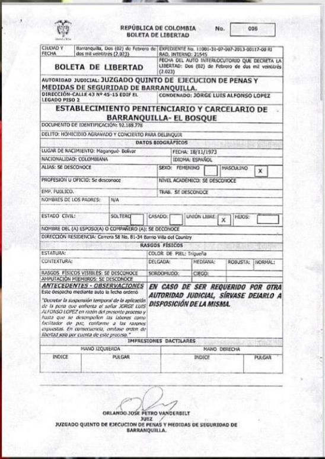
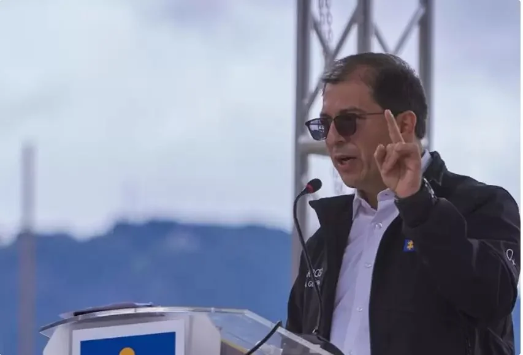

*La «Paz Total» con «el Gatico», y sus víctimas, al olvido. Danilo Rueda está detrás de la rehabilitación del genocida «Jorge 40». Quiere poner en libertad a los genocidas del paramilitarismo.*

La «Paz Total» está cumpliendo con «el Gatico». Pero no cumple con sus víctimas, condenadas al olvido como los Buendía de Cien Años de Soledad. La Gran Prensa puso el grito en el cielo. La «Paz Total» le dio la libertad a **Jorge Luis Alfonso López**, hijo de la empresaria magangueleña **Enilce López Romero**. Ella yace enferma cumpliendo una pena de 37 años de cárcel.

El artífice de esta jugada política, que no jurídica, es precisamente el **Alto Comisionado de Paz (OACP), Iván Danilo Rueda Rodríguez**, quien le dio la categoría de _facilitador de paz_ mediante la **Resolución No 075 del 22 de diciembre de 2022**. Una condición _sine qua non_ para que el Juez Quinto Penal de Ejecuciones de Penas le diera la libertad. El gobierno está cumpliendo con el **Pacto de la Picota** en forma subrepticia y silenciosa.

## La esperanza que se esfuma

A todas luces, esa conducta vergonzante e hipócrita de la OACP está convirtiendo a los criminales y genocidas en **«gestores de paz»** sin que hayan pagado sus deudas con la sociedad y con las víctimas. La esperanza de que haya verdad total, justicia, reparación y no repetición, se esfuma. Es una forma grotesca de burlar el **Estatuto de Roma y la Corte Penal Internacional** a donde deben parar los genocidas y criminales de guerra. No solo es el caso de Alfonso López. La OACP es la principal animadora para que la JEP acepte al genocida **«Jorge 40»**. Busca ponerlo en libertad sin entregar nada a cambio para la verdad.

Así sucedió con el autor intelectual del asesinato **de Rafael Prins Velásquez**, quien no ha aportada nada a la verdad de los crímenes de guerra y del genocidio. Esto se denunció en el artículo sobre la presentación de **Rodrigo Tovar Pupo** ante el tribunal de justicia alternativa. Si esto se cumple, la verdad no se irá a los Estados Unidos como cuando Uribe extraditó a los jefes paramilitares, sino que se esfumará para siempre.

Y el silencio de los defensores de derechos humanos es diciente y trepidante. Están callados porque tienen la boca llena o están esperando un nombramiento como **_caimán en bocaecaño_**. Ellos vivieron de la guerra del **régimen neobonapartista** y ahora están chupando la teta de la «Paz Total».

\[Leer, por favor: [«Yo me llamo Jorge 40»: Un embustero en la JEP](/articulos/yo-me-llamo-jorge-40-un-embustero-en-la-jep-iii/) (III)\]

## **Nota aclaratoria**

Escribo esta nota periodística en mi condición de familiar y amigo de **Rafael Prins Velásquez**, quien fue **ejecutado por orden de Alfonso López el 19 de febrero de 2005**. Si notan que se filtra una gota de emocionalidad en la narrativa de esta verdad, comprendan que el periodista también tiene su corazón. Un corazón que deja traslucir sus emociones humanas sin empañar la objetividad.

Son dos familiares, dos periodistas asesinados por los actores del conflicto. El otro es el periodista **Guzmán Quintero Torres**, mi hermano, _**mi vale**_, quien cayó bajo las balas asesinas de **«Jorge 40»** un 19 de septiembre de 1999. Al día siguiente, salí subrepticiamente para Cartagena con mis hijos menores. Llegué a esta ciudad _**con una mano adelante y otra atrás**_. Estaba en la lista de los condenados a morir por orden de **«Jorge 40»**. ¿Saben ustedes lo que es vivir con el miedo a morir? Llama la atención que la UNP me degradó mi esquema de seguridad cuando en 2020 comencé a publicar sobre el retorno de Rodrigo Tovar Pupo. Lo sorprendente: la UNP en la era de Gustavo Petro se niega a reponer el esquema de seguridad que originalmente me aprobaron. \[Leer: [**El retorno de «Jorge 40», sus aliados y sus muertos (I)**](/articulos/el-retorno-de-jorge-40-sus-aliados-y-sus-muertos/)\]

De hecho, esos periodistas fueron héroes sin capa que entregaron sus vidas por los derechos de la gente. Son almas buenas que lucharon contra el sistema, aunque en vida sufrieran el anatema. Hicieron del periodismo un compromiso con la verdad y con la sociedad. **¿Qué frustración y desesperanza sienten las familias de Guzmán Quintero Torres y Rafael Prins?** ¿Sabrá el presidente **Gustavo Petro** el grave daño que le hace a la sociedad cuando su **_paz total_** se está transformando en una **ventanilla siniestra** de la violencia? ¿Se acabará la guerra disfrazando a los genocidas de ovejas arrepentidas? ¡No!!! Lo único que el gobierno de Petro está acabando es con la esperanza de un pueblo que, después de 200 años, esperaba un cambio. (Te invito a leer mi libro: [**¿Adiós a la Guerra? Cinco claves para la paz**](/articulos/adiosalaguerra/)).

## Así fue el asesinato de rafael Prins

https://youtu.be/xkClm6pe6Wg

El 19 de febrero de 2023 se cumplirán 18 años del asesinato de rafael Prins. Ahora que Jorge Luis Alfonso está libre, este documental es clave.

## La boleta de libertad de «el Gatico»

*La boleta de libertad de «el Gatico». Cortesía Opinión Caribe.*

En la mañana de hoy miércoles fue tramitada una **boleta de libertad** de Jorge Luis Alfonso ante el INPEC de la cárcel de El Bosque de Barranquilla. El juez Quinto Penal de Ejecuciones de Penas y Medidas de Seguridad de Barranquilla, **Orlando José Petro Vanderbil**t, ordenó la libertad de Alfonso López («el Gatico»). ¿Por qué razón? En diciembre había sido nombrado por el gobierno de Gustavo Petro como gestor de paz. Así lo señaló el mismo juez en el auto que tomó esa decisión.

> **«**Decretar la suspensión temporal de la aplicación de la pena que enfrenta el señor JORGE LUIS ALFONSO LÓPEZ en razón del presente proceso y hasta que se desempeñen las labores como facilitador de paz, conforme a las razones expuestas. En consecuencia, emítase orden de libertad solo por cuenta de este proceso**»**.

**Lease bien:** **«**Orden de libertad solo por cuenta de este proceso**»**. El juez se refiere a la **Resolución No 075 del 22 de diciembre de 2022** emitida por el alto gobierno, dentro de la política denominada Paz Total. Allí se reconoció a Jorge Luis Alfonso como **facilitador de paz**. Esta resolución es la condición sine qua non para alcanzar la libertad. Sin ella, el juez estaría prevaricando. ¿Cómo Jorge Luis Alfonso podría cumplir su papel de facilitador de paz encerrado en la cárcel o en su casa?

Por esta razón, el comunicado de la OACP destila pura hipocresía. Es una posición política vergonzante. Expresa la _**reculada del ovejo**_. Esta posición fue forzada cuando los medios de comunicación presentaron esa escandalosa decisión. No fue del juez. Fue una resolución firmada por el gobierno de Gustavo Petro, quien forjó su capital político como defensor de los derechos de las víctimas. Pero, ahora como presidente y con poder para materializar su discurso forjado durante 30 años, parece que está expresando su verdadera catadura: **está del lado de los genocidas**.

/articulos/luciotorres/status/1623483625642622978?s=20

## «La Paz Total no puede ser tramposa»

*«La Paz Total no puede ser tramposa», dice el fiscal Francisco Barbosa.*

Razón le cabe al fiscal cuando dice que «La Paz Total no puede ser tramposa». El gobierno del presidente Gustavo Petro está desfigurando el sentido de la gestión de paz. Los otroras genocidas están haciendo turno para convertirse en «gestores de paz». En la cola se encuentran **«Jorge 40»**, «Marquito» Figueroa, «Kiko» Gómez, entre muchos otros que están pidiendo pista en la Paz Total.

Al respecto, el fiscal Francisco Barbosa consideró que la figura de gestor de paz como el caso de Jorge Luis Alfonso López, no es constitucional ni legal.

> «Como lo he indicado al país, no existe marco jurídico ni constitucional ni ley de sometimiento para que estas personas queden en libertad».

No obstante, el fiscal Barbosa debería investigar la denuncia que se hizo en **Vox Populi Digital** contra el Alto Comisionado de Paz, **Danilo Rueda**. Según fuentes de jefes paramilitares detenidos, durante la campaña electoral a la presidencia de 2022, se reunió con genocidas presos y se transportaba, al parecer, en vehículos blindados proporcionados por empresas de «Ojitos Azules» (Darío Laino Scopetta), Este genocida seguía las órdenes de **«Jorge 40»**. Ellos junto a agentes de la Segunda Brigada de Barranquilla, entre 1998 y 2002, asesinaron a líderes sociales, sindicales, periodistas, docentes y estudiantes que le estorbaban en el proceso de captura de la ciudad.

Esa denuncia tiene sentido con lo que está sucediendo con el proceso de **«Jorge 40»** en la JEP y la gestión de paz de Jorge Luis Alfonso López. Los que analizan la política saben que los compromisos electorales se hacen realidad cuando el comprometido es elegido. **Rueda está cumpliendo con el Pacto de la Picota.**

https://twitter.com/FiscaliaCol/status/1623392827857043459?s=20

## Epílogo

Como periodista he sido defensor de los derechos humanos. No puedo cambiar mi camino, mis principios, cuando en la presidencia está un amigo (Gustavo Petro) con quien comparto muchas ideas, pero que hace lo mismo que hicieron los otros. Verbigracia, si Álvaro Uribe Vélez pretendiera rehabilitar al genocida **«Jorge 40»** y declarara a «el Gatico» facilitador de paz, ¿cómo hubiese sido la reacción de las organizaciones de derechos humanos y de los dirigentes **Iván Cepeda, Aida Abella, Gustavo Bolívar, Gloria Flórez, Gabriel Becerra Yañez**, y un largo etc.? Se olvidaron del genocidio contra la UP y de los casi 300 mil muertos de esta guerra fratricida. ¿Cómo se llama eso? ¿Hipocresía política?