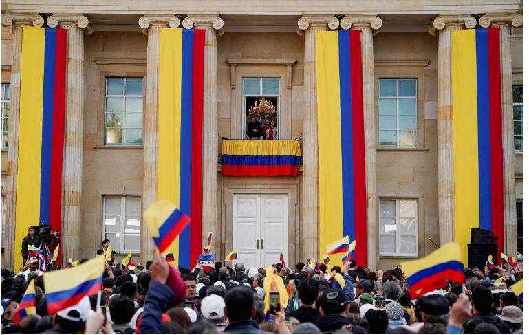
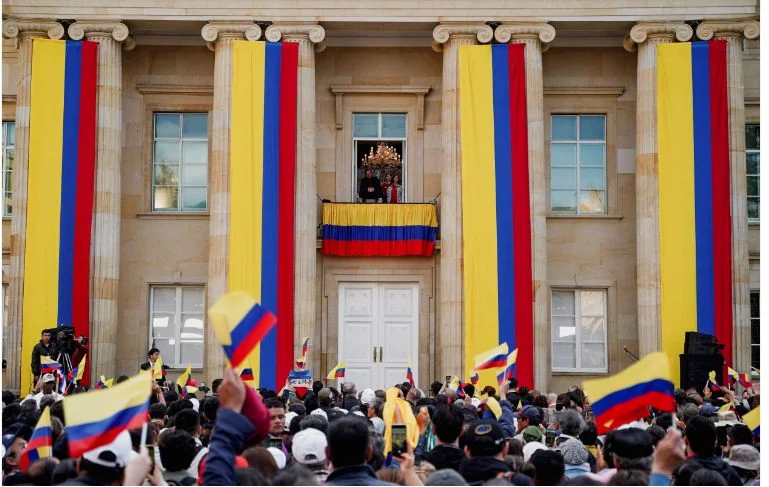

*La marcha de la oposición en Medellín.Sí a la reforma, pero no de esa forma.*

El país necesita cambios para mejorar la calidad de vida. En el caso de la salud, por ejemplo, «**sí a la reforma, pero no de esa forma»**. Las marchas del 14 y 15 de febrero a favor y en contra de las iniciativas legislativas del gobierno, no fueron masivas. **A favor: 28 mil marchantes. En contra: 47 mil**, según la Policía Nacional. Además de reflejar una confrontación ideológica y propagandística sobre las reformas que propone el gobierno del presidente Gustavo Petro, lo que observamos es una derrota a la clase política de izquierda o/y de derecha.

El hecho de que la misma Policía Nacional anunciara de que se movilizaron 75 mil marchantes en las dos jornadas, se constituyen en sí mismas un fracaso político. La derecha o la izquierda quedaron derrotadas en las calles. **La Policía Nacional dispuso de 30.000 uniformados. Es decir, casi un agente patrullero por dos marchantes.**  Así garantizó la seguridad de ambas jornadas en todo el país.

(Puedes leer: [Encuentro distante entre presidente Petro y presidente de ANDI](/articulos/encuentro-distante-entre-presidente-petro-y-presidente-de-andi/))

## «**Sí a la reforma, pero no de esa forma»**

«**Sí a la reforma, pero no de esa forma»**. Si hacemos un análisis comparativo nos damos cuenta que antes de 2015 las tutelas por el derecho a la salud estaban disparadas. Luego de la sentencia **C-760 de 2008 y de la ley 1751 de 2015** que declara la salud como derecho fundamental, las tutelas se estabilizaron. Pero, en 2020 llegó a **81.899 tutelas** contra las Empresas Promotoras de Salud.

Los derechos más vulnerados en este Estado Social de Derecho son de salud, mínimo vital y seguridad social, según la misma **Defensoría del Pueblo**. Lo que indica que deben hacerse reformas ajustadas a la Constitución Nacional y a la sentencia C-760 de 2015.

Son más de 9 millones de tutelas reclamando esos derechos fundamentales. El reclamo del derecho a la salud es la primera motivación de esa acción judicial creada por la Constitución de 1991. Esta situación indicaría que una reforma del sistema de salud es necesaria e inaplazable.

No obstante, surge una pregunta ineludible. ¿Qué sistema se va a aprobar? Por ejemplo, hasta ahora ninguno de los dos bandos han propuesto un debate claro sobre el futuro de la prestación del servicio a la salud. Sin duda, antes de la ley 100/94, se amplió la cobertura de la salud con apoyo a la demanda. Atrás había quedado el viejo sistema donde el Estado subsidiaba la oferta. Ese sistema colapsó, porque la salud quedó reducida a un clientelismo tan voraz como el enriquecimiento de hoy de una élite de empresarios de la salud enquistada en las EPS.

\[Puedes leer: [¡Insólito! Duque gira $60 billones a Eps y sin camas UCI-Covid-19](/articulos/insolito-duque-gira-60-billones-a-eps-y-sin-camas-uci-covid-19/)\].

## Confrontación ideológica

Las redes sociales son escenarios de la confrontación ideológica sobre las reformas de Petro. Muchas mentiras, pocas verdades expresan ambos bandos. Que **Miguel Polo Polo**, reconocido "influencer", haya sido uno de los líderes de la marcha de la oposición, lo dice todo.

Sin embargo, los "influencers" del gobierno no se quedan atrás. Muchos de ellos tienen contratos con el Estado directa o indirectamente. Tales son los casos de **Daniela Beltrán (Lalis) y Celso Tete Crespo**. Asimismo, vienen alineando a medios periodísticos independientes. Algunos sectores políticos allegados al Pacto Histórico exigen del presidente Petro que asuma un mayor control del sistema de medios públicos para ponerlo al servicio de su proyecto político. Esta petición la hacen con el pretendido criterio de que se enfrentan a los aparatos ideológicos de derecha dominantes.

La arremetida es brutal de ambos bandos haciendo de la verdad la principal víctima. La oposición experimenta un nuevo escenario desconocido: las calles. En las jornadas del **14 y 15 de febrero** lograron una victoria pírrica. Los gobiernistas retrocedieron en un terreno que les he familiar.

La derrota de la clase política de gobierno y de oposición, hace pensar que estamos _ads portas_ de una nueva situación del período político. Esto es importante que suceda. Así se demuestra que el país nacional, como dijera **Jorge Eliécer Gaitán**, no le pertenece ni a la izquierda ni a la derecha. Ninguna de esas dos facciones interpreta la voluntad popular.

## Un gobierno compartido

*El presidente Petro hablando en el balcón que da a la Plaza de Bolívar. Abajo fieles seguidores que añoran las grandes marchas.*

Si bien el gobierno de Petro concentra el poder legislativo a la cabeza de sus alfiles **Roy Barreras** (senado) y **David Racero** (cámara), y una coalición aplanadora, carece de solidez política. La izquierda tiene la presidencia, pero el gobierno es compartido con los mismos partidos y personajes que han dominado la política en los últimos 30 años. Es decir, no se percibe ninguna ruptura con el pasado inmediato.

¿El poder para qué sirve si el discurso presidencial no se está concretando? ¿Quiénes hacen posible los cambios? Si se entiende que la transformación de un país se debe a su gente ¿por qué está ausente en las reformas que propone el gobierno? Los 28 mil marchantes del 14 de febrero indican que no tienen respaldo popular. ¿O es que el cambio por la vida puede ser autoría de una élite de izquierda preclara con un brillante discurso que las masas desprotegidas no entienden?

No obstante, el capital político del gobierno compartido de Petro será sometido a una _prueba ácida_. Cuando suba la temperatura en la atmósfera del debate político del congreso sobre las principales reformas, como la de la **salud, laboral, política y agraria**, veremos la verdadera dimensión de la aplanadora petrista. ¿Será un tanque panzer para una guerra política tipo Blitzkrieg, o no pasará de ser pura carretilla? De hecho, la gente dice «s**í a la reforma, pero no de esa forma»**.

\[Puedes leer: [Colombia Humana, médula sana del Pacto Histórico,  corre altos riesgos\].](/articulos/colombia-humana-medula-sana-del-pacto-historico-corre-altos-riesgos/)

## Una oposición acéfala

Si en el gobierno observamos una gran debilidad para movilizar su capital social, en la oposición de derecha no se avizora una respuesta de conjunto. La mayoría de sus organizaciones políticas están entretenidas con la mermelada recibida del gobierno compartido. El jefe natural de la derecha colombiana, **Álvaro Uribe Vélez**, también está entretenido. Sus reuniones con el **presidente Gustavo Petro lo mantiene en la expectativa**. Está petrificado. Tiene mucho que perder si desafía al nuevo gobierno, y éste tampoco quiere afectar los intereses del _establishment_.

Parece que estuviéramos en una pelea de 4 años entre gobierno y oposición. El primer año es de estudio del contrario. Dar golpes y moverse hacia atrás, lanzar jabs de izquierda o de derecha. Pero 2023 será un año especial. La pelea será electoral por las alcaldías y gobernaciones del país. Si los tradicionales logran la victoria electoral, las reformas como están diseñadas no pasarán. Esta es la razón por la cual se espera que sean aprobadas antes de las elecciones de octubre. Algo improbable que suceda.

A quienes vimos jalonar la protesta del 15 de febrero, además de los parlamentarios Miguel Polo Polo y Fernanda Cabal, otros representantes de la oposición estuvieron presentes. Entre ellos, **Francisco Santos, exvicepresidente; Miguel Uribe, Andrés Forero, Enrique Gómez y Ciro Ramírez.** No observamos en ellos un discurso político coherente y profundo que cuestione las reformas petristas. Más bien son vociferantes dotados de frases efectistas de _influencers_ para conseguir likes.

En la próxima entrega se presentará un breve análisis del proyecto de ley para la reforma a la salud. «**Sí a la reforma, pero no de esa forma»** es el principal objetivo de esta serie.