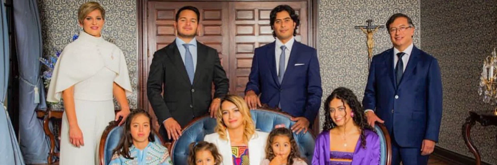

*La familia presidencial. De ellos el primer sacrificado, el primogénito Nicolás Petro.*

El diputado del Atlántico, el primogénito de Petro Urrego, **Nicolás Petro Burgos**, sin duda, sufre una **doble crucifixión política** a raíz del detonado escándalo con su **expareja Day Vásquez**. La primera, como es natural y lógico a sus actos, la crucifixión de la opinión pública polarizada por las actuaciones del Presidente. Pero, la que más le podría estar doliendo en lo más profundo de su corazón, es la **crucifixión paternal** con la denuncia penal que presentó ante la Fiscalía. Este sentimiento se resume en esta frase que dio a conocer hoy en un comunicado de prensa:

> **«... personas que consideré mis amigos y amigas, a quienes les tendí la mano, me han dado la espalda»**.
> 
> Nicolás Petro.

La solicitud del presidente **Gustavo Petro** a la Fiscalía para que investigara los rumores contra su primogénito **—**que no es lo mismo**—** y su hermano **Juan Fernando Petro**, **fue una decisión política fría, calculada y distante del amor que debe sentir un padre por su hijo o de un hermano.** ¿Fue una decisión concertada con ellos?

Sin equívocos, esa decisión es una puñalada a la yugular de la vida social, moral y política de **Nicolás Petro Burgos** y de su fiel amigo **Máximo Noriega**, quienes se echaron al hombro la campaña presidencial en Atlántico y en la Costa Caribe en 2022. Hoy, son los principales crucificados de este escandaloso episodio de la familia presidencial. ¿La decisión de Gustavo Petro de presentar esa denuncia fue por conveniencia política? Sin duda, este sacrificio de su primogénito fue por un interés supremo que rige al presidente Petro. ¿Cuál es ese interés?

\[Te puede interesar: [«Las cabronadas» de Petro con el «Hombre Marlboro» ¿más grave que la «Parapolítica»? (I)](/articulos/las-cabronadas-de-petro-con-el-hombre-marlboro-mas-grave-que-la-parapolitica/)\]

## «Me han dado la espalda», el primogénito de Petro

*Nicolás Petro antes de que se prendiera el escándalo estaba haciendo campaña para maximo Noriega a la gobernación del Atlántico.*

El primogénito del presidente Petro se quejó hoy ante la opinión pública por el linchamiento social y mediático sin precedentes que lo han juzgado y condenado. Este sentimiento lo viene sufriendo desde que la revista Semana publicó la entrevista con su ex esposa **Day Vásquez Castro**.

https://twitter.com/nicolaspetroB/status/1632441680598036482?s=20

## El primogénito de Petro, le siguió los pasos a su padre

**Nicolás Fernando Petro Burgos**, nació en Ciénaga de Oro, Córdoba, un 21 de junio de 1986. Fue criado por su madre **Katia Burgos**, en el seno de una familia de pensamiento político conservador. Estudió derecho en la **Universidad Pontificia Bolivariana**. Hoy está cursando un Máster en Cambio Climático. Su formación política dista, por supuesto, de la obtenida por su padre. Pero comulga con sus preceptos políticos hasta el punto que fue uno de los animadores de la Bogotá Humana.

Al hablar con Petro Burgos en 2022, noté en él, al parecer, una falta de autoestima que sufrimos los seres humanos por carencias afectiva en nuestra infancia. Esto se profundiza debido a que el chico busca estar a la altura de su padre. La gente espera de él eso y, necesariamente, lo comparan con su progenitor. Él debía estar preparado para enfrentar esta realidad.

Luego de que su padre dejara la alcaldía de Bogotá, entre la amargura y el amor, se fue a vivir a Barranquilla. No le fue muy bien en Bogotá. Esa amargura que sentía, al decir de quienes lo conocen, se debió a que la primera vez que su padre presentó una denuncia ante la Fiscalía contra él por falsos rumores, lo marcó para siempre.

En Barranquilla estrechó amistad con Máximo Noriega y es su aliado político. Tanto que fue el principal asesor de su campaña a la gobernación del Atlántico, una candidatura creada por personas allegadas a **Elsa Noguera** para legitimar su elección, la cual estaba cantada mucho antes de la fecha de las elecciones. Tanto que la gobernadora lo acogió en su seno.

En abril de 2019 se casó con Dayssuris Vásquez Castro, cuyo hijo con Pedro name es ahijado de Elsa Noguera. Al matrimonio llegó su padre junto a Verónica Alcocer. Durante la campaña presidencial de su padre 2022 jugó un papel protagónico en la región Caribe al lado de su esposa Day y de su gran amigo Máximo Noriega.

## ¿El sacrificio del primogénito de Petro?

Contrario a lo que podrían pensar los asesores políticos del presidente Petro, el amor de padre debió primar antes que el interés político. Debió entregar una declaración oficial para que su primogénito y su hermano pudiesen demostrar su inocencia ante la ley. Y esto no lo hacía más o menos transparente. No. Pero lo hace más humano, porque el amor de padre es grande, mucho más grande que el poder político y que la presidencia misma. ¿Cuántos reyes no abdicaron por amor? ¿Cuántos líderes no renunciaron a sus sitios de poder político por amor a la familia? Dentro del pensamiento cultural abrahamico, solo Dios entregó a su primogénito para salvar a la humanidad:

> «Porque de tal manera amó Dios al mundo, que dio a su Hijo unigénito, para que todo aquel que cree en Él, no se pierda, mas tenga vida eterna.
> 
> Juan 3:16

En la política nacional, cuando los precedentes históricos indicaban lo contrario, siguiendo la lógica de Petro, tenía un imperativo de hacer lo que ningún presidente habia hecho: denunciar a un hijo. La historia nos dice que **Alfonso López Pumarejo** no lo hizo con su primogénito López Michelsen. Tampoco los presidentes **Álvaro Uribe Vélez y Juan Manuel Santos** con sus hijos. ¿Esta conducta los hizo más o menos corruptos en la presidencia? De ninguna manera.

https://twitter.com/FiscaliaCol/status/1631698879786655744?s=20

## ¿Estaba obligado a crucificar a su primogénito?

En la anterior entrega demostramos que si bien no existe el _**delito de sangre**_, hecho recurrente de los políticos condenados por el **«Proceso 8 mil»** y **«La Parapolítica»**, no puede ser usado por las mismas castas familiares para seguir delinquiendo desde la cima del poder político.

La pregunta que surge ahora en este análisis: **¿Estaba obligado el presidente Petro a denunciar a su propio hijo y hermano de un presunto delito?** La respuesta sin ambages y tajante es: ¡No! Juristas consultados por este periodista manifestaron que el derecho internacional ampara esta excepción de denunciar el delito.

Así está establecido en Colombia por la ley 906 de 2006:

> «Nadie está obligado a formular denuncia contra sí mismo, contra su cónyuge, compañero o compañera permanente o contra sus parientes dentro del cuarto grado de consanguinidad o civil, o segundo de afinidad, o denunciar cuando medie el secreto profesional» .
> 
>  **[SENTENCIA C-848/14](/articulos/actualidad/ultimoscomunicados/C-848-14\(D-9590\).html#:~:text=Nadie%20est%C3%A1%20obligado%20a%20formular,cuando%20medie%20el%20secreto%20profesional.)**

## ¿Por qué sacrificó a su primogénito ?

Desde luego que los políticos viven su propia dinámica y la mayoría está enajenado por la lógica imperante. Por tanto, la actuación de muchos líderes de la política se torna fría y calculadora cuando los protagonistas están enajenados por el mismo poder político. Incluso, ni siquiera el sentimiento del amor paternal extingue esa enajenación cuando está en peligro el poder político que le produce la misma opinión pública. La familia es sólo una categoría y una fotografía para la opinión pública.

De igual manera, esto explica la razón de la violencia política en Colombia protagonizada por las élites dominantes y por sus contrarios que luchan por la inclusión en el poder político. Un ejemplo de esta enajenación política podría ser el **«ajusticiamiento masivo»** de la **Masacre de Tacueyó** (1985) cometido por líderes del movimiento guerrillero **_Ricardo Franco_** contra sus propios compañeros. O los juicios populares de las FARC y el ELN contra líderes del mismo movimiento.

Una de las diferencias que se ha notado en todo esto es el comportamiento de los líderes de izquierda con los de la derecha respecto al amor de la familia. Los movimientos políticos que consideraron que la disciplina de partido y la revolución es superior a la familia, llevaron a sus propias sociedades al holocausto. Ejemplos sobran. La Rusia Soviética de Stalin, la Alemania de Hitler, la China de Mao.

## Sacrificar al primogénito

En 1941 cuando los panzers alemanes penetraron el territorio soviético y estaban en las puertas de Moscú, Stalin promulgó dos decretos. La **Orden 227** que autorizaba fusilar a todos aquellos soldados que abandonaran sus puestos de defensa. La **Orden 270** que impedía que los oficiales del Ejército Rojo se rindieran. Debían morir en el campo de batalla. Los que sobrevivían a la prisión del enemigo, eran ejecutados por un batallón especializado y entrenado para matar a sus propios compañeros de lucha.

El 12 de julio de 1941, el teniente **Yákov Dzhugashvili**, primogénito del dictador Stalin, cayó en manos de los nazis defendiendo el puesto militar **Vitebsk**. En 1943, los nazis le propusieron a Stalin canjear a su hijo, que estaba en un campo de concentración nazi, por el mariscal de campo Von Paulus. Ante esto, el supremo le dijo a los alemanes:

> **«**Un teniente no vale lo mismo que un mariscal, además yo no tengo ningún hijo llamado Yákov.**»**
> 
> [Yákov Dzhugashvili: El hijo que Stalin dejó morir a manos de Hitler](/articulos/yakov-dzhugashvili-el-hijo-que-stalin-dejo-morir-a-manos-de-hitler/).

En 1944, Yákov se suicidó. Hizo como si estuviera huyendo del campo de concentración y los centinelas le dispararon.

## Las relaciones tormentosas de Nicolás

*El trío amoroso que terminó en un linchamiento social para Nicolás Petro.*

De hecho, las relaciones tormentosas de Nicolás no terminarán con este episodio de **Day Vásquez**. La primera consecuencia es que se siente linchado social y moralmente. Pero, el amor de hoy surgido de una trilogía amorosa, tendrá también sus consecuencias en poco tiempo. La despampanante actriz y modelo **Laura Ojeda,** la pareja del primogénito de Petro que está embarazada, en abril de 2022, en la foto del post subido por Day Vásquez para celebrar su tercer aniversario de matrimonio con Nico, les dijo:

> **«**Bellos, que Dios los mantenga unidos siempre, los quiero**»**.

Fueron las palabras de **Laura Ojeda**, la misma que le estaba haciendo "el cajón" a su mejor amiga. Nicolás, el primogénito de Petro, quedó envuelto en un sándwich amoroso, cuyas consecuencias apenas está padeciendo.

## Próxima entrega: Máximo Noriega, el otro sacrificado

https://youtu.be/3FUBDop6K98