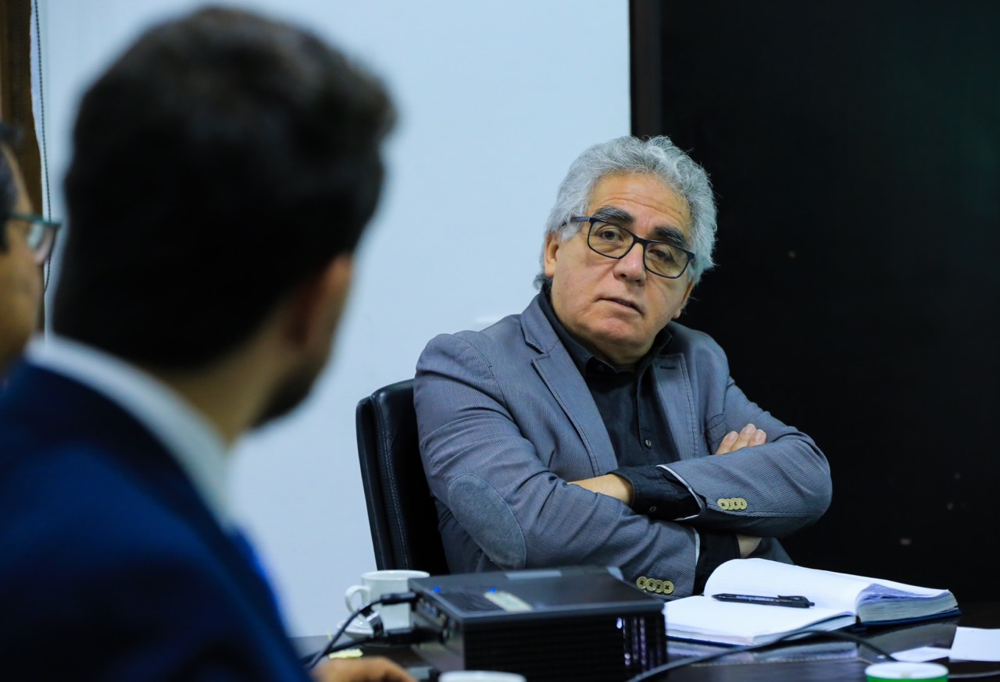
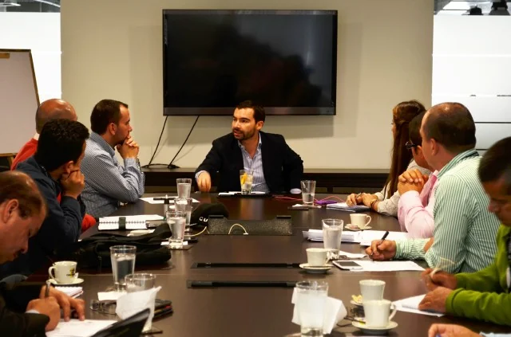

*Manuel Antonio Castañeda Bernal, el narcochofer, uno de los hombres de confianza del que fuera subdirector de Seguridad de la entidad Ronald Rodríguez Rozo.*

¿**«Mafias cartelizadas»** anidadas al interior de la UNP autoras del atentado contra su director, Augusto Rodríguez Ballesteros? Sería una de las hipótesis que los investigadores deben contemplar en sus líneas de investigación para establecer la autoría del atentado del cual salió ileso. ¿Por qué? Eso fue lo que venía denunciando y destapando al interior de esa entidad, cuya misión es garantizar la seguridad personal de líderes políticos, sociales y periodistas amenazados por sus actividades.

Como lo informaron en su momento diferentes medios periodísticos, siendo aproximadamente las 10:30 de la noche del martes 7 de marzo, cuatro individuos movilizados en motos, interceptaron el vehículo blindado donde se transportaba Rodríguez Ballesteros. Pero, afortunadamente, ya había ingresado a la casa. Se produjo un intercambio de balas por parte de los escoltas del director de la UNP contra los agresores.

De ese enfrentamiento, al parecer, uno de los 4 agresores resultó herido. De parte del cuerpo de seguridad de Rodríguez solo uno padeció heridas en una de sus piernas, según el informe de prensa.

\[ Te puede interesar leer la primera parte de este análisis: [Corrupción en UNP: Historia de un perverso complot (I)](/articulos/corrupcion-en-unp-historia-de-un-perverso-complot-i/)\]

## Las «Mafias cartelizadas» no son nuevas

*Lo primero que hizo Augusto Rodríguez como director de la UNP fue reunirse con los sindicatos. Luego de estar un cierto tiempo descubrió las «mafias cartelizadas»*

Lo que le está sucediendo a **Rodríguez Ballesteros** no es nuevo en la UNP. Los directores han tenido que cohabitar con esas mafias. Los funcionarios que están por fuera de sus tentáculos se alinean o los alinean. Por ejemplo, **Julián Marulanda**, secretario general de la UNP en la época cuando la dirección de la entidad estaba en manos del economista **Andrés Villamizar Pachón**, se opuso a varias jugadas chuecas al interior de la UNP cohonestadas por su propio director. Ante ese hecho, fue víctima de un complot en un supuesto caso de soborno donde participaron algunos contratistas que tenían en peligro sus contratos. Pero, recientemente, fue declarado inocente de todo cargo por **la juez 42 Penal del Circuito de Bogotá**.

En efecto, **Marulanda le dijo a VoxPopuli Digital** que el objetivo de algunas de las mafias incrustadas en la UNP lo querían matar por haber descubierto el **_modus operandi_** de algunas de ellas. Pero recurrieron al montaje. Crearon una escena con la complicidad de uno de los grandes contratistas que tenía en esa época la institución.

## Antecedentes del atentado

Cada vez que se deben renovar los contratos o terminar los existentes, siempre se presenta una situación tensionante al interior de la UNP. El año pasado ocurrió un hecho que podría indicarse como antecedentes con los sindicatos. Así lo reseñó la misma dirección:

> Mucho contribuiría con el éxito, reducir las tensiones, no afectar el clima de buena convivencia ni buscar sembrar criterios equivocados o contradictorios. Pero de ahí a llegar con acciones de hecho, como ocurrió este 11 de octubre, cuando un grupo de sindicatos afiliados a la CUT, que habían convocado a un mitin informativo decidieron ejecutar un paro, impidieron el ingreso de los trabajadores, incluido el propio director, Augusto Rodríguez, no se compadece con la voluntad y la disposición de la nueva administración de resolver en buenos términos y en un ambiente fraterno las diferencias y circunstancias laborales propias de este tipo de entidades. Paralizar la actividad en las oficinas, además de ser un acto indebido, no contribuye con las urgencias del despacho que tiene que velar por la vida de personas y comunidades en alto riesgo.

Pero, lo más problemático en materia de seguridad es cuando un megacontrato no se pretende renovar. Verbigracia, en 2014 la contratista **Vise** buscó la renovación del contrato, varios funcionarios hicieron efectivos reparos como los que hizo Marulanda. En circunstancias extrañas uno de los evaluadores, **Germán Escobar**, apareció muerto de un disparo en la sien. Su cadáver lo encontraron en su apartamento. 

## «Mafias cartelizadas» al interior de la UNP

*Lo primero que hizo Andrés Villamizar como director de la UNP fue reunirse con los sindicatos. Villamizar salió mal librado, tal vez contagiado por las «mafias cartelizadas» como se demostró con el complot tendido a Julián Marulanda, secretario de la entidad en 2014.*

Regresemos a la pregunta que nos hicimos al inicio. ¿Por qué el atentado? Sin duda, debemos decir que el director de la Unidad Nacional de Protección, antes del atentado, se estaba ocupando de las «mafias cartelizadas» que rápidamente se anidaron en su interior.

Recordemos que desde su creación (2011), la UNP heredó todo lo bueno y todo lo malo del antiguo Departamento Administrativo de Seguridad (DAS). Gran parte del personal pasó a ocupar cargos directivos en la nueva entidad. Venían con una rica experiencia en materia de seguridad. Al mismo tiempo, muchos de ellos estaban inoculados por el virus de la corrupción que acabó con el DAS. Pusieron al servicio de la maquinaria homicida del paramilitarismo todo el aparato de seguridad del Estado al servicio de las nuevas mafias que resultaron del proceso de Paz del presidente Álvaro Uribe.

Muchos de los reinsertados del paramilitarismo y de la guerrilla de las Farc continuaron delinquiendo alrededor del narcotráfico. Pero ahora con esquemas de seguridad del Estado. Las autoridades echaban la mirada a un lado, cuando se descubrían hechos de evidente corrupción. Casi todos los esquemas de seguridad adolecen de tráfico de influencia, al decir de algunos testigos oculares que reservan sus nombres.

## Los tentáculos de **«Matamba»** en la UNP

Lo fuga de Juan Larinson Castro Estupiñán, alias **«Matamba»**, (marzo 20 de 2022), es otro ejemplo de que las «mafias cartelizadas» son un problema serio de seguridad para muchos de los protegidos de la UNP. Indicaría la forma cómo se maneja la seguridad personal de centenares de hombres y mujeres que ameritan esa garantía de protección personal. **De esto se colige, que la mayoría de los esquemas se montan y se desmontan por intereses de esas «mafias cartelizadas» en la UNP**.

Precisamente con motivo de ese caso, el 5 de diciembre de 2022, **Augusto Rodríguez Ballesteros, según trascendió en su momento, le solicitó a la Fiscalía General de la Nación** investigar el **presunto nexo entre la fuga del peligroso narcotraficante Juan Larison Castro Estupiñán, alias **«Matamba»**** y el llamado narcochofer, expolicía **Manuel Antonio Castañeda Bernal**, uno de los hombres de confianza del que fuera subdirector de Seguridad de la entidad **Ronald Rodríguez Rozo**.

El mismo Castañeda Bernal, fue capturado el 19 de diciembre con **168 paquetes con cocaína de alta pureza** en una camioneta blindada de la UNP. ¿De quién era esa droga? ¿Quiénes eran sus cómplices en la UNP? ¿Siguen vinculados en la entidad? Castañeda es solo un transportador y recibía una paga especial por ese tipo de "trabajo". Confesó que el GAULA los escoltó hasta Doradal Puerto Triunfo (Antioquia) cuando transportaban a **«Matamba»** una vez se fugó de La Picota.

¿Cómo está Ronald Rodriguez Rozo, quien quitaba y ponía esquemas de seguridad y carros blindados, vinculado a estos procesos de narcotráfico y fuga de presos? ¿Siguen sus cómplices mandando al interior de la UNP? ¿Hacia dónde va la investigación de la Fiscalía?

## Las «mafias cartelizadas» están arriba

Desde luego, esto se entiende porque la corrupción viene desde arriba, anidada en las altas esferas de la justicia y dela misma Fiscalía. El mismo **«Matamba»** tenía una nómina criminal integrada por 15 militares activos y en retiro. Muchas de esas pruebas fueron encontradas en el operativo que terminó con la muerte del legendario criminal que tenía 16 antecedentes penales. Se había escapado de la cárcel en 7 ocasiones. Con su muerte se acabó una vida dedicada al homicidio y a todo acto criminal que mucho daño le hizo a la sociedad. Militó desde las Farc, pasando a las autodefensas hasta llegar al Clan del Golfo. Todo movido por el narcotráfico.

Los tentáculos de **«Matamba»** no solo llegaban al GAULA, la Fiscalía sino también a la UNP. Más que tentáculos, es muy posible que el hoy muerto simplemente era parte de una cadena de la mafia que sigue instalada en la misma UNP. Esto es grave. De hecho, la UNP amerita una alta cirugía con plenos poderes para erradicar el tumor que cada día se reproduce con fuerza. Se necesita hacer un vuelco total al sistema de contratación, a la vinculación del personal y hacer un intenso expurgue de empleados y colaboradores. No solo basta acabar con la tercerización. Se necesita terminar con la corrupción. si siguen los mismos, no hay nada que hacer, en cinco años retoñarán las «mafias cartelizadas».

## ¿Podemos acabar la criminalidad del Estado?

**«Puerca pollera no pierde el vicio»**. Los individuos que tienen una mente criminal (sean guerrilleros, narcotraficantes paramilitares o generales, o estén donde estén, hagan lo que hagan, sean curas o pastores) solo cambian de hábitos, porque siguen con la misma conducta criminal en perjuicio de la sociedad. Son psicópatas o sociópatas consumados. Es el caso del coronel **Róbinson González del Río**, quien había llorado ante la JEP pidiendo perdón. Lo perdonaron y se burló de la justicia transicional. Era uno de los altos oficiales retirados que estaban en la nómina criminal de **«Matamba»**. Lo mismo podemos decir del general (r) **Leonardo Barrera** señalado con el alias de ‘El Padrino’, según fuentes de la misma Fiscalía.

Algunos criminales del DAS hoy siguen en la UNP. ¿Lo sabían? ¿Qué tipo de estudio se le hace a los altos funcionarios de la seguridad? ¿Se someten a un intenso estudio polimétrico y a otros test de análisis de seguridad? Si no lo hacen los de arriba, mucho menos los de abajo.

> Asesinar les da sentido de pertenencia a un grupo y se sienten empoderados de que lo pueden hacer. Matan como forma de descargar un coraje, una frustración o la impotencia que vienen arrastrando desde temprano en su vida, según los expertos entrevistados por la mente **criminal**

## **«Muerto el perro, se acabó la rabia»**

Entonces, tenemos que la UNP fue creada en el gobierno de **Juan Manuel Santos** y desde ese tiempo comenzó a padecer la conducta mafiosa heredada del DAS. Aquí no funcionó el viejo dicho de **«muerto el perro, se acabó la rabia»**. Todo lo contrario, es sabido que en su interior coexisten diferentes tipos de mafias sustentadas y patrocinadas desde el exterior. Funcionan al mejor estilo de las mafias italianas que tienen organizaciones sindicales, periodistas, parlamentarios y altos funcionarios de los gobiernos que reciben dádivas de los que manejan los hilos del poder real.

¿Por qué existen 19 sindicatos? ¿Cuántos son de las mafias? ¿Cuántos velan por el bienestar de sus asociados y no por lo intereses mafiosos? ¿Por qué algunos altos funcionarios de la UNP pareciera que mandaran más que su director Augusto Rodríguez? ¿Cuántos cargos directivos de mando de la UNP fueron removidos y otros se mantienen? ¿Por qué no se ha adoptado un sistema de información de punta confiable para seguir la trazabilidad de los procesos? Desde luego que se da un pulso de poder al interior de la UNP.

## ¿La UNP logística de la mafia?

Ahora bien, el objetivo de las mafias no solo es despedazar el presupuesto de **$1.6 billones (2022)** de la entidad. Más del 74% de ese dinero se va en tercerización de servicios misionales de la entidad. El presupuesto es quizás la bolsa de relojera de los mafiosos que se fuga en esa contratación con terceros. Por supuesto no es nada despreciable contratar alrededor de $800 mil millones en hombres de seguridad, vehículos blindados y convencionales, entre otros rubros.

En la primera entrega de un seriado sobre la corrupción al interior de la UNP. Allí nos preguntamos ¿cuál es la verdad verdadera de la UNP? Julián Marulanda, quien iba a ser nombrado director en reemplazo de Villamizar, en 2014 fue **víctima de un complot político** urdido, probablemente, desde la misma Dirección General de la UNP. Todos los cargos de corrupción por los cuales lo habían denunciado fueron declarados infundados por **la juez 42 Penal del Circuito de Bogotá** atendiendo la solicitud, no solo de la defensa, sino también de la misma **Fiscalía y el Ministerio Público.**