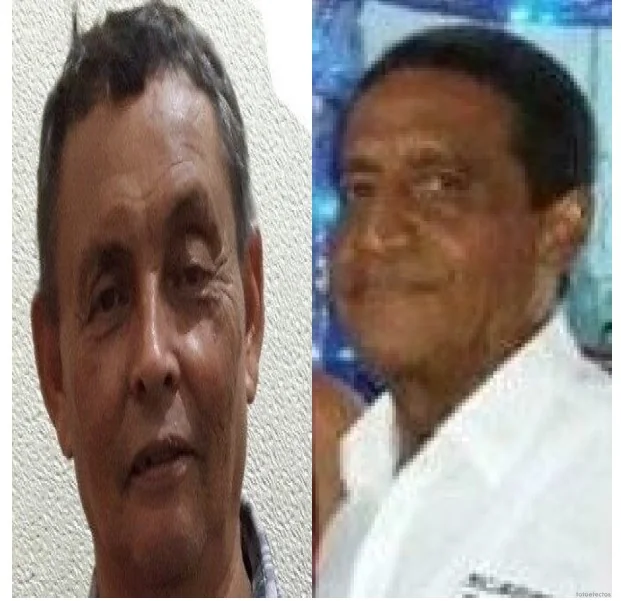
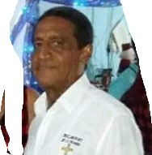
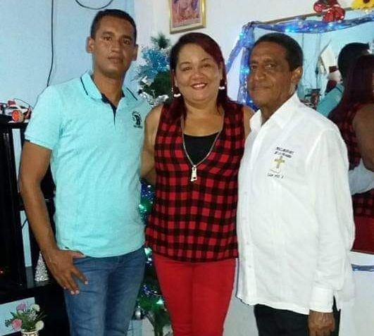

*Eduardo García y Rogelio España, trascendieron lo material.*

Ellos trascendieron lo material porque supieron transmitir sus enseñanzas en tierra fértil. Cuando murió mi maestro de filosofía, **Rogelio España Vera**, el 14 de junio de 2020, mi mente estaba atribulada todavía por el coronavirus. En la noche del viernes **7 de marzo de 2023**, mi primo **Neftaly Prins Moreno**, hermano de **Rafael Prins**, el periodista comunitario asesinado en 2004, me dio la noticia de que se acababa de morir **Eduardo García Martelo**, mi maestro de castellano. Los dos fueron mis maestros **—no docentes—**que trascendieron lo material para ir a la gloria eterna. De alguna manera, soy prolongación de ellos.

¿Cómo puedo retribuirle a mis dos maestros que me apoyaron con sus enseñanzas cuando era un bisoño estudiante de 14 años en el **Liceo Vélez de Magangué**? El profesor **Rogelio España**, además de docente, fue musicólogo y escritor de varios libros. Me enseñó la importancia de la filosofía, específicamente del materialismo histórico y a hacer un análisis de coyuntura política y económica. Al mismo tiempo, **Eduardo García**, excelentísimo pintor, me enseñó (¡atención!) a escribir. ¡Y cuánto se lo agradezco!

Abro una página de la historia de mi generación. La historia es de hombres vivos, como lo explicara el historiador **George Duby**. Destapo un momento de la historia del movimiento social de Magangué poco contado. Incluso, mucho más importante que en la época de **Marcelo Torres** cuando los estudiantes del **Liceo Vélez** secuestraron un avión. Me matriculé en una maestría de historia con la Universidad Nacional solo para estudiar el método historiográfico. Allí estudié al lado del historiador **Sergio Paolo Solano**, el popular _Paco_. Cuando entendí el método, me retiré.

\[Te puede interesar: [“Dejan colgados de la brocha” a extrabajadores de Aseo Regional, en Magangué](/articulos/dejan-colgados-de-la-brocha-a-extrabajadores-de-aseo-regional-en-magangue/)\]

## Cuatro años para siempre: trascendieron lo material

*Eduardo García Martelo*

Entrar a estudiar al Liceo Vélez era una odisea. Llegué allá después de haber cursado el 1° de bachillerato en el Colegio Santander de **Genaro Anaya**, un gran profesor de castellano. En 1972 me gradué de primaria en la **escuela La Milagrosa de Getsemaní en Cartagena**. En 1974 hice un examen de ingreso al liceo. Salí excelente. Me dieron el cupo. **En esos momentos no tenía claro a qué vine al mundo.** Pero tenía una idea de lo que iba a hacer con mi vida. En los próximos cuatro años comenzaba el despertar.

Quizás fueron cuatro años (1974-1977) que nos formamos en una escuela de psicología, sociología, filosofía y política. **Fue una formación para siempre**. Éramos una familia de adolescentes. Chicos con buenas ideas y de una alta espiritualidad. Batallamos juntos por los derechos a la educación de un poco más de 400 estudiantes de las diferentes jornadas que tenía en los años 70s el **Liceo Vélez**. Fueron cuatro años que trascendimos las aulas. La inmensa mayoría de los que nos formamos en esa época nunca nos torcimos como persona. **El concepto de la ética y de los principios fundamentales de la conducta humana nos sirvió para toda la vida**.

## ¿Por qué trascendieron lo material

*La muerte de su hijo y de su esposa Candelaria, pudieron llevar a Eduardo García a una depresión.*

**Y pensamos salvar al mundo**, Y ellos trascendieron lo material haciendo lo que sabían. Y debíamos ser ejemplo. Un espejo donde se reflejara la nueva sociedad que pretendíamos construir. Debíamos ser transparentes, críticos, autocríticos, solidarios, amorosos y abnegados. Y no era cuestión de teoría. Salíamos a apoyar a los obreros petroleros de El Limón, Cicuco, y en contra de Ecopetrol. Lo hacíamos por solidaridad con el más débil. O los campesinos de las sabanas de Bolívar y Sucre a reclamar sus parcelas. ¡Lo hacíamos con mística! **Éramos una especie de ascetas o monjes, cuya espiritualidad estaba dada en el servicio social y en la militancia política**.

Sin duda, fueron cuatro años que marcaron para siempre mi vida y mi conducta como la de la mayoría que vivimos esa experiencia inigualable. Y la cárcel que probé en 1977 fue simplemente una prueba para forjar el diamante que estaba en mi interior. ¡No me doblegué! Salí espiritualmente más fuerte. Y **Eduardo García Martelo**, no solo me enseñaba la escritura sino también la compostura. Yo era un chico díscolo, arrebatado y desordenado como **Fernán Fortich Pacheco**, compañero de lucha estudiantil. Pero éramos muy respetuosos. ¿Cuántos regaños acepté del **Garzo** (así le decíamos), o de José Gutiérrez (_el Chaza_), o de Luis Martínez (_Coyongal_)? Eran los _mayorcitos_ del grupo.

## Farewell 1977

> Fui tuyo, fuiste mía. Tu serás del que te ame,  
> del que corte en tu huerto lo que he sembrado yo
> 
> Farewell, Pablo Neruda.

Una vez quedé en libertad. A mis familiares le dijeron que si seguía en Magangué me iban a matar. Le dije adiós a esos cuatro años de una escuela integral de alta formación. A mis amores furtivos, a las calles polvorientas, a las ciénagas, al río, a la gente buena de la _Ciudad de los Ríos_. A mi familia. A Eduardo García y a todos mis compañeros y compañeras de lucha.

Todo eso me sirvió cuando me desplacé forzosamente para **Barranquilla en 1977**. Con decirle que no fui capaz de fumarme un cigarrillo de tabaco o de marihuana. En Magangué viví en tres sitios: Versalles, al lado de la casa cural y en La Peña. Pero pasaba mucho en el barrio Olaya donde vivía mi papá Juan con **Isabel Navas** y mis hermanos de padre. En Versalles y en Olaya, para esa época, era algo frecuente ver a los _burriquetes_ en las esquinas botando humo como una chimenea. Y en Barranquilla, la cosa no era diferente a Versalles. Era peor.

Dos años más tarde, ya estaba estudiando periodismo en la Universidad Autónoma del Caribe. Egresé en 1983 y me gradué en 1987. Fue una seguida de triunfos, puesto que me gradué de bachiller en 1978 en el Instituto Pestalozzi, anexo a la Universidad del Atlántico. En 1977 validé el 5° de bachillerato en la **Escuela Normal Nacional para Varones del Litoral Atlántico**, hoy Escuela Normal Superior La hacienda. Si el rector del Liceo Vélez, **Cantillo Soto**, no me hubiese expulsado, seguramente no hubiese tenido la oportunidad de hacer este recorrido de vida. Así le sucedió a la mayoría de los que estuvimos en **la diáspora del Liceo Vélez.**

## 1975

*¿Quién no se conmovió con esta fotografía en 1972? Los que seguíamos la guerra de Vietnam nos impactó mucho. Por eso el triunfo de los norvietnamistas sobre los Estados Unidos nos llenó de alegría a la juventud de aquella época que estábamos contra la guerra.*

Para 1975 teníamos un gran compromiso: seguir el legado dejado por una camada de líderes estudiantiles que terminaron su bachillerato. Muchos debieron trasladarse a otras ciudades a estudiar sus carreras profesionales. **Luis Martínez, Andrés Amell, Augusto Salas, Arturo Zea** y muchos otros. Arturo, quien se distinguió por ser también un destacado propagandista y amante del arte, era responsable del circulo de estudio donde yo me encontraba. Arturo Zea, gracias a la influencia política de su cuñado, Farid Arana, fue nombrado alcalde de Magangué seis años más tarde. Eduardo García se quedó en Magangué, porque en aquel tiempo era también mensajero del Liceo Vélez. Y los directivos del Liceo no sabían de su militancia trotskista. Desconocían que era él, junto con Nestaly Prins, quienes hacían los grandes pósters de Camilo Torres o El Che, nuestros héroes en el imaginario revolucionario.

En efecto, _Garzo_ fue nuestro gran artista de la revolución. Pero, eso lo sabíamos un pequeño grupo de estudiantes conspiradores que publicábamos los contenidos para revolucionar la mentalidad de toda una generación.

## La guerra de Vietnam

Recuerdo **—**tendría 15 años**—** que el **29 de abril de 1975** duramos trabajando la edición del periódico **Comité de Trabajo Socialista** hasta las 4 de la mañana del día siguiente. Ese día trabajamos en su humilde casa ubicada a orillas de la ciénaga del barrio Versalles. A las 7 de la mañana el Garzo estaba tocando la campana del Liceo que indicaba la hora de entrada. Mientras nosotros comenzábamos a distribuir el periódico de salón en salón. Ese día había triunfado la Revolución Vietnamita cuando entraron triunfantes los guerrilleros a Saigón. Habían declarado la unificación del país, expulsando a los soldados norteamericanos que habían invadido la nación.

Ese día, **Eduardo García hizo una caratula espectacular.** Recuerdo que dibujó a un guerrillero del Vietcom con un fusil en alto en son de triunfo, **sin apuntar a nadie**. Además de escribir impecablemente con una hermosa caligrafía, **era un excelente dibujante y pintor**. Y también _pintor de brocha gorda_, oficio con el que obtenía ingresos adicionales, ya que su papá Eduardo se lo llevaba a pintar casas y edificios junto con su tío que conocíamos como **_«_Pinguita_»_**.

No sé por qué yo era el redactor y editor del periódico. Era el menor de todos. Escribí el artículo central sobre ese acontecimiento histórico. Todos estuvieron de acuerdo con su contenido. Eduardo era mi corrector de estilo. Además, era el ilustrador junto con Neftaly. Hacían los mejores pósters, carteleras y cuadros del Liceo. **Ketty Gordon** era la mecanógrafa, la que "picaba" el stencil. Imprimíamos el periódico no en un mimeógrafo. No. Usábamos una especie planigrafo que Eduardo García lo manejaba a la perfección y lo guardábamos en su casa bajo los principios fundamentales de la conspiración. Éramos clandestinos para hacer las cosas. Pero transparentes en nuestra relación con los demás estudiantes del liceo o de la sociedad.

## 1977

Todo iba muy bien. Los estudiantes no solo éramos objetos sino sujetos de derechos. Fuimos el estamento más importante que supervisaba a directivos y profesores para que cumplieran con su deber. Los líderes estudiantiles debíamos ser los primeros en el rendimiento escolar. Esa era la concepción de los dirigentes del **trotskismo**. Hasta cuando en 1977 el secretario de Educación de Bolívar de la época, respondiendo a directrices del Ministerio de Educación Nacional (MEN) y, específicamente, de un inspector llamado **Antonio Castaño**, expulsaron a 95 estudiantes del Liceo Vélez. Sin derecho a recibir las calificaciones de los períodos estudiados. Los estudiantes expulsados debimos salir de Magangué para terminar su bachillerato. Algunos solo faltaba un semestre para graduarse. Yo hacía 5° de bachillerato (hoy 10). Una vez, salí de la cárcel

Primero expulsaron a cinco, entre los cuales estaba **Neftaly Prins, José Gutiérrez y Gilberto Ospina** copartidarios míos, **y William Ruiz y Fredy Bolívar**, que eran del Moir. Me salvé de la primera expulsión, porque si bien me había matriculado para 5° de bachillerato, me fui a estudiar al colegio "**Antonio Lenis**" de Sincelejo. La idea era organizar la corriente trotskista que no tenía ninguna presencia allí. Pero como el rector era de tendencia **estalinista-maoista**, cuando descubrió que la corriente trotskista había elegido una significativa delegación al Consejo Estudiantil, me expulsó fulminantemente.

Después de la derrota del movimiento estudiantil de Magangué, comenzó la diáspora. Esos 95 estudiantes debieron trasladarse fuera de Bolívar para terminar su bachillerato. A algunos solo les faltaba un semestre para graduarse. Yo hacía 5° de bachillerato (hoy 10). Después de estar más de una semana en la cárcel, mi primo **Marino Barros Moreno** habló con el alcalde **Amín**. Nos pusieron en libertad. Habíamos infringido el Estado de Sitio del gobierno de **Alfonso López Michelsen**.

## La encarcelada

Expulsado del Antonio Lenis, me regresé a Magangué a encabezar la lucha por el reintegro de los estudiantes del Liceo Vélez. Luchamos cerca de dos meses con el apoyo de docentes y padres de familia. Eduardo, siendo mensajero del Liceo Vélez, jugó un papel muy importante para nuestro apoyo.

En una de las manifestaciones de protesta cuando hacía uso de la palabra, me capturaron 10 policías. Me golpearon hasta dejarme privado. Luego me encarcelaron y me metieron en una mazmorra de la cárcel municipal que estaba en la calle de Las Flores (Carrera 3 con la calle 11a) donde hoy está un CAI de la Policía.

Esa noche dormí en el piso en un espacio reducido compartidos con peligrosos delincuentes. Recuerdo que uno me regañó respetuosamente, porque me dijo que si iba al colegio era para estudiar y no hacer desordenes. No le contradije. Pensé que era inútil explicarle la causa de mi lucha. Al día siguiente, me hizo compañía **Elias Ospina ,**padre de **Gilberto Ospina Marroquín,** hoy profesor y líder sindical de Fecode en Medellín. El viejo de Ospina, como otros padres de familia, al saber que nuestra lucha tenía como objetivo tener buenos laboratorios, más profesores, mejor infraestructura, nos acompañó en esa lucha por el reintegro.

## La lista de la diáspora

Sabíamos que desde Cartagena estaban organizando la lista de los estudiantes que debían expulsar. Pero lo que queríamos era que reintegraran a los primeros que les habían cancelado la matricula.

La lista de expulsados la encabezábamos los **trotskistas-camilistas**. Éramos los que mayor presencia teníamos en el movimiento estudiantil. Allí estábamos este servidor, mi primo **Neftaly, Gilberto Ospina, José Gutiérrez, Fernán Fortich**, **Julio Martínez Navaro**, **Temístocles Orellano**, **Vivian Padilla, La Muñe, Lupe Montes, María Belén, Nevis Loaiza Suárez (Aleja), María Auxiliadora Rivera, Felix Borré** y muchos otros. Luego vinieron los líderes de la Juventud Patriótica, **Mario Ojeda**, **Fredys Bolívar**, **Julia Quiroz**, que eran del MOIR. Posteriormente los de la Juventud Comunista, **Daniel Franco** y otros, estudió sociología y hoy es un destacado empresario, hacía parte del grupo de **José Padauí.**

Con Daniel Franco visité la antigua sede del Liceo Vélez que él como contratista reconstruyó respetando el diseño original. En esa visita **—46 años después—** recordé la última asamblea estudiantil a la cual habíamos invitado al rector Cantillo Soto. Lo hicimos subir al balcón para que explicara la resolución que no llevaba su firma sino la del secretario de Educación de Bolívar y del inspector del Ministerio de Educación Nacional. En aquel momento, yo tenía la palabra y lo hice comparecer ante la asamblea de estudiantes para que diera su explicación. Nadie le tocó un pelo al rector. Lo escuchamos sin agredirlo.

Eduardo García Martelo vivió esos momentos detrás del telón. Como mensajero del Vélez trabajó hasta cuando entró como docente en el municipio de Magangué. Se le conoció como el _profesor Martelo_. Su proyecto de vida, que se inició cuando terminó 5° de primaria en el **Colegio Marco Fidel Suárez**, según testimonio del abogado y exfiscal delegado ante la Corte Suprema de Justicia, **Ricardo Mezamell**, su compañero de estudio en ese centro educativo.

## Próxima entrega: de García a España