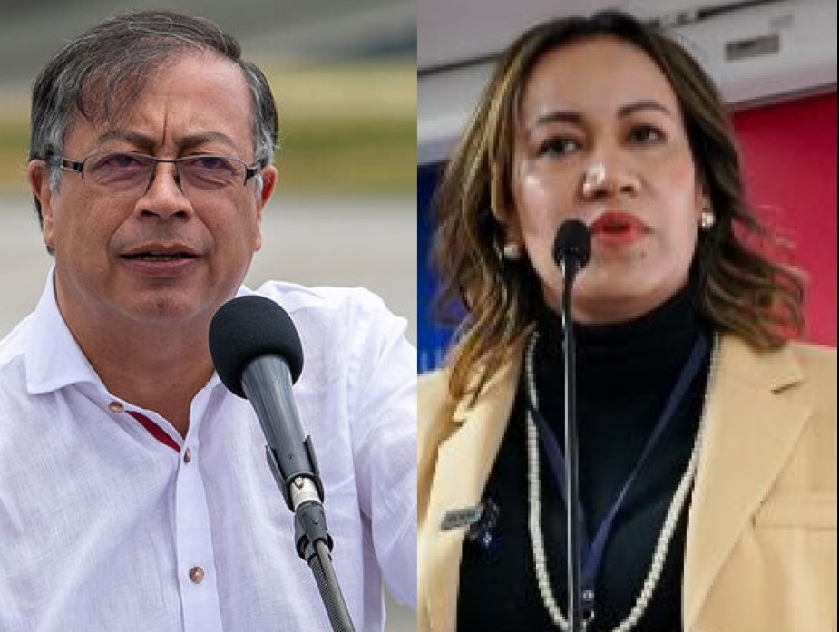

*El presidente Gustavo Petro salió de Diana Carolina Corcho de una manera criticada por sectores importantes de la salud. ¿Se corchó Petro con el sacrifico de Carolina?*

¿Se corchó Petro con el sacrificio de **Diana Carolina Corcho** **Mejía**, la hoy exministra de Salud? **Sectores de la Colombia Humana** y de organizaciones que integran el **Pacto Histórico** expresaron toda su solidaridad a la exfuncionaria, la principal sacrificada con el cambio ministerial. Ahora tenemos un gabinete incondicional y moldeable al deseo absoluto del **presidente Gustavo Petro**, cuya Colombia Humana brilla por su debilidad orgánica. Un gabinete sin disenso, proclive al unanimismo, lo llevaría a **un falso consenso**.

Con este cambio de _lineup_ antes de que termine el _primer inning_, **—**como se dice en el argot beisbolero— el fracaso de su estrategia de gobierno compartido y pacto parlamentario con sectores de centro—derecha del congreso en detrimento de un verdadero diálogo social. Tras su retiro, la exministra Corcho recibió muchas expresiones de solidaridad y de reconocimiento. Pero, cuando ejerció el ministerio, parecía que estuviera sola, ni el presidente la respaldó ante la jauría que enfrentó. ¿Por qué no la apoyó como lo hace con la ministra de Minas y Energía, Irene Vélez Torres? Si bien, algunos líderes de la coalición Pacto Histórico no se atreven a expresar su verdadero pensamiento sobre esta salida inesperada, causó mucho malestar entre ellos.

De antemano, aclaramos que en esta oportunidad se usa expresiones beisbolera de la cultura Caribe. A propósito del libro _Noveno Inning_, de nuestros amigos Bertha Arnedo y Felipe Merlano.

## ¿Se corchó Petro con el sacrificio de Carolina?

https://twitter.com/CarolinaMRoa/status/1651761590088155138?s=20

En el nuevo _lineup_ ministerial observamos un _roster_ que **—**aunque tienen visiones y prácticas diferentes**—** está integrado por personajes que obedecerían a ciegas los designios de Gustavo Petro: **Ricardo Bonilla**, ministro de Hacienda; **Guillermo Alfonso Jaramillo**, ministro de Salud; **Mauricio Lizcano**, ministro de las TIC; **Luis Fernando Velasco**, ministro del Interior, y **Jhénifer Mojica Flórez**, ministra de Agricultura. Esto no es bueno ni malo. ¿Qué pretende el _manager_ con este nuevo roster? ¿Negociar el trámite de las reformas desde una **concentración del poder** presidencialista para doblegar a las mayorías del congreso? Tal sería la nueva estrategia.

¿Es conveniente una concentración del poder cuando el gobierno es débil? ¿Por qué no lo hizo desde el principio para **—**a partir de allí**—** iniciar un proceso de concertación con el congreso? ¿Por qué delegó el poder en un gabinete contrario a las fuerzas orgánicas que estuvieron en su campaña electoral?

Ahora bien. ¿Fue acertada la decisión de sacrificar a una mujer que se la jugó toda por sus convicciones y compromisos con el electorado colombiano y con la misma visión del presidente? ¿Fue consecuente con lo que representa una profesional de la salud, académica**—**orgánica que creyó en la propuesta de cambio del Sistema de la Salud de Colombia?

¿Acaso Carolina Corcho se ponchó frente a las _bolas lanzadas_ por expertos y viejos _pitchers_ anidados en un viejo congreso repleto de jugadas sucias, por lo que debía ser reemplazada por un _cuarto bate_ que es **Alfonso Jaramillo**? Tampoco se trata de descalificar a nadie. O de decir que uno es mejor que el otro.

## Una sola voz

De cierto, de ahora en adelante los consejos de gobierno presidenciales solo tendrán una voz, la del presidente Petro. Sin disenso. Tendrá resultados inmediatos. Pero con el tiempo se va absolutizando una forma de gobierno contraria al ideal democrático. El consenso solo se construye a partir del reconocimiento del disenso. Pero, la concentración del poder es la maldición que ha corroído el poder político de la izquierda desde la Revolución de Octubre, Rusia 1917.

En consecuencia, nada se haría si no está en los libretos preconcebidos del mandatario y al vaivén del juego político que está lleno de muchas mañas del adversario. Si te descuida, te _roban la base_. Pero también observamos en este primer _inning_ señales equívocas del _manager_. Y aquí está el grave problema que nos afectaría a todos: a la izquierda y a la derecha, al trabajador y al empresario, al pobre y al rico. ¡A todo el país!

La principal falencia de muchos gobernantes es que no saben interpretar la esencia del poder político. El poder se ejerce o se delega. El presidente delega en sus ministros el ejercicio de las políticas públicas. En esa determinada área, la deben tener más claras que el propio delegante. El delegado recibe la orientación política, pero el delegante debe tener la experticia y el conocimiento para diseñar y ejecutar el conjunto de las políticas publicas.

Los estadistas del siglo XXI deberán romper con las ataduras del pasado impuestas por sistemas políticos de izquierda o de derecha que han lesionado a la humanidad con los holocaustos causados. Ejemplo de esto, son las guerras y los genocidios que han acompañado las promesas de cambio. Ahora, la existencia de gobiernos de partidos son pretextos personales para convertirlos en instrumentos de beneficios económicos y sesgos cognitivos de los mandatarios, lejos de ideales sanos como el bienestar, la felicidad y la democracia.

## UdeA: ¿Se corchó Petro?

/articulos/luciotorres/status/1652383296670580738?s=20

Diferentes voces señalan que la exministra Corcho Mejía estaba poniendo toda la carne en la parrilla para transformar el Sistema de la Salud. Entonces, ¿por qué el gobierno del cambio la zapateó? ¿Pudo más el interés político de pasar una reforma a la salud que ya no será la que Corcho encarnaba sino una caricatura de ella? ¿Valió la pena este sacrificio para sacar adelante una reforma que ya no será lo que se pensaba que fuera?

La facultad de Medicina de la Universidad de Antioquia le hizo una distinción a Carolina Corcho por el papel que ella representó para proteger el derecho a la salud:

> **«Gracias a su liderazgo, el compromiso ministerial superior de proteger el derecho a la salud de la población, ganó notable relevancia para todo el país.** Su voz ayudó a que la sociedad colombiana, en su conjunto, reconozca que el Sistema de Salud necesita cambios profundos para garantizar el goce efectivo del Derecho Fundamental a la Salud a todos los ciudadanos».
> 
> Comunicado de prensa UdeA.

Corcho ha sido vicepresidenta de la Federación Médica Colombiana, presidenta de la ONG Corporación Latinoamericana Sur y de la Asociación Nacional de Internos y Residentes. Además, fue coautora de la Ley Estatutaria de la Salud y la Ley de Residencias Médicas, y **hace parte del órgano consultor de la Corte Constitucional para temas de política pública en salud.**  

## La emocionalidad política de Petro

/articulos/luciotorres/status/1652388438300033028?s=20

Respondan esta pregunta: ¿Se corchó Petro con la salida de Carolina Corcho?

Sin embargo, los gobernantes son tan emocionales que se dejan seducir de la emocionalidad. Dicen los expertos neurocientíficos que los seres humanos somos emocionales, intuitivos y racionales. El premio nobel, [Daniel Kahneman](https://luciotorres.local/wiki/Daniel_Kahneman), habla de dos sistemas del cerebro: **Sistema 1** que maneja lo emocional e intuitivo y el **Sistema 2** que administra lo racional. El problema de los gobernantes poderosos reside en el Sistema 1. Allí se producen pensamientos distorsionados y **sesgos cognitivos** que hacen tomar decisiones erradas al gobernante. Por esto, _dos cabezas piensan mejor que una_, dice el adagio popular. Y tiene toda la razón.

¿Quién dijo que Gustavo Petro no tiene un brillante discurso político que emociona? La mitad del país le votó porque le atrajo, por ejemplo, la promesa de cambio del Sistema de Salud, Reforma Agraria, Reforma Laboral, un nuevo país. ¿Que se ha visto hasta ahora? En este _primer inning_, que aún no termina, nos damos cuenta que tenemos más de lo mismo. Petro no puede gestionar el disenso. Así lo demostró en la alcaldía de Bogotá. Él gusta del consenso, que es un fenómeno binario. Uno no puede existir sin el otro.

Sin embargo, vale la pena ir a la historia política con **pensamiento crítico** cuando al interior de la Colombia Humana y de varios partidos de izquierda hablan de gobernar sin alianzas. Y hasta creen que la salida política es **convocar a una Asamblea Nacional Constituyente—ANC**. No se han dado cuenta que los resultados de la consulta interna del **partido de gobierno** brilló por su debilidad popular y que el respaldo a las reformas de **Gustavo Petro** carecen del fervor comunitario. Esta es la realidad llana, independientemente de si las reformas sean necesarias, pertinentes o no.

## El sistema que se degeneró

Cuando en 1917 los Bolcheviques se tomaron el poder, su máximo líder Lenin convocó a una **Asamblea Nacional Constituyente (ANC)** con el fin de diseñar una nueva nación. Pero, cuando la realidad le demostró que ellos solo eran una minoría dentro de una Rusia, cuyo 80% era rural, al solo elegir democráticamente un 24% de sus miembros, el líder bolchevique ordenó disolver la ANC. No toleraron el disenso, ni estar en minoría.

En esta etapa de la historia se parió un sistema político que prometió a los trabajadores y campesinos el paraíso en la tierra. Muy pronto surgió la **«dictadura del proletariado»**, la policía política llamada **Checa** y se profundizó la limitación de los derechos civiles que emergían en un **régimen zarista absolutista**. Eliminaron a todos sus antiguos aliados de izquierda, socialistas revolucionarios, a la centro izquierda y a la derecha democrática para erigir un **poder absoluto** que lo resumió en una consigna: **«Todo el poder para los soviets»**. **Pensar distinto era ser contrarrevolucionario**. Lenin en el poder ordenó la deportación a Siberia de centenares socialistas revolucionarios, anarquistas, blanquistas al lado de partidarios del ejército Blanco. Pero, cuando asumió el poder **Joseph Stalin**, en sus purgas políticas, **fueron exterminados 9 millones de sus compatriotas**. Un gran porcentaje pereció en campos de trabajo forzados en Siberia, según el escritor ruso **Vadim Erlikman**.

Al final de su vida (1924), Lenin entendió que había cometido un grave error. Pero ya era tarde. Él mismo había parido a un engendro político más sanguinario y con un sesgo cognitivo mayor: **la megalomanía estaliniana**. Este hecho lo dejó plasmado en su _testamento_ cuando observó que **Joseph Stalin**, como Secretario General del partido, había concentrando todo el poder. Recomendó que fuera relevado del cargo. Al morir Lenin, la **«dictadura del proletariado»** pasó a ser la dictadura de Stalin. Lo primero que hizo fue expulsar al digno sucesor de Lenin, **León trotsky**, y mandarlo a una isla de Turquía. Trotsky se escapó, pero no de la muerte ordenada por el dictador de Rusia. **Ramón Mercader,** agente del partido comunista español, lo asesinó con un pico de alpinista en Coyoacán, México, agosto de 1940.

## ¿Giro a la izquierda?

Algunos califican el cambio de _lineup_ del gabinete ministerial como un _timonazo a la izquierda_, como dice María Jimena Duzán. Este criterio está lejos de la realidad. El ministro Bonilla, por ejemplo, es un seguidor de las políticas conservaduristas del FMI y del Banco Mundial. Por lo menos, Ocampo es un cepalista, estructuralista que busca una conciliacion entre el interés privado y el público. Jaramillo es un liberal que acompañó a Petro en la alcaldía de Bogotá con buenos indicadores sociales durante su gestión.

La salida de **Diana Carolina Corcho Mejía** es una especie de comida para buitres. ¿Un fusible, como en los mejores tiempos del presidente Uribe? Sin embargo, quitarla del camino ¿facilitaría la aprobación de la Reforma al Sistema de la Salud? Esta es otra historia que contaremos en la próxima entrega de esta serie.