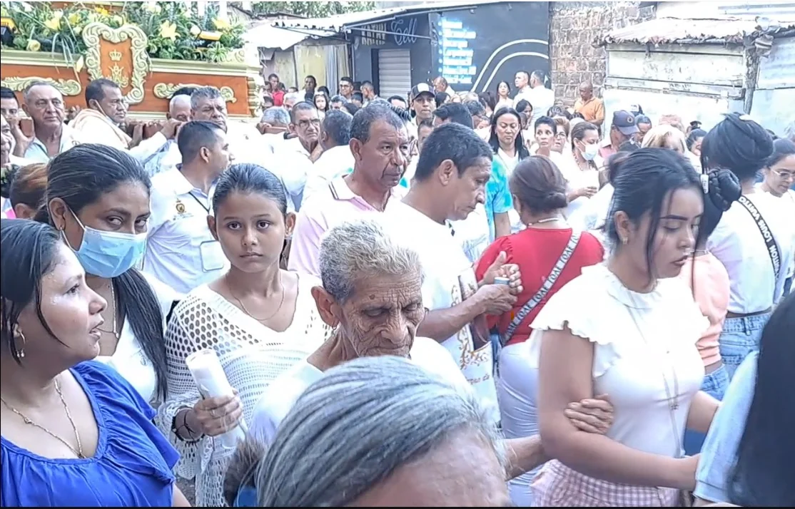
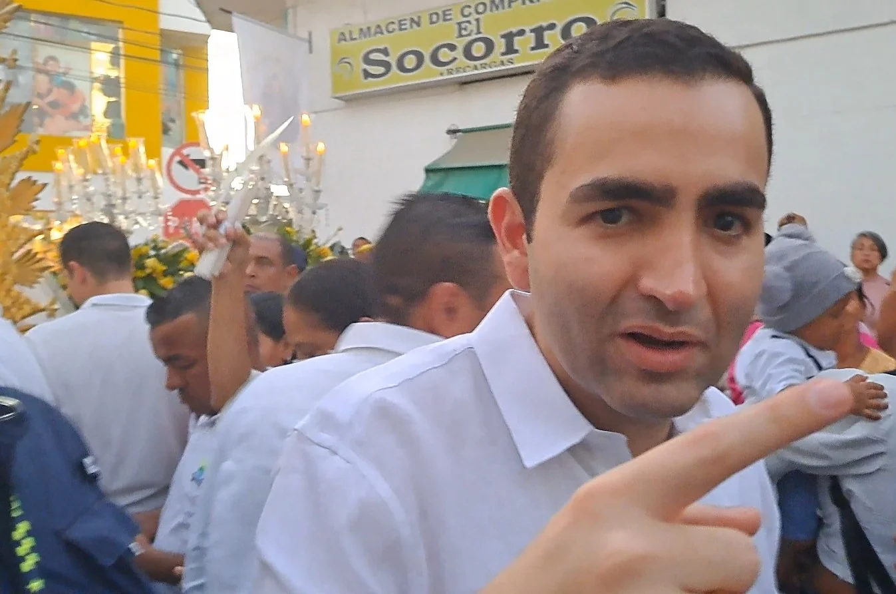
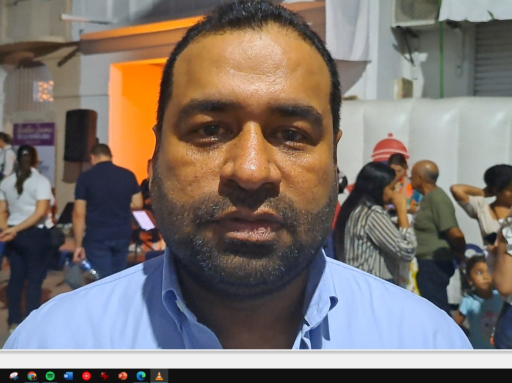
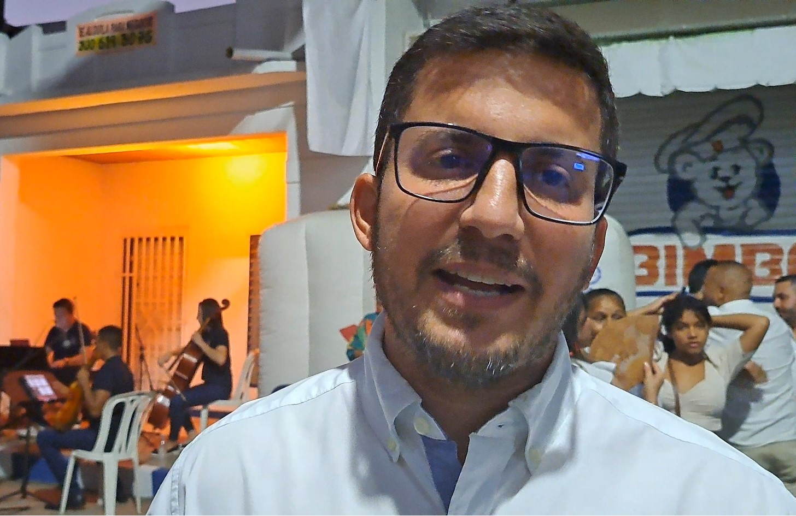
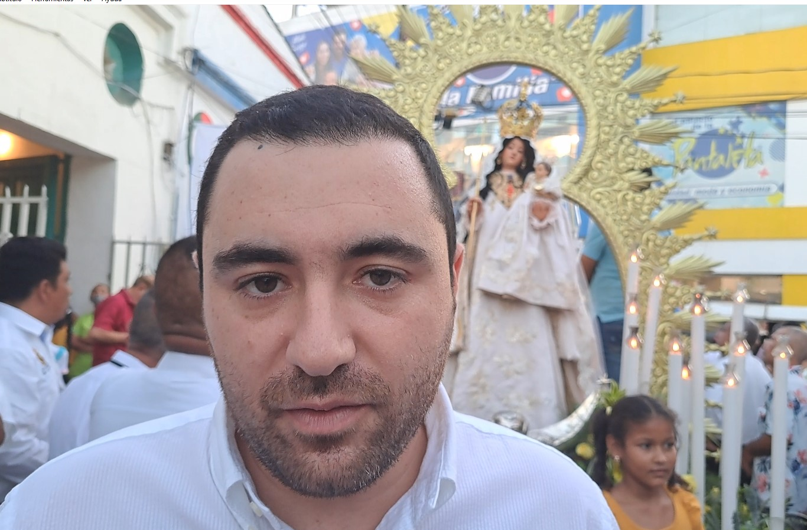

*Turismo religioso: Se le apareció la Virgen a Magangué. Aspecto de la procesión de la Virgen de la Candelaria en Magangué febrero 2023.*

Comienza la Semana Santa y se reactiva el turismo religioso, especialmente en 21 sitios de Colombia. Los centros de atracción de categoría nacional son Mompox y Cartagena en Bolívar. En cuanto a alcanzar una verdadera experiencia religiosa, **a Magangué se le apareció la virgen**. Ahora, la **_Ciudad de los tres ríos_**, ineludiblemente, podría ser incluida entre los 21 sitios de la «Ruta de la Fe». La «Ley Yamilito» facilita el camino para que ello sea una realidad y vendría la reactivación de la economía, el turismo y de la vida social y cultural de Magangué.

La declaratoria de Patrimonio Cultural de la Nación de las fiestas de la Virgen de la Candelaria debe ser aprovechada para que la incluyan en los sitios atractivos del turismo religioso nacional. Esto es, ofrecer una experiencia religiosa para aquellos turistas que andan por el país y el mundo en la busqueda de una vivencia especial con Dios.

## Semana Santa, la experiencia mayor

Para la Semana Mayor en la región Caribe sobresalen Santo Tomás, Atlántico. También Valledupar, y Ciénaga de Oro, Córdoba. ¿Por qué Magangué no podría construir una ruta cultural religiosa con Mompox aprovechando su calidad de Distrito y de tener una Semana Santa afincada a nivel nacional? No se trata de competir sino colaborar mutuamente para que las fiestas centrales de cada una de ellas se fortalezcan y ofrecerle al turista una experiencia mayor.

La Semana Santa en Mompox despierta una atracción en el turismo religioso, pero también en el fomento del sector inmobiliario y de la gastroeconomía. La orfebrería es una de las ramas de la economía que más se beneficia.

En tanto que en Magangué este año fue la primera vez que se celebraron las fiestas de la Virgen de la Candelaria como Patrimonio Cultural de la Nación. Los resultados fueron muy positivos en todos los aspectos, al decir de periodistas y de organizaciones sociales asociadas a estas festividades. Uno de los periodistas imbuidos en estas actividades religiosas, **Rodolfo Zambrano**, así lo reafirma y miembros de la organización de historiadores de Magangué, entre ellos, el profesor **Julio César Martínez Navarro.**

\[Te puede interesar: [Ley Yamilito: La Candelaria de Magangué patrimonio de la humanidad](/articulos/ley-yamilito-la-candelaria-de-magangue-patrimonio-cultural-i/)\]

## Turismo religioso: balance positivo

*El gobernador de Bolívar, Vicente Blel Scaff, es uno de los impulsores de las festividades de la Candelaria. Aquí en 2023 a la salida de la virgen hacia la catedral de Magangué.*

Si bien es cierto que en los tiempos de pandemia, la asistencia presencial de los eventos quedó restringida, en este año 2023 los eventos centrales contaron con una asistencia masiva no solo de los nativos sino también de zonas aledañas y también lejanas. Este año se abrió un mundo de posibilidades religiosas, turísticas y económicas a «La Ciudad Cosmopolita**»**.

El gobernador, **Vicente Blel Scaff** y varios de sus secretarios estuvieron presentes en los acontecimientos más importantes de las fiestas. Así como algunos parlamentarios del departamento, especialmente **Yamilito Arena Padauí**. No solo acompañaron con su presencia sino que también le metieron el hombro a la virgen de la Candelaria.

La **ley 2230 de julio 2022** -que declara patrimonio inmaterial de la humanidad estas festividades- es un salto cualitativo y cuantitativo para Magangué. Este imaginario cultural se construyó desde que el lienzo fue colocada en la principal iglesia de la población al final del siglo XVIII. Casi que en las postrimerías del período colonial colombiano.

## Reactivación económica

*Carlos Cabrales, alcalde de Magangué, estuvo entre los que impulsó la versión 2023 de la Virgen de la Candelaria.*

Desde el punto de vista económico los hoteles tuvieron una ocupación casi del 100 por ciento. Los restaurantes estaban llenos y los centros comerciales vivieron una actividad febril. Por primera vez **Iván Sanes**, director de ICULTUR -que dirige las políticas culturales de Bolívar- se metió de lleno en las fiestas. De igual manera, la alcaldía municipal asumió compromisos propios con acciones dirigidas por la primera dama y gestora social, **Jhovanna Barrientos González**.

La alcaldía de Magangué, sus fuerzas vivas e ICULTUR deben de inmediato hacer un balance de esta versión de las fiestas de la Candelaria, y conectarlas con las fiestas de Semana Santa. Ahora se le debe incluir en la **«Ruta de la Fe»** constituida por 21 sitios religiosos que tienen catedrales y otros íconos religiosos que Procolombia promueve a nivel internacional. Magangué podría ser el sitio No 22, siempre y cuando el gobierno departamental, municipal y las fuerzas vivas locales se lo propongan.

En la región Caribe solo hay dos sitios incluidos en la **«Ruta de la Fe»**: Cartagena y Mompox. De hecho, se necesita una importante gestión de nuestros gobernantes y del liderazgo social y religioso para lograr que Magangué sea incluida en esa ruta. Se debe tomar en cuenta lo señalado por la ley que elevó esas festividades religiosas a Patrimonio Cultural de la Nación.

## Las potencialidades del turismo religioso

*Iván Sanes, director de ICULTUR*

El turismo religioso mueve anualmente 18 mil millones de dólares americanos. Son 330 millones de turistas que realizan 600 millones de viajes anuales a los diferentes sitios religiosos del mundo. De acuerdo con **World Religious Travel Association**, estas personas van por el mundo buscando santuarios, monumentos y celebraciones religiosas.

La oferta de Magangué debe ser coherente, sostenida y acompañada por el gobierno departamental y nacional, además de la municipalidad. Debe ser una oferta conectada con Cartagena y Mompox para construir un corredor cultural en Bolívar.

Este año se presentaron algunas novedades en las fiestas de la Candelaria de Magangué. Los medios de comunicación acompañaron en directo algunas actividades centrales de las fiestas. Se está hablando de la creación de una corporación desde la sociedad civil que impulse estas fiestas sin ánimo político o económico particular. Esta corporación debe incluir a organizaciones y personalidades de la comarca.

Se debe ofrecer **«**una experiencia religiosa o de Dios**»** única y sostenida.

> **La experiencia religiosa**, como dicen los expertos, supone el acceso a un modo radicalmente original e irreductible, caracterizado por el reconocimiento y la vivencia profunda y convencida de la trascendencia, de hallarse ante una presencia, la presencia de "lo sagrado".
> 
> **[Sobre la experiencia religiosa: aproximación fenomenológica](http://www.scielo.org.co/scielo.php?script=sci_arttext&pid=S0123-48702009000200008#:~:text=La%20experiencia%20religiosa%20supone%20el,lo%20sagrado%22%2C%20la%20presencia.)**.

## El desafío de la declaratoria de lo inmaterial

*Yamilito Arana, autor de la ley de Patrimonio Cultural de la Nación.*

Se concluye que el turismo religioso es un fenómeno que tiene su antecedente en el peregrinaje a centros religiosos. El desafío es ofrecer una experiencia religiosa enmarcada en "la antropología cultural mediante los símbolos, el concepto y una experiencia que trascienda lo material para anidar los pensamientos de lo inmaterial". Magangué debe ofrecer un escenario para una experiencia religiosa, sus motivaciones, los recuerdos religiosos, los sacrificios para obtener un beneficio divino o expiar los pecados. Los centros culturales de Magangué y de la Universidad de Cartagena, por ejemplo, deben impulsar los estudios culturales vinculados a la religiosidad, especialmente a las festividades de la Virgen de la Candelaria y de Semana Santa.

Solo así se puede aprovechar la ley de lo inmaterial para que sea motor de desarrollo económico, cultural y religioso. O de lo contrario será una ley más.

**Próxima entrega:** Construir una propuesta de patrimonio inmaterial de la humanidad.