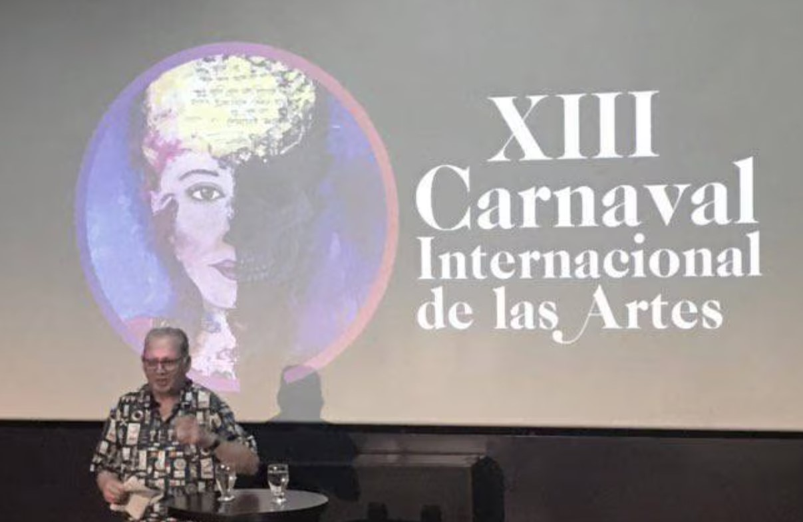
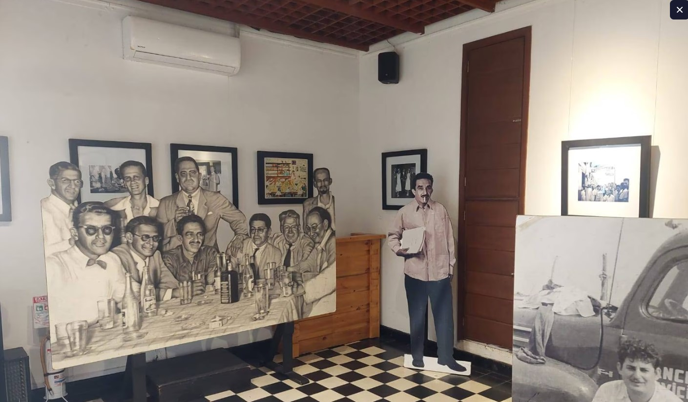

*Nada es mentira. Este es uno de los compendios publicados por el Banco de la República de la obra de Heriberto Fiorillo.*

¡Adiós, Fiorillo! En el despertar de este martes 30 de mayo del 2023, nos encontramos con la noticia de la muerte de Heriberto Fiorillo, el destacado periodista, cineasta, productor y escritor barranquillero que hizo carrera en diferentes medios de comunicación del país. Descansó en paz. En la paz eterna.

En efecto, luego de una prolongada enfermedad que lo puso fuera de combate de las lides literarias, sociales y profesionales, Fiorillo no se despertó en el día de hoy. La noche del lunes se hizo eterna para el hombre que puso a brillar el periodismo del Caribe. Fue uno de los maestros que tuvimos en la especialización de periodismo de investigación organizado por la **Universidad del Atlántico** en convenio con la **Universidad de Antioquia**, 1999.

Con _Fiori_, junto a **Arturo Alape** (autor de _El Bogotazo_), también ya fallecido, luego de cada clase, tuvimos la oportunidad de conversar al son de la música caribeña o de un buen café en la Barranquilla de finales de los 90. Este es uno de los períodos de ingrata recordación por los asesinatos selectivos propiciados por el paramilitarismo que se apoderó de la economía barranquillera.

## Fiorillo, el cronista

*Heriberto Fiorillo le dedicó la parte final de su vida a la Cueva. Foto Caracol.*

**Arde Raúl, La Cueva, Nada es mentira, Cantar mi pena y La mejor vida que tuve**, son algunos de los títulos que compendia su obra periodística y literaria. Crónica pura.

Algunos cronistas como **Alberto Ramos Salcedo, Alonso Salazar, Gustavo Colorado Grisales**, agrego a **Juan José Hoyos**, al decir de Tomás Eloy, brillaron en este campo. Muchos buenos escritores de la generación posterior al premio nobel, quedaron reducidos al ostracismo, pese a su buena pluma. Y esta fue una conversación que tuve con el escritor y filósofo **Bruno Elías Maduro** cuando lanzó su novela _La aldea debajo de la montaña_. Por mucho esfuerzo que hizo por distanciarse y diferenciarse de la prosa macondiana, uno, como lector, termina comparándola. Y esto tiene su razón de ser. Es la tradición narrativa del escritor caribeño que sin haber leído a García Márquez, el lector termina por adivinar rasgos macondianos en sus escritos. Es un _defecto_ por nacimiento. Es lo mismo que le sucede al cronista para narrar la cotidianidad.

> El cronista es el sismógrafo de una sociedad desgarrada, pero no tiene nada que ver con el sismo: no puede evitarlo ni predecirlo ni mucho menos juzgarlo.
> 
> Tomás Eloy Martínez, prólogo Nada es mentira.

## Nada es mentira

El trabajo de Heriberto Fiorillo se puede calificar como un escape del cliché impuesto por la veneración hacia el novelista más grande que ha tenido Colombia en toda su historia, **[Gabriel García Márquez](https://www.cervantes.es/bibliotecas_documentacion_espanol/creadores/garcia_marquez_gabriel.htm)**. Esta marquilla garciamarquiana fue la muerte literaria de muchos buenos novelistas colombianos tan grandes como el autor de _Cien años de soledad_. La literatura quedó atrapada por el estilo y género novelesco macondiano. El renombrado periodista y escritor argentino **[Tomás Eloy Martínez](https://luciotorres.local/wiki/Tom%C3%A1s_Eloy_Mart%C3%ADnez)**, en su prólogo del libro **[Nada es mentira](https://luciotorres.local/digital/collection/p17054coll10/id/3218/)**, presenta esa apreciación de juzgar a los escritores con el racero graciamarquiano. Pero también, el malentendido de apreciar la obra de Heriberto Fiorillo solamente por lo que hizo en la televisión, soslayando su papel como cronista y escritor que escapó de la influencia macondiana:

> La obra de Heriberto Fiorillo es el más alto punto de encuentro entre la tradición y la renovación. La considerabIe y justa notoriedad de Fiorillo como autor de agudas entrevistas de televisión ha dejado en segundo plano, al menos hasta ahora, su talento de escritor. Nada es mentira, la colección de crónicas y entrevistas que el lector tiene en sus manos, va a resolver sin duda ese malentendido.

Y los grandes escritores modernos quieren escapar de la etiquetada garciamarquiana. Fiorillo, según Tomás Eloy, incursionó en la crónica, un género del periodismo donde podía escapar del sello García Márquez.

> La crónica es el único territorio donde combaten con armas iguales la realidad y la imaginación, la destreza verbal con el lenguaje voluntariamente descuidado.

Tomás Eloy Martínez estima que Fiorillo tiene una gran imaginación que estructura sus crónicas.

## Fiorillo voló a otra dimensión

*En las últimas presentaciones de Heriberto Fiorillo/Carnaval S.A.*

> Cronista mayor de una generación de grandes cronistas, Fiorillo es el único de todos ellos que incurre en dos admirables virtudes: es fiel al legado de sus maestros y, a la vez, tiene la osadía de apoyarse en ellos para volar hacia otros horizontes.

En suma, **Heriberto Fiorillo**, maestro de la crónica y de la entrevista, voló hoy a otra dimensión perseguido por sus personajes imaginados o reales ¿qué más da? Si nada es mentira.