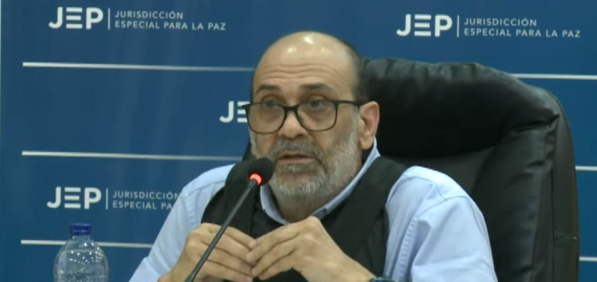
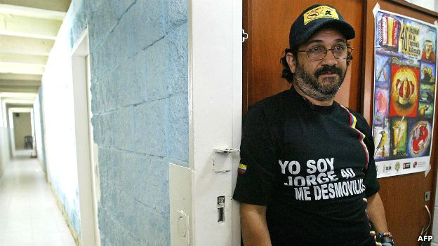

*«Jorge 40», un embustero en la JEP. Ni verdad ni arrepentimiento.*

Un embustero en la JEP. Se comprobó la tesis del análisis publicado por **VoxPopuli Digital** durante la **audiencia única** para definir la admisión de Rodrigo Tovar Pupo en la JEP que quiso convertirla en un show especial de _**Yo me llamo «Jorge 40»**_. En efecto, por falta a la verdad, **este 15 de mayo fue inadmitido Rodrigo Tovar Pupo, uno de los jefes del _paramilitarismo_ que tanto daño le hizo y le hace al Caribe y a Colombia**. Además, este jefe de los _escuadrones de la muerte_ perdió la oportunidad de aportar efectivamente a la verdad de **miles de crímenes**. Los familiares de estas víctimas fatales esperaban saber dónde están sus desaparecidos, o cómo y quiénes mataron a sus padres, hijos o esposos.

Nuestros lectores se preguntarán por qué acertamos en nuestros análisis desde el primer día de la audiencia pública donde se le escuchó a Tovar Pupo. La respuesta es sencilla: **buscamos que el enfoque utilizado esté desprovisto de sesgos cognitivos**: pasionales, ideológicos, odio, megalomanía, mesianismo, etc.. Solo así podemos quitar las escarchas de la verdad que desconocemos. La decisión de la JEP fue tomada en derecho sin dejarse influenciar de la presión que en forma indirecta ejercía el Alto Comisionado de Paz, Danilo Rueda, quien en épocas electorales se transportaba en vehículos blindados de **«**Ojitos Azules**»**, según versión de algunos exparamilitares.

¿Podemos creer en los arrepentimientos de los criminales cuando no dicen la verdad? ¿Por qué **«Jorge 40»** fue muy comedido para decir mentiras? ¿Acaso no es el mayor síntoma de que sigue en el negocio del bajo mundo a través de su cadena de testaferros que sigue intacta con el beneplácito de la Fiscalía y de la alta oficialidad de las fuerzas militares? ¿Cuál fue el papel del Alto Comisionado de Paz, Danilo Rueda, quien buscó la forma para que fuera aceptado en la JEP?

\[Te puede interesar: [«Yo me llamo Jorge 40»: Un embustero en la JEP (III)](/articulos/yo-me-llamo-jorge-40-un-embustero-en-la-jep-iii/)\]

## Un embustero en la JEP perdió su última oportunidad

*«Jorge 40», el Papas o Rodrigo Tovar Pupo, un embustero en la JEP. Aquí tiene cara de yo no fui. (Foto BBC).*

Con esta decisión, **«Jorge 40»** no tendrá otra oportunidad. No podrá tener libertad condicional ni todas las prerrogativas que tienen los criminales cuando se someten a la **justicia alternativa**. No podrá seguir dirigiendo sus negocios en forma directa. Tendrá que seguir valiéndose de terceros. Todos los procesos criminales como jefe de los escuadrones de la muerte que tiene vivo en Colombia, deben continuar. Sin embargo, deberá responder por el holocausto causado en la guerra paramilitar donde practicó y practica un **clientelismo armado**. Sus bienes, que sobrepasan los **$10 billones**, según expertos, deberán ser efectivamente extinguidos.

No obstante, la única manera de que **«Jorge 40»** sufra efectivamente las consecuencias, es que pierda el poder político que nunca perdió. Ni siquiera durante los 15 años de su extradición. Por el contrario, fuentes cercanas a la Fiscalía señalan que regresó más rico que nunca. Al parecer, y esto es muy grave, está recuperando algunas de sus propiedades, acciones de empresas y poder político mediante una guerra silenciosa librada contra algunos de sus testaferros que no quieren dar cuentas claras. Una guerra contra otras bandas armadas que se **disputan el BOTÍN DE GUERRA** dejada por una guerra librada contra una parte de la sociedad civil acusada de ser apoyo de la guerrilla, tal como lo señaló **Salvatore Mancuso** en los cuatro días de su audiencia que terminó en el día de hoy.

\[Te puede interesar: [«Jorge 40» ante la JEP: Demagogia y poca verdad](/articulos/jorge-40-ante-la-jep-demagogia-y-poca-verdad/) (I)\]

## De Tovar Pupo a Mancuso

*Un embustero en la JEP. Danilo Rueda, Alto Comisionado de Paz, fue el principal animador de «Jorge 40». Su asesor, Alias el Gordo, es el mismo lugarteniente de Rodrigo Tovar Pupo en los tiempos de guerra en Barranquilla.*

Contrario a Mancuso, **«Jorge 40»** nunca perdió el contacto con la mayoría de su cadena de testaferros que se convirtieron en ricos y poderosos empresarios llamados **«Los Intocables»**, como **Darío Laino Scopetta** (**«**Ojitos Azules**»**), **Alfonso Macías** (**«**Comandante M-1**»**), **Rafael Matera Lajud** (**«**Comandante 300**»**), **Everth Pernet**, quien sobrevivió a un atentado realizado recientemente en el norte de Barranquilla. (Leer: [¿Quién mandó a matar a Perneth Caicedo, testaferro de «Jorge 40»? (I)](/articulos/quien-mando-a-matar-a-perneth-caicedo-testaferro-de-jorge-40/)\]. Tampoco con el bajo mundo de la delincuencia. **«**La banda de los 40**»** estaba ligada con sus antiguos hombres de confianza de los años de guerra de **«Jorge 40»**. Alias **«Salomón»**, su segundo al mando en la cúpula militar, fue jefe de esa banda que impuso el terror en Barranquilla y en otras zonas del Caribe. Luego llegaron Los Paisas y Los Nevados y acabaron con ese reinado en el bajo mundo. Hoy, el problema de **«Jorge 40»** es con los Vegas.

Si Mancuso se alejó de las bandas armadas y de sus antiguos aliados políticos y empresariales, **«Jorge 40»** estrechó más sus lazos criminales para mantener privilegios políticos y económicos. **Rodrigo Tovar Vélez**, hijo, concentra un gran poder debajo de la mesa. Su padre **«Jorge 40»** habla con su voz. Hoy tiene cogido de la escasa _moña_ al poderoso fiscal general **Francisco Barbosa**, quien tiene varios procesos en la **Comisión de Acusaciones de la cámara de representantes**. En esta instancia legislativa cuenta con la mayoría. Quiere decir, que el poder político de **«Jorge 40»** es inmenso. **Puede decidir la suerte tanto del presidente Gustavo Petro como del fiscal Barbosa.**

## La orden de muerte de **«Jorge 40»**

*Frente a un pedido urgente de Fiscalía y de la Defensoría del Pueblo para atender el clamor de este periodista por las amenazas serias de muerte, no ha sido atendido por el director de la UNP, Augusto Rodríguez. ¿Este es el gobierno de la vida?*

Ante esa evidente realidad, como periodista sobreviviente a la orden de muerte de **«Jorge 40»** decretada en 1999 y que aparece en varios procesos judiciales, presento públicamente mi temor de que reactive esa orden criminal. No es extraño que cuando comencé a publicar el seriado denominado [El retorno de «Jorge 40», sus aliados y sus muertos](/articulos/el-retorno-de-jorge-40-sus-aliados-y-sus-muertos/),recibí amenazas y seguimientos sospechosos en el Magdalena.

En tanto, la Unidad Nacional de Protección (UNP) me degradó el esquema de seguridad. Pero sí es extraño que el director de la UNP, **Augusto Rodrguez Ballesteros**, desconozca el **riesgo extremo en que me encuentro**, luego de que se reactivaran las amenazas de muerte contra este periodista en diciembre de 2022 y enero 2023. Esto me obligó a confinarme en mi residencia por el virus del miedo a la muerte en un gobierno de la vida. ¡Menuda contradicción! Salgo de incógnito a constatar los hechos como si el ejercicio del periodismo estuviese prohibido en un Estado autoritario. ¿Conoce esto el presidente Petro?

## Un embustero en la Jep

Esto se dijo en el artículo el 5 de febrero de 2023 de VoxPopuli Digital, una vez se concluyó la audiencia de Tovar Pupo:

> No hubo un solo aporte a la verdad plena para demostrar que Rodrigo Tovar Pupo fue agente estatal tipo bisagra. Tampoco mostró hechos que se definan como **_patrones macrocriminales_** conjuntos con la fuerza pública.
> 
> VoxPopuli Digital, 27 de enero 2023.

En efecto, se dijo en ese artículo que **«Jorge 40»** no cumplió con la exigencia del el auto **TP-SA 1187 de 2022** de la [Sección de Apelación del Tribunal para la Paz](https://www.jep.gov.co/Sala-de-Prensa/Paginas/JEP-ultima-oportunidad-Mancuso-Jorge-40.aspx) que revocó el auto de primera instancia proferido por la Sala de Definición de Situaciones Jurídicas. 

Siguiendo ese mismo tenor del análisis de VoxPopuli Digital, la subsala de Definiciones Jurídicas de la JEP en la última oportunidad dada al exparamilitar, concluyó en la reciente resolución:

> La subsala concluyó que Tovar Pupo no cumplió con las órdenes impartidas por la Sección de Apelación que, entre otras cosas, implicaban suministrar verdad plena que develara los patrones macrocriminales atribuibles al Bloque Norte de las Autodefensas Unidas de Colombia (AUC)
> 
> Subsala de Decisiones Jurídicas de la JEP

 [\[Puedes leere: ¿Por qué «Jorge 40» en la JEP no delató al Clan Daes—Char y a los narcoempresarios? (II)](/articulos/jorge-40-en-la-jep-dejo-de-ser-un-fantasma-del-clan-daes-char-ii/)\]

## No entregó pruebas ni nada

Dicha instancia dijo hoy que incumplió varios requerimientos como un compromiso concreto y programado de aporte a la verdad. Tovar no entregó pruebas que acreditaran que financió y auspició organizaciones paramilitares antes de formar parte de las Autodefensas Campesinas de Córdoba y Urabá (ACCU).  Además, incumplió la orden emitida por la Sección de Apelación de entregar previamente los temas que abordaría en la Audiencia Única de Verdad Plena, lo que en varias oportunidades le solicitó la subsala.

En el análisis, Vox Populi Digital había dicho:

> **«**Si la audiencia pública de **Rodrigo Tovar Pupo** se transformó en la segunda temporada de **_Yo me llamo Jorge 40_**, ¿cómo será la audiencia reservada de febrero? En realidad, es un embustero en la JEP que jamás dirá la verdad.

Por tanto, la resolución de mayo de la JEP donde no admite a Jorge 40, se señala:

> (Estos hechos) muestran claramente la intención del solicitante de ofrecer poca o nula información a la JEP, motivado además en salvaguardar exclusivamente sus propios intereses defensivos, mas no en contribuir decididamente a esclarecer la verdad para las víctimas y la sociedad"

En conclusión, la Sala de Definición de Situaciones Jurídicas ordenó el rechazo del sometimiento y, por ende, su exclusión de la JEP. Desde el principio no hubo voluntad de sometimiento a la justicia alternativa, sentenció la JEP:

> “Por su evidente falta de voluntad de cumplir con el régimen de condicionalidad"