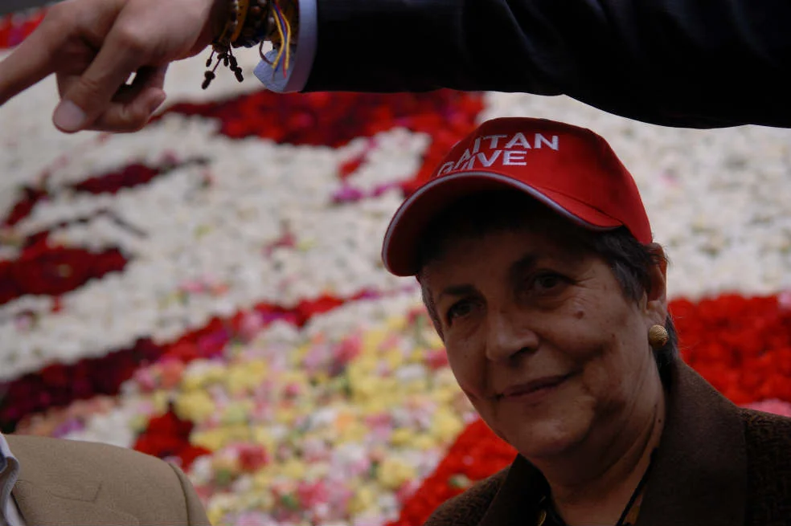

*Gloria Gaitán, la hija del caudillo popular, Jorge Eliécer Gaitán.*

Desahogarme, es la motivación de este escrito que voy a compartir con algunos de quienes, en la actualidad, tienen una u otra conexión con El Exploratorio. En realidad de verdad, la cultura patriarcal me agrede, no solo mentalmente sino físicamente. Me siento profundamente contrariada cuando surgen expresiones que demuestran que el alma de escuderos sigue predominando en nuestra cultura.

Alguien que estuvo en los actos que se llevaron a cabo el 9 de abril de este año, pese a que me ha escuchado muchas veces explicando el origen y la razón de ser de El Exploratorio, priorizó lo dicho por Petro antes que la esencia misma del proyecto, lo que ilustra esta mentalidad patriarcal que tanto me enardece psicológica y físicamente. Al leer el escrito, quedé como mariposa colgada a la pared, traspasada por un alfiler. El sentimiento de frustración y rechazo que me produjo va más allá de mis raciocinios.

## El Exploratorio, gestor de participación popular

En su discurso Petro dijo “estoy ahora en una casa de Rogelio Salmona, el arquitecto de la democracia, lo llamaría yo”, y añadió “Salmona también ideó la construcción de la obra que resguarda la memoria de Gaitán y de la participación del pueblo”. Es importante que Petro sepa que la construcción está destinada a la participación del pueblo. Solo hay que explicarle que Gaitán planteó que, para lograrlo, era fundamental **trabajar en el cambio de nuestra actual cultura, que será la tarea de El Exploratorio**.

Y, claro está, quien relató lo acontecido ese día, con mentalidad patriarcal, repetirá superficialmente lo dicho por Petro, calificando a Salmona como arquitecto de la democracia, cuando lo cierto es que su primer diseño fue una inmensa plaza pública, como esas que se han hecho a través de la historia, diseñadas para que se reúna la gente a escuchar con sometimiento las palabras de un líder y que mi idea de regar la construcción de pequeños patios, con dimensión al alcance de la gente para sustituir ese único espacio por pequeñas plazas, donde el protagonista fuera la gente y no el orador, **es la clave para entender el valor del edificio como gestor de participación.**

El autor del artículo en cuestión dice textualmente que “la edificación que diseñó Rogelio Salmona –el arquitecto de la democracia– en 1976, teniendo en cuenta las sugerencias de Gloria…”. Y ahí sí me sentí profundamente ofendida y herido mi amor propio, porque el diseño partió de un programa hecho por mí y no por Rogelio, programa que tuvo su origen en una frase de mi padre que dice:

> “Lo que queremos es la democracia directa, aquella donde el pueblo manda, el pueblo decide, el pueblo ejerce control sobre los tres poderos de la democracia burguesa, el Ejecutivo, el Legislativo y el Judicial y que, además, garantice la equidad en el aspecto económico. Allí donde el pueblo es el pueblo, el pueblo ordena y ejerce un mandato directo sobre y en control de quienes han de representarlo. Todo esto exige trabajar honda y apasionadamente en el cambio de una cultura que despierte en el pueblo voluntad para regir directamente sus destinos…”.

Y Gaitán definirá lo que es escultura así:

> “Entendemos por cultura, no la adquisición de conocimientos decorativos y vagamente educativos, sino un régimen de convicciones que rigen realmente la existencia de un pueblo. Éste, con sus condiciones peculiares es el supuesto humano sin el cual no es posible la cultura, porque perder de vista la vida afectiva del hombre y sus ineludibles urgencias es, precisamente, la negación de la cultura. Cultura no es lujo, es pura y esencialmente una necesidad vital, es menester imprescindible de la vida humana, es adquirir conciencia de sus convicciones y del medio histórico en que se actúa, es elevar su nivel de vida de acuerdo con su tiempo”.

De manera somera lo dirá Gaitán siendo alcalde:

> “Los colombianos deben dejar de ser espectadores para convertirse en actores. Mi programa va a ser de ACCIÓN COLECTIVA”.

## El proyecto original

En el proyecto original de Salmona los visitantes eran tratados a manera de espectadores y la modificación que pedí de los patios les otorgó un escenario para que fueran actores.

Es evidentemente ofensivo que un cambio tan drástico ideológicamente en la arquitectura de El Exploratorio se califique de meras “sugerencias”, lo que implica un gran desprecio por el contenido ideológico de esa diferencia en la concepción del espacio arquitectónico entre Rogelio y yo, porque esa visión diametralmente diferente del espacio tenía sus raíces en un programa con fundamentos ideológicos que estuvieron al origen del diseño del edificio.

Reconozco que hay mucho de amor propio en mi rabia al desconocer el origen del Exploratorio y su motivación ideológica. Pero no solo es eso. Es el peligroso desconocimiento del programa que le sirvió de base al diseño arquitectónico. Porque desconocer la razón de ser del Exploratorio en sus orígenes nos pone al pie del abismo , lo cual facilita e impulsa a ocupar el edificio con cualquier contenido porque, supuestamente, es un edificio diseñado por Salmona a partir de la nada, aparentemente sin programa original de base.

He ahí el peligro, que no se debe a la concepción que Petro tiene de la edificación, porque se refiere a “la participación del pueblo”, lo cual es importantísimo que lo tenga claro y lo exprese públicamente el Presidente. Pero delegar mi concepción teórica y política a “sugerencias” mías y no a un programa claro y definido, al cual se tenía que ceñir el arquitecto, es poner nuestra cabeza a la base de la guillotina.

Bogotá, mayo 10 de 2023