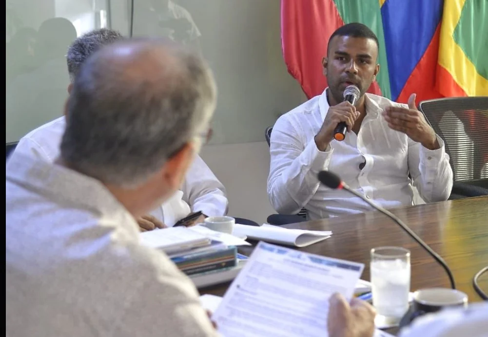

*Hace 7 años Abraham Dau hacía cualquier locura para atraer clientes. Desde que llegó papá Dau, las cosas fueron diferentes. El juguete que el alcalde le dio a su hijo Abraham: la alcaldía de la localidad No 1 Histórica y del Caribe Norte.*

El juguete que el alcalde de Cartagena le dio a su hijo Abraham es más rentable que su negocio el gastrobar **El Arsenal The Rum Box**. Desde que los dos turistas holandeses se **comieron la última cena** de sus vidas en ese restaurante, domingo 21 de agosto 2022, los clientes ya no dejan las ganancias de antes. Pero, el propietario del negocio no tiene problemas económicos. Como Tu papá te quiere, al parecer, le regaló descaradamente la Localidad Histórica y del Caribe Norte. La promesa paternal es que iba a disfrutar estos 4 años con las bendiciones de la contratación de más de $13 mil millones anuales del Fondo Local de Desarrollo de esta localidad. La promesa la cumplió. Quizás es lo único que el «antimalandrín» ha cumplido en estos tres años de gobierno.

En efecto, existen **muchísimas evidencias**, que estaremos dando cuenta en próximas entregas, para llegar a esa conclusión que expresa la captura del distrito de Cartagena con **un discurso anticorrupción**. En estos tres años, **el juguete que le dio William Dau a su hijo Abraham** le puede costar a los cartageneros la suma de **$6 mil millones** que equivale al 15% de las comisiones recibidas por la contratación del Fondo Local de Desarrollo.

\[Te puede interesar: [La no tan misteriosa muerte de turistas holandeses](/articulos/la-no-tan-misteriosa-muerte-de-turistas-holandeses/)\]

## Hijo Abraham, _tu papá te quiere_

*Tal para cual, hijo Abraham, he aquí a tu papá que te quiere con el dinero de los más pendejos.*

**William Dau Chamat** nunca había tenido que ver con su hijo Abraham. Pero ahora lo quiere mucho que hasta recibe en su casa las bendiciones de una alcaldía que ha fracasado en todos los indicadores sociales de gestión administrativa. Recibir más de $6 mil millones sin saber leer ni escribir, por ser su hijo Abraham, es porque _**tu papá te quiere**_.

¡Chvévere! Con el dinero de los contribuyentes le da los juguetes a su hijo Abraham. Es el único de "sus hijos" que ha salido de la pobreza. Mientras el 40.4% de los cartageneros están por debajo de la línea de pobreza. ¡Aberrante! Su hijo Abraham recibe **$2 mil millones anuales** de la alcaldia menor. En tanto 160 mil "hijos" viven en la extrema pobreza con un ingreso per cápita menor de $2 millones, segun Cartagena Como Vamos. Lo peor: De 100 cartageneros, 30 se acuestan con una sola comida diaria.

¿Su hijo Abraham Dau es el único que ha salido de la pobreza en esta administración de William Dau? Lo cierto es que en estos estos tres años viene ganando por partida doble. Su negocio se ha expandido. Tiene todos los permisos que quiera para el uso del espacio público de la localidad No 1. Su negocio había sido rentable hasta cuando ocurrió la muerte de los turistas holandeses. Si fuera otro, su negocio estaría cerrado. La muerte de esos dos turistas todavía es un misterio. Extrañamente Medicina Legal no ha dado a conocer los resultados de la necropsia y la investigación penal en la Fiscalia no avanza.

\[Te puede interesar: **[La última cena en el gastrobar de los Dau y la necropsia (II)](/articulos/la-ultima-cena-en-el-gastrobar-de-los-dau-y-la-necropsia-ii/)**\]

## Tu papá te quiere

¿No le parece extraño que el alcalde Mayor, **William Dau Chamat**, está silente frente a los actos de corrupción de **Luis Negrete Blanco**, alcalde de la Localidad 1? Hasta falsificaron cotizaciones de empresas comerciales para adjudicar contratos. Así lo señala el representante legal de **Papelería Jonan S.A**. El Tractor Dau es lengüisuelto para refirirse a las presuntas irregularidades de las localidades 2 y 3. Pero, poco o nada se ha referido a la presunta corrupción anidada en el interior de la localidad Histórica y del Caribe Norte de Cartagena.

Por el contrario, Dau es su defensor. Así lo hizo en el caso de la **descarada contratación de $600 millones** que hizo su titular **Luis Hernán Negrete Blanco** en insumos hospitalarios para el Hospital Universitario del Caribe, en 2020. Si bien f**ue hallado disciplinariamente responsable**, en segunda instancia fue absuelto por la Procuraduría Regional de Bolívar. Fue un fallo francamente controvertido y prevaricador. Este salvavidas se lo lanzó el procurador **Fernando Carrillo Flórez** gracias a la gestión de William Dau Chamat. Pero queda la investigación de la Fiscalía.

En esta serie de VoxPopuli Digital analizaremos tres variantes de las tres alcaldías menores: la contratación con el Fondo Local de Desarrollo, el comportamiento político-administrativo del alcalde menor y las investigaciones fiscales, penales y disciplinarias que no avanzan.

## **Localidad Histórica y del Caribe Norte**

*El juguete que el alcalde le dio a su hijo Abraham. Aquí el alcalde mayor haciendo el parampampam de selección del alcalde menor. (Prensa alcaldía de Cartagena).*

El Distrito de Cartagena tiene tres alcaldías locales, según la división política establecida en el Plan de Ordenamiento Territorial (POT, 2001). **Localidad 1, Histórica y del Caribe Norte. Localidad 2, De la Virgen y Turística. Localidad 3, Industrial y de la Bahía**. Cada una de ellas es regida por un alcalde menor y cuenta con un Fondo Local de Desarrollo. Anualmente los 9 miembros de la Junta Administradora definen un plan de inversión priorizando las obras más relevantes.

De esas tres alcaldías locales, la **Histórica y del Caribe Norte**, es la que ha mantenido a su alcalde **Luis Negrete Blanco** desde el inicio de su periodo, enero de 2020. Las otras dos se han debatido en una inestabilidad debido a procesos disciplinarios y fiscales que han puesto fuera de camino a sus titulares.

## Aponte, el Rey de la contratación

*Abajo, Pedro Aponte. Arriba, el concejal Luis Cassiani y el capitán Bueno.*

En la Localidad de la Virgen y Turística, **el rey de la contratación**, presuntamente, es **Pedro Aponte** a través de terceras personas. Algunas fuentes, cercanas a la localidad, señalan que Aponte es el financista de varios ediles y del alcalde local Andy Reales, en estado de suspensión. Por esta razón fue reemplazado por **Édgar Arrieta**.

Todo hace indicar que Reales y Aponte estarían incurso en un delito de concierto para delinquir por haber participado como autores intelectuales del complot del kilo de cocaína en la camioneta de **Martín Barreto de la Hoz** donde se transportaba la presidenta del concejo de ese entonces (14 de enero 2022) Gloria Estrada. Según testigos en el proceso penal que se sigue por este caso, Aponte y Reales pudieron contratar a un oficial de la policía y éste a los agentes que realizaron el falso operativo que terminó con la detención de Gloria Estrada Benavides, Martín Barreto de la Hoz y Avelino Villamizar.

En tanto que en la localidad 3, la situación se ha complicado luego de la renuncia de su titular **Aroldo Coneo**, quien tomó posesión en otro cargo que obtuvo por concurso de carrera administrativa. Actualmente la alcaldía la ejerce el director de la Oficina Asesora para la Gestión del Riesgo de Desastre, Fernando Antonio Abello Rubiano. Estableceremos hasta qué punto es cierto las advertencias de presunta corrupción del actual alcalde menor denunciadas por los concejales Hernando Piña, Rodrigo Reyes y David Caballero.

## Su hijo Abraham, el financista

*Lidy Ramírez, aquí en una de las campañas presidenciales con Gustavo Petro. Ella fue la mano derecha del hijo Abraham en la contra-revocatoria.*

Tenemos que el dueño de la localidad Histórica es Abraham Dau, el hijo emprendedor del alcalde **William Dau Chamat**. Allí nada se mueve si no se cuenta con su anuencia. Algunos de sus delegantes reciben las comisiones por anticipado, una vez el contratista verdadero tiene en sus manos el CDP y el acta de inicio del contrato. La fuente que pidió reserva, señala que en esto son estrictos.

Cuando el 2 de febrero de 2021 se hizo la audiencia de revocatoria, su hijo Abraham fue el **financista para sabotear e intimidar a los que participamos** en el evento. En el 2020 los resultados económicos fueron fabulosos para esta caterva de vencejos, como dijera el poeta Luis Carlos López. La alcaldía había contratado $13.000 millones casi que a su libre arbitrio. En el 2021 no fue distinto. Los contratos lo hicieron, en su mayoría, a través de selección abreviada o menor cuantía. Realizaron 20 contratos por un valor total de **$10.446 millones**.

Una ínfima parte del dinero capturado en 2020 y en enero del 2021, la usó William Dau para movilizar e instrumentalizar a grupos de jóvenes en riesgos, grupos culturales, artistas de la champeta, líderes de la Colombia Humana, que **los pusieron al servicio de la contra-revocatoria.** Ese día de la audiencia en el Centro de Convenciones de Cartagena Julio César Turbay, crearon una base operativa en el **«gastrobar la última cena»**, como se le conoce a **El Arsenal The Rum Box**.

## **$300 millones**

Según fuentes cercanas a ellos, se gastaron **$300 millones** ese día de la audiencia. Supuestamente se invirtieron **$100 millones** en la contratación de cantantes de champetas. Uno de los artistas que participó, **le reveló a este periodista que sólo le pagaron $**500 mil. Uno de los contratistas, por debajo de la mesa, fue la hermana de un **famoso cantante de champeta** que se quedó con la mayor parte de ese dinero, según le manifestó a este periodista otro artista que fue utilizado para ese acto.

Además, ese dinero de la corrupción les permitió comprar a líderes comunales, grupos juveniles, _influencers_, picós, equipo de amplificación, medios de comunicación y, desafortundamente, a periodistas. Este servidor, Jacqueline Perea y otros líderes de la revocatoria fuimos objeto de agresiones de algunos mercenarios. Hasta tuvimos que transportarnos en una patrulla de la policía. También usaron sus bodegas digitales para perseguir y amenazar en las redes sociales a los que nos atrevimos denunciar la **farsa de antimalandrines** que comenzaba a gobernar a Cartagena. Usaron las redes sociales para sus propósitos malsanos. Por ejemplo, a la **Crónica de Rafa** le pagaron para denigrar de este periodista. Pero el tiempo y los hechos se encargaron de mostrar quiénes son los verdaderos malandrines.

En la próxima entrega, seguiremos con la localidad 1, el juguete que el papá Dau le regaló a su hijo Abraham. Hasta entonces, **_"porque tu papá te quiere"_**.