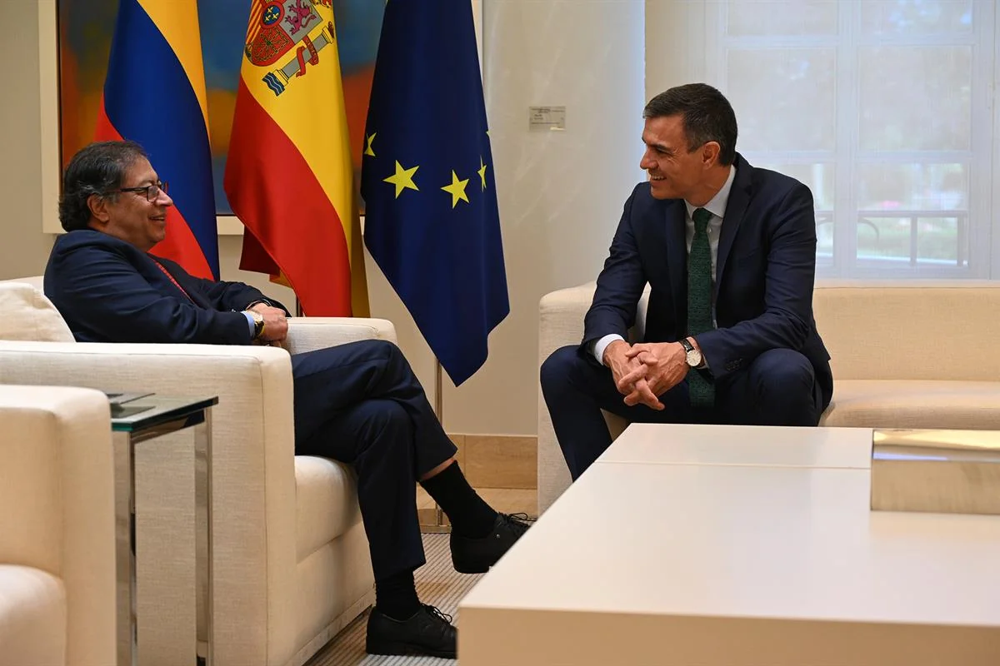
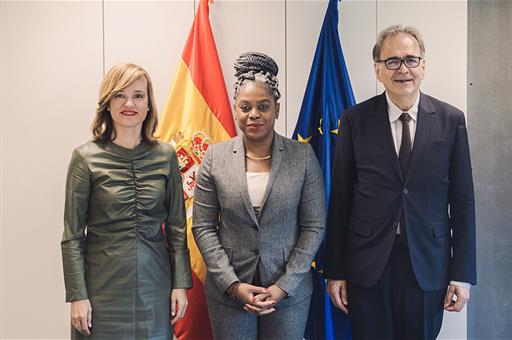
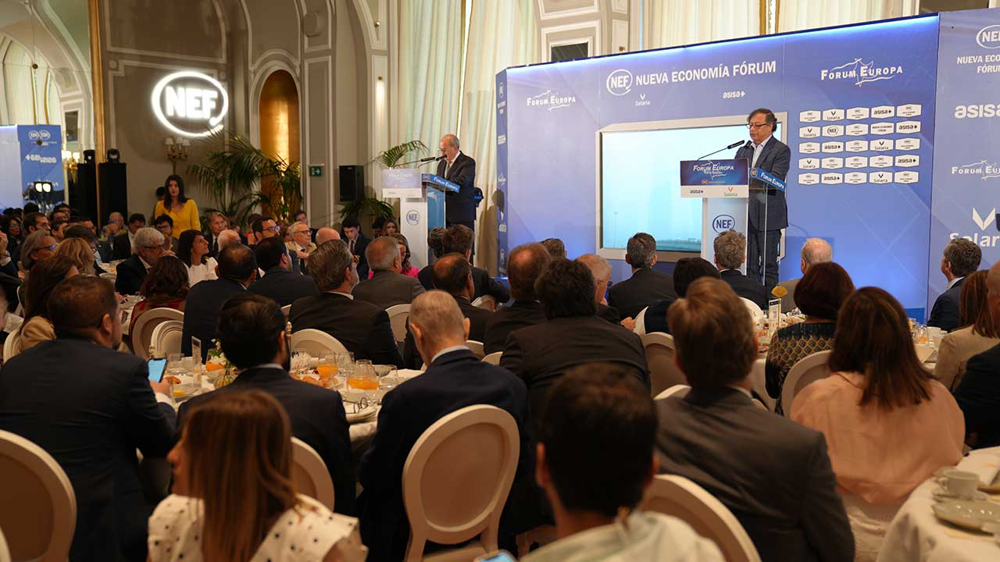

*España apoya reformas y Paz Total de Petro.Aquí el presidente de Colombia Gustavo con su homólogo de España Pedro Sánchez/Pool Moncloa / Borja Puig de la Bellacasa*

El presidente colombiano **Gustavo Petro Urrego** logró que **España apoye a sus reformas sociales**, a las políticas de transición de energías limpias y, en especial, a la propuesta de _Paz Total_. El discurso de cooperación del mandatario colombiano, logró que su homólogo **Pedro Sánchez** respaldara como garante el proceso de paz con el ELN al cual **destinará 1 millón de euros** en este año.

Además, ambos países firmaron memorando de acuerdo de cooperación bilateral en educación, trabajo y fortalecimiento de las relaciones comerciales. El presidente del gobierno español y el de Colombia realizaron un encuentro fraterno en el **Palacio de la Moncloa** que dio resultados concretos para el impulso de las políticas públicas que adelanta el mandatario colombiano.

\[Te puede interesar: **[La Filigrana Momposina y Paz Total de Verónica al Papa Francisco](/articulos/veronica-alcocer-y-el-papa-francisco-filigrana-momposina-vs-outfit/)**\]

## España apoye reformas y Paz Total

En efecto, los presidentes de ambos países firmaron una declaración conjunta en la cual enfatizaron la necesidad de apoyar las reformas estratégicas que permitirá el **fortalecimiento democrático del país**, mejorar las condiciones de la población más vulnerable e implementar políticas de mitigación del cambio climático.

Entre otras cosas, se fortalecieron las relaciones comerciales bilaterales que están pasando por un buen momento. España puso a disposición de Colombia 1 mil millones de euros para financiación de proyectos en sectores prioritarios con empresas españolas.

## La importancia de las relaciones bilaterales

*España apoya reformas y Paz Total de Petro. La ministra de Educación y Formación Profesional, Pilar Alegría, la ministra de Educación Nacional de Colombia, Aurora Vergara, y el ministro de Universidades, Joan Subirats. /Prensa La Moncloa.*

El presidente Sánchez destacó la voluntad de ambos países de continuar trabajando en los temas que ya existe una **profunda cooperación**. Colombia es un socio de primera magnitud en importaciones y exportaciones. En la actualidad, **la inversión española en Colombia asciende a los 28.000 millones de euros.** El comercio bilateral se sitúa en los **3.000 millones**, explica el gobierno español.

Este encuentro es fundamental para avanzar hacia un nuevo estadio de la relación entre España y Colombia. El presidente Sánchez la llamó de **"histórica, fructífera y larga"**, a través de la firma de acuerdos y memorandos de entendimiento en áreas muy diversas, como la **[educación](/articulos/serviciosdeprensa/notasprensa/educacion/Paginas/2023/040523-colombia-acuerdo-acceso-universidad.aspx)**, la lucha contra la delincuencia y la seguridad, el deporte, **[la cooperación sociolaboral](/articulos/serviciosdeprensa/notasprensa/trabajo14/Paginas/2023/040523-yolandadiaz-memorando-colombia.aspx), [el transporte y las infraestructuras ferroviarias](/articulos/serviciosdeprensa/notasprensa/transportes/Paginas/2023/040523-espana-colombia-infraestructuras-transporte.aspx)** y la conectividad.

Por tanto, con ese memorando de cooperación firmado por la vicepresidenta segunda y **ministra de Trabajo y Economía Social de España, Yolanda Díaz** y el canciller colombiano, **Álvaro Leyva,** permitirá que Colombia se sume a los países latinoamericanos que "han aparcado las políticas neoliberales" en una apuesta decidida por **impulsar reformas centradas en las personas**, según la dirigente ibérica.

> **«**En ese afán compartido de hacer política para la gente, hoy reforzamos nuestras relaciones bilaterales, firmando el primer Memorando de Entendimiento entre nuestros Ministerios de Trabajo para seguir avanzando hacia mercados laborales más justos, inclusivos y democráticos.**»**
> 
> vicepresidenta segunda y ministra de Trabajo y Economía Social de España, Yolanda Díaz.

Como se sabe, España es el séptimo socio comercial del país del latinoamericano. Exporta a nuestro país maquinarias, vehículos como automóviles y tractores, y artículos farmacéuticos. Colombia exporta combustibles y productos minerales.

## Mitigar el cambio climático

*Intervención del president e Petro en Nueva Economía Fórum_NEF/Juan Diego Cano - Presidencia*

El presidente colombiano propuso una alianza sostenible entre Europa y América Latina basada en la energía limpia y en la producción económica descarbonizadas. El Mandatario intervino en un encuentro del centro de estudios **Nueva Economía Fórum**, realizado en Madrid este viernes 5 de mayo.

> “Poner a andar una alianza Europa-América Latina sobre la base de energía limpia y economía descarbonizada y productiva, aquí y allá, me parece que es el objetivo de las relaciones por construir en estos días y meses”
> 
> Gustavo Pedro, presidente de Colombia **Nueva Economía Fórum**.

Cabe destacar que Petro fue presentado en el evento por **Yolanda Díaz**, Vicepresidenta Segunda del Gobierno y Ministra de Trabajo y Economía Social de España, y por **José Luis Rodríguez**, Presidente de Nueva Economía Fórum.

Asimismo, en la declaración conjunta se dice que España y Colombia coinciden en la urgencia de acelerar los esfuerzos globales para mitigar los **impactos crecientes del cambio climático**. Reconocieron la importancia de alcanzar resultados ambiciosos en la próxima Conferencia de las Partes de la Convención Marco de Naciones Unidas sobre el Cambio Climático (COP28) en Dubái.

## Declaración conjunta

En la [Declaración Conjunta](/articulos/presidente/actividades/Paginas/2023/040523-sanchez-recibe-presidente-colombiano.aspx) el presidente Español reclamó la necesidad de acelerar y garantizar una transición energética justa, limpia, sostenible e inclusiva.  

Al respecto, el presidente del Gobierno dijo:

> "Hoy hemos hablado de proyectos concretos en sectores como el aeronáutico, la conectividad, los ferrocarriles, los satélites o la digitalización de la sanidad en el que empresas españolas pondrán su tecnología y _know-how_ al servicio del desarrollo de Colombia"
> 
> Presidente Pedro Sánchez-

Por esa razón, los ministros de Comercio de España y Colombia firmaron el 4 de mayo un [Protocolo Financiero](/articulos/serviciosdeprensa/notasprensa/industria/Paginas/2023/040523-asistencia-financiera-espana-colombia.aspx) para establecer un marco general de colaboración en este ámbito, respondiendo a las prioridades económicas y sectoriales de los dos países.

> "España va a poner hasta 1.000 millones de euros a disposición de Colombia a través de diferentes instrumentos de comercio e inversión para la financiación de proyectos en sectores prioritarios con empresas españolas"
> 
> Presidente Pedro Sánchez.

## Lo importante: España apoye reformas

Como se puede apreciar, la visita del presidente Gustavo Petro a la _Madre Patria_ fue fructífera de todo punto de vista. Más allá de su doble discurso, Petro fue pragmático. Escondió el discurso del _yugo español_ del Primero de Mayo en el balconazo de la Plaza de Bolívar y blandió el discurso de la cooperación colombo**—**española.