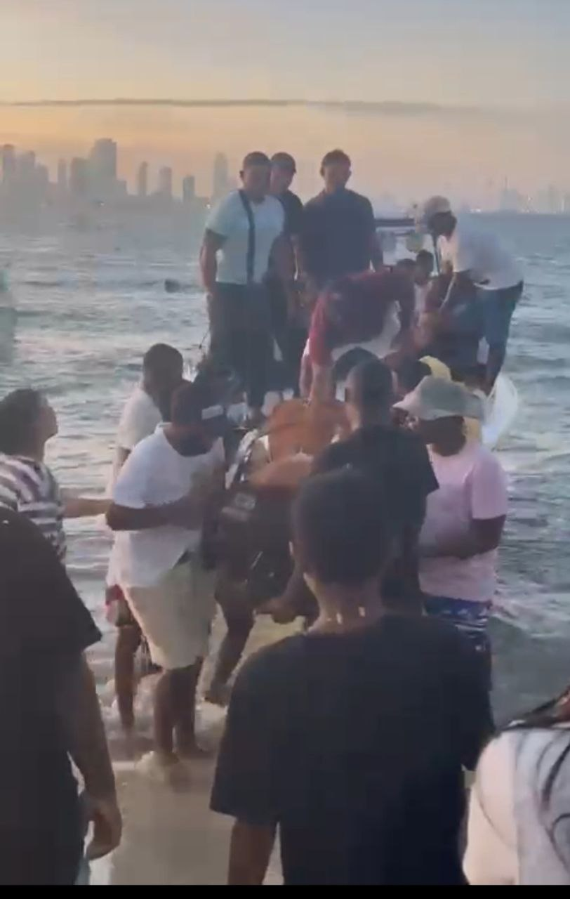
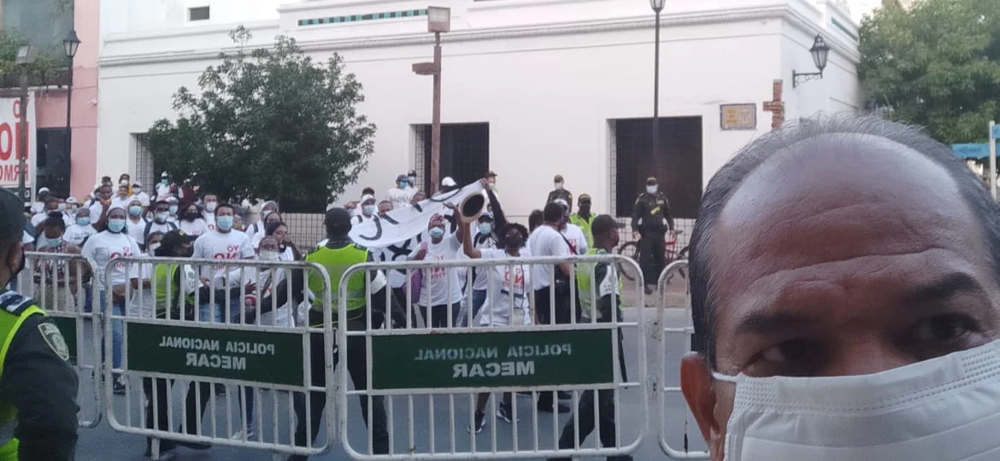
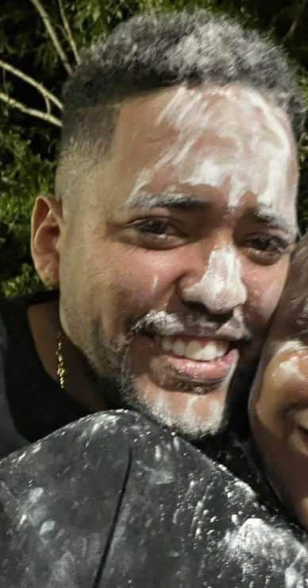

*Cartagena sitiada por el crimen y la ineptitud. La muerte de alias Yordan puede producir retaliación. /Foto suministrada.*

La muerte, en el día de hoy lunes, de alias _Yorman_ con silenciador en Bocacagrande, el exclusivo barrio turístico de Cartagena, probablemente sea un eslabón más de una cruenta guerra entre _Los Salsas Mexicanos Nueva Generación_ contra el _Clan del Golfo_ por el control de la ciudad. Los que deben estar felices en estos tres años y medio de gobierno de **William Dau Chamat**, además de los corruptos, son los delincuentes asociados al crimen organizado y a la economía ilegal. Pues, en este tiempo **no ha existido ninguna articulación orgánica ni estratégica del gobierno Distrital con la Policía Nacional y la Fiscalía seccional para combatir el crimen y las actividades ilícitas.** Cartagena sitiada por el crimen y la ineptitud de un alcalde que todavía no sabe para qué es ese cargo. **No es una hipótesis, es una realidad irrefutable**.

En ese sentido las estadísticas son contundentes que muestran a Cartagena sitiada por el crimen. Los últimos sicariatos ejecutados en los últimos dos meses hace parte de una guerra cruenta por el control del puerto de Cartagena. Este año van 187 asesinatos, de los cuales **113 bajo la modalidad de sicariato.** Hoy asesinaron a **Jorman Meléndez Coneo**, quizás el último de la banda de los Coneo con pertenencia al Clan del Golfo. Una fuente del bajo mundo corroborada por un agente de inteligencia de la Policía Nacional que reserva su nombre, indica que ese asesinato pudo originarse desde la organización de Los Robledo y presuntamente, por orden de **Julián Alberto Jiménez Monsalve, alias Machete**.

*Esta noche llegó el féretro con el cuerpo de alias Yorman a Punta Arena.*

Fuentes reservadas de la Fiscalía seccional indican que la falta de articulación estratégica con el Distrito de cartagena facilitó la operatividad de la delincuencia organizada. No existe plan ni actividades preventivas y correctivas para combatir al crimen organizado, más allá de la labor ordinaria de la Policía Nacional.

**Te puede interesar**: [Guerra Clan del Golfo Vs Salsas. Asesinato de «el Nalga»](/articulos/guerra-clan-del-golfo-vs-salsas-asesinato-de-el-nalga-cercano-a-chawala/)

## Alcalde zambiloco facilitó a Cartagena sitiada

*El Zambiloco no sabe qué hacer con esta cartagena sitiada por el crimen. /Cortesía redes sociales.*

Cuando el el 2 de febrero de 2021, en la audiencia para lanzar el proceso de revocatoria contra el alcalde, señalamos tres cosas que se volvieron virales en la época. La primera que teníamos un burgomaestre _zambiloco_ **incapaz de gobernar**. Un gobernante que, al parecer, se _encaletaba_ en un apartamento de estrato 6 a consumir cigarrillo de tabaco revuelto con marihuana y bazuco. En esos momentos se le reclamaba una respuesta a una pregunta que ya le había hecho públicamente, pero no quiso responder. La segunda, no había ejecutado el plan de inversiones. La tercera, que no estaba cumpliendo con su programa de gobierno y plan de desarrollo.

El alcalde William Dau entabló una acción de tutela contra este periodista. Pero el fallo de la autoridad judicial me favoreció en todos los sentidos. No le había violado el derecho al buen nombre ni a la intimidad. Entre otras cosas, porque William Dau se ha comportado como un hombre desclasado, propio de personas que sufren de problemas de adicción. Esto es, de problemas asociados con su comportamiento psicológico.

Dos años más tarde de esa accidentada audiencia, donde tuvimos que salir escoltados, se demostró que no solo teníamos razón en lo dicho por los tres comités pro—revocatoria sino también en las denuncias periodísticas de octubre de 2019. Dau era un peligro ambulante, advertimos. No es que nosotros seamos **pitonisos**. La verdad es que hacemos nuestros análisis desprovistos de apasionamientos políticos y de ideologías que impiden conocer la verdad y las proyecciones de los gobernantes. **Nos interesa analizar más lo hechos que los discursos**. Aunque todo indica que William Dau no ganó las elecciones sino que llegó a la alcaldía mediante una vía fraudulenta, su administración es reflejo de haber recibido algo sin merecerse.

Te puede interesar: [Ascenso y caída de «Paty Paty» ¿Delatará a políticos y empresarios? (I)](/articulos/ascenso-y-caida-de-paty-paty-delatara-a-politicos-y-empresarios-i/)

**También**: [Así ordenaron matar a Laura ¿amante de «Paty Paty»? (III)](/articulos/asi-ordenaron-matar-a-laura-amante-de-paty-paty/)

## Cartagena sitiada

*Este es uno de los grupos pagados por William Dau para intimidar a los revocantes. El gastrobar de Abraham Dau fue la base de operaciones para hostigar a Jacqueline Perea, hoy precandidata a la alcaldía, y a este periodista.*

En los últimos días se incrementó el numero de atentados. **Avelino Villamizar**, también asociado a la actividad musical, al negocio del espectáculo y la farándula, sufrió un atentado del cual salió herido. El líder comunero y cívico del barrio San Francisco, **Emiro Manuel Luna Pérez**, fue herido hoy por un individuo que se transportaba en una moto.

De acuerdo con datos de la misma Policía Nacional, Cartagena tuvo la segunda tasa más alta de homicidios en 2022. Esto es, **35 casos por cada 100 mil habitantes**. Lo que es peor, según la Policía Nacional, durante el 2022 hubo 341 crímenes por sicariato. Esta modalidad de homicidio, indica que los crímenes son ordenados por jefes de la delincuencia organizada para cobrar deudas o castigar algún tipo de falta, que le afecta a alguien del bajo mundo.

En el ranking nacional, Cartagena le siguió a Cali que marcó en el tablero del crimen 42 casos por cada 100 mil habitantes, y en tercer lugar está Barranquilla con 28 homicidios por cada 100 mil habitantes. Paradójicamente, Medellín con 15 y Bogotá con 13 muertos por cada 100 mil habitantes. Esta situación la advertimos en el mes de marzo cuando denunciamos la aparición de una guerra declarada en el bajo mundo por el control de los puertos de Cartagena, Barranquilla y Santa Marta.

Con respecto al 2021, según ‘Cartagena Cómo Vamos’, los homicidios aumentaron en un 51 por ciento llegando a 369 casos en 2022. Los suicidios aumentaron en un 58 por ciento. Las muertes en accidentes de tránsito crecieron un 17 por ciento, y las muertes accidentales disminuyeron en un 18 por ciento.

Te puede interesar: [Cartel Jalisco declara objetivo militar a «peces gordos»](/articulos/declararon-objetivo-militar-a-chawala-y-38-peces-gordos-del-bajo-mundo/)

## Machete y la muerte del último de los Coneo

*Cartagena sitiada por el crimen*

¿Hasta qué punto es cierto que alias _Machete_ sea el ordenador del crimen de **Jorman Meléndez Coneo**, alias _Yorman_? El último bastión del Clan del Golfo en Cartagena era **Carlos Fernando Ayala Barrera, alias _Gomelo_**. Fuentes reservadas de la inteligencia indican que la guerra iniciada a principio del año pasado, al parecer, la ganó la banda **_Los Salsas Mexicanos Nueva Generación_**. Esta agrupación sicarió a la red de distribuidores del microtráfico y a los principales sicarios del Clan.

Hoy, el Clan del Golfo está reculando. A L_os Coneo_ los han exterminado. Por ejemplo, al papá de _Yorman_, **Roberto Meléndez Vallecilla**, alias Caracol, lo sicariaron en enero de 2019 en la calle Mompox del barrio Pie de la Popa de Cartagena. Tenía poco tiempo de haber regresado de los Estados Unidos donde había pagado una pena de prisión de 13 años por narcotráfico. Su hijo _Yorman_ estaba dedicado a la industria del picó, la discoteca y la farándula. Como es heredero de alias Caracol, muy probablemente los enemigos de este creen que haya retomado las rutas y el control del narcotráfico de su padre en la isla Barú, Punta Arena, Tierrabomba y Caño del Oro.

Al mismo tiempo que ello sucedía, alias _Paty Paty_, hoy en La Picota, se alió a la estructura de **Los Robledo** y de todos aquellos jefes que entraron en contradicción con la dirección del **Clan del Golfo** donde se produjo una desbandada. En realidad, la fuente dice que la mayoría de jefecillos que en una época fueron del Clan, se unieron a la estructura de **Los Robledo de Medellín** que estaba siendo dirigida por alias _Machete_, después de la captura y extradición a Estados Unidos de alias _Babalao_. Crearon _Los Salsas Mexicanos Nueva Generación_. Uno de estos traquetos que están en transición de ser jefe, es alias _El rey de los papelitos_ o _El mocho_. Se está perfilando como uno de los poderosos amo de Cartagena.

Te puede interesar: [Asesinato de Arroz Barato, declaración de guerra total en el bajo mundo (II)](/articulos/asesinato-de-arroz-barato-declaracion-de-guerra-total-en-el-bajo-mundo-ii/)

## El zambiloco no sabe qué hacer

Ante este oscuro panorama de muerte y caos, la ciudadanía está desesperada. Ya no son los legendarios barrios del crimen como Olaya, El Pozón, San Francisco, La Candelaria. Ahora están Bocagrande, Manga, Pie de la Popa y algunas urbanizaciones de estrato 5. El escenario del crimen se ha expandido sostenidamente en estos tres años de desgobierno. Y el zambiloco no sabe qué hacer. Pareciera que estuviera gobernando para favorecer a la misma delincuencia y a los corruptos de nuevo cuño, y no a la ciudadanía.

El Zambiloco no sabe qué hacer frente a la avalancha de sucesos del bajo mundo. Su modelo de gobierno, de hablar mucho y no hacer nada, se le agotó rápidamente, muy a pesar de contar con el apoyo de los gremios económicos de la ciudad y de altos índice de aprobación inicial de su gobierno.

Hoy, los niveles de aprobación cayeron estrepitosamente por su conducta no solo alocada sino al servicio de los corruptos que tanto criticó. El discurso funciona hasta cierto tiempo. Cuando no se cumplen las promesas, viene el desencanto, luego la frustración y por último la indignación. Esto es lo que se siente en la mayoría de los cartageneros. Ni siquiera en Bocagrande, su barrio, lo quieren. Tampoco en los barrios de clase media. Por ejemplo, el sentimientode indignación que se percibe en Blas de Lezo es tal que no gustan de William Dau. A uno de sus defensores, **Lenin Martínez** y, al parecer, compañero sentimental de la Secretaria del Interior, lo sacaron a sombrerazos y abucheos. Lo sindican de ser el supuesto querellante contra la colocación de las letras de identificación del barrio por el precandidato a la alcaldía de Cartagena **Dumek Turbay Paz**.

## Próxima entrega

¿Por qué ordenaron la muerte de _Yorman_? ¿Realmente la ordenó Machete? ¿Hasta qué punto Cartagena puede soportar esta guerra de traquetos ordenada desde las cárceles con la complicidad de las autoridades?