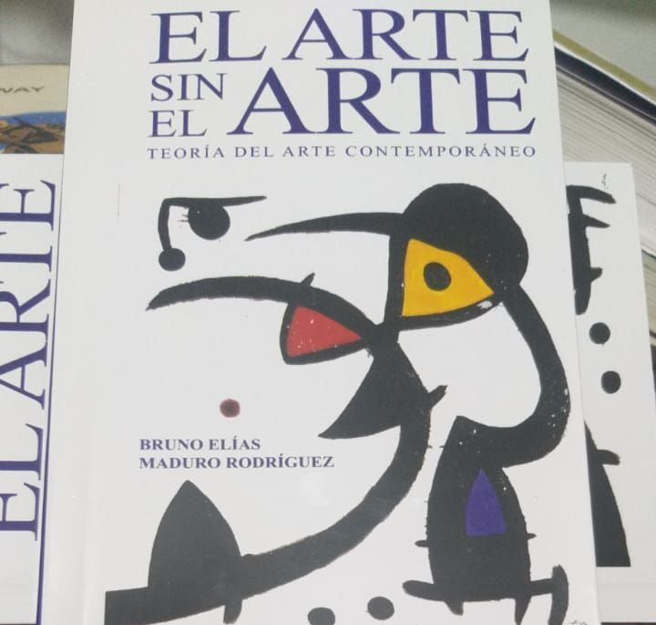
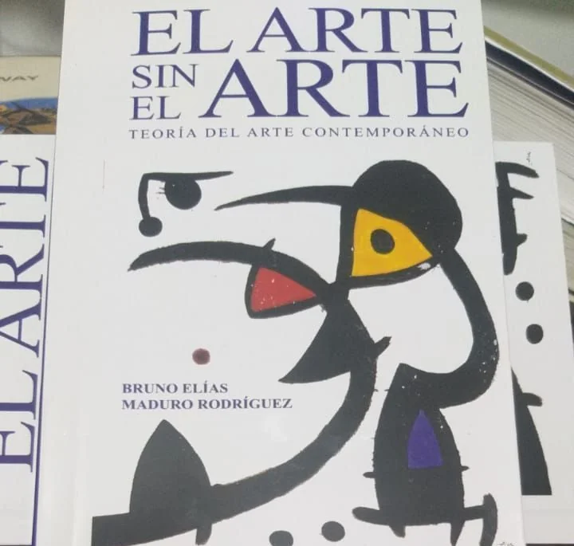

*El arte de Bruno y la ficción de la vida. Aquí con el también escritor y su corrector de estilo, Laurent Céspedes. Foto suministrada.*

Una de las mentes que puede revolucionar el pensamiento latinoamericano es **el arte de Bruno**. Sus escritos sobrepasan la ficción de la vida. Ya en la literatura, ya en la filosofía o en la historia del arte. ¿Por qué el homínido, esta especie de la cual salimos los humanos, desde sus orígenes quiso dejar una huella de su percepción artificial de la vida? Es decir, ¿por qué el hombre o la mujer de la caverna recreó la vida real? Por la ficción de la vida. Untarla de esa creatividad infinita que dura más en la memoria humana que la propia realidad.

Ejemplo de ello es el **Poema de Gilgamesh**, el más antiguo de la literatura sumeria. Pero también podíamos citar, la Torá y la Biblia, son textos que de cualquier manera pertenecen a la literatura de la humanidad. Ellos reflejaron una realidad de su tiempo que sigue siendo el tiempo presente. O la obra de Homero, que le gusta mucho a Bruno. Le sirve de pretexto para ahondar un poco en la historia de la literatura.

## El arte de Bruno

*El arte de Bruno.*

Abstraer esa realidad no es fácil. Trasmitirle toda su complejidad mental, su subjetividad y transformarla en algo increíble y, al mismo tiempo, verosímil, es una tarea que nace de lo más adentro de los creadores de ficción. Es el sitio donde se anida lo más profundo del arte.

Pues bien, para entender esa complejidad de la creatividad humana, **Bruno Elías Maduro** nos propone un camino cierto donde combina la historia del arte con la filosofía y quizás el psicoanálisis. Su nuevo libro _**El arte sin el arte**_ francamente despertará mucho interés, no solo en el mundo de los artistas sino también en la academia. Se suma a su novela _La aldea al pie de la montaña,_ y a su obra ensayística _La teoría del poder,_ entre otros.

## El arte nos hace trascender

> Es el arte lo que nos hace trascendente en este mundo inmanente, es la belleza la que nos hace superar lo suprasensible, es el arte la verdadera copia de la vida misma, y es la vida del arte la mejor interpretación de las iniciales de nuestra existencia.
> 
> Bruno Elías Maduro. _**El arte sin el arte**_. Primera edición en papel personalizada. Pág 16.

## La estética de la ética

La tesis 9 del libro, Bruno la abre con el versículo de Lucas:

> Si alguien te quita la capa, deja que se lleve también la túnica.
> 
> Lucas 6:29

Y con ella no explica:

> Hay acciones éticas que se vuelven estéticas. (...) Hay acciones morales en las cuales lo ético funge, como en el arte conceptual, como figura estética, como _Le grand verre_ (El gran vidrio) de Duchamp. Un acto de pretexto para indagar lo que está ahí dentro del espíritu. En el Evangelio lo ético se vuelve estético. En Duchamp, lo estético se vuelve concepto (Cabanne, 2013).
> 
> Página 44.

## La mente del artista

La alocada idea de Bruno es adentrarse en la mente del artista. Explicarse qué lo motiva para crear, cuáles son los dones que posee.

> Una persona puede nacer con dones en su área del arte, pero si no tiene la posibilidad de cultivarlos o entrenarlos, lo más probable es que se pierdan en la masa informe, y perezcan antes de su nacimiento. Este desperdicio es quizá parte del efecto del pecado original del arte.
> 
> Pág 71

## Las matematicas del arte

En la tesis 26, Bruno nos habla del uso de las matematicas en la construcción del arte. Por ejemplo del creador artístico griego, que utilizaba intuitivamente la geometría para darle forma a su figura. De esta manera conseguía que su creación no fuera una copia de la realidad sino una creación que le inyectaba "sus competencias innatas".

> "El artista se distancia del fabricante normal porque aplica una cuota adicional y extraordinaria de su imaginación estética para sacar las matematicas de la esencia axiomática y someterla a la ilusión del arte".

## El tiempo del arte

La naturaleza física del arte es lo temporal, dice Bruno en la tesis 67 del texto. Sin embargo, el artista no crea su obra para que al día siguiente desaparezca. Él crea para que "permanezca en el siempre". ¿Qué hay, entonces, en lo que se llama el arte efímero? El artista lo crea para que físicamente desaparezca en cuestión de días.

Bruno no absuelve ese interrogante. Pero atina al señalar que el artista vive variadas formas del tiempo a la vez. Cuando la obra se crea y se difunde adquiere una dinámica propia, construye sus propios tiempos, diría.

En ese sentido, el tiempo del arte no es estático. Es conflictivo. Se impregna una contradicción entre el tiempo de su creador y el tiempo de la obra, entre el tiempo congelado del artista y el tiempo cambiante del arte. Entre el ser y el fluir del ser.

Ello me hace recordar la levedad del tiempo. El tiempo humano es recto. Pero él quiere que sea circular para alcanzar la felicidad, dice Kundera. No obstante, para Bruno el tiempo del creador es limitado, distinto a su creación que perdura en el tiempo. Como me dijo un mecánico del barrio El Espinal, Cartagena, "ahora Diomedes Diaz canta mejor que cuando estaba vivo".

El creador del Poema de Gilgamesh (año 2000 a.C.) o de los creadores del arte rupestre, no se imaginaron que ellos iba a vivir en su creación un tiempo extendido, el tiempo de su obra. Es el tiempo que quiere vivir todo creador. Vale la pena tener _El arte sin el arte_ en la mesita de noche junto a la Biblia o el Torá.