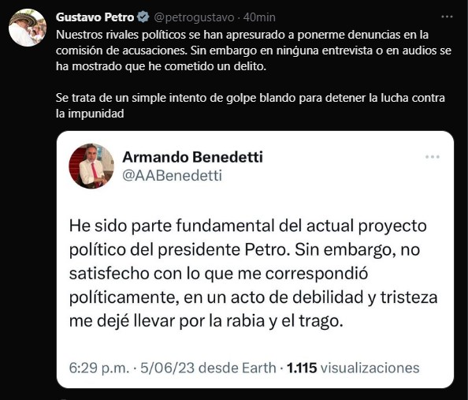

*El dueño de la bolsa ¿Petro o Benedetti?*

¿Quién es el dueño de la bolsa de dólares que se perdió en casa de Laura Sarabia, exjefa de gabinete de presidencia? ¿Petro o Benedetti? Tal es la pregunta que surgió en el avance de la _bola de nieve_ que engulle todo a su paso en el gobierno compartido de izquierda. En tanto, en la tarde de hoy lunes, el presidente Gustavo Petro reiteraba la existencia de lo que llamó «**un simple intento de golpe blando para detener la lucha contra la impunidad»**. Y, al mismo tiempo, publicaba un pantallazo del último tuiter de Armando _Terminator_ Benedetti, quien reconoció que se dejó **"llevar por la rabia y el trago»**. Es el mismo que había amenazado con incendiar la Casa de Nariño, incluso, con él adentro. Esta fue su amenaza:

> **«Nos caemos todos**, hp».
> 
> Benedetti.

Ese tuiter de _Terminator_ Benedetti, podría indicar que el gobierno nacional se movió rápidamente para contralor la onda expansiva de la bomba incendiaria de los audios publicados por la revista Semana. Probablemente, se llegó a un punto de entendimiento donde el presidente ya no acusaba a su exembajador de chantaje sino que atacaba a los que pretenden encausar **«un golpe blando»** contra su gobierno.

## Comisión de Acusaciones

No terminando Semana de publicar los incendiarios audios de _Terminator_ Benedetti, el excandidato a la presidencia de la derecha colombiana en la primera vuelta de las elecciones pasadas, **Federico _Fico_ Gutiérrez, y el senador uribista Miguel Uribe**, presentaron una denuncia ante la Comisión de Acusaciones contra el presidente Gustavo Petro.

Gutiérrez, al presentar la denuncia, le dijo a los miembros de la Comisión de Acusaciones:

> **«**Hagan esta investigación y sesionen de forma pública, como lo dice la ley, donde tengan acceso los medios de comunicación y la ciudadanía».

\[Te puede interesar: [¿Benedetti & Sarabia detuvieron la bola de nieve? (III)](/articulos/benedetti-sarabia-detuvieron-la-bola-de-nieve/)\]

De modo que esta es una reacción lógica de la derecha colombiana ante semejante papayazo del gobierno compartido de izquierda. Y, en efecto, podría prosperar el golpe blando del cual teme tanto el presidente Petro. (Sobre este tema regresaremos en la próxima entrega).

## El desbordado enfado

Recordemos que el jueves 1 de junio, el presidente Gustavo Petro solo vino a atender al entonces embajador de Colombia en Venezuela ya entrada la noche. Luego de una prolongada espera, lo que le emputó a Benedetti es que el presidente no le creyó a él sino a su jefe de gabinete Laura Sarabia.

El desbordado enfado del exembajador de Colombia en Venezuela, **Armando Benedetti**, no era contra la mensajera, su antigua subalterna y _álter ego_, **Laura Sarabia Torres**. En realidad, fue el resultado de una ira y resentimiento contenidos contra el presidente Gustavo Petro por no haberlo ubicado en una mejor posición de poder. Según él, la parte que recibió del botín no fue proporcional a lo que aportó en la campaña presidencial:

> **«**Yo hice 100 reuniones (...) **15.000 millones de pesos, es más, si no es por mí no ganan.** (...) Además, lo que te voy a decir no es una amenaza (...) veo que esto me puede emputar, pateo hijueputa, y ahí nos caemos todos, hijueputa».

Como lo habíamos predicho en **VoxPopuli Digital**, la causa del escándalo destapado con las declaraciones de Marelby Meza, la niñera de Laura Sarabia a la revista Semana, no era un simple robo doméstico. Con los audios divulgados anoche por el mismo medio, se comprueba que el problema de fondo es **la posesión de la bolsa de dólares**, cuya cifra es indeterminada. La bolsa desapareció en enero de 2023 cuando estaba en poder de la funcionaria de quien Petro gozaba de una alta confianza.

## ¿El dueño de la bolsa?

De hecho, la verdad es que todo gira en torno al dinero y a la supuesta falta de reconocimiento al trabajo electoral realizado por Benedetti para la victoria presidencial. La reacción del exembajador ante una inminente salida del gobierno, fue visceral frente a la que consideró una **«**mamadera de gallo» del presidente Petro.

En la última entrevista concedida hoy a Vicky Dávila, de Semana, Benedetti puso de manifiesto un hecho trascendental:

> **«**... Yo empiezo a entender qué pasa con Mary hasta el 22 o 23 de mayo. (...) Yo lo único que empiezo a entender ahí es que había mucho movimiento de plata en la casa de ella (Laura Sarabia) y ella quería ocultarlo».

Según _Terminator_ Benedetti, él no es el dueño de la bolsa. Supuestamente, solo vino a entender que había mucho **«**movimiento de plata» en la casa de Laura que **«**ella quería ocultarlo». Por su parte, Laura dice que el dinero desaparecido es suyo, producto de los viáticos. Pero, la cantidad de efectivo desborda toda proporcionalidad. No tiene forma de justificar tal cantidad de dinero.

Si la bolsa no es de Laura ¿de quién será? Todo hace indicar que pudo ser parte de un soborno o de un sobrante de los dineros recaudados durante la campaña electoral. Puede ser que ese dinero lo llevó algunos de los financistas de campaña o de algunos de ellos que se beneficiaron de alguna concesión o un contrato estatal. En todo caso, este hecho sería materia de investigación por parte de las autoridades competentes.

Sin embargo, determinar el dueño de la bolsa es el núcleo central de todo el escándalo. Ello nos llevaría a varias conclusiones: (1) si hubo o hay sobornos en la actual administración, (2) si desbordó los topes de campaña, (3) si hubo dinero ilícitos en la campaña o, por lo menos, de no emprendedores, como le dijera voluntariamente _Terminator_ Benedetti a Vicky.