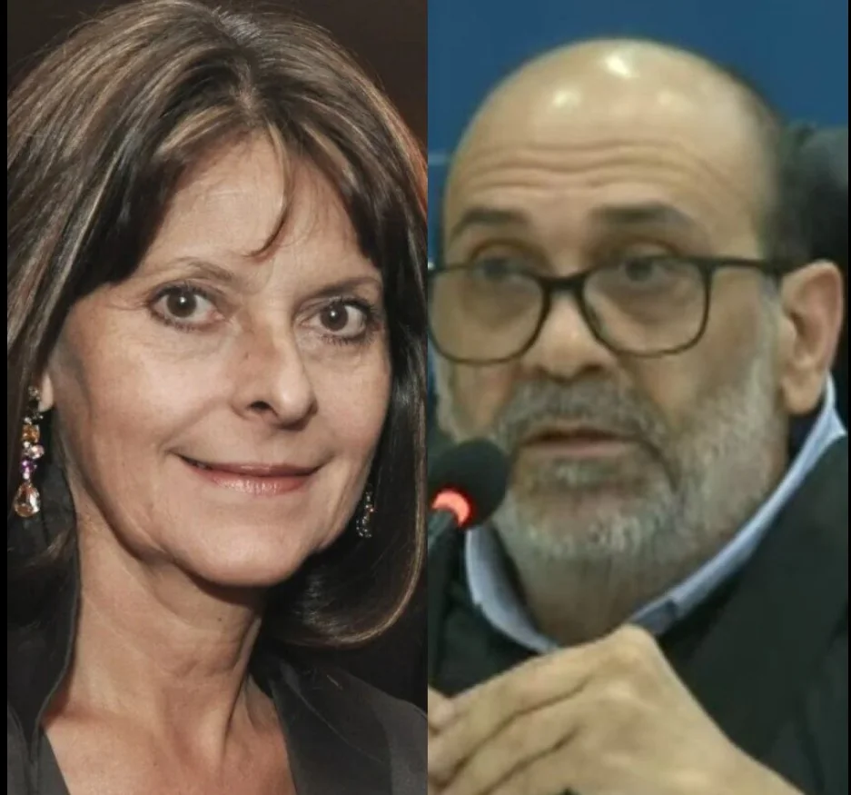
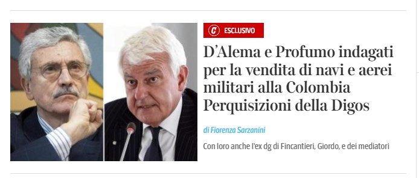

La exvicepresidenta de Colombia, **Marta Lucía Ramírez** se pudo concertar criminalmente con presuntos testaferros de **«Jorge 40»** para intentar defraudar al estado colombiano y al italiano. Por el otro, igualmente, el exprimer ministro de Italia **Massimo D´Alema** y sus compinches, presuntamente se habían concertados para defraudar a Colombia e Italia detrás de una «coima» de 80 millones de euros. Esta es la cantidad que recibirían por la compra de naves, aeronaves y material bélico del Estado colombiano a dos importantes empresas italianas, Leonardo y Fincantieri. La Fiscalía de Nápoles inició la investigación y solicitó la colaboración de su similar de Colombia donde se encuentran involucrados, además de la exvicepresidenta colombiana y del exprimer ministro italiano, una firma norteamericana de abogados.

Sin embargo, el negocio se les cayó cuando se filtró —hace un año— en la prensa italiana la negociación ilegal que pretendían realizar en la postrimería del gobierno del presidente Iván Duque. Hubo una desavenencia de uno de los participantes en una videollamada que filtró a la prensa de investigación de Italia.

\[Te puede interesar: [¿Quién mandó a matar a Perneth Caicedo, testaferro de «Jorge 40»? (I)](/articulos/quien-mando-a-matar-a-perneth-caicedo-testaferro-de-jorge-40/)\]

## El atentado a Perneth

En ese sentido, VoxPopuli.Digital en febrero de este año se refirió a **Eder Perneth Caicedo**, uno de los que participó en esa negociación mafiosa que había sido víctima en Barranquilla de un atentado criminal del cual sobrevivió. Perneth participó en la negociación e intención del gobierno de Iván Duque de esa compra por la suma de 4 mil millones de euros a la industria bélica italiana. Retomando fuentes italianas, se Informó sobre la participación de varios presuntos testaferros de **«Jorge 40»**. Pero no se pudo establecer si había una conexión entre la frustrada negociación y el el atentado sufrido el 16 de febrero por Perneth en Barranquilla. Este empresario y contratista del Estado, fue el coordinador del equipo de trabajo desplazado por Colombia como intermediario para la compra del material bélico.

Además de Eder Perneth, estaban el otrora jefe del paramilitarismo en Barranquilla, **Edgar Fierro Flórez (alias «Don Antonio»**) y **Oscar José Ospino Pacheco**, alias **«**Tolemaida**»**. Estos individuos, como jefes de escuadrones de la muerte recibieron condenas alternativas por sus crímenes de lesa humanidad en Justicia y Paz. Ahora, presuntamente, están actuando como testaferros de **«Jorge 40»**, quien jamás se ha retirado del negocio ilegal. Ante esta situación, la fiscalía napolitana le solicitó a su similar de Colombia iniciar la investigación respectiva contra estos individuos y la vicepresidenta de Colombia, Marta Lucía Ramírez.

[Desierta la APP para rescatar galeón San José abre un mar de beneficios al Caribe](/articulos/desierta-la-app-para-rescatar-galeon-san-jose-abre-un-mar-de-beneficios-al-caribe/)

## La investigación italiana a Marta Lucía

Como suele suceder, la Fiscalía colombiana siempre está a la zaga de las investigaciones, especialmente, cuando se refiere a casos de corrupción de alto turmequé, como en este caso de la frustrada compra a las dos firmas italianas. Pero, por suerte, la Fiscalía napolitana ya abrió la investigación y pidió la colaboración a su similar colombiana para echarle el guante a los principales protagonistas de este delito transnacional.

> **«**En la investigación también aparecen mencionados **Edgard Fierro Flórez jefe del grupo de trabajo para la presentación de oportunidades en Colombia, Marta Lucía Ramírez, canciller y vicepresidenta de Colombia, Germán Monroy Ramírez y Francisco Joya Prieto**, delegados de la comisión del Senado de Colombia**»**.
> 
> [D’Alema e Profumo indagati per la vendita di navi e aerei militari alla Colombia. Perquisizioni della Digos](/articulos/notizie/cronaca/23_giugno_06/massimo-d-alema-alessandro-profumo-indagati-perquisiti-armi-colombia-07077ce7-c0e7-454e-adf9-8c6a69a65xlk.shtml).

## La conducta de Marta Lucía y D'Alema

En ese sentido, el periódico italiano Corriere della Sera, señala que D'Alema podría ser procesado penalmente.

> **«**Por tanto, habrían violado el artículo 322 bis del código penal, que castiga "el desfalco, la extorsión, la inducción indebida a dar o prometer beneficios, la corrupción y la instigación a la corrupción, el abuso de funciones de los miembros de los tribunales internacionales ...**»**.

La conducta de **Massimo D´Alema** y sus cómplices violarían esa norma penal. En tanto que a Marta Lucía Ramírez se le imputaría, entre otros, el delito de concusión tipificado en el Código Penal Colombiano en el artículo 404:

> **«**El servidor público que abusando de su cargo o de sus funciones constriña o induzca a alguien a dar o prometer al mismo servidor o a un tercero, dinero o cualquier otra utilidad indebidos, o los solicite, incurrirá en prisión de noventa y seis (96) a ciento ochenta (180) meses, multa de sesenta y seis punto sesenta y seis (66.66) a ciento cincuenta (150) salarios mínimos legales mensuales vigentes, e inhabilitación para el ejercicio de derechos y funciones públicas de ochenta (80) a ciento cuarenta y cuatro (144) meses**»**.
> 
> Código Penal colombiano.

Además de tráfico de influencia y otros delitos, Marta Lucía debe responder políticamente por la alta investidura de la cual gozaba como canciller y vicepresidenta de la república. **Pero el delito más grave sería concierto para delinquir**. Al parecer, ella se concertó criminalmente con los testaferros de **«Jorge 40»** para recibir junto a sus cómplices el otro 50% de una comisión por dicha compra—venta de 4 mil millones de euros. Es decir, ella y sus cómplices debían **embolsillarse la suma de 40 millones de euros**.

## Perneth y **«Jorge 40»**

Recordemos, en febrero dijimos que Eder Perneth Caicedo tiene un largo historial semejante a **Darío Laino Scopetta** alias **«Ojitos Azules»**. Las fuentes manifiestan que maneja un **«billete largo»** gracias a los grandes contratos con el Estado y a inversiones en el sector de la infraestructura de Barranquilla durante los gobiernos de Alex Char, Elsa Noguera y Jaime Pumarejo, alcalde actual. Actualmente se considera como uno de los empresarios que asechan la construcción del nuevo puerto barranquillero.

Tanta plata tiene Eder Perneth Caicedo y los antiguos esbirros de Tovar Pupo, que fueron delegados por el gobierno de Duque en esa negociación —junto con el exprimer ministro de Italia, **Massimo D´Alema** — para la compra de armamentos y naves de guerra con dos empresas italianas, como lo señaló la agencia EFE y el portal Dagospia.com en 2022.

El citado medio reveló en esa oportunidad una investigación:

> **«**En la lista estaba el jefe del “grupo de trabajo”, un tal Eder Perneth Caicedo, con toda probabilidad un constructor de Barranquilla, donde los comisionistas, pero también D’Alema, se estaban interesando en la construcción de un puerto**»**.

O sea, que los italianos también estaban interesados en invertir en Barranquilla para la construcción del puerto. Pero este tema será tratado en las próximas entregas.

En el grupo de intermediarios, como se dijo arriba, estaba la crema y nata de los comandantes de **«Jorge 40»**. Porejemplo,  el otrora comandante **«**Don Antonio**»** y **«**Tolemaida**»**. El primero fue el comandante y mano derecha de **Rodrigo Tovar Pupo en Barranquilla**. El segundo nacido en 1966 es uno de los asesinos, bajo órdenes de Tovar Pupo y del jefe de seguridad de la Drumond, de los dirigentes sindicales **Valmore Locarno, Víctor Hugo Orcasita** y **Gustavo Soler**, Estos eran directivos del sindicato de trabajadores de la empresa norteamericana Drummond.

## Síntesis.

Lo que se presume con esta investigación de la fiscalía de Nápoles, es que la conducta de la exvicepresenta y excanciller Marta Lucía Ramírez quedó atrapada en el pasado de su esposo **Álvaro Hermes Rincón**. Sus negocios turbios de construcción e inmobiliaria con alias Memo Fantasma le persiguen hasta el presente. El pasado no perdona.