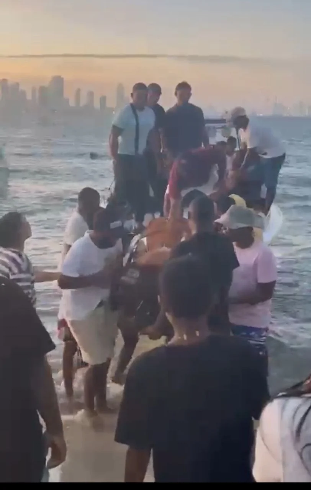
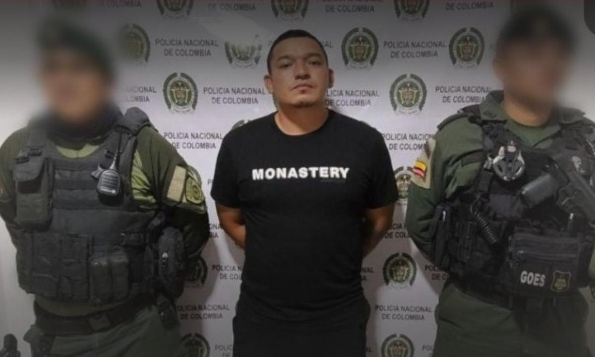
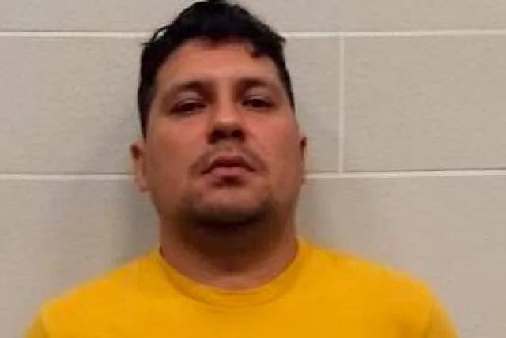

*Mataron a Yorman. Aquí cuando su cadáver llegó a Punta Arena/Captura de pantalla de video.*

A las 3:10 de la mañana del 19 de junio, cuando la parte nocturna de Bocagrande se aprestaba a dormir, nadie escuchó los balazos que mataron a _Yorman_. El asesino, abriéndose paso entre las mujeres que acompañaban a la víctima a la salida de la **discoteca Jet―Set**, tenía silenciador en su pistola, la cual usó a _quemaropa_. **Jorman Meléndez Coneo** (29 años) cayó al pavimento vencido por la muerte. Mientras su asesino, sin apuros, tomaba una moto con dirección al centro histórico. En este barrio turístico, hacía 12 años que no había ocurrido un sicariato de alto impacto asociado a la guerra del narcotráfico.

Vale recordar, que en 2011, _Los paisas_ mataron a **Elsa Porto**, hija del periodista **Melanio Porto Ariza**, en su spa de Bocagrande, a varias cuadras donde también mataron a _Yorman_. La orden la dio el paisa Maximiliano Bonilla Orozco, el jefe de esa banda. La causa tuvo que ver con el manejo de dinero de esa organización delincuencial que estaba en una guerra con los _Urabeños_ y los _Costeños_. En este crimen, según fuentes de inteligencia y de amigos de Yorman, indican que otro paisa, **Julián Alberto Jiménez Monsalve**, alias **“Machete”**, dio la orden de muerte desde la Tramacúa, de Valledupar.

La descripción del homicidio de _Yorman_ fue posible luego de ver detenidamente algunos videos de las cámaras de seguridad que se encontraban en el lugar, carrera 3 con calle 5.

## Las preguntas obligadas

Hoy, después del entierro de alias _Yorman_, surgen algunas preguntas clave para entender la dimensión de su asesinato que tiene más trascendencia de lo que la gente común puede estimar. ¿Quién ordenó su homicidio? ¿Hace parte de la cadena de asesinatos y del control del narcotráfico de la zona insular de Cartagena? ¿Cuánto costó esta muerte ejecutada con higiene profesional y sin ninguna interferencia? ¿Cómo se pudieron movilizar fácilmente en una moto que está prohibida a esa hora? ¿Por qué no se activaron de inmediato los cuadrantes de Policía que están a dos cuadras del escenario del crimen?

## El dato curioso

**Aleida Coneo y karolay Díaz** ―madre y esposa de **Jorman Meléndez Coneo**, respectivamente―  están desbastadas. Como sus demás familiares y amigos exigen justicia. y se preguntan cómo pudieron escapar los criminales en moto si **Bocagrande solo tiene una entrada y una salida. Además, está llena de cámaras de seguridad por todas partes**, tanto públicas como privadas. ¿Qué dice la Fiscalía? ¿Cuál es el pronunciamiento de la Policía? ¿Qué dice el alcalde? ¿Dónde está el debate en el concejo a la secretaria del Interior Ana María González?

Te puede interesar: [Las madres paren hijos para la guerra y la corrupción](/articulos/las-madres-paren-hijos-para-la-guerra-y-la-corrupcion/)

## En este video se predijo lo que sucede hoy en Cartagena

https://youtu.be/r3H1mcPfl\_U

Cartagena se podría convertir en Acapulco, en manos de los carteles.

## El móvil de la muerte de Yorman

Algunas fuentes del bajo mundo y de investigadores sobre crímenes de alto impacto, indican que las organizaciones reagrupadas en _Los Salsas Mexicanos Nueva Generación_ ―que han contado probablemente con el beneplácito implícito de las autoridades policivas y militares― podrían ser las autoras de este homicidio. Pero también de los últimos homicidios que estremecen a Cartagena. Es una especie de pequeña confederaciones de organizaciones criminales dedicadas a la seguridad del tráfico de estupefacientes, principalmente a Estados Unidos y Europa. Allí se encuentran otroras jefes del Cartel del Golfo, estructuras de la Oficina de Envigado, como Los Robledo de Medellín.

Al parecer, están aprovechando el espacio de transición del **Coronel Wharlinton Iván Gualdrón Gualdrón**, quien apenas se está acomodando como comandante de la Policía Metropolitana de Cartagena―MECAR. El oficial se posesionó el pasado 7 de junio. Es muy probable que no haya recibido el estado del arte de la guerra por el control del puerto de Cartagena que explotó una vez fueran capturados los jefes máximos del Clan del Golfo. Algunos de los cuales fueron extraditados a Estados Unidos.

El Clan del Golfo tenía presencia en el control de los puertos de Cartagena, Barranquilla y Santa Marta. El principal jefe era el antioqueño **Juan José Valencia**, alias Babalao o Andrea. Las autoridades extraditaron a Estados Unidos a _Babalao_. Su papel era de bisagra entre los exportadores de cocaína y los jefes que mantenía la seguridad de esos cargamentos en las rutas ya definidas.

Por su parte, según las fuentes de inteligencia, el **Clan de los Coneo** juega un papel muy importante para la exportación de la droga. Esta organización le trabaja al buen postor o a la organización que esté mandando la parada en el momento. Esta organización va más alla de proporcionar cotaminadores de las embarcaciones que atracan en el puerto local. Proporcionan lanchas rápidas debidamente equipadas, excelentes conductores conocedores de la ruta, tiene buenas relaciones y son garantías para que el producto llegue a su destino. Su área de acción es la zona insular de Cartagena.

Te puede interesar: [La guerra narco—paramilitar se expande en ciudades del Caribe (I)](/articulos/la-guerra-narco-paramilitar-en-la-costa-caribe/)

También: [Tres perlas del Caribe en poder de la mafia: Santa Marta, Barranquilla y Cartagena (I)](/articulos/tres-perlas-del-caribe-en-poder-de-la-mafia-santa-marta-barranquilla-y-cartagena-i/)

## Se recrudece la guerra

*El día que capturaron a "Paty Paty". Hoy está en La Picota.*

A principio de 2022 se reactivó una nueva guerra por la pérdida de algún cargamento del **Clan del Golfo**. En esta ocasión, el Clan mandó refuerzos para detener a lo que inicialmente se conoció como _Los Salsas Mexicanos_ que amenazó a sus jefes y sicarios que operaban en Cartagena. La guerra se recrudeció. Entraron _Los Robledo_ de Medellín para reforzar a los Salsas y mandaron sicarios para cometer sus crímenes. Por su parte, el Clan hacía lo propio. A raíz del estallido de esa guerra, en marzo del 2022 se advirtió que Cartagena estaba en vía de convertirse en un nuevo Acapulco, ya que se encontraba entre las 50 ciudades más violentas del mundo.

Los jefes del Clan mandaron a alias _Niñoco_ a reforzar su operatividad criminal y de exterminio. Consideraban que la policía estaba del bando de los Salsas Mexicanos. Por ello desarrollaron lo que se conoció _plan pistola_ contra agentes de la Policía Nacional. Fue entonces que en julio del 2022, en un violento operativo realizado por la policía en Parque Heredia, al suroriente de Cartagena, cayó **Nicolás Antonio Urango Reyes, alias _Niñoco_** y su guardaespalda **Édgar Alberto Cardales Miranda, alias ‘Jordan’.**

Según fuentes oficiales, el delincuente abatido, se le sindicó de ser el ordenador de 23 homicidios por la vía sicarial en la ciudad y el coordinador del plan pistola que dejó como saldo un policía muerto y dos heridos en tres atentados criminales.

De esa manera, con la muerte de Niñoco se acabaron 19 años de trayectoria criminal. **Él es una prueba de que los procesos de paz si no toma en cuenta lo más profundo del ser humano, fracasarán.** Se desmovilizó de las Auc. Luego integró las bandas criminales ‘los Urabeños’ y ‘los Paisas’. Últimamente, según la policía, era el cabecilla urbano del Clan del Golfo en Cartagena. Quizás este fue el golpe más certero que sufriera esta organización.

Te puede interesar la primera entrega: [Cartagena sitiada por el crimen y la ineptitud (I)](/articulos/cartagena-sitiada-por-el-crimen-y-la-ineptitud/)

## Por orden de Gomelo, el Purry ejecuta masacre en Barú

*Cuando capturaron a alias Gomelo vivía sabroso en una mansión de Tolú.*

Esta parte de la historia es clave para entender por dónde pudo venir la muerte de Yorman. **Carlos Ayala Barrera,** alias _Gomelo_, como jefe de la estructura financiera del Clan del Golfo en Cartagena, era quien ordenaba los asesinatos junto con Niñoco. El apodo de Gomelo se lo ganó, precisamente, porque le gusta vivir sabroso: mansiones, carros lujosos, yates, ropa de marca, mujeres bonitas, fiestas suntuosas y exclusivas. En fin, la típica conducta del pobre que deviene en nuevo rico.

Precisamente, el mismo día que mataron a Yorman, el jefe de sicarios, **David Esteban Ladeus Díaz**, alias [_Purry_](/articulos/colombia/noticias/carcel-para-el-purru-presunto-cabecilla-de-red-sicarial-de-la-estructura-clan-del-golfo-en-cartagena/), fue objeto de una medida de aseguramiento intramural dictada por un juez de garantía a petición de un fiscal especializado. El sicario participó en el crimen de siete personas ocurrido en las islas de **Caño de Loro y Barú**, zona insular de Cartagena  los días 23 y 24 de mayo del 2022. Las víctimas supuestamente le servían a Paty Paty y a los Salsas Mexicanos. Cuatro de ellas fueron torturadas.

Por su parte, _Paty Paty_ (Armando Elías Buelvas Sepúlveda), luego de ser amigo y compañero de delincuencia de Gomelo, se enfrascaron en una pelea por el control del Clan. Prácticamente _Paty Paty_ fue sentenciado a muerte por la jefatura de esa organización debido a la pérdida de una droga. Ante esta sentencia que debía cumplir el mismo Gomelo, _Paty Paty_ se fue de Cartagena. Buscó abrigo en la estructura de Los Robledo de Medellín. Pero, Buelvas Sepúlveda, en diciembre de 2022 lo capturaron en Manizales. El 2 de enero de 2023, a petición de un fiscal especializada de Cartagena, [un juez le dictó medida de aseguramiento intramural a Paty Paty](/articulos/colombia/noticias/a-prision-alias-paty-paty-presunto-responsable-de-por-lo-menos-5-homicidios-en-bolivar/). Su supuesto prontuario: **concierto para delinquir, homicidio, ambos delitos agravados y fabricación, tráfico y porte de armas de fuego o municiones**. Hoy. _Paty Paty_ está en La Picota esperando el juicio.

Por su parte, su archienemigo, el _Gomelo_, fue capturado en marzo de este año en una lujosa mansión de Tolú cuando se daba la vida sabrosa con mujeres y todos los lujos de un traqueto enriquecido con el comercio de la droga.

Te puede interesar: [Guerra Clan del Golfo Vs Salsas. Asesinato de «el Nalga»](/articulos/guerra-clan-del-golfo-vs-salsas-asesinato-de-el-nalga-cercano-a-chawala/)

También: [Cartel de Jalisco en Guerra por el Puerto de Cartagena dispara el sicariato](/articulos/cartel-de-jalisco-en-guerra-por-el-puerto-de-cartagena-dispara-el-sicariato/)

## Alias _Machete_ y la muerte de Yorman

*Según personas cercanas a la víctima, quien pudo dar la orden de muerte contra Yorman fue Julián Alberto Jiménez Monsalve, alias Machete, detenido en La Tramacúa de Valledupar.*

De acuerdo con fuentes del bajo mundo y de la inteligencia que piden reserva, la orden del asesinato pudo venir desde la prisión La Tramacúa, de Valledupar. ¿Por qué? Según esas fuentes, **Julián Alberto Jiménez Monsalve**, alias Machete, era uno de los capos que manejaba el negocio de la droga desde Punta Cana, República Dominicana. En ese lugar fue capturado sindicado de ser uno de los jefes del grupo _Los pesebreros_, conocida en la Costa Caribe como Los Robledo. A Jiménez Monsalve se le sindica de 40 homicidios, narcotráfico, entre otros delitosgraves.

De acuerdo con fuentes del inframundo delincuencial, la estructura Los Robledo en esta guerra al interior del Clan del Golfo, tomó partido por los _Salsas Mexicanos_ y formaron lo que ahora se llama _Salsas Mexicanos Nueva Generación_. ¿La razón? Esta nueva organización está integrada por los traquetos que se unieron para sacar al _Clan del Golfo_ de Cartagena. El último reducto era comandado por alias Gomelo. Pero en entre mayo y junio, le han exterminado su red sicarial y sus testaferros. Lo han despojado de todo lo que le daba fuerza, incluso, dentro de la cárcel.

¿Por qué mataron a Yorman? Alias Machete no confiaba en Yorman. Tenía miedo de que lo delatara y que se pusiera al servicio de los jefes del Clan del Golfo que tienen influencia en la Oficina de Envigado que maneja el 70%, según los entendidos, de la industria criminal de Medellín que se extiende a la Costa Caribe. Alias **Gomelo** era amigo de Yorman. Los dos compartían los buenos gustos por la ropa de marca y la vida sabrosa. Pero Yorman, era un muchacho muy abierto y cordial. Caía bien a Gomelo pero también a Paty Paty y a muchos otros que fueron del Clan del Golfo.

En síntesis ¿esa es la raíz que originó la muerte de **Jorman Meléndez Coneo**? Es una explicación que dan algunas fuentes conocedoras de la industria del narcotráfico. También podría explicar el gran ascenso que Yorman venía teniendo en su negocio de ser apoderado de varias figuras de champeta y de su picó **La Amenaza** de Punta Arena que amenazaba desbancar al **Rey de Rocha**, el picó icónico de Cartagena. Precisamente había tocado con éxito el 16 de junio en la discoteca que fue escenario de su muerte, el Jet Set.

## Próxima entrega

¿Por qué no hay articulación estratégica de la Policía, la Fiscalía y el Distrito? ¿Cuáles son los golpes de alto impacto contra la delincuencia organizada de la ciudad? ¿Cuál es el papel del CTI para combatir a las bandas criminales? ¿Cuantos investigadores tiene el CTI? ¿Cuál es su operatividad?