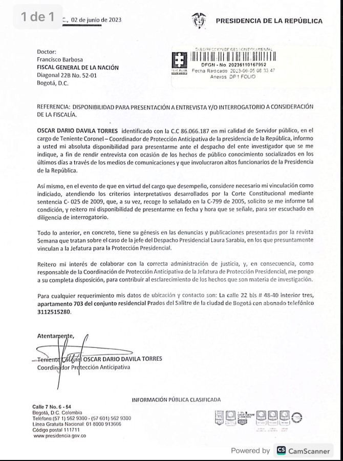
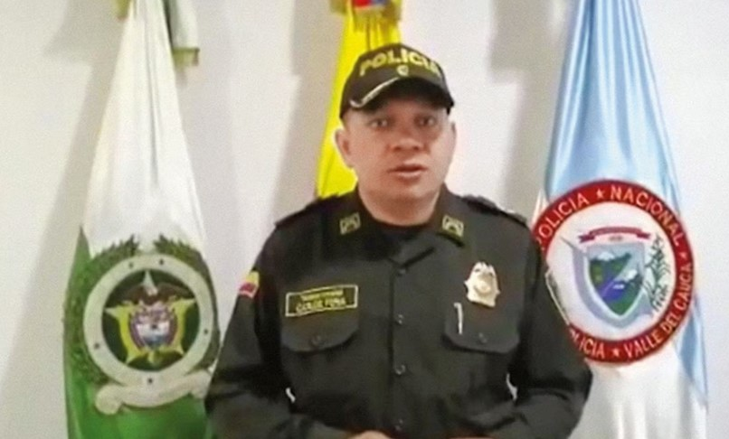

*El presidente Gustavo Petro aclaró que se trató de un suicidio.*

¿Suicidio? ¿Homicidio? ¿Cachos? Tales son las preguntas que surgen a raíz de la **enigmática muerte** del principal sospechoso de haber ordenado las chuzadas presidenciales, **teniente coronel Oscar Darío Dávila Torres.** Una fuente de entero crédito allegada a las autoridades, le acaba de confirmar a **VoxPopuli Digital** que fue un suicidio con su arma de dotación oficial. Además de intrigas palaciegas, el truculento caso ahora tiene una pizca de pasión. La fuente agrega que el detonante **directo de este cruento hecho fue pasional** (¿cachos?). En este punto confuso, eleva a otro nivel esta compleja investigación surgida a raíz de un supuesto robo doméstico a la **otrora todopoderosa Jefa de Gabinete del presidente Petro**.

Por tanto, l_a bola de nieve_ sigue creciendo y amenaza alud presidencial con las interceptaciones ilegales a dos humildes trabajadoras domésticas. Debemos estar atentos que el alto gobierno desarrolla una estrategia comunicativa para denotar una confrontación entre el presidente y el fiscal. En tanto, los dueños del poder real se enfrascan en desnudar las falencias de gobierno para debilitarlo más. El abuso de poder del gobierno es real con la conducta evidenciada por Laura Sarabia en este caso concreto.

## ¿Suicidio? ¿Cachos o chuzadas?

No es nada raro que el detonante sea la infidelidad, uno de los grandes problemas de pareja del personal policivo, militar, de vigilancia y choferes, según estudios sobre el particular. Pero también pudo ser la combinación de los dos casos que atormentaban al alto oficial de la policía: la relación tormentosa con su pareja y las chuzadas.

Empero, la versión del suicidio cobra mayor fuerza entre las mismas autoridades, especialmente de presidencia. Una fuente allegada a los investigadores de la Sijin reveló a **VoxPopuli Digital** que ese día el oficial llegó a su apartamento atormentado con el caso de las chuzadas y el acoso de los medios de comunicación. Al llegar, Presuntamente, encontró a su esposa en brazos de su amante. Pero, dice la fuente, ella admitió que desde hace rato venían con problemas de pareja. Le dijo a las autoridades que a las 4:30 de la tarde ella (la esposa) se fue y lo dejó solo en el apartamento.

En consecuencia, dos horas después (6:30 p.m.), Dávila extrañamente mandó a su escolta a comprar una botella de agua. A su regreso, el agente de la policía lo encontró muerto en la camioneta **Nissan Frontier**, **FWX914** asignada por **Dirección de Protección y Servicios Especiales**, de acuerdo a la información entregada al CTI. Al parecer, cerca de la camioneta habían otros agentes de la Policía Nacional que serán interrogados, según lo constató agentes de DIPOL.

## Preguntas urgentes

¿Por qué el oficial se suicidó al interior de la camioneta y no lo hizo en su apartamento donde se encontraba solo, ya que su esposa se había ido con sus dos hijos? ¿Por qué el suicidio se produjo después de las 6:30 de la tarde cerca a su residencia? ¿Cuál es la causa para que las mismas autoridades, desde presidencia hasta la misma Sijin y el CTI, se contradigan en sus versiones y detalles? ¿Existe una relación directa del suicidio con la investigación de las chuzadas? ¿La motivación directa fue pasional o por presión de la Fiscalía, o de los medios de comunicación? Con la muerte del teniente coronel Dávila ¿se rompió la línea investigativa de la Fiscalía que debía llegar a la cúpula de la seguridad presidencial a cargo del coronel **Carlos Feria Buitrago**, quien acompaña a Petro desde hace 10 años?

## ¿El suicidio cambiará el curso de la investigación?

*Si leen con atención, el teniente coronel Oscar Dávila no se sentía acosado por la Fiscalía. Por el contrario, estaba dispuesto a declarar si lo tenían como indiciado.*

Una vez se conoció la noticia del supuesto suicidio del Jefe de Operaciones Preventivas asignado a la Casa de Nariño, se tejió una serie de versiones que hicieron crecer el enigma no solo de su muerte sino también del caso de las chuzadas. Las víctimas de esta conducta criminal son **Marelby Meza y Fabiola Perea**, dos humildes trabajadoras del servicio doméstico de **Laura Sarabia Torres**, quien era el único contacto político y de gobierno del presidente Petro con el mundo exterior.

Para chuzar a las supuestas sospechosas del robo, los jefes que ordenaron esa acción crearon artificialmente un plan perverso contra las dos mujeres del servicio doméstico de Sarabia. Las hicieron pasar como eslabones de Wilmer Antonio Giraldo Quiroz, alias Siopas, uno de los jefes del Clan del Golfo que estaba siendo investigado por la Fiscalía. El mismo oficial de policía que había engañado al fiscal del caso solicitando incluir a Marelby y Fabiola en la lista del personal que debía ser chuzado, posteriormente pidió que se terminara la interceptaciones. El hecho es que Siopas fue asesinado a mediados de febrero de 2023, y no se justificaba el seguimiento de las mujeres.

## Las contradicciones del suicidio

*La camioneta Nissan Frontier, FWX914 . Pantallazo de video del CTI.*

Empecemos por desmenuzar la versión del presidente que no explicó de qué fuente extrajo esa información. A primera vista presenta varias contradicciones y defectos fácticos con relación a al informe del CTI.

**Primera.** No fue hallado muerto. Se suicidó delante de su escolta que había regresado con una botella de agua. Pero las fuentes directas que conocieron el hecho, fuentes del CTI, señalaron que el cadáver fue hallado por su escolta a su regreso.

**Segunda.** No se suicidó con su pistola de dotación sino con la de su escolta. El informe del CTI dice que fue con el arma de dotación de la Policía Nacional.

**Tercera**. El escolta dejó su pistola en el asiento y cuando regresó delante de él se suicidó. La versión del CTI y de la misma Sijin es que el escolta lo halló muerto y de inmediato dio aviso.

Tal vez esas contradicciones del presidente se debe a su afán de aclarar de que se trataba de suicidio y no un homicidio. Le corresponderá a la Fiscalía investigar este nuevo caso que se agrega a la cadena de hechos criminales que el robo de la bolsa de dólares desató.

## La versión presidencial: suicidio

Para ser objetivo, veamos la versión presidencial. En la mañana de hoy el presidente Gustavo Petro publicó un extenso tuit donde dio su versión sobre la muerte del teniente coronel Dávila Torres sin presentar pruebas de la misma:

> **«**El teniente coronel de la policía, Oscar Dávila, adscrito a la seguridad de la presidencia de la República ha muerto por suicidio. Cerca a su casa mandó a su conductor por una botella de agua, éste dejo su pistola en el asiento y cuando regresó delante de él se suicidó con un disparo en la cien con la pistola que había dejado. No hay más disparos en el lugar. No es cierto que el coronel haya sido encontrado muerto ni que hayan dos disparos en su cuerpo**»**.
> 
> [Presidente Petro tuit](/articulos/petrogustavo/status/1667516866900770817)

De igual manera, el presidente explicó las actividades previas del alto oficial:

> **«**Previamente el Coronel Dávila había recibido varias llamadas de la prensa y había asistido a la diligencia del CTI en el piso 13 de la DIAN. El coronel Dávila deja dos niños menores de edad. A su familia mis más sentidas condolencias. QEPD.

¿Cuál era el papel del teniente coronel Dávila Torres en Casa de Nariño? El presidente lo dejó claro:

> **«**Su labor en presidencia era asegurar los sitios donde yo tendría que ir en cumplimiento de mis agendas. A eso se dedicaba el personal del piso 13 de la DIAN en donde no había ningún tipo de aparatos de interceptación**»**.

## La versión del abogado del Río

Una de las primeras versiones fue la del mediático abogado **Miguel Ángel del Río**, apoderado de los patrulleros involucrados en este caso criminal de las chuzadas. En su cuenta de tuiter, poco después de conocerse la muerte del teniente coronel, se apresuró en publicar:

> **«**El día de ayer me reuní con el Coronel Dávila quien me buscó para manifestarme que de la fiscalía lo estaban amenazando. Le advirtieron que no se detenían “hasta que corriera sangre”. Hoy se quitó la vida con su arma de dotación. Lo de la Fiscalía es una persecución infame**»**.

Frente a esa declaración del abogado, las evidencias dicen todo lo contrario. Lo primero que la Fiscalía, según informó esa entidad, no lo había citado. Lo segundo, que el teniente coronel Oscar Dávila tenía otro abogado. Tercero, que el mismo oficial le había dirigido una carta a la misma Fiscalía para expresarle toda su colaboración para el caso de las chuzadas. Además, que estaba dispuesto a declarar si a bien lo tienen como indiciado.

La versión de Del Río no es objetiva. Se cae por su propio peso, y quiere reducirlo a lo que él llama "una persecución política". Una cosa son las contradicciones del presidente con el fiscal general, y otra debe ser la controversia jurídica que se basa en hechos interpretados a la luz del derecho. Y no lo contrario.

## Muerto Dávila ¿quién responderá por las chuzadas?

*Coronel Carlos Alberto Feria Buitrago, jefe de seguridad de la Casa de Nariño y quien le guarda la espalda a Gustavo Petro desde hace10 años.*

Sin duda, el jefe de Dávila era el también **coronel Carlos Feria Buitrago**. **¿Deberá responder por las interceptaciones ilegales siendo el jefe de seguridad de Palacio?** Su jefa en la Casa de Nariño era **Laura Sarabia Torres**, quien trabajaba de la mano con Feria Buitrago, un integrante de la Policía Nacional que viene protegiendo al presidente Petro desde que fue alcalde de Bogotá.

Se dice que **Feria Buitrago, es un veterano** experto en **inteligencia y contrainteligencia**. ¿Quién le pondrá el cascabel al gato? ¿La Fiscalía?

Para un periodista le cuesta ubicar de qué lado estará la justicia cuando se presentan estas clases de hechos donde los altos mandos tienen las pruebas ya sea para descubrir o encubrir a los responsables. ¿Cómo será para los ciudadanos que están atenidos a una información superficial que difunde la Gran Prensa? ¿De qué lado estará la justicia? ¿Del lado de Laura Sarabia o de las humildes trabajadoras domésticas de la que fuera la todopoderosa Jefa de la Casa de Nariño? El abuso de poder no se puede admitir, venga de donde viniere.