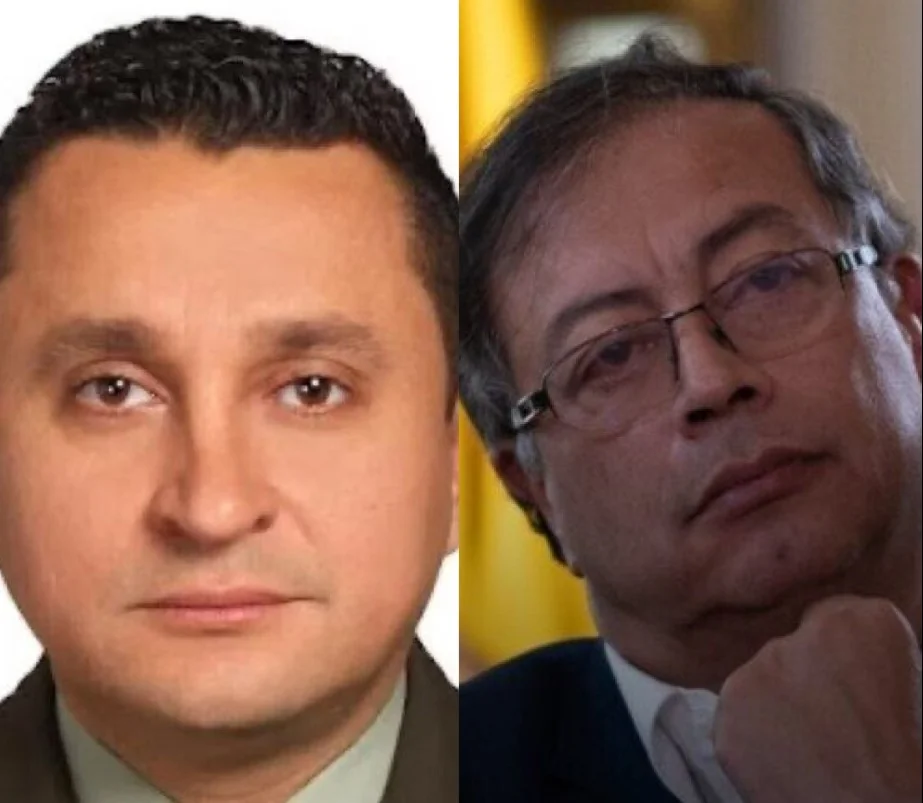
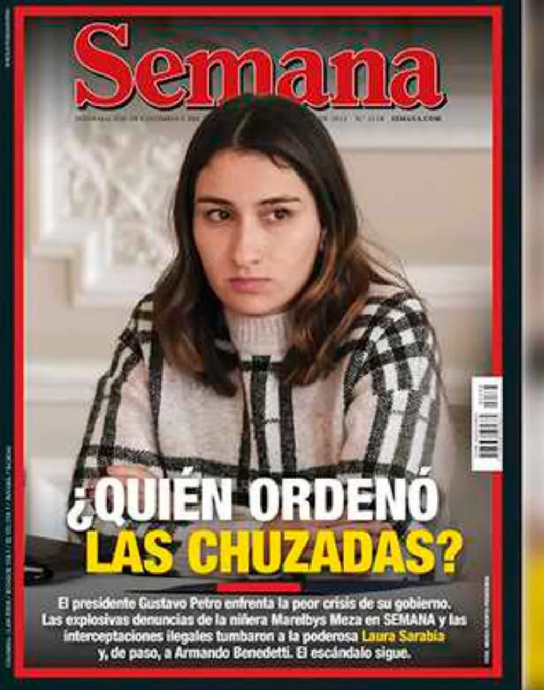

*La máxima es que todo dictador debe ser tumbado por el pueblo ¿Es válido con el caso Petro? ¿Tumbar a Petro con fuente anónima? /Fotomontaje de Semana.*

¿Tumbar a Petro? La noticia fue concebida como una bomba de alto poder. Pero con una fuente anónima, secundaria y sin el rigor de la veracidad. Con una fuente anónima —**«Garganta de lata»**— el Whasington Post tumbó al presidente de los Estados Unidos, **Richard Nixon**, con el caso de **«Watergate»**. Pero, también, con una fuente anónima una de sus periodistas, **Janet Cook**, ganó el premio Pulitzer con una historia falsa. Ahora, **la revista Semana quiere tumbar a Petro** al atribuirle la propiedad de los supuestos **$3 mil millones** hurtados de la residencia de **Laura Sarabia Torres**, la exjefa de gabinete del presidente de los colombianos.

La forma como los periodistas de Semana presentaron la noticia me hizo dormir más tarde que de costumbre la noche del 14 de junio. En cuanto llevé conectado un poco más de 30 minutos a su _live_, me dí cuenta de que el empaque de la noticia era exageradamente grande para su contenido. Lo primero que observé fue el **carácter de la fuente**: un anónimo. Lo segundo, **la calidad de la fuente**: secundaria. Lo tercero, **la clase de fuente**: testimonial.

## ¿Tumbar a Petro? La obsesión

De manera que esas características escudriñadas en el radar (rigor) periodístico, me hizo colegir lo dudoso de la versión y del testimonio anónimo de Semana. No se podría presentar como una noticia para **tumbar a Petro**. Pero, si para minar su credibilidad ante la sociedad como a sí mismo se mina la credibilidad del medio con esa forma abusiva y extensiva del uso de la fuente anónima. Ningún periodista profesional y que siga el rigor de la investigación periodística puede usar una fuente secundaria para llegar a algo fundamental que marcaría el destino de la noticia y, quizás, del personaje afectado con su impacto.

De hecho, la fuente anónima a veces es el único recurso que tenemos los periodistas en una sociedad hiper amenazada como la colombiana. **En VoxPopuli Digital** la usamos cuando no tenemos otro recurso disponible, pero la ponderamos con un análisis riguroso. La fuente directa que uno tiene del hecho noticioso, puede ser también manipulada con informaciones falsas para que inconscientemente la difundan. Cuando sospechamos esta falsa motivación, presentamos su versión como una hipótesis más con el fin de que el lector tenga la oportunidad de saber que no es una versión definitiva o verdadera.

## Un ejemplo

En una de nuestra experiencia periodística reciente, con el uso de fuentes anónimas, desvelamos la verdadera catadura del alcalde de Cartagena **William Dau Chamat** y de su gobierno corrupto. Fuimos víctimas de amenaza de muerte y persecución política en un momento en que el mandatario gozaba de una alta aceptación con su discurso antimalandrín. Cuando la gente está ciega por la pasión o la emocion, no ve la verdad. Cree en su ídolo. Se transforman en fans y son seguidores de sus promesas. Pero, todo era una farsa para engañar a una ciudad cansada de los corruptos.

Hoy, 3 años después, desafortunadamente tuvimos razón: **William Dau es más falso que una moneda de cuero.** Ahora, el 80% cree que si. Al comienzo, era lo contrario.

\[Te puede interesar: [El "Buitre" Dau se destapó con mentiras y verdades frente a Bloomberg](/articulos/el-buitre-dau-se-destapo-con-mentiras-y-verdades-a-bloomberg/).

## ¿El dinero es de Petro?

*¿Tumbar a Petro con el caso de las chuzadas?*

Ahora bien. Para tumbar a Petro no bastaría con elucubrar o decir que el dinero es de Petro. Semana dice que se lo dijo un personaje anónimo que, a su vez, se lo dijo el coronel que estaba más comprometido por el caso de las chuzadas. ¿Quién puede hablar por el muerto? Una persona que supuestamente se suicidó pocas horas después de que le mandara **$50 millones en efectivo al abogado Miguel Ángel del Rí**o para que lo defendiera de ese berenjenal en lo que lo había metido su jefe inmediato, el también coronel **Carlos Feria Buitrago**.

La historia de Semana le hizo falta un eslabón que conectara con la declaración de su fuente. Por ejemplo, otros testimonios que corroboraran el testimonio central. O una fuente documental o visual. Pero en el live ni el texto difundido no encontré una prueba periodística que fortaleciera la tesis periodística principal que vendió la revista en su presentación: **que el dinero robado es del presidente Petro**.

De lo que se trata aquí no es hacer una defensa gratuita al presidente Gustavo Petro sino de defender el rigor que debe primar entre los periodistas y los medios de comunicación. Uno puede perder la búsqueda de la objetividad cuando se apasiona por el hecho noticioso en sí. En estos casos se necesita hacer un pare para auto examinarse si está rompiendo los principios que rigen el ejercicio de una profesión que necesita una alta dosis de ética.

## **«**Tienen un ánimo difamatorio**»**

Ante esas especies muy abrasivas, el presidente Petro que volaba a Alemania se limitó a expedir un comunicado de 5 párrafos. Entre otras cosas dijo:

> **«**(...) son falsas las afirmaciones entregadas por una supuesta fuente que no se identifica, en las que se me relaciona con altas sumas de dinero en efectivo. Estas afirmaciones, que son difíciles de acreditar debido a su carácter anónimo, tienen un ánimo difamatorio**»**.

Si Semana no logra darle consistencia a su historia basada en una fuente anónima, sin duda, quedaría en una completa difamación. El afán de tumbar a Petro —quien sabe con qué intereses subyacentes— disminuye la credibilidad del medio periodístico, pero también la del presidente. Es decir, que Semana se suicida matando la disminuida buena imagen que tiene el jefe de Estado. Puesto que las últimas encuestas señalan que en mayo creció la desaprobación de su gestión situándose en 61%.

## ¿Tumbar a Petro o debilitar su gobernabilidad?

En una encuesta realizada por el Centro Nacional de Consultoría para CM&, poco después que estallaran los audios del exembajador de Colombia en Venezuela, Armando Benedetti, difundidos por Semana, la agencia hizo una pregunta.

> **«**Pensando en la gobernabilidad **¿Usted considera que el presidente Petro debe reconstruir la coalición de Gobierno para darle rumbo al país**»**?**

La respuesta no se hizo esperar:

*   Si: **61%**
*   No: **29%**
*   No sabe – No responde: **10%**

Los resultados de esa encuesta coinciden con el nivel de desfavorabilidad de otras mediciones. Pero también son coincidentes con el resquebrajamiento de la coalición gobernante en el congreso. Es muy probable que, al día de hoy, esa gobernabilidad esté más debilitada.

## ¿Semana hace oposición?

*¿Quién ordenó las chuzadas? Y colocan en portada a Laura Sarabia, la otrora jefe de gabinete de Petro.*

Hacer periodismo de análisis —que no de opinión ni informativo— es muy complicado en un medio acostumbrado a supervalorar las fuentes oficiales. Pero, ninguna de las grandes verdades que se transformaron en escándalos políticos devinieron en crisis de gobernabilidad durante los 8 años de gobierno de **Álvaro Uribe**, los 8 de **Juan Manuel Santos** y los cuatro de **Iván Duque**. La **Gran Prensa**, si bien destapó esos hechos, los estrategas de esos presidentes le dieron un tratamiento diferente. Además de utilizar las cortinas de humo, los dueños de los grandes medios estaban bien atendidos por esos presidentes.

De esa manera, la Gran Prensa funciona como **«perros guardianes»** de los intereses de grupos de poder. Y funciona en cualquier momento político, independientemente de quien esté gobernando. Es complemento del poder hegémónico. No es cierto lo que dicen voceros no oficiales del presidente Petro que pregonan un derrumbe del viejo sistema de poderes con **«**el gobierno del cambio**»**. En estos 10 meses, el petrismo no ha afectado nada el _statu quo_ político ni económico.

Por el contrario, a los grandes grupos económicos y los partidos tradicionales les ha ido muy bien. La reforma pensional le favorece a los fondos privados. Están muy alegres los Luis Carlos Sarmiento y los grandes inversionistas que se benefician con el dinero de los trabajadores del país. Al conglomerado  [Gilinski Group](https://luciotorres.local/wiki/Jaime_Gilinski_Bacal), dueño de la revista Semana le va muy bien. Con la adquisición de **Nutresa**, por ejemplo, la compañía más importante en la producción de alimentos ultraprocesados, se posiciona en un sector que marcará la pauta de la economía en los próximos años. ¿O acaso los Gilinki quieren más? Salieron de **Argos y de Sura**, que pertenecen al Grupo Empresarial Antioqueño—GEA. Estas empresas se podrían debilitar y, en consecuencia, el GEA estaría en aprietos.

## Síntesis

En suma, es evidente la embarrada de la revista Semana. El testimonio no tiene soportes. Pero esto no quiere decir que sea falso o verdadero. No estamos respondiendo a esa pregunta binaria. Lo que estamos demostrando es la falta de rigurosidad del tratamiento periodístico de la revista Semana. Pareciera que primara más el deseo de difundir una información para **tumbar a Petro** que para conocer la verdad. Un medio que en cualquier época ha jugado un papel muy importante en la vida política del país desde que **Felipe López Caballero** la rescató, podría afrontar una crisis de credibilidad en esta nueva era de **Vicky Dávila** en detrimento del periodismo nacional.

Sin embargo, las fuentes anónimas son necesarias para reconstruir la verdad mediante una interpretación rigurosa del espíritu de las pruebas. Esto depende, no de las fuentes, sino de la integridad ética de los hombres y mujeres que ejercen el periodismo. Recordemos, **el periodismo es una acción altamente ética**. Esta es la razón por la cual hemos pagado un alto precio en sudor, sangre y muerte. Le tocará al _ombudsman_ de Semana hacer su propio juicio.

## Próxima entrega

No obstante, a que el presidente consideró el pasado 7 de junio que **«**la revista Semana ordena y el CTI obedece**»**, no da muestra de que quiera salir de las cuerdas. Expresión literal, en Colombia tenemos un congreso vendido. Está más pendiente de las dádivas de un gobierno debilitado que de sacar las reformas sociales propuestas. Es más, la oposición política no ha sido capaz de realizar un debate de control político digno. Es una **«**oposición de influencers**»**.