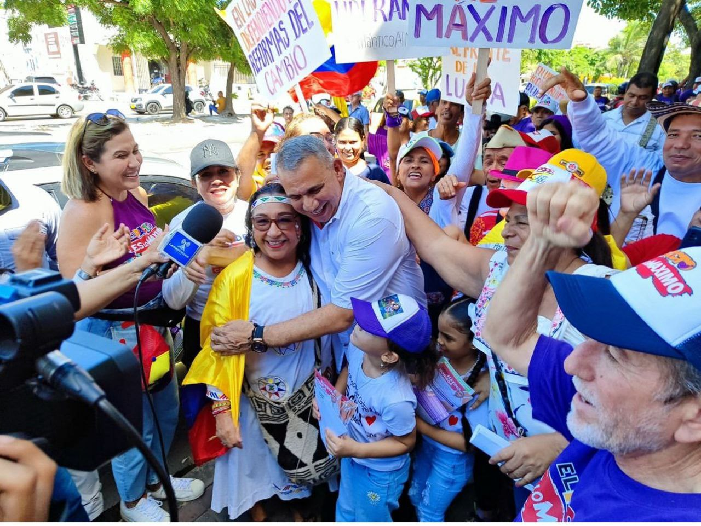
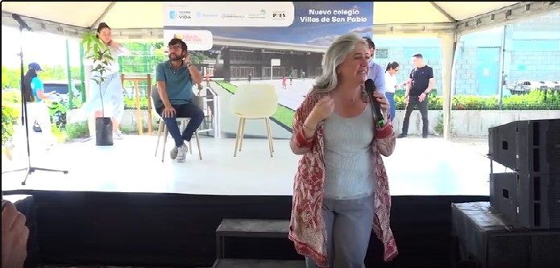
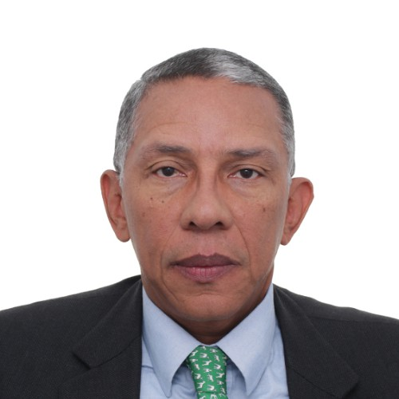

*CNE respaldó a Máximo y exhortó a CH que lo avale. El líder con más de 40 años de luchas populares, sigue recorriendo el Atlántico.*

El Consejo Nacional electoral-CNE respaldó a **Máximo Noriega** a la gobernación del Atlántico. Exhortó a Colombia Humana (CH) cumplir los términos establecidos en la **consulta del 23 abril** que ganó ampliamente el dirigente progresista que tiene un recorrido de 40 años de luchas. Esta decisión es de suma importancia que pondría a pensar a la coordinación nacional del **Pacto Histórico**, ya que es una coalición y no un partido o movimiento político.

**Lo anterior significa que para CH es vinculante el resultado de la consulta.** También es necesario decir que el pasado 4 de julio el PH del departamento del Atlántico avaló en consenso mayoritario la candidatura de Máximo. Lo paradójico, es que el centralismo de la coalición en Bogotá no se atreven a refrendar ese apoyo territorial.

**Te puede interesar:** [Aval bipartidista a Yamilito ¿asegura gobernación? (II)](/articulos/yamilito-arana-se-embolsillo-mitad-de-la-gobernacion-con-aval-bipartidista-ii/)

## ¿Por qué le temen a Máximo?

¿Por qué le temen a Máximo? ¿Pueden reconocer que el CNE respaldó a Máximo? Es cierto que Máximo fue mencionado en el escándalo de **Nicolás Petro con Day Vásquez**, lo cual sería una estrategia para sacarlo del paseo. Pero, los directivos de la CH de Bogotá, al parecer, están presionados por el representante **Agmeth José Escaf Tijerino** y el senador **Pedro Hernando Flórez Porras** para que no le den el aval al líder de Colombia Humana. Escaff apoya a Varela y Flórez a Verano.

Para escribir este artículo, visitamos en Barranquilla a varios líderes de CH. La mayoría de ellos coincidieron que el Clan de **Euclides Torres Romero** apoya a Eduardo Verano, el candidato del charismo en el Atlántico. Ven en Máximo el rival que le podría ganar a ambos candidatos. Es decir, a Verano y a Varela.

Llama la atención el decir de líderes del Pacto Histórico que señalan a Varela como el "plan B" del _califato daescharista_. Escaf, dicen, es la _quinta columna_ de ese califato al interior de Colombia Humana y, por tanto, del Pacto Histórico, A Pedro Flórez lo tienen como el _Caballo de Troya_. ¿Tendrán razón? _Por sus obras los conoceréis_, dice la Biblia. Bogotá creó un dique a la autonomía territorial de Colombia Humana. Esto indicaría que responden a intereses malsanos centralizados, lo cual carcome los principios democráticos de una organización progresista.

## Colombia Humana a cumplir la ley

*Catalina Velasco, Ministra de Vivienda, respaldó al califato Daecharista.*

Llama la atención un hecho curioso que vale la pena tenerlo en cuenta. Uno de los directivos que tiene peso en la Colombia Humana es **Eduardo Noriega**, muy cercano a Escaf y a la esposa del presidente, **Verónica Alcocer**. Además, la esposa de Noriega, **Catalina Velasco Campuzano**, ministra de Vivienda, elogió recientemente el modelo de gobierno y de desarrollo del charismo en Barranquilla. En otras palabras, el charismo se la quiere jugar con **Eduardo Verano** y, en segunda instancia con **Alfredo Varela**, quien militó en Cambio Radical, luego en el Polo y ahora es avalado por el Verde.

Esto dijo, Catalina Velasco:

> “Aquí en Barranquilla todo funciona. Y eso es realmente maravilloso. Cuando estaban los jóvenes bailando _En Barranquilla me quedo_, yo sentía ganas de decir: sí, aquí todo funciona bien siempre”
> 
> Catalina Velasco.

¿"En Barranquilla todo funciona"? Ministra Velasco, como periodista su declaración es una gran mentira y una complicidad del modelo de desarrollo narcoeconómico que impera en La Arenosa. ¿Sabe usted cómo se viene aplicando la política de vivienda social? Es más, su declaración es un respaldo político-electoral a la continuidad de ese modelo. Por esa razón, el esposo de la ministra, **Eduardo Noriega**, debería decir públicamente por qué razón se opone a expedir el aval a Máximo Noriega. ¿Acaso ya cocinaron un acuerdo con el _califato daescharista_?

## Máximo Noriega, candidato disruptivo

*Eduardo Noriega de la Hoz, el dirigente más influyente en la dirección de Colombia Humana. Su esposa, Catalina Velasco, apoya al califato Daescharista. Al parecer, es uno de los opositores al aval a Máximo Noriega*

Dicho de otro modo, Eduardo Noriega debe declararse impedido para tomar una decisión. **Máximo Noriega, por su parte, es un candidato disruptivo** frente a los designios del asfixiante centralismo _cachaco_. Centralismo que contaminó a la dirección nacional de CH y del PH, independientemente de los orígenes regionales de sus directivos. Por ejemplo, Eduardo Noriega es de Santa Marta con muchos años en Bogotá.

En términos de ley, CH debió entregar el aval al ganador. Esto lleva a concluir, que si Máximo no encuentra consenso en el PH, podría lanzar su candidatura con el respaldo de Colombia Humana, el partido del presidente Gustavo Petro y todos los movimientos que lo apoyaron en la asamblea de julio. Así como lo han hecho otras organizaciones políticas con personería jurídica que se encuentran en esa coalición. Tal es el caso de ADA y de Fuerza de la Paz.

De la misma manera, se puede colegir que con esa resolución del CNE, se le podría formar un maremágnum a la dirección nacional de la Colombia Humana en sus equivocadas decisiones para resolver las contradicciones de sus territorios. Por ejemplo, en Bolívar la consulta la ganó Líner Campo Tejedor, quien debería ser el candidato legítimo. Lo mismo que Germán Viana.

**Te puede interesar:** [¿Germán Viana, infiltrado de la derecha en el Pacto Histórico en Bolívar? (I)](/articulos/pacto-historico-viana-infiltrado-de-la-derecha-i/)

## CNE respaldó a Máximo

En otros términos, la resolución No 5370 DE 2023 del 19 de julio de 2023 del CNE, se convierte en un instrumento legal que por vía de tutela, CH **debería expedir antes del 29 de julio el aval a Máximo Noriega** para no ocasionar un perjuicio irremediable. Esa es la fecha que se tiene prevista en el calendario electoral por el CNE. El espíritu de la resolución señala:

> Por medio de la cual se EXHORTA al Partido Político Colombia Humana, al cumplimiento de los resultados de la Consulta realizada el día 23 de abril de 2023, para la escogencia de candidatos en el Departamento de Atlántico, con ocasión de las elecciones de autoridades locales que se realizarán el 29 de octubre de 2023, dentro del expediente bajo radicado No. CNE-E-DG-2023-05083

En tanto que esa exhortación es un respaldo legal e institucional de la candidatura de Máximo, la coalición Pacto Histórico se vería en la imperiosa necesidad de expedir su apoyo, siempre y cuando tenga mayoría entre los 12 partidos coaligados.

## ¿Puede CH lanzar a Máximo?

**VoxPopuli Digital** consultó a unos expertos en derecho electoral. Los tres consultados coincidieron que la consulta popular es vinculante para Colombia Humana. ¿Puede, entonces, CH lanzar a Máximo Noriega como su candidato a la gobernación del Atlántico? La respuesta de los expertos es tajante: Debe expedir el aval sin dilaciones. Este mecanismo de escogencia está establecido en el artículo 107 de la Constitución Nacional. En uno de sus apartes dice:

> Para la toma de sus decisiones o la escogencia de sus candidatos propios o por coalición, podrán celebrar consultas populares o internas o interpartidistas que coincidan o no con las elecciones a Corporaciones Públicas, de acuerdo con lo previsto en sus Estatutos y en la ley.
> 
> Art. 107 Constitución Nacional.

Ese artículo es desarrollado por la ley 130/94. En el aspecto que nos convoca en este escrito es saber si la decisión de la consulta es vinculante para CH. La ley dice que los resultados son de obligatorio cumplimiento por el partido o movimiento que lo realizó. Así lo confirma el parágrafo de la mentada ley dice;

> "Los precandidatos que se acogieron al procedimiento de consulta deben respetar su resultado y queda prohibido a los perdedores que se sometieron a dicho procedimiento, que presenten sus nombres para elecciones que fueron objeto de la consulta interna".

## CNE respaldó a Máximo ¿y CH?

Con esta resolución, Máximo Noriega podría recibir el aval de Colombia Humana esta misma semana. Pero si no lo hace, los representantes de las organizaciones que apoyaron su consulta, podrían presentar una acción de tutela contra Colombia Humana para la defensa de sus derechos fundamentales.

En la próxima entrega, analizaremos la posible tutela de personas diferente a máximo que podrían presentar contra la dirección de Colombia Humana.

## LEA AQUÍ LA RESOLUCIÓN DEL CNE

/wp-content/uploads/2023/07/CNE\_RES.-5370-Rad.-015083-23-1.pdf