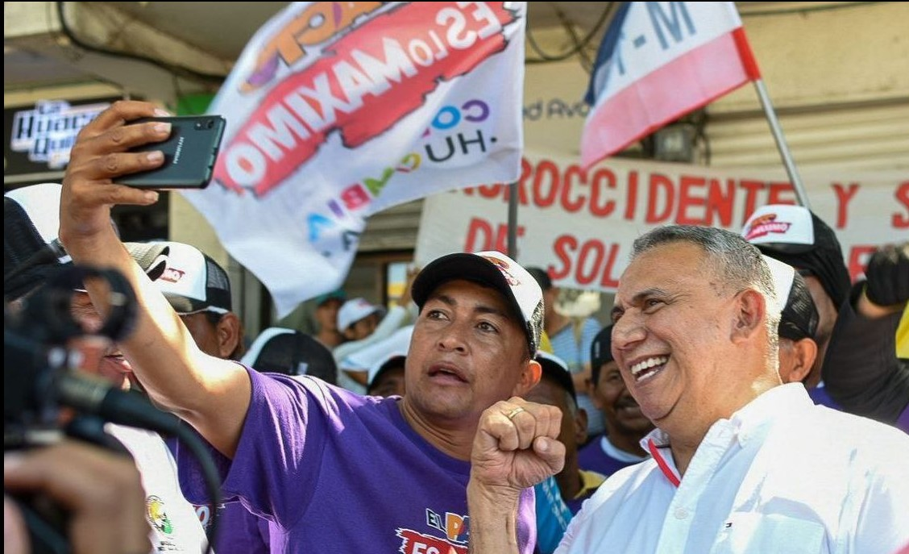

*"Atlántico al Máximo" con aval automático de Colombia Humana, se inscribirá Máximo Noriega. /Cortesía.*

En uso de las facultades ganadas al vencer limpiamente en la consulta popular interna de Colombia Humana (CH), **Máximo Noriega** se inscribirá a la gobernación del Atlántico con **aval automático**. Lo hará en nombre del Frente Amplio "**Atlántico al Máximo**", constituido por la mayoría de agrupaciones que compone el **Pacto Histórico** de ese departamento. **Aparte de tener un derecho adquirido con la consulta popular,** importantes sectores de la coalición que llevó a la presidencia a **Gustavo Petro**, como el Polo Democrático, **no apoyarían a Alfredo Varela**, porque sería un contrasentido a los principios democráticos y populares definidos por la Constitución y la ley.

La inscripción de **Máximo Noriega** es un hecho, según fuentes de entero crédito, Para esto, no necesitaría un permiso adicional distinto a la certificación de la Registraduría Nacional del Estado Civil de ser el ganador absoluto de la consulta popular respectiva, salvo que estuviera sancionado o condenado. Pero, los líderes de la campaña de Máximo indican que su candidato no tiene ningún impedimento judicial ni legal. De los cuatro procesos que tenía vivo, dos terminaron con absolución. Los otros dos fueron archivados.

**Te puede interesar**: [CNE respaldó a Máximo y exhortó a CH que lo avale](/articulos/cne-respaldo-a-maximo-y-exhorto-a-ch-que-lo-avale/)

## Tutela contra CH y Registraduría

Si en última instancia, hoy Colombia Humana no resuelve favorablemente la petición de Máximo Noriega de que le expidan su correspondiente aval, el candidato tiene la opción de asegurarla por la vía extraordinaria de tutela. Para esto debería vincular a la Registraduría Nacional del Estado Civil, porque es el ente que expidió el acto administrativo mediante el cual se le reconoció la victoria a Noriega.

En concomitancia con lo dicho anteriormente, Máximo tiene dos vías para inscribirse. La primera asumiendo directamente su inscripción ante la Registraduría **sin llenar el formulario de solicitud de inscripción**. ¿Por qué? Se entiende que automáticamente, al ganar, queda inscrito para la contienda por la cual compitió en la consulta.

La segunda opción es apelar a la **acción de tutela vinculando a la Registraduría Nacional** que deberá hacer valer su acto administrativo. La expedición de la certificación de ganador de la consulta popular se materializa cuando el ganador hace valer el derecho, ya sea inscribiendo su candidatura o participando voluntariamente en otro proceso de coalición electoral.

**Te puede interesar**: [¿Vapeando basuco y reculando? El alcalde zambiloco y la ciudad al garete (III)](/articulos/vapeando-basuco-y-reculando-el-alcalde-zambiloco-y-la-ciudad-al-garete-iii/)

## Aval automático

De acuerdo con **algunos constitucionalistas y expertos en derecho electoral**, consultados por VoxPopuli Digital, si **Máximo Noriega** se inscribe con un aval automático, sería la primera vez en la historia de la Constitución del 91 y de la ley 1475 de 2011, que un candidato recurre a dicho derecho por _default_ . Es decir, por defecto o negativa del centralismo de reconocer el aspecto vinculante y obligatorio de la consulta popular que respetó los preceptos constitucionales y legales.

Como dijimos en la anterior entrega, el caos antidemocrático que se está armando con los avales en el Atlántico se debe a la negativa de **Eduardo Noriega**, esposo de la ministra de Vivienda y Agua Catalina Velasco, de expedir el aval que automáticamente obtuvo en franca lid Máximo Noriega. Significa que el aval es solo un formalismo, ya que el candidato para su inscripción debe presentar la credencial de ganador de la respectiva consulta sin necesidad del aval.

¿Por qué se puede inscribir con aval automático? La consulta interna de un partido para escoger a sus candidatos que participarán en una contienda electoral por cargos unominales o corporativos, no es optativo decidir si se respeta o no. Es un imperativo acatar los resultados. Es la única interpretación posible del inciso 1 del artículo 7 de la Ley 1475 del 2011:

> “OBLIGATORIEDAD DE LOS RESULTADOS. El resultado de las consultas será obligatorio para el partido, movimiento, grupo significativo de ciudadanos o coalición, que las hubiere convocado, así como para los precandidatos que hubieren participado en ellas".

## Si no es Máximo, no es nadie

Ahora bien. Si la directiva nacional desconoce las decisiones democráticas y autónomas de las regiones, como son las consultas, cualquier decisión contraria del centralismo cachaco sería antidemocrática, ilegal e insconstitucional. Por tanto, sería una decisión nula de toda nulidad. En consecuencia, si no es Máximo, no es nadie.

Lo anterior quiere decir que si Colombia Humana decide prescindir de los resultados de la consulta popular del 4 de abril de 2023, el candidato que escoja o coavale sería declarado nulo. Veamos el espíritu del inciso 2 del artículo 7 de la Ley 1475 del 2011:

> "La inobservancia de este precepto, será causal de nulidad o revocatoria de la inscripción del candidato que se apoye, diferente al elegido en la consulta. ”

No obstante, hay algo más contundente que obligaría a la dirección nacional de Colombia Humana a deshacer cualquier pensamiento antidemocrático y temerario de negarle el aval a Máximo Noriega. La parte final del inciso citado del artículo 7 de la mentada ley, expresa:

> "La inscripción, en todo caso, a solicitud del candidato seleccionado, se hará a nombre de los partidos, movimientos o coaliciones que realizaron la consulta, aunque no suscriban el formulario de solicitud de inscripción."

## Conclusión

En consecuencia, si no es Máximo, la actuación de la Colombia Humana y, por tanto, del Pacto Histórico, sería nula de toda nulidad. Ello llevaría, por ende, a una acción de tutela contra Colombia Humana, vinculando a la Registraduría Nacional, como lo explicaron los expertos en derecho electoral **Alcides Arrieta y Nixón Torres**.

## Máximo: ¡Absuelto!

Así lo certifica el mismo poder judicial.

/wp-content/uploads/2023/07/ActaJuiciooral14DIC22.pdf