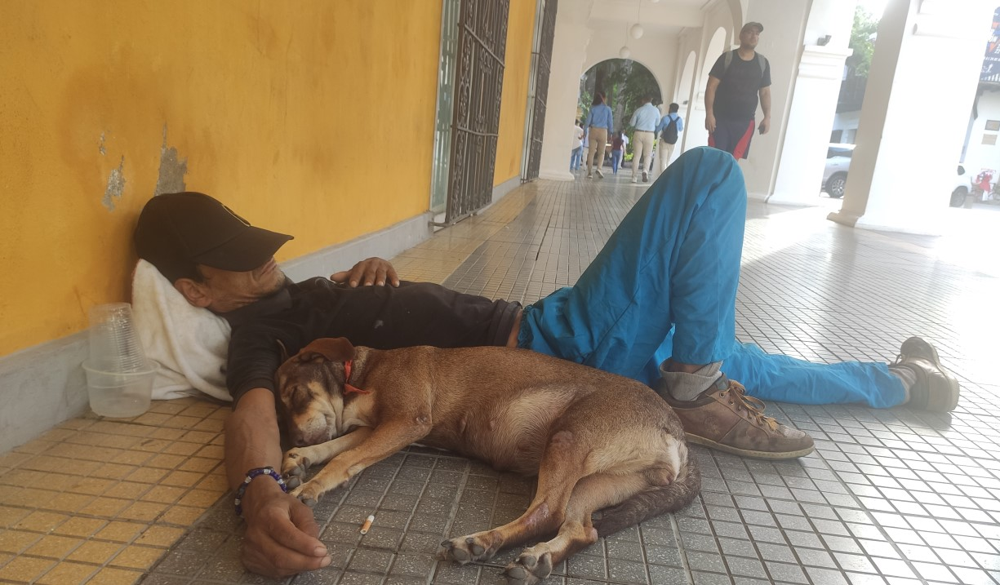
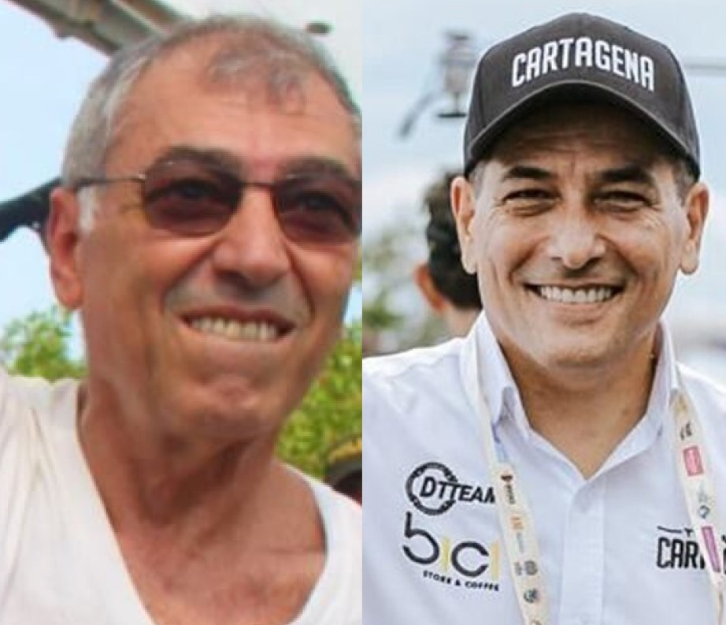
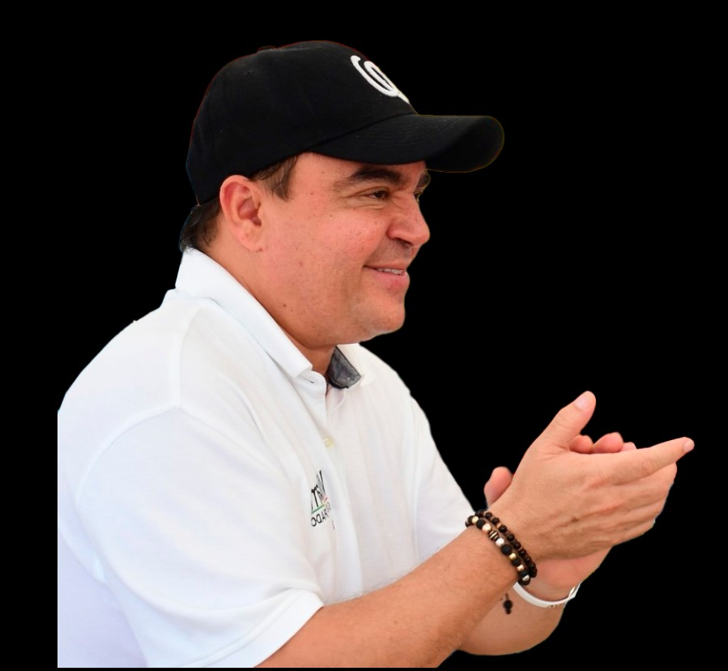
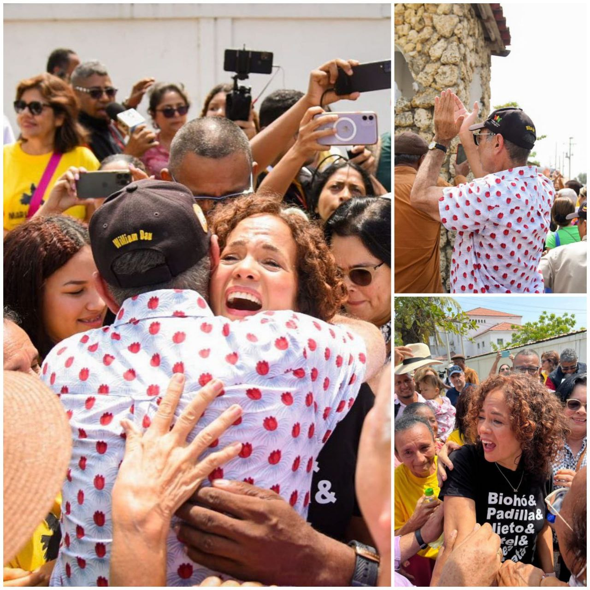
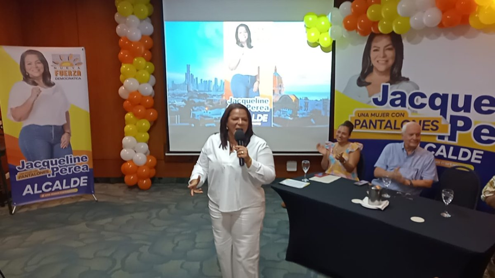
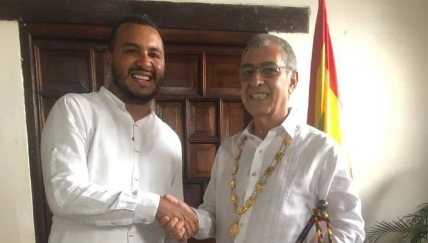

*Así está Cartagena de Indias, como esta persona en condición de calle en la Plaza de la Proclamación de la Independencia. Esperando que uno de los 15 pretendientes la redima. /VoxPopuli Digital.*

¿Quién se quedará con Cartagena? Somos una ciudad líquida que no disfrutamos las hermosas cosas que tenemos. Son 15 pretendientes en la cola para pedirle la mano. Los pocos conocidos y llamados _alternativos_ tienen menos chance. ¿La razón? Hace 4 años _le paró bola_ (puso atención) a un **extraño salvador** que terminó de _contramatarla_ con su seducción de **psicópata social**. De salvador, con el pasar de su período, se transformó en el _ángel de la muerte_. ¡La está matando! Pues, terminó en el fondo de una crisis política profunda que no tiene precedente.

La postura antiética, amoral, indignante y decadente de quien la administró en estos últimos 3,5 años, podría hacer de Cartagena una ciudad más escéptica con las propuestas de anticorrupción o de erradicación de la pobreza. La ineficaz administración de **Judith Pinedo** Flórez (Mariamulata) ―mucho discurso y poca acción― hizo posible que en 2012 apareciera voces populistas como las estrellas fugaces de **Campo Elías Terán Dix**, **_Manolo_ Duque y Antonio Quinto Guerra.** Ninguno de ellos alcanzó a concluir sus períodos. Las encargaturas de **Yolanda Wong y Pedrito Pereira** no pudieron terminar sus tareas.

El psicólogo **Zygmunt Bauman**, _autor del amor líquido_ nos revela la superficialidad emocional con que afrontamos las relaciones sociales. Esta traspolación del amor, lo hacemos porque realmente somos habitantes que establecemos una relación amorfa y superficial con su ciudad. Y esto lo expresamos cada cuatro años en las elecciones populares.

## Peor el remedio

**Hoy, La Heroica está peor que en 2019.** Ningún indicador de gestión administrativa y social le favorece al mandatario actual. Él dice que logró el **saneamiento financiero** para que el próximo alcalde, que debe ser de su cuerda política (Mariamulata), se despache. ¡Mitómano! Cartagena tiene la misma calificación ([Fitch Ratings](/articulos/research/es/international-public-finance/fitch-affirms-cartagena-de-indias-ratings-outlook-stable-12-05-2022)) **AA de 2019**. Desafortunadamente, la ciudad no abrió los ojos frente a las advertencias que **VoxPopuli Digital** hizo en aquél momento. (**Lea lo que se dijo cuando ganó Dau: [Un buitre de corto vuelo](/articulos/dau-un-buitre-de-corto-vuelo-alcalde-de-cartagena/)**).

Como periodistas escudriñamos la verdad. Exploramos las razones. Descubrimos las tendencias. Pero no podemos hacer más allá de esta tarea para abrirle el entendimiento a la gente. Eso es lo más doloroso. Porque para nosotros no es fácil. Nos sometemos a la reacción de aquellos que se sienten descubiertos. Son 3,5 años de estar sufriendo la persecución y las amenazas de esta administración. Pero son gajes del oficio.

Desde el punto de vista administrativo y social, lo que se vendió como la salvación fue el gran engaño del siglo. Aunque está en duda de que la ciudad haya elegido a El Zambiloco, **fue peor el remedio que la enfermedad**. Lo único que se puede rescatar de esta administración es que le dejó gran parte del dinero al próximo alcalde o alcaldesa. Dinero que no se pudo gastar por su ineficacia e incapacidad para gobernar.

## Cartagena, caterva de vencejos

> Fuiste heroica en los años coloniales,  
> cuando tus hijos, águilas caudales,  
> no eran una caterva de vencejos
> 
> Luis Carlos López.

Cartagena de Indias es una ciudad con una gran historia nacional y de vocación natural hacia la cuenca del Caribe. De _águilas caudales_ pasamos a ser una _caterva de vencejos_. ¡Esa es la verdad! Las élites gobernantes no aprendieron de sus padres, abuelos y tatarabuelos cuando vendían el _aceite en botijuela_. No aprendieron la grandeza y el honor construido por las generaciones anteriores. **¡Cartagena debe retomar el camino de la grandeza!**

En la época de la colonia, **Cartagena de Indias con Veracruz** (México), eran los puertos más importantes del mundo insular antillano. Durante el imperio de La Corona Española el gobierno de Cartagena (Real Orden de 1803) se prolongaba hasta las costas de Mosquitos (Nicaragua). Luego de la independencia, los dos puertos importantes del Caribe decayeron hasta quedar en el ostracismo.

Hoy, Cartagena está postrada. Las élites sociales y económicas son pájaros enjaulados en su propia limitación mental. No tienen capacidad para gobernar la ciudad. Esas élites usaron a El Zambiloco contra los políticos corruptos de provincia. Pero el demente hizo como hacen las moscas: **vomitan ácido sobre el alimento que se van a comer**. Así estamos en Cartagena. _Una ciudad líquida_, llena de agua de mierda más allá de las murallas. Ciudad líquida que se nos va entre los dedos. Seguimos con el grillete. Ya no de hierro de la época colonial, sino de ese grillete mental, invisible, que es aún más doloroso. Doloroso, porque no lo reconocemos y nos creemos libres para elegir. **Pero, seguimos siendo esclavos**.

## Los 15 pretendientes y los sin aval

*Los 15 pretendientes. Alcides Arrieta fue engañado por el Partido Poder Progresista de Hernan Lozano que no tenía personería jurídica para expedir aval. Un gran candidato que se perdió.*

El profesor, abogado jurisconsulto y de claridad meridiana en administración pública, **Alcides Arrieta**, fue uno de los frustrados pretendientes que perdió en esta oportunidad la ciudad. La dirección del Partido Poder Progresista que lo iba a avalar lo engañó, como lo hizo con más de 200 personas en todo el país. No tenía personería jurídica y se fueron por todo el país ofreciendo avales. Ahora le espera a Lozano 200 demandas y denuncias por fraude y otros delitos.

Otros, como **Jorge Quintana**, no consiguieron aval. Pero pudieron animar el debate con sus ocurrencias y críticas. Por orden de aparición en la Registraduría, estos son los 15 pretendientes.

## Dumek Turbay

*Dumek Turbay, uno de los 15 pretendientes, hizo arrodillar a El Zambiloco para que chupara el polvo de la derrota en los estrados judiciales.*

Gobernador de Bolívar (2015―2019) con buenos resultados de gestión administrativa.  Concejal de El Carmen de Bolívar. Realizó sus estudios universitarios de Derecho en la [Universidad de Cartagena](https://luciotorres.local/wiki/Universidad_de_Cartagena). En Cartagena se desarrolló tanto en el sector público como en el privado. Estuvo en la Red de Solidaridad Social. Director de Distriseguridad de la alcaldía de Cartagena hasta la dirección del Instituto de Deportes de Bolívar. **Es un funcionario de resultados**. Continuó la propuesta de gestión de su predecesor, Juan Carlos Gossaín. Tiene múltiples avales que acompañan a su movimiento ‘Fuerza de las Ideas’. Se destaca, por ejemplo, La Fuerza de la Paz (Roy Barreras), En Marcha (juan Fernando Cristo), Cambio Radical y Nuevo Liberalismo.

## William García Tirado

*William García Tirado , nacido en el barrio La María, es uno de los 15 pretendientes de ser el alcalde de Cartagena con sus Tres Golpes y su segundo intento.*

Nacido en el barrio La María de Cartagena. Economista. Doctorado en administración pública. Representante a la cámara (2010-2014), su máximo cargo como servidor público. Una carrera política de más de 23 años. Edil de la Comuna #10 de la localidad 1. Concejal de Cartagena en los periodos (2001―2003), (2004―2007) y (2008―2011) con una de las mayores votaciones. Gerente de Corvivienda (2016-2018) obteniendo excelentes resultados. En forma inexplicable, en 2019 con más de 104 mil votos, perdió las elecciones frente al alcalde actual. Se inscribió por firmas: **Grupo Los Tres Golpes**. Su movimiento tiene organización y reconocimiento en toda la ciudad. Es un político que luego de la derrota de 2019, se dedicó a emprender con mucha resiliencia.

## Judith del Carmen Pinedo Flórez―_Mariamulata_

*Mariamulata, exalcaldesa, una de las dos mujeres que hacen parte de los 15 pretendientes.*

Nacida Cartagena de Indias. Abogada de Universidad de Cartagena. Especialista en Derechos Humanos y en Derecho Público, y Estudios Políticos.  Alcaldesa (2008-2012). Su victoria frente a **Juan Carlos Gossaín** fue una sorpresa. La primera y única alcaldesa popular de la ciudad. Su gestión fue regular en resultados. Se puede destacar el trabajo realizado en educación y cultura ciudadana, pero deficitario en salud y saneamiento ambiental. Debido a que su gobierno respondía a las élites dominantes, debió soportar el peso de sus errores. Le vendió al Hotel Dann un fragmento de playa como si fuera **lote baldío**, pero la Corte Suprema de Justicia la absolvió. William García Tirado, concejal en ese momento, le hizo el debate para impedir que vendiera el lote. _La Mariamulata_ no le hizo caso, y lo vendió junto con su secretaria de Hacienda, **Viviana Eljaiek**. Cuando salió libre, el alcalde de Cartagena, El Zambiloco, la abrazó con sus _alas de buitre_.

## Jacqueline Perea

*Esta es Jacqueline Perea Blanco, la mujer de pantalones, una de las 15 pretendientes. La única opositora de El Zambiloco desde que este comenzó a pelar el cobre.*

Nacida en Cartagena de Indias. Casada con Pepe del Toro, exmilitante de la Ad-M19, exalcalde de localidad No 3, Madre de 3 hijos. Abogada de la CUC, especialista en Gerencia Social de la ESAP. **_Mujer Bolívar_** 2016 por el trabajo comunitario en el Distrito de Cartagena. Es la única de las candidatas que en estos 3,5 años de administración de El Zambiloco le hizo una férrea oposición. Denunció decenas de casos de corrupción administrativa. Acompañó el frustrado proceso de revocatoria de la audiencia del 2 de febrero de 2021. Fue inscrita por **Nueva Fuerza Democrática**, el partido liderado por el expresidente Andrés Pastrana. La opositora No 1 de El Zambiloco.

## Javier Julio Bejarano

*Javier Julio Bejarano, una de sus pocas experiencias políticas, es haber acompañado a El Zambiloco. Es uno de los 15 pretendientes. Aquí cuando andaba de "pipícogido" con el burgomaestre.*

Nacido en 1987, Cartagena. Abogado de la Universidad de Cartagena. Ingeniero del Tecnológico de Comfenalco. En forma sorpresiva fue elegido concejal con el apoyo de El Zambiloco. Es más, fue el único concejal que había acompañado al alcalde y se creía que iba a liderar una bancada a favor del burgomaestre. Por cualquier circunstancia, en noviembre de 2020 peleó con él. En aquella ocasión VoxPopuli Digital anunció que se se comenzaba extinguir el embrujo del Buitre. Los $1.8 billones del presupuesto fueron destinados para los Araújo y los Char. El Zambiloco lo trató de **_abuelita chismosa_,** por lo que debió retractarse ante tutela de Julio Bejarano. (**Píldora para la memoria**. Lea el análisis de aquél momento: [¿Se acabó el embrujo del alcalde malandro? (I)](/articulos/se-acabo-el-embrujo-del-alcalde-malandro-i/)

En la próxima entrega, por orden de aparición, los siguientes pretendientes de suceder a El Zambiloco. Espere la otra serie de los que pretenden suceder al gobernador **Vicente Blel Scaff.**

_Información útil para hacer una buena selección de quién va a gobernar tu ciudad o departamento._