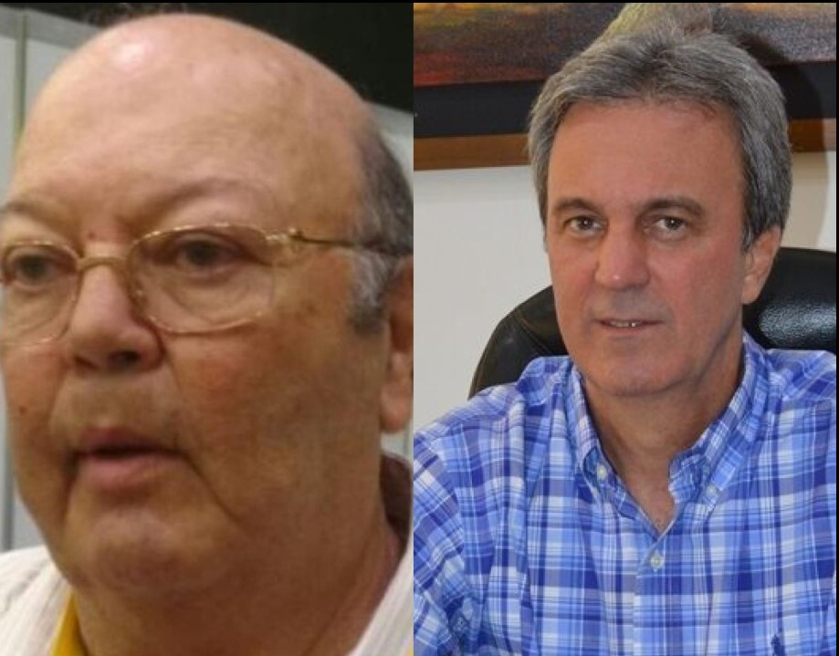
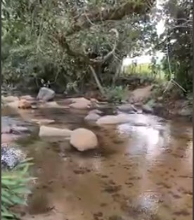
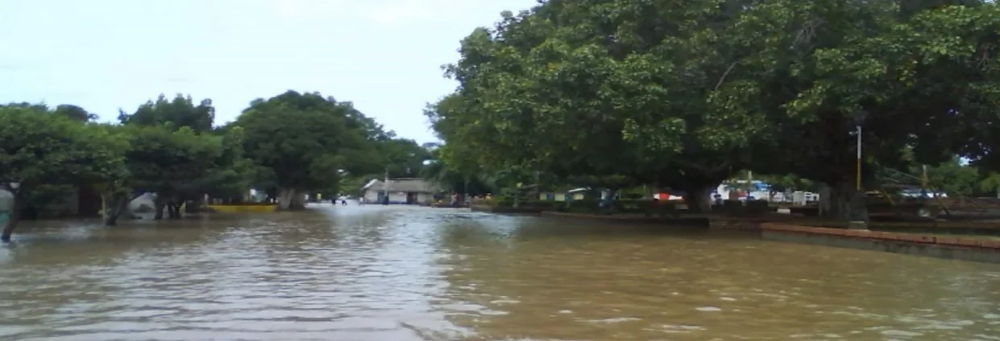
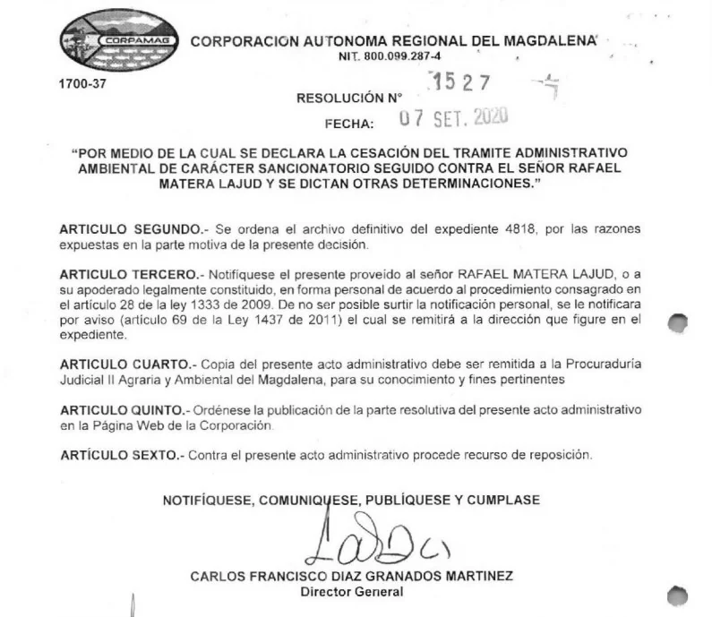
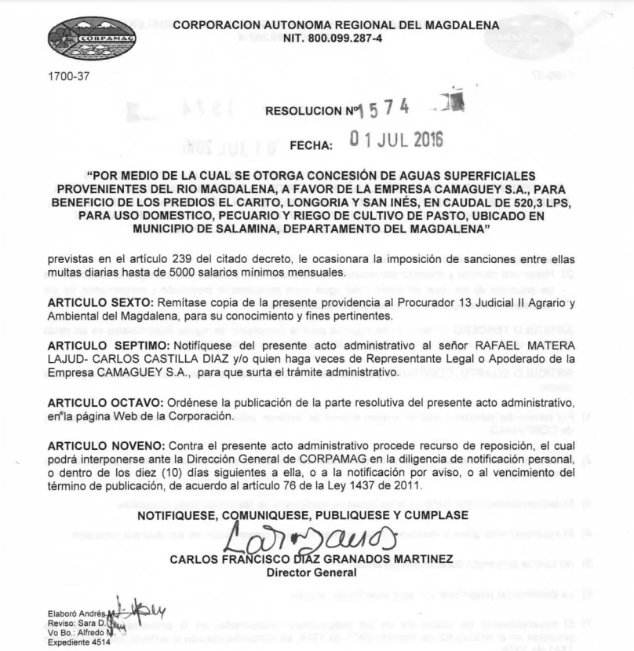
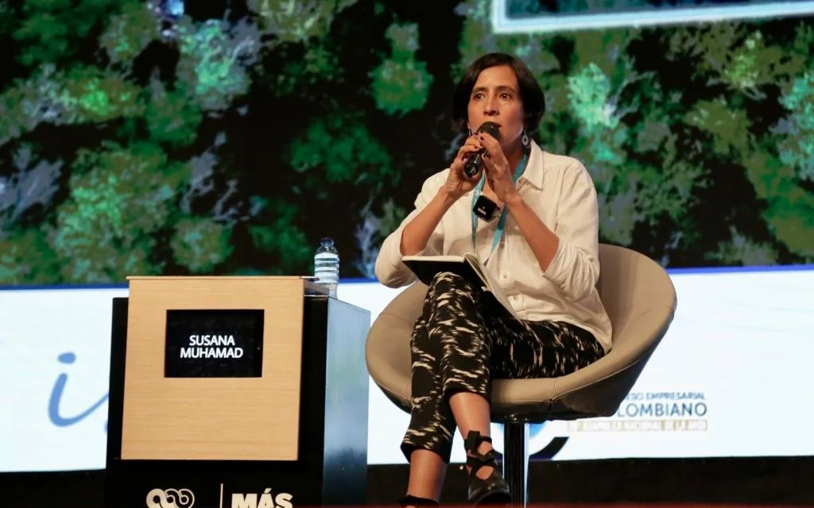

*Rafael Matera Lajud (a la izquierda), dueño del matadero Camagüey, y representante de Los Intocables, al parecer se robaron el Río Ariguaní con la complicidad del director de la Corporación Autónoma Regional del Magdalena―Corpomag, Carlos Díaz-Granados.*

Los valles y llanuras alrededor del río Ariguaní, además de ser un esplendor de belleza, eran una fuente de alimento que el agua producía. Pero el monocultivo y la violencia cambiaron este hermoso panorama. **_Los Intocables_**, los empresarios que financiaron y determinaron los crímenes de los paramilitares, se robaron el río Ariguaní y, no contentos con esto, la **Corporación Autónoma Regional del Magdalena―Corpomag**, les entregó tres concesiones de agua. Una de ellas, del río Magdalena. Esta afirmación es tan verdadera como la _corriente de agua clara que baja de la Sierra Nevada_, por lo cual los aborígenes la bautizaron en su lengua con el nombre **de Ariguaní**.

En efecto, **Rafael Antonio Matera Lajud,** uno de _Los Intocables_, **socio mayoritario del matadero Camag**ü**ey S.A**., **alias C_omandante 300_**, a quien no solo se le acusa de ser determinador de masacres, junto con otros socios y familiares, sino de que también se _robaron_ el Río Ariguaní, con la complicidad de la autoridad ambiental. Así como sus presuntos crímenes contra seres humanos se mantienen en la impunidad, sus crímenes contra el medio ambiente estarían siendo aupados por las mismas autoridades.

El ministerio del Medio Ambiente no responde a las quejas de los usuarios del río Ariguaní, y mucho menos la Fiscalía General de Nación. Así han permitido que estos delincuentes de _cuello blanco_ sigan cometiendo los crímenes que la Sala de Justicia y Paz de los tribunales de Santa Marta y Barranquilla pusieron recientemente en evidencia, a través de la compulsa de copias, para que sean procesados.

## Las travesuras del director de Corpomag

Son muchas las travesuras del director de Corpomag. Pero en esta oportunidad nos detendremos en uno de sus posibles crímenes ecológicos y sociales como sería **el robo del río Ariguaní**, solo comparable con el robo del río Ranchería de La Guajira. A este último lo privatizaron arbitrariamente la empresa **El Cerrejón**, y otros grandes empresarios agrícolas. Como consecuencia, se produjo una estela de pobreza y muertes por la falta de agua. La desnutrición y el hambre dispararon la tasa de **morbimortalidad de la población infantil wayuú**. Estas son algunas de las consecuencias de este crimen ecológico.

Y no se trata de acusaciones abstractas de las comunidades. Un ejemplo concreto de esta realidad es la actuación, al parecer prevaricadora, del director de la Corporación Autónoma Regional del Magdalena―**Corpomag**, **Carlos Francisco Díaz-Granados**, conocido en el Magdalena como _M**aletín Travieso**_, quien no solo absolvió sino que entregó varias concesiones de explotación de agua. Una de ellas en Salamina, sobre el río Magdalena.

Se tiene conocimiento que, luego del triunfo del paramilitarismo ―como proyecto político―, grandes empresarios del país, especialmente los emergentes, iniciaron un proceso de expansión y consolidación de sus empresas. Y todos aquellos que los denunciaron, han sido víctimas de su persecución política y de amenazas de muerte. Esto le sucedió, por ejemplo, a un prestigioso catedrático y abogado de Barranquilla, quien hace tres años presentó una denuncia contra Rafael Matera Lajud, mientras la Fiscalía se muere de la risa. Por eso son intocables.

## Era un paraíso

*A la altura de Pueblo Bello, Cesar, las aguas cristalinas del Ariguaní.*

Los habitantes más antiguos de las riberas del río Ariguaní manifestaron que, tanto la parte alta como la baja, constituían un ecosistema parecido al mítico paraíso del Edén. Así lo manifestó uno de los habitantes a _RCN_, emisora radial que retomó _Voxpopuli Digital_:

> **«**Cuando yo conocí el río Ariguaní, hace más de 40 años, por aquí no estaban las palmeras. Esto era un paraíso, era caudaloso y la gente trabajaba contenta. Había abundancia de pescado como bocachico, bagre, comilón y blanquillo. Pero ahora todo eso se acabó. Las canoas están casi tocando el camino de arena que queda**»**.

Además, el territorio era irrigado con esas aguas cristalinas bien mineralizadas que enriquecían las tierras para el cultivo de frutales y productos de pancoger que abastecían los mercados locales. Aquí el hambre era desconocida. Hoy, sin embargo, es un panorama diferente. El pueblo apenas sobrevive, herido por la violencia paramilitar y guerrillera. Pero, además, está herido por la impunidad y el olvido de las mismas autoridades, que actúan contra la Constitución y el espíritu de la Ley.

Te puede interesar: [Mancuso, los crímenes de «Los intocables» y la JEP (III](/articulos/mancuso-los-crimenes-de-los-intocables-y-la-jep-iii/)

## ¿Por qué se robaron el río **Ariguaní**?

*Así se robaron el río Ariguaní: cuando comenzaron a realizar obras civiles no autorizadas legalmente, bajo la vista gorda del director de Corpomag. Foto El Heraldo.*

Las comunidades, y entre ellas los líderes sociales, ganaderos, finqueros, campesinos y pescadores de **Bosconia, Ariguaní, El Copey, Algarrobo y San Ángel, vienen denunciando desde 2007 que en la región norte se han robado el río Ariguaní sin que las autoridades hayan detenido esa situación irregular.** Las consecuencias de ese robo se expresan en la pobreza de la población por la afectación de su economía campesina, ganadera y pesquera. Además de producir daños irreparables al medio ambiente, este hecho está afectando profundamente al núcleo económico, la forma de vida y el desarrollo cultural de la región.

¿Será que estos supuestos **«empresarios»** son tan poderosos que pueden robarse impunemente hasta un río? En Colombia, a raíz del fenómeno paramilitar, que surgió como **una estrategia contrainsurgente**, hubo empresarios, ganaderos y terratenientes que financiaron esa actividad ilegal. De igual manera, otros se convirtieron en lavadores de activos y determinadores de grandes crímenes. **Realizaron una contrarreforma agraria**. Se apoderaron de la justicia y de organismos como el INCORA y las Corporaciones Autónomas Regionales. Desde luego, para sus proyectos agroindustriales el uso del agua es esencial. Y hoy ellos siguen reinando. Esto explica el hecho de la impunidad de _Los Intocables_, así como la inaplicabilidad de las sentencias sobre la propiedad de tierras, ya que la restitución de tierras se quedó solo en el papel, como los procesos judiciales en donde se encuentran inmersos.

El exjefe paramilitar, **[Salvatore Mancuso](/articulos/el-poder-de-los-intocables-y-el-crimen-del-magistrado-v/)**, en diferentes instancias judiciales, entre ellas la Sala de Justicia y Paz, y ahora ante la JEP, presentó pruebas de los grandes empresarios que participaron en el proceso de expoliación económica y despojo de la población campesina del país. En la Costa Caribe, Mancuso señaló a los alias **_**300**_ **y** al** **_**Comandante** M1_,** como se hacía llamar Alfonso **Macías Vargas, uno de los grandes socios del crimen de Rafael Antonio Matera Lajud.** Mancuso los señaló como partícipes en el accionar criminal de las Autodefensas Unidas de Colombia―AUC.

## ¿Cómo se robaron el río Ariguaní?

*Río Ariguaní.*

La primera denuncia que se tiene bien documentada fue presentada formalmente a Corpomag y a Corpocesar en 2007, por **Joaquín Tomás Ovalle**, uno de los finqueros directamente afectados por la desviación del río, quien denunció que personas privadas venían realizando obras civiles para desviar el Ariguaní en un sitio localizado a 30 metros de la bocatoma _El Indio_, También se denunciaron otras construcciones ilegales como en el predio La Pola, jurisdicción del departamento del Magdalena.

Ante esa situación, se integró una comisión que hizo una visita al lugar. De acuerdo con el informe técnico del **12 de marzo de 2007, firmado por Félix Vides Pérez y Rafael Contreras**, se comprobaron las denuncias de que efectivamente se estaban ejecutando obras civiles no autorizadas que desviaban el curso del río. Y como si esto fuera poco, 8 años más tarde, se volvió a hacer otra inspección y se llegó a la conclusión de que la corriente del Ariguaní había sido desviada hacia algunas fincas situadas en la zona norte de su recorrido. Entre ellas, la finca El Coraje, de matadero Camag**ü**ey S.A. de Rafael Antonio Matera Lajud. Es decir, en jurisdicción del departamento del Magdalena.

La anterior prueba está consignada en un informe del 22 de julio de 2015, donde **Ana Cecilia Vega González**, profesional universitaria **de Corpomag, le informó a su colega Shindy Fernández Ramírez** sobre los trabajos que estaba realizando Rafael Matera Lajud para su finca El Coraje.

La obra civil que hicieron, por su _propio cojón_, los finqueros del norte, al mando de Matera Lajud, consiste en un dique de casi un kilómetro en sacos de arena que forman un terraplén debidamente compactado. lo cual permitió que la mayor parte de la corriente del río se desviara hacia las zonas bajas para irrigar las grandes fincas que tienen _Los_ _Intocables_. El volumen de agua del río disminuyó significativamente en la zona del Cesar.

## Archivaron las investigaciones

*Parte resolutiva donde se declara la cesación del proceso en una de las tres investigaciones contra Rafael Matera Lajud, a pesar del robo del Río Ariguaní.*

Estas irregularidades están sustentadas por las quejas formales de las comunidades y de personas que, en particular, se han visto afectadas por esos abusos sobre el río. Esas dos corporaciones regionales, evidentemente, parecen estar al servicio del despojo de los recursos naturales que le pertenecen a la Humanidad y, por ende, los procesos los resolvieron a favor de los victimarios.

La última decisión donde absuelven a Matera Lajud fue la resolución N° 1527 del 7 de septiembre de 2020, firmada por el actual director de Corpomag, quien podría estar incurriendo en una flagrante y evidente conducta prevaricadora. Pero no le sucede nada, porque la Procuraduría Agraria y la Fiscalía poca importancia les dan a estos procesos.

El primer proceso está etiquetado con el **N° 1919 de 2007**. La supuesta investigación la iniciaron con el auto N° 1106 de agosto 22 de 2007. Así se inició una investigación sancionatoria que fue una parodia de justicia ambiental. A Corpomag se le olvidó sospechosamente incluir al primer denunciado: Rafael Matera Lajud, alias _Comandante 300_, propietario de la finca **El Coraje. Fue una investigación inconclusa. A pesar de ello, la archivaron sin el menor recato, pues no tomaron decisión alguna.**

Posteriormente abrieron el segundo proceso que etiquetaron con el N° 3623 del 9 de marzo de 2010. Se inició la investigación sancionatoria con el auto N° 308. Esta vez sí incluyeron al principal autor de este descarado robo del río Ariguaní. Esto es, Luis Romero López, propietario del **Predio La Panchita, y en contra de la Sociedad Camaguey, propietaria del predio El Coraje, representado legalmente por el señor Rafael Matera Lajud,** por la presunta infracción a las normas de protección ambiental y de los recursos naturales renovables de conformidad con los hechos allí expuestos.

En tercer lugar, el proceso N° 4818 de 2017, en el auto N° 004 del 4 de enero de 2017, con el que se da inicio a una nueva investigación, donde se incluyeron nuevos hechos que evidencian la desviación irregular del río Ariguaní.

## **«Maletín Travieso»** y el cese de la investigación

Para tener una mayor claridad de lo que está sucediendo, los expertos oficiales dicen que el 62% del río Ariguaní se encuentra en el departamento del Magdalena. El resto, en la parte sur de su recorrido, baña al Cesar, hasta desembocar en el río Magdalena, entre Fundación y Bosconia. Por lo tanto, le tocaría a Corpomag asumir una decisión para la defensa del patrimonio ambiental, que es la defensa de la vida. Pero Corpomag no está cumpliendo con su papel misional desde que el paramilitarismo y sus testaferros se apoderaron de esas entidades.

Vale decir que **Carlos Francisco Díaz-Granados Martínez**, nacido en Santa Marta, fue elegido **Director General de Corpomag,  para el período 2016-2019**. Luego, fue reelegido para el período actual que vence en diciembre de 2023. Es primo del senador Luis Eduardo Díaz-Granados Torres. Este Director ha firmado concesiones de aguas subterráneas a empresas que son de su familia. Aunque en 2019, Díaz-Granados Martínez se declaró impedido frente a otra solicitud de la misma empresa para uso de aguas superficiales. Pero en la primera no lo hizo, y no le pasó nada.

En Santa Marta, a **Carlos Francisco Díaz-Granados Martínez** lo conocen como **_Maletín Travieso_**. Esto porque tiene un juego de carrusel con un _roscograma_ de empresas a las cuales les adjudica los megacontratos. Por ejemplo, fue duramente cuestionado por haberle entregado al **Consorcio Aguas SM** el contrato de licitación pública **N° 004 del 2022**, por valor de **$53 mil 688 millones 396 mil 444** pesos. Este consorcio está constituido por **Ingecon SA** con un 50%; **CM Ingeniería y Construcción SAS**, con un 49% y **Carlos Alfonso Cotes Morales** con un 1%. En este sentido, a **CM Ingeniería y Construcción SAS** se le conoce porque siempre se le ha adjudicado el contrato para dragado de los caños de agua en la Ciénaga Grande de Santa Marta, sin que presenten resultados positivos para el ecosistema de esa ciénaga, víctima de la alta salinidad.

## Las concesiones a Camag**ü**ey

*Se robario el río Ariguani*

Una de las últimas concesiones a **Rafael Matera Lajud** data de 2016, precisamente cuando ya los jefes del paramilitarismo, incluyendo al propio Mancuso, habían confesado sus crímenes contra la humanidad y delatado a sus financiadores, como Rafael Matera Lajud. Esta concesión fue adoptada con la resolución No [1574 de 2016-07-01](/articulos/archivos/resoluciones/1574-2016.pdf):

> **Por medio de la cual se otorga Concesión de Aguas Superficiales provenientes del Río Magdalena, a favor de la empresa CAMAGUEY S.A., para beneficio de los predios El Carito, Longoria y Santa Inés, en caudal de 520.3 lps, para uso doméstico, pecuario y riego de cultivo de pasto, ubicado en el municipio de Salamina, Departamento del Magdalena.**
> 
> No [1574 de 2016-07-01](/articulos/archivos/resoluciones/1574-2016.pdf)

En ese mismo año se otorgó otra concesión de aguas. A través de la Resolución No [3166 de 2016-12-15](/articulos/archivos/resoluciones/3166-2016.pdf) se le otorgó el uso y el abuso de aguas subterráneas para su finca El Coraje:

> Por medio de la cual se otorga Concesión de Aguas Subterráneas a la sociedad CAMAGUEY S.A., representada legalmente por el señor Rafael Matera Lajud, a partir de dos (2) pozos profundos, en un caudal de 198 lps, para el riego de cultivos de palma, ubicados en el predio El Coraje, corregimiento de Casa de Tabla, municipio de Sabanas de San Ángel.
> 
> No [3166 de 2016-12-15](/articulos/archivos/resoluciones/3166-2016.pdf)

De la misma manera, en el 2020 se le otorgó otra concepción mediante la Resolución No [0602 de 2020-03-02](/articulos/archivos/resoluciones/Resol_0602-2020.pdf),

> Por medio de la cual se otorga permiso de Prospección y Exploración de Aguas Subterráneas, a favor de la empresa Camag**ü**ey S.A., identificada con el NIT. 890.100.026-1, en el predio denominado el predio "El Coraje - Lote 4", localizado en la vereda Casa de Tabla, municipio de Sabanas de San Ángel.

## ¿Qué dice Susana Muhamad?

*Susana Muhuamad, ministra de Medio Ambiente, debe actuar frente al robo del río Ariguaní.*

Ante este atentado contra el patrimonio de la humanidad, decretado por varias Corporaciones Autónomas Regionales, el ministerio de Medio Ambiente debe ponerle contención a estas entidades, especialmente a sus directores que están cometiendo un crimen contra la humanidad. Si el presidente Gustavo Petro manifiesta que se debe ordenar el territorio en torno al agua, **¿por qué el ministerio de Medio Ambiente no ha adoptado las acciones pertinentes?** Lo que estamos viendo es un doble crimen contra la naturaleza. Es un proceso de privatización de nuestros recursos, especialmente del agua, fuente de vida de nuestras tierras y del ser humano. Una privatización entregada a los criminales que se apoderaron del territorio con fuego y sangre de personas despojadas de sus propiedades.

La competencia atribuida al Ministerio del Ambiente y Desarrollo Sostenible (Minambiente) para vigilar a las Corporaciones Autónomas Regionales (CAR) no desconoce la autonomía de estas entidades. Es **la razón por la cual la Corte Constitucional declaró exequible el numeral 10 del artículo 2º del Decreto Ley 3570 del 2011**. Este fijó dicha función en el ministerio. El artículo 150 de la Constitución Política de Colombia señala que la autonomía otorgada a las CAR no es absoluta. Las CAR no son **una rueda suelta dentro de la administración pública, y forman parte del Sistema Nacional Ambiental, cuyo coordinador es el Minambiente**.

Por esa razón se amerita que el Ministerio del Medio Ambiente haga un análisis de cada una de las CAR para adoptar decisiones que cambien el curso de la depredación de nuestros recursos con espurias concesiones, que son licencias para matar el medio ambiente en aras de fortalecer economías para la muerte.

## ¿Qué dice el fiscal Barbosa?

Algunos expertos juristas señalan que lo que está sucediendo con _Los Intocables_ es una deshonra para la Fiscalía General y para la justicia. Su actuación criminal no solo explica la impunidad, sino que les da garantías a los criminales para continuar delinquiendo.

> Es un mal mensaje para todos los habitantes en Colombia. Demuestra que la justicia en nuestro país no funciona ni llega a los delincuentes de cuello blanco, disfrazados de empresarios. Y como si fuera poco, han tenido investigaciones criminales por homicidio agravado, masacres, desplazamientos forzados, violaciones de derechos humanos de todo tipo, y ahora se robaron el río Ariguaní.

Por lo tanto, resulta imperiosa una respuesta eficaz del fiscal Francisco Barbosa, antes de que entregue su cargo. Se necesita que concrete las órdenes de captura contra los que aparecen procesados por los diferentes delitos que aquí se han señalado. La lista de los empresarios intocables es larga.

El Cerrejón y los empresarios inescrupulosos de La Guajira se robaron el río Ranchería, trayendo más pobres, hambre y muertes. Ahora, _Los Intocables_ se robaron el río Ariguaní en el Cesar y Magdalena, y no ha pasado nada...

/wp-content/uploads/2023/07/Cormagdalena\_Resol\_1527-2020.pdf