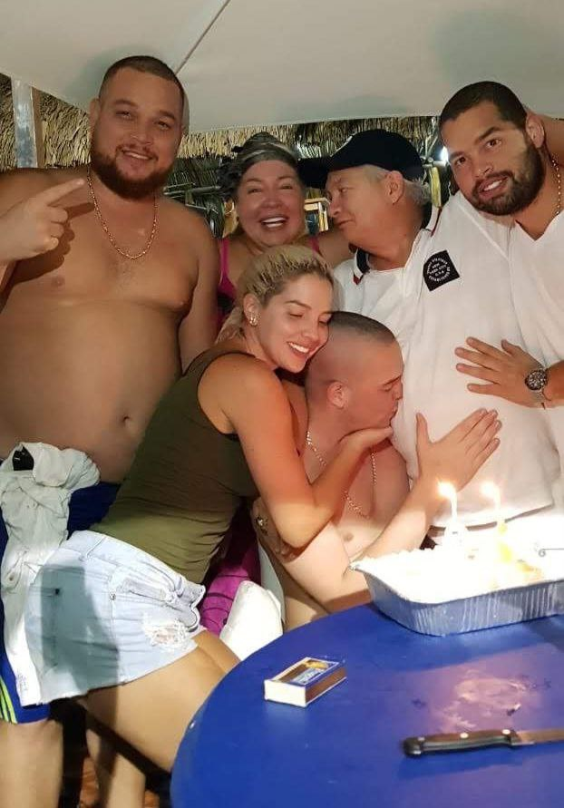
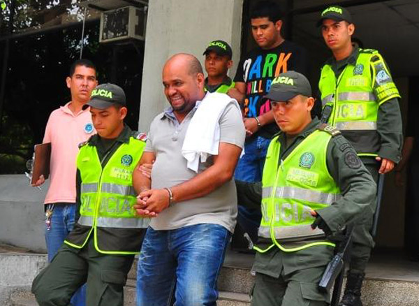

*La Negra Dominga apenas tenía 24 años cuando la Dijin presentó a los capturados antes de ser extraditados a Venezuela. /Cortesía EFe.*

¿Quién mató al temido capo  **«Kike» Vega en su escondrijo?** Luego de la matanza de la que se salvó uno de los cuatro líderes de la **banda Los Vega**, las autoridades, el bajo mundo y la sociedad de Barranquilla se hacen esa pregunta. Ese jueves sonaron 4 ráfagas de fusil de asalto. El silencio del conjunto residencial North Frontier de Villa Campestre, quedó vuelto añicos a las 4:30 de la tarde del 29 de junio del 2023. El cuerpo del capo  en su escondrijo quedó tendido, al lado de los cadáveres de dos de sus hijos. Los sorprendieron. No pudieron reaccionar al ataque criminal.

La paradoja de la vida, **Roberto Carlos Vega Daza,** el que mató a Jonathan Ospino en su fiesta de cumpleaños en Punta Roca (octubre 2022), se salvó de esa masacre. Por ahora se le escapó a la parca. Sin embargo, de acuerdo con fuentes allegadas a la malograda fiesta, él fue quien ordenó matar al cumplimentado. Con esta acción, firmó su condena capital y la de su banda. No sabía con quién se estaba metiendo.

## La sentencia de muerte de los Vega

*El que pudo ser el último cumpleaños de «Kike» Vega en su escondrijo. Aquí con sus hijos, su esposa y la Mona. El Beto, quien se salvó salvó de la masacre, le besa la barriga a su padre. Foto suministrada.*

El joven Ospino, de 21 años, era el sobrino preferido de **Álvaro Luis Ospino, alias la Negra _Dominga_**, presunto jefe militar de la banda **Los Piloneros**. Tiene nacionalidad venezolana, pero nació en Arroyohondo (Bolívar). Cuando emigró a Venezuela se metió en el bajo mundo a delinquir en Valencia estado de Carabobo, En la fiesta estaba en compañía de su socio y uno de los nuevos duros que regresó a Colombia y a Barranquilla _remasterizado_ y repotenciado con mucha plata y poder, Víctor Rafael Reales Hoyos. Hoy, se hace pasar como un próspero ganadero y financista electoral que diversificó su negocio. Es una organización que tiene más poder que los Vega, según las fuentes consultadas por **VoxPopuli Digital.**

En consecuencia, ese hecho ocurrido en Punta Roca marcó el principio del fin de los Vega. La sentencia estaba decretada. Faltaba su ejecución. Ese día llegó en la tarde del pasado 29 de junio de 2023 donde cayeron muertos tres de los cuatro jefes de esa agrupación delincuencial. No se escatimó recursos para cumplir la sentencia. Algunos dicen que el operativo pudo costar un millón de dólares. La _vuelta_ no era fácil. La intención era meterse en la madriguera del oso. Y lo consiguieron.

## Duro a la cabeza

Al primero que le dieron fue al viejo  **«Kike» Vega**. Uno de los ****«peces gordos»**** más sanguinarios que venían azotando el área metropolitana de Barranquilla. Las autoridades señalan que fueron dos sujetos que entraron armados por la parte trasera de la guarida de los Vega. Pero, todo hace indicar que uno solo mató a los tres, y el otro cubrió su entrada. Los victimarios dispararon con **fusiles** calibre 5,56 hacia el sitio donde se encontraban las víctimas. Fueron cuatro ráfagas de 36 tiros que acabaron con **Rafael Julio Vega Cuello** y sus hijos Ray Jesús y **Ronald Iván Vega Daza**. No hubo necesidad de usar las granadas de fragmentación que tenían en su arsenal. El fusil de asalto fue suficiente para ejecutar la sentencia de muerte.

Esta es la primera entrega de la serie: [«Kike» Vega e hijos masacrados en su madriguera](/articulos/kike-vega-e-hijos-masacrados-en-su-madriguera/).

## **«Kike» Vega** en su escondrijo

Los Vega estaban calientes. Ellos sabían que los estaban buscando para matarlos. Eran conscientes de que se habían metido con un rival muy peligroso. Más peligroso y poderoso que ellos. Según la información, habían cambiado de madriguera varias veces desde el mes de octubre del años pasado. Al parecer, los jefes de la banda habían arrendado hacía tres meses ese escondrijo de Villa Campestre. Pasaban desapercibidos con sus camionetas blindadas.

Sin duda, la banda de Los Vega no huían de las autoridades. Al parecer, como se dijo, las tenían compradas. Ni la Fiscalía ni la Policía se metían con ellos. Tienen negocios ilegales que combinan con sus negocios legales. El día que se produjo la balacera en **Punta Roca (Sabanilla, Puerto Colombia),** la propiedad de **Mauricio Gerleín Echeverría**, Roberto Carlos Vega y su padre salieron ilesos de esa refriega que protagonizaron sus escoltas. Los Vega escaparon en la camioneta blanca Luxer que recibió 42 tiros de fusil y pistola, tal como se vio en los videos que en su momento se conoció. Pero, la camioneta fue detenida cuando llegaba a Barranquilla. Sus ocupantes fueron identificados y capturados y puestos en libertad 5 horas después.

En su momento, el comandante de la Policía Metropolitana, coronel Urquijo dijo a la prensa que luego de que el abogado de ellos llegó y trajo la documentación respectiva, fueron liberados. Sin embargo, fue una explicación plagada de contradicciones.

\[Así es la guerra en Cartagena: [¿Por qué mataron a Yorman si era tan sociable? (II)](/articulos/por-que-mataron-a-yorman-si-era-tan-sociable-ii/)\]

El sitio de Cartagena: [Cartagena sitiada por el crimen y la ineptitud (I)](/articulos/cartagena-sitiada-por-el-crimen-y-la-ineptitud/)

## La hipótesis de la muerte de «Kike» Vega en su escondrijo

*En primer plano Víctor Rafael Reales Hoyos y en segundo plano la Negra Dominga cuando solo tenía 24 años. Aquí cuando fueron detenidos en Barranquilla en 2011. Cortesía El Heraldo.*

¿De quiénes y por qué huían Los Vega? La respuesta está en la fiesta de cumpleaños de Punta Roca, como ya se anotó. Ahí se encontraban varios capos de la mafia de la Costa Caribe que no aparecen en el radar delincuencial de Barranquilla. Su poder y dinero lo habían hecho en Venezuela donde manejaban el prans más poderoso de Valencia. Por cualquier razón, dos de ellos habían sido liberados por la justicia venezolana luego de ser condenados a 20 años de prisión por un tribunal de Caracas en 2016. De acuerdo al proceso, fueron los autores de la muerte del periodista Orel Sambrano, quen le quitó la máscara al narcotraficante Walid Makled y al Cartel de los Soles.

En efecto, se trata de Víctor Rafael Reales Hoyos y Álvaro Luis Ospino, quienes en 2011 fueron capturados en Barranquilla por la Interpol, y luego extraditados a Venezuela por el presidente Juan Manuel Santos. El narco que había contratado sus servicios era nada más y nada menos que Walid Makled García, alias _el Turco_, uno de los grandes narcotraficantes venezolanos de origen sirio.

En efecto, Makled contrató al prans de Los piloneros en Venezuela para enfrentar a narcotraficantes de la talla de Wilber Varela, alias _Jabón_. Algunos narcos se fueron para el hermano país cuando se atacó duramente al cartel del Norte del Valle. Pero, su detención y condena en Caracas fue por su responsabilidad en la muerte del veterinario **Francisco Larrazábal** (51 años) y del periodista **Orel Sambrano** (62), ocurrida el 5 y 16 de enero de 2009, respectivamente, en el estado Carabobo.

\[Si quieres saber cómo los Santo Domingo se hicieron más ricos: [Despojo de Barú, la prueba reina (IV)](/articulos/el-despojo-de-baru-se-produjo-desde-el-estado-iv/)\]

## Los piloneros ¿nuevos amos del bajo mundo?

*El del sombrero vueltiao es Víctor Reales en una fiesta privada con Diomédes Díaz en Venezuela. Captura de pantalla de video. Fueron los que se le metieron a Kike Vega en su escondrijo.*

Entonces, _Los piloneros_, el nombre con el que se conocía a la organización, pasó de ser un prans para convertirse en una empresa del tráfico de drogas. que le vendía seguridad a Walid Makled García, alias _el Turco_ o el Árabe. Según la DEA, llegó a exportar mensualmente hasta 10 toneladas de droga a Estados Unidos y amasar una fortuna de más de 1.300 millones de dólares.

Vale decir que Makled, antes de conocerse que estaba metido en el narcotráfico, fungía como un próspero y exitoso emprendedor que tenía una empresa de avión y de transporte. Además, sus hermanos estaban metidos en la política y dominaban el estado de Carabobo. Con la complicidad de agentes de las fuerzas militares, podían exportar a Estados Unidos toneladas de droga procedente de Colombia. El grupo armado que le dirigía esas operaciones era _Los piloneros_. Hoy, Makled está fuera de circulación y se cree que el grupo colombo-venezolno heredó ese poder.

Reales Hoyos y Ospino Illera, el famoso _Negra Dominga_, supuestos dirigentes de la banda criminal _Los Piloneros_, heredaron las rutas, los contactos y la industria de la droga de los Makled. Uno de sus hermanos que había caído en una redada en Venezuela fue liberado en 2022, por pena cumplida. Pero no estaba en condiciones de recuperar lo perdido. Al parecer, Los Piloneros si, porque manejaban el grupo armado desde la cárcel, según fuentes de Venezuela.

Vale recordar que durante la audiencia preliminar donde la dupleta fue condenada, las Fiscalías 30º Nacional y 152ª del Área Metropolitana de Caracas (AMC) ratificaron la acusación contra Víctor Reales Hoyos y Álvaro Luis Ospino por los delitos de sicariato en grado de coautor y asociación para delinquir. Finalmente fueron condenado, como ya se dijo, a 20 años de cárcel.

\[Te puede interesar este artículo, uno de los más leído: [¿Benedetti & Sarabia detuvieron la bola de nieve? (III)](/articulos/benedetti-sarabia-detuvieron-la-bola-de-nieve/)}

## _La Negra Dominga_ y Víctor Reales Vs. «Kike» Vega en su escondrijo

*Jonnathan Ospino Illera con su tío la Negra Dominga, el presunto jefe armado de Los Piloneros exsocio de Walid Makled. Se pudieron quedar con el negocio de la droga en sociedad con el cartel de los Soles. Probablemente fueron los que diseñaron y ejecutaron el asalto a «Kike» Vega en su escondrijo. Foto suministrada.*

Víctor Reales Hoyos, 46 años, fue apresado en mayo 2011 en Barranquilla junto con alias la _Negra Dominga_, **Álvaro Luis Ospino**, de 36 años. En poco tiempo fueron extraditados a Venezuela. El Tribunal Supremo de Venezuela sustentó su petición de la siguiente manera:

> [El Tribunal Supremo de Justicia](/articulos/decisiones/scp/Abril/078-3412-2012-11-171.html) en Sala de Casación Penal administrando justicia en nombre de la República Bolivariana de Venezuela, declara que **ASUME EL FIRME COMPROMISO** ante el Gobierno de la República de Colombia, que a los ciudadanos VÍCTOR RAFAEL REALES HOYOS y ÁLVARO LUIS OSPINO, se les seguirá juicio penal por la comisión de los delitos de SICARIATO y ASOCIACIÓN PARA DELINQUIR, tipificados en los artículos 12 y 6 de la Ley Orgánica Contra la Delincuencia Organizada.
> 
> [El Tribunal Supremo de Justicia](/articulos/decisiones/scp/Abril/078-3412-2012-11-171.html).

Los procesados hicieron su carrera delictiva en Venezuela, después de salir de Calamar y Arroyohondo (Bolívar), respectivamente. En ese año todavía no tenían los contactos que tienen hoy en Barranquilla. Quizás por esta razón fueron aprehendidos y extraditados a Venezuela por ser parte de la organización de Makled en la comisión de varios crímenes.

La captura de Reales Hoyos y Ospino se produjo después de la extradición de Makled a Venezuela por cargos de narcotráfico. Víctor Rafael Reales Hoyos y Álvaro Luis Ospino Illera (alias "La Negra Dominga"), según dijo el director de la Policía Nacional, general Óscar Naranjo en una rueda de prensa en Bogotá, tenían en su contra una **circular roja de Interpol**. Fueron detenidos en un exclusivo sector de Barranquilla.

## _La Negra Dominga_ y su juventud

Hoy, _La negra Dominga_ ya no es el joven de 24 años que fue apresado en Barranquilla en 2011. Los años de cárcel lo llevaron a otro nivel de la delincuencia. La muerte de su sobrino Jonnathan Ospino, hijo de su hermano que también fue asesinado en el día de su cumpleaños, le marcó profundamente.

Este hecho, quizás, pudo llevar a reaccionar violentamente contra Los Vega. Y es muy probable que no descanse hasta acabar con toda esa organización, Así aplican justicia en el bajo mundo con los códigos especiales para los que se pasen de la raya: diente por diente, hierro a hierro. Mientras las autoridades no saben qué hacer. Recurren a lo mismo. Ofrecen recompensa de $100 millones, y después se cruzan de brazos.

## La historia oscura de una familia trágica

En su ya larga carrera delincuencial de los Vega, iniciada como robadores de automotores en San Juan del Cesar La Guajira en los años 80s, se granjearon la enemistad de otros bandidos. Cuando llegaron a Barranquilla, encontraron una ciudad que desde la época de la marimba (finales de los 70), le brindaba cierta laxitud para el lavado de activos procedentes del narcotráfico y de otras actividades ilícitas.

Barranquilla, en aquellos viejos tiempos de la marimba que pudimos soportar. nos encontramos con los Pitre. Valdeblanquez, Cárdenas, Raúl Gomez Castrillón (Gavilán Mayor), Anichárico. Se formaron grandes balaceras por los enfrentamientos entre los rivales del narcotráfico.

Precisamente, los Vega Daza sufrieron una baja similar cuando dos miembros de esa familia cayeron por la disputa de una deuda de $500 millones en 214. Los Gómez y los Daza Inauguraron una nueva forma de estos enfrentamientos. Los primos de los Vega Daza que cayeron en esa oportunidad fueron Giany Daza Joiro y Nefer Barros Daza. Los fulminaron con un ráfagazo de mini UZI. En 2011, fue ultimado Wildon Daza Mejía, el Gaby Daza. En 2003, otro de los Daza fue hallado muerto y su cuerpo presentaba signo de torturas.

## Los Vega, sobrevivientes de varias guerras

Los Vega se enfrentaron a Los Rastrojos y sobrevivieron. En el año 2012 le declararon la guerra. Fueron nombrados en un panfleto difundido en el norte de **Barranquilla**, firmado por el frente _Juan David Jaramillo_ de ‘Los Rastrojos’. Se les acusaba de ser integrantes de una presunta organización delictiva con la que disputaban las rentas criminales de la ciudad.

En el panfleto, son 17 los nombres que figuran en la lista de amenazados, la cual está encabezada por un individuo identificado como **Fredy Castillo Carrillo**, conocido como ‘Pinocho’. Se le sindica de ser uno de los jefes de Los Pachenca. Estuvo extraditado en una cárcel de Estados Unidos por cuatro años. Hoy, funge de líder social en el corregimiento de Guachaca, de Santa Marta, en Magdalena. Acaba de ser liberado en Santa Marta, y le apuesta a la Paz Total de Petro.

En la lista también están dos presuntos jefes de la banda criminal ‘Los Pachencas’: Deimer Patiño Giraldo, alias ‘80’ y John Rafael Salazar Salcedo, alias ‘Flash’. Este último fue señalado de ser el autor intelectual de, al menos, 30 homicidios en Santa Marta y el Magdalena.

Los Vega sobrevivieron varias guerras intestinas de la creciente industria criminal de Barranquilla. La lista de amenazados del Clan del Golfo la completaba alias ‘Kike Vega’ o ‘el Patrón’; Ronald Vega Daza, alias ‘el Vega’; Jonathan González Campo, alias ‘el Calvo’; Wasinto Musso, alias ‘Papo’; Beto Quiroga, alias ‘5.5’; y Zulma Musso Torres, alias ‘la Patrona’. Entonces, Los Vegas arreglaron con el Clan, y siguieron delinquiendo. Hasta que les llegó su San Quintín el pasado jueves 29 de junio de 2023.

## Epílogo

Y todo comenzó por una mujer que había sido la amante de uno los Vega. Eso sucedió cuando las copas y las drogas hacían su efecto en aquella malograda fiesta de cumpleaños que duró hasta la mañana siguiente.

## Próxima entrega

_La venganza de la Negra Dominga._ La Negra Dominga y Víctor Reales Hoyos se sintieron profundamente tocados por la muerte de Jonnthan Ospino. El joven prometía ser un digno sucesor de su empresa criminal. Y Barranquilla, el escenario de esa venganza, una ciudad que siempre ha tolerado la industria ilegal de las drogas.

Recibo información: lucio@voxpopuli.com.co