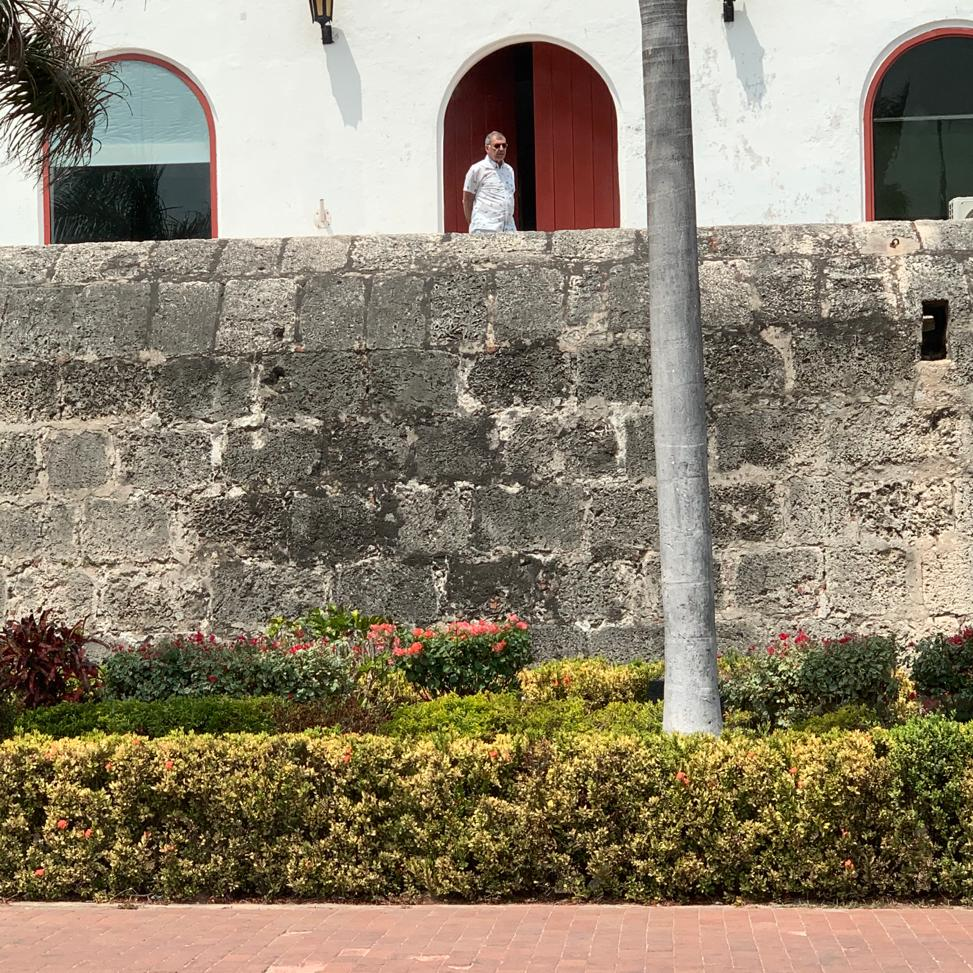

*¿Vapeando basuco y reculando? El alcalde zambiloco y la ciudad al garete. Observen la mano izquierda de William Dau, tiene la pipa inhalando lo que al parecer es basuco revuelto con marihuana, sus dos drogas predilectas, según testimonios entregados a VoxPopuli Digital. Captura de pantalla de video/Ahora.In.*

Algún vecino cansado de las mañanas enrarecidas con olor a _caucho quemado_, grabó en video el momento cuando el alcalde de Cartagena, **William Dau Chamat**, se le veía**, al parecer, vapeando basuco**. O sea, **"base sucia de cocaína"** con _mariacachafa_ (cannabis). Este hecho confirmaría las razones por las cuales **VoxPopuli Digital** le hizo una pregunta pública en uno de sus artículos del mes de noviembre de 2020 sobre su presunto problema de adicción a las drogas. La misma pregunta que se le hizo en la audiencia del abortado proceso de su revocatoria que **se viralizó el 2 de febrero de 2021**. En definitiva, el alcalde de Cartagena **debería estar preso y no al frente de una ciudad que hace como el cangrejo, echar para atrás.**

En el mencionado video se ve el alcalde de Cartagena vapear, inhalando el humo de lo que podría ser basuco revuelto con marihuana, según las fuentes que **VoxPopuli** había contactado hace tres años. Vapeaba mientras a mano escribía. El video fue publicado en las redes sociales por **Ahora.In**. Es real, y es Dau en la terraza de su apartamento. Luce un torso desnudo con malnutrición. Los huesos, que están entre el cuello y el torax, se les nota claramente cuando hace cada inhalación del humo. Contrasta con su barriga pronunciada, como si fuera una iguana enhuevada.

## ¿Qué dice la Procuraduría?

Esperemos que en los próximos días la Procuraduría, con esta información, inicie una investigación de carácter disciplinario contra el alcalde de Cartagena William Dau Chamat.

Mientras William Dau se le ve vapeando basuco, Cartagena Cómo Vamos señala que **el 64 % de los encuestados dijo que tenía una imagen desfavorable, un 28 % favorable y un 8 % no tenía opinión**. Sin embargo, otros sondeos hablan de que la imagen desfavorable sobrepasa el 80 **%**. Sin duda, Dau Chamat es un alcalde que debería estar preso por los procesos de corrupción administrativas donde se encuentra involucrado.

## VEA EL VIDEO: ¿Vapeando basuco?

https://youtu.be/ffsiYeU9MIE

Por restricciones de Youtube, debido al presunto consumo de estupefacientes, este video solo lo puedes ver en la plataforma.

## ¿Qué hacer con un alcalde zambiloco?

Aquí no se trata de hacer un debate moralista. Como periodista no es nuestro papel juzgar a nadie. Mucho menos al ciudadano Dau, quien está en su derecho de consumir cualquier droga y en las cantidades que quiera. Eso es **libre desarrollo de la personalidad** amparado por la Constitución. Pero, de allí a aceptar que un alcalde adicto, incapaz de gobernar, siga gobernando, es un atentado contra el bienestar colectivo y la salud pública. Esto fue lo que se advirtió en esa famosa audiencia para su revocatoria. El pueblo de Cartagena entregó 90 mil firmas para revocarlo. Pero, la Registraduría Nacional no le dio paso a las 50 mil firmas válidas. Estos son los gajes de una democracia frágil, donde la voluntad ciudadana es constantemente cercenada.

¿Por qué es tan importante saber la adicción del burgomaestre? Un artículo científico de la médico y psicóloga Sonia Jiménez Suárez, divulgado por **Carta de la Salud**, revista de la Fundación Clínica Valle de Lili, señala:

> "En el aspecto psicológico, **los usuarios crónicos de basuco** sufren depresiones matinales, ansiedad, suspicacia, dificultades de concentración y memoria e ideas persecutorias de carácter delirante, **que generan actos de violencia y estilo de personalidad agresiva**. Como resultado, el mundo de relaciones familiares, sociales y ocupacionales del consumidor **sufre severo deterioro**. Se hace más propicio **su ingreso al bajo mundo de las drogas y a la delincuencia asociada**".
> 
> **[Cocaína y basuco, efectos físicos y psicológicos de su consumo](https://repository.icesi.edu.co/biblioteca_digital/bitstream/10906/4530/1/096_Cocaina_basuco_efectos_fisicos_psicologicos.pdf)**.

Sin embargo, los diferentes estamentos de Cartagena deben emprender un dinámico debate que se salga del mero marco moral para centrarse en la capacidad de decisión del alcalde. Saber si está apto para gobernar. En este punto, se podría constatar la causalidad del caos que vive la administración distrital y la ciudad. Es un efecto directo de que no tenemos alcalde ¿de que está secuestrado por la adicción? Esto determinaría su salud mental y, por ende, su incapacidad para gobernar. Los pésimos indicadores de gestión de estos tres años y medio de William Dau Chamat, se podrían explicar porque tenemos un _alcalde zambiloco_, como lo habíamos advertido oportunamente. Esto hace del alcalde un peligro público y, por tanto, afecta los derechos colectivos de los cartageneros. Sus decisiones casi siempre son erráticas.

## ¿Vapeando basuco y calumniando?

*La soledad del poder. William Dau se le ve, incluso, en las noches, fumando en el baluarte San Ignacio Loyola donde está el Palacio de la Aduana.*

Mientras el alcalde _se da por la torre_, escribía a mano, tal vez, el contenido del ataque contra una de sus tantas víctimas por injuria y calumnia. Son ataques con alevosía contra la integridad moral, honra y buen nombre de personas que tienen la presunción de inocencia. No es gratuito que haya sido condenado a retractarse en más de 20 procesos de tutelas y penales.

Lo más degradante de su conducta es que **todo lo hacía con alevosía y con su hecho pensado de manipular a una opinión pública** que estaba cansada de los gobiernos de una clase política indolente. Todo era una vulgar campaña de manipulación iniciada en 2017 desde su oficina de burócrata del sistema financiero depredador en Nueva York. Su idea era lanzarse como candidato a la alcaldía de Cartagena. Su instrumento de campaña eran estos tipos de denuncias, sin prueba alguna, en contra de la integridad moral de sus víctimas.

No obstante, lo que más se lamenta hoy en Cartagena es que personas honestas se dejaron arrastrar por los bajos instintos de un hombre que no tiene límites morales. Fue _el niño mimado_ de los gremios económicos, los grandes medios de comunicación y de sectores políticos y económicos que han usufructuado su decadente administración. Tiene el apoyo de la Casa Aráujo. Se alió a los uribistas, pero también a los petristas. Manipuló a todo el mundo. Incluso, la Gran Prensa le dio inicialmente "buena prensa". Se embolsilló a la izquierda y a la mayoría de los sindicatos con contratos de prestación de servicios y cargos en su administración.

Se debe recordar que en el primer gabinete estaban figuras de dichos gremios, como **Mónica Fadul Rosa**, presidenta ejecutiva de Fenalco Bolívar. Ella fue nombrada **Gerente de Ciudad**. No duró casi. _El Zambiloco_ andaba en su vida loca. O también, podemos citar a **Viviana Elajiek Juan**, exgerente de la Andi seccional. Ella fue una acérrima defensora de esta administración. Pero, por alguna razón, declaró a la exsecretaria de Hacienda de Cartagena **"persona no grata"**.

## ¿Vapeando basuco y reculando?

*El Zambiloco vapeando basuco*

Los actos más humillantes que desgastó su palabra ofensiva fueron las órdenes de retractación asumida por jueces que defendieron los derechos fundamentales de sus víctimas. Las medidas más espectaculares tomadas en ese sentido fueron las tutelas instauradas por el gobernador de Bolívar de 2019, **Dumek Turbay Paz**, actual candidato a la alcaldía de Cartagena. Pero también el empresario **Alfonso El Turco Hilsaca** le propinó una derrota judicial que lo hizo retractarse por orden del Juzgado Segundo Penal Municipal:

> **“Me retracto de las publicaciones, denuncias y afirmaciones sobre conductas delictivas y ofensivas realizadas en redes sociales contra Alfonso Hilsaca Eljadue desde el 30 de julio de 2017 a la fecha en mi condición de veedor ciudadano anticorrupción…”**

Se entiende que cada una de esas falsas denuncias del alcalde **William Dau Chamat**, probablemente las hacía bajo los efectos del basuco. No se entendería de otra manera, ya que es un abogado con una maestría de la Universidad del Rosario. Debe conocer la norma y los derechos de los demás. Pero, es una persona con bajos instintos, cuyos conocimientos los pisotea para darle paso a lo más oscuro de su retorcido pensamiento.

Como veedor, Dau jamás presentó una denuncia penal con el fin de que se investigara sus supuestas denuncias. Su criterio de que la justicia no sirve, fue su pretexto para despreciar la Constitución y la ley y buscar la ciudadanía norteamericana. Es la razón por la cual comete todo tipo de irregularidades. Ofende, humilla, denigra y manipula. Es un personaje grotesco, zambiloco de vida loca, mientras hace una administración corrupta digna de los peores malandros que se han apoderado de los recursos públicos. Esta es la razón, por la cual las candidaturas realmente alternativas de Cartagena no tendrán futuro en esta coyuntura. El zambiloco se encargó de corroer la esperanza de esta ciudad que esperaba mucho de su discurso anticorrupción. El autodenominado Tractor resultó una carretilla.

## Dau reculó y se arrodilló ante Dumek

*Miren los dientes del alcalde William Dau ¿las huellas del basuco? Este mano a mano contra el candidato a la alcaldía de Cartagena Dumek Turbay Paz.*

Varias son las sentencias, en sede de tutela, donde **Dumek Turbay Paz** lo hizo recular. Reculó y se arrodilló frente al gobernador en 2019. Luego como exgobernador y candidato a la alcaldía de Cartagena, Dumek lo volvió a arrodillar para que chupara el polvo de la derrota. Así, Dau le hizo propaganda política gratuita a uno de los candidatos que aparecen posicionados en la coyuntura electoral. Primero, por orden del Juzgado Quinto Civil del Circuito de Cartagena, reculó, y esto dijo en su retractación:

> "Me retracto de la publicaciones, manifestaciones y afirmaciones sobre la conformación de una red criminal, conductas ofensivas y delictivas realizadas en redes sociales como veedor anticorruptivo contra Dumek Turbay Paz como gobernador de Bolívar, su esposa Lialiana Majana Pupo, su cuñado Luis Fernando Majana Pupo y su núcleo familiar..."

Esa reculada y arrodillada de William Dau frente a Dumek Turbay reflejó que todo lo que sale de la boca del alcalde debe recibirse con sentido de inventario. Ni siquiera puede tenerse como fuente periodística. Por eso, no se entiende por qué razón la **revista Semana** no aclaró que el reportaje que le hicieron sobre un presunto saneamiento de las finanzas del Distrito de Cartagena fue pagado. Porque está plagado de mentiras. Hoy Cartagena tiene la misma calificación de riesgos de 2019. Así lo señalan las agencias del sector.

## Dumek volvió a arrodillar a Dau

**El Juzgado 8 Civil del Circuito de Cartagena**, a principio de julio de 2023, en segunda instancia, aceptó los argumentos del candidato a la alcaldía **Dumek Turbay**, y revocó una decisión de primera instancia que había favorecido a William Dau. El juez superior señaló que el alcalde William Dau, en una entrevista a la emisora La Cariñosa, se extralimitó en el derecho a la libertad de expresión. Así transgredió los derechos del exgobernador, por lo cual debe retractarse públicamente

En ese sentido, la jueza **Rosiris Llerena Vélez**, señaló que William Dau no presentó ningún elemento probatorio que sustentara sus acusaciones contra Dumek Turbay. Por esta razón lo hizo retractar.

Con esta decisión a favor de **Dumek Turbay**, William Dau es el principal promotor de su campaña a la alcaldía. La ley del karma. Se está regresando lo que pasó en 2019. Dau adquirió notoriedad en la ciudad calumniando a Turbay. Hoy está haciendo lo mismo, pero en sentido contrario. La campaña del exgobernador está adquiriendo más notoriedad por la lengua viperina del alcalde zambiloco que se la pasa, al parecer, vapeando basuco en su pipa electrónica adquirida en Nueva York.

## Próxima entrega

La realidad financiera de Cartagena