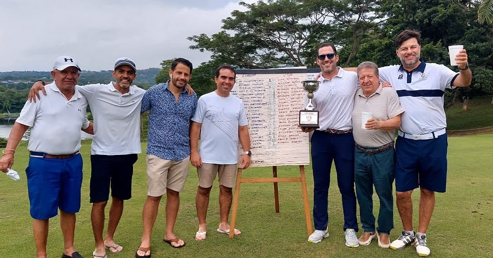
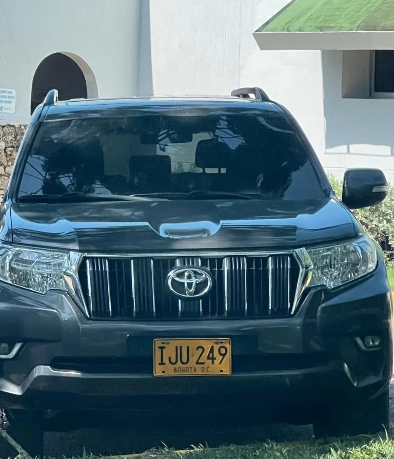
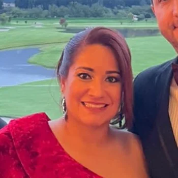

*«El golpe de chuleta» en el Club Campestre: Este trío debe responder: Fanny Batista, Jhon Villamizar y Luis Fernando Lemus.*

El complot del asesinato contra el hoy candidato a la alcaldía de Cartagena, **Héctor Pérez Fernández**, tomó un nuevo giro. Se supo que en el Club Campestre planeaban asesinarlo, porque era un obstáculo para las pretensiones expansivas de un empresario con intereses en Cachenche.

Como se sabe, VoxPopuli, por infidencias de una mujer adolorida y bella, **Fanny Batista Quintero**, conoció del supuesto plan macabro. El hecho fue ratificado por el socio y abogado **Adolfo Vergara Martínez**, quien está dispuesto a declarar ante la Fiscalía. Este es un «golpe de chuleta» ―como se conoce en el argot del golf cuando se arranca un pedazo de pasto― que compromete inicialmente a **Jhon Villamizar Gómez**. **Luis Fernando Lemus** y otros empresarios que van a jugar golf semanalmente en el Club Campestre de Cartagena.

La guerra de los desencuentros pasionales es mítica. Basta recordar la guerra de Troya cuando Paris secuestró a la bella Helena. Esos líos pasionales son pretextos para la guerra. En estos días involucran a **Aida Merlano, Daysuris Vásquez y Laura Ojeda**. Tres barranquilleras de diferentes generaciones que se metieron como objetos sexuales en el mundo de los políticos y de grandes contratistas del Estado, y hasta con el hijo del Presidente. Pero, también hay casos menos conocidos como el de Fanny Batista. En forma habilidosa, el empresario Jhon Villamizar apagó el fuego regresándole todo lo que le había quitado a su **baby―sugar**.

## Los desencuentros pasionales

En otras palabras, los desencuentros pasionales traen como resultados que los pensamientos más oscuros comiencen a aflorar en los espacios vitales donde frecuentan sus protagonistas. Un Club Campestre donde las mujeres son expertas en juegos de mesa o ahora pueden servir de compañía a sus maridos para el juego de golf. Y así, en esos espacios, salen a la superficie las perversidades y las _ideas más rocambolescas_ de los personajes que están involucrados en esas bajas pasiones.

Ese complot para asesinar a una persona protegida es un **«golpe de chuleta»** que marcaría el _swing_, no solo de los empresarios involucrados, sino del mismo Club Campestre, que a sabienda, no lo denunció. Para las potenciales víctimas, como es el caso de **Héctor Pérez Fernández**, debe tomarlo como un alivio, ya que otros no tuvieron la suerte o la oportunidad de que sus victimarios fueran delatados antes de ejecutar lo mal pensado.

Por esa razón, la directiva del Club Campestre presidida por **Miguel E. Desmoineaux Glen, con la secretaría de José Seba Angulo y la tesorería de Ricardo Segovia Pereira,** deben aclarar ante la opinión pública lo que pasó en su organización. Si bien es cierto que ellos no pueden controlar lo que piensan y planean sus distinguidos y ricos socios cuando van a jugar golf, pero si trascendió y lo sabían ¿por qué se niegan a dar una explicación?

Te puede interesar: [Venganza pasional de Fanny Batista aclararía complot contra Héctor Pérez (II)](/articulos/venganza-pasional-de-fanny-batista-aclararia-complot-contra-hector-perez-ii/)

## El castigo social en el Club Campestre

*Así se le ve a Jhon Villamizar y Luis Fernando Lemus codearse con los demás socios del Club Campestre. /Cortesía.*

Contrario a ello, lo que realmente no se puede entender es la conducta de la directiva. ¿Por qué sancionó al socio **Adolfo Vergara Martínez** de excluirlo del club sin el debido proceso? ¿Por qué se atrevió a denunciar el supuesto complot de Villamizar, quien dio el **«golpe de chuleta»**? **VoxPopuli Digital** se enteró por una fuente que pidió reserva, que allegados a Villamizar están buscando una coartada para justificar la expulsión de Vergara y **minimizar el impacto del complot de asesinato que supuestamente planeaban contra Héctor Pérez Fernández y compañía**. El nombre del otro objetivo no fue establecido.

Una de esas coartadas, se supo, es construir un escenario donde el abogado y empresario Vergara aparece haciéndole una propuesta indecente a una de las masajistas del club.

¿Cómo la directiva del Club Campestre va a tapar el plan para asesinar a una persona protegida, como es el caso de Héctor Pérez Fernández con una sanción social a uno de sus socios? ¿Por qué la Fiscalía no ha actuado con diligencia frente a este horrendo caso? ¿Por la imagen del Club Campestre donde van los ricos a esparcirse y otros a planear el próximo asesinato? Con esta entrega, el Club Campestre está advertido para que asuma una conducta de acorde a la Constitución y a la Ley.

Te puede interesar: [Denuncian a Villamizar y Lemus por plan para asesinar a Héctor Pérez](/articulos/denuncian-a-villamizar-y-lemus-poplan-para-asesinar-a-hector-perez/)

## **«El golpe de chuleta»** en el Club Campestre

El primer **«golpe de chuleta»** fue en enero de 2023, según confesiones de la misma Fanny Batista Quintero que fueron ratificadas posteriormente por el abogado y empresario, Adolfo Vergara a Vox Populi Digital. Como se recuerda, Jhon Villamizar Gómez, propuso a varios empresarios, entre ellos, **Luis Fernando Lemus**, hacer una vaca para asesinar al abogado y veedor Héctor Pérez Fernández y otro líder.

Asimismo, el 6 de julio, nuevamente el empresario Villamizar, en el hoyo No 16 de la cancha de Golf del Club Campestre, le volvió a proponer el complot para asesinar a los líderes sociales con el fin de sacar de Cachenche a los campesinos que se habían tomado esos predios a cargo de la SAE. En esta oportunidad, Vergara le dijo que no estaba de acuerdo. Que él tenía otra forma de resolver los problemas de proyectos empresariales.

## Dato curioso que la Fiscalía debe investigar

*Esta es la camioneta que conduce Jhon Villamizar. El día 6 de julio de 2023 estuvo parqueada en el Club Campestre. Ese día hizo la horrorosa propuesta de asesinar a Héctor Pérez.*

Dos personas que no tuvieron suerte, ni hubo problemas pasionales para que salieran a flote los complots antes de que se ejecutaran, fueron los hermanos **Miranda Rodríguez**, legendarios reclamantes de tierras, descendientes de Gabriel Miranda Julio, un afrodescendiente que alcanzó a tener miles de hectáreas de tierra en el _Bajo Miranda_. ¿Los asesinatos de **Luis Felipe Miranda** (pastor de una iglesia) ocurrido el 14 de mayo de 2023 y , dos semanas después, el 2 de julio, su hermano, **Jaime Miranda Rodríguez**, de 68 años, tienen relación con el supuesto complot de Villamizar?. 

**Lo curioso**. **Sucedieron tres hechos concomitantes. Primero**. Poco antes de su asesinato, el pastor le había dado poder a **Pérez Fernández** para que lo representara en el proceso judicial contra **Carlos Segovia de la Espriella y el sr Collins**. Estos empresarios supuestamente se habían quedado con los predios donde se construyó la urbanización La Carolina y el portal de Transcaribe. **Segundo.** Cuatro días después, Villamizar le vuelve a proponer el complot de asesinato a Adolfo Vergara, quien rotundamente se negó atender tan horrorosa proposición. Fue así que Vergara se lo reveló a un allegado de los veedores **Erick Urueta Benavides y Héctor Pérez Fernández.** Tercero. Asesinaron a uno de los cuidanderos que los Miranda tenían en un predio del _Bajo Miranda_.

Esos hechos concomitantes, nos propone una pregunta esencial que la Fiscalía debe responder: ¿Los asesinatos de los Miranda están relacionados con el frustrado complot contra Héctor Pérez Fernández?

## El Club Campestre con el empresario Villamizar

*Karina Castellano López, gerente del Club Campestre.*

En la pasada entrega observamos cómo el lío pasional de la joven **Fanny Batista Quintero** con el **septuagenario Jhon Villamizar permitió** que lo dicho por él en el mes de enero de este año saliera a la luz pública.

VoxPopuli Digital, cumpliendo con su papel de medio de comunicación, buscó establecer una comunicación con el Club Campestre de Cartagena. Sin embargo, la gerente **Karina Castellanos**, primero me tiró el teléfono en forma brusca y grosera. Luego, no me atendió cuando fui al club Campestre a hablar con ella o con algunos de los directivos. El portero no abrió las talanqueras de la entrada. ¿Acaso se encuentra compinchada con el empresario Villamizar?

Como dato curioso, la gerente expidió una certificación indicando que John Villamizar y Fanny Batista Quintero no habían ido el 8 de julio al club Campestre y, por tanto, la versión de Vergara se caía por su propio peso. Pero la realidad es que la versión habló del 6 de julio de 2023. Así se corrobora en la bitacora de entrada y salida al club. Pueden ver la captura de pantalla que se publica.

*La certificación habla del 8 de julio, pero la reunión de Villamizar para proponer el complot de asesinato de Héctor Pérez fue el 6 de julio. Al día siguiente Luis Fernando Lemus, el otro implicado, viajó a Europa. Lemus, al parecer es socio de Villamizar, y también coordinador del Comité de Convivencia.*

## Conclusión

**«El golpe de chuleta»** dado en el campo de golf del Club Campestre tiene que hacer sonar las alarmas en la alta sociedad cartagenera. ¿Acaso están fomentando el sicariato como las organizaciones delincuenciales del país? ¿Qué relación tienen los empresarios con oficinas de cobro de la ciudad? ¿Los clubes sociales son usados para organizar y planear asesinatos como este que se denunció?

## Próxima entrega

Los chats, audios y videos de esta historia que la Fiscalía debe conocer