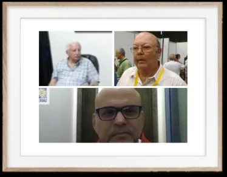
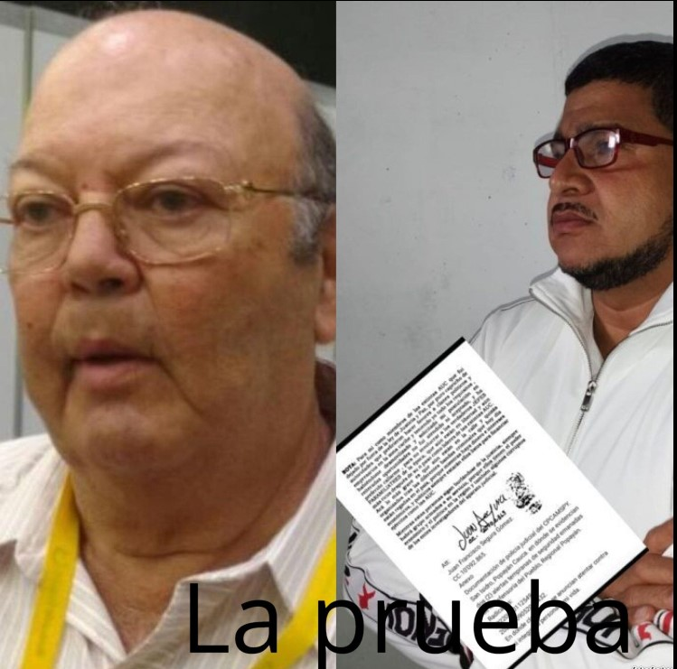
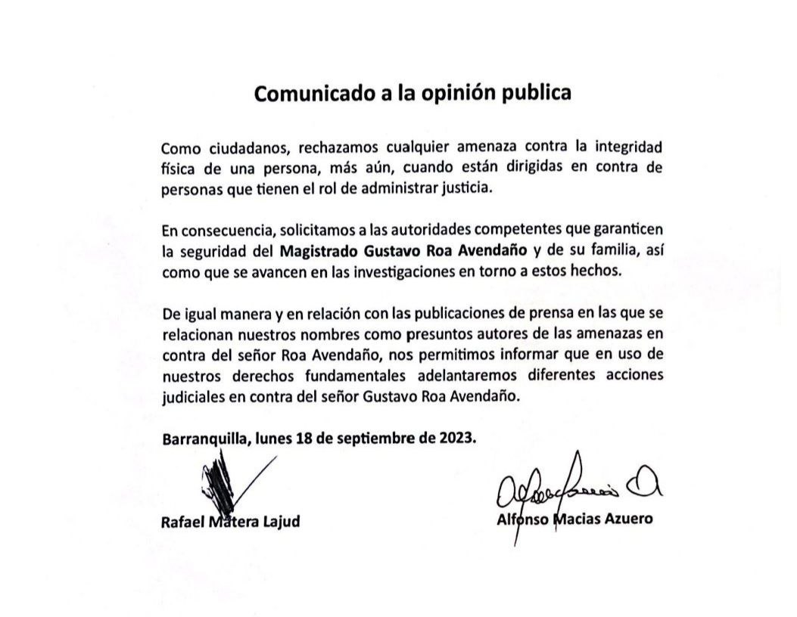

Como buitres que disparan a la escopeta, **Rafael Matera Lajud y Alfonso Macías Azuero**, criminales de lesa humanidad, según sus otrora **agentes de la muerte**, denunciarán penalmente al único juez que se atrevió a ponerlos en la picota pública. Se trata del **magistrado **Gustavo Roa Avendaño**** de la Sala de Justicia y Paz del Tribunal Superior de Barranquilla, autor de dos macrosentencias icónicas contra el **paramilitarismo** en la Costa Caribe.

Sin embargo, existe algo extraño, y se siente más cuando se escribe esta entrega a 10 mil metros de altura. Además de que «Los buitres» le disparen a la escopeta, **se trata del papel cómplice de la Fiscalía General de la Nación (FGN) y de la Gran Prensa en estos 20 años posteriores a la guerra contrainsurgente del paramilitarismo** que sobrepasó los horrores de la guerrilla. No hay un solo rico y poderoso empresario o terrateniente financiador de la guerra condenado por concierto para delinquir ni tampoco por crímenes de lesa humanidad. Son centenares los sindicados y procesados o señalados por la Corte Suprema de Justicia o la Justicia y Paz.

## Se confirma el fracaso de la Fiscalía

*Francisco Barbosa, fiscal general ¿tocará a Los Intocables?*

No solo no hay un rico y poderoso financiador de la guerra condenado, sino también centenares de alcaldes. A diferencia de los gobernadores condenados por _parapolítica_. El primero fue Trino Luna (Magdalena). El más emblemático, el caso de Salvador Arana Sus, condenado a 40 años de prisión. Esto expresa el fracaso de la Fiscalía como institución para perseguir a los criminales. No ha cumplido el precepto constitucional del **derecho a una justicia pronta y expedita** en los plazos y términos **que** fijen las leyes. Tampoco emite sus resoluciones de manera **pronta**, completa e imparcial. El caso de _**Los intocables**_ que ahora atacan al magistrado Roa es solo una muestra.

Asimismo, observamos que más del 70% de los alcaldes del período de dominio paramilitar, fueron sus aliados y les entregaron los presupuestos públicos, según se pudo establecer en los procesos de la Corte Suprema de Justicia y en Justicia y Paz. Los únicos alcaldes condenados por paramilitarismo fue por homicidio agravado y no por concierto para delinquir.

En tanto que la Gran Prensa, en este caso concreto donde aparece como víctima el magistrado Roa, le dio mayor trascendencia al anuncio de denuncia de los supuestos voceros de _**Los intocables**_ contra el magistrado, que al complot para asesinarlo. Incluso, le dieron más importancia que a la misma denuncia penal entablada por la víctima de amenazas de muerte. El comunicado de los sindicados fue publicado sin contexto, como si fuera un remitido, por tanto, pagado.

## El deber de un juez frente al horror

*Los intocables que amenazan*

Frente a los crímenes de los financiadores, hombres de atrás de los escuadrones de muerte del paramilitarismo, la Fiscalía General de la Nación (FGN) y los jueces de la República, deben cumplir con su deber constitucional y legal de perseguirlos judicialmente. Si no lo hacen, deben ser procesados y juzgados.

No obstante, lo que sucede en Colombia es extremadamente extraño. "Los hombres de atrás" de esos horrendos crímenes de la guerra interna, son tratados como héroes. Esos individuos **se escondieron detrás de los paramilitares, sobre quienes ejercieron dominio y poder, para que ejecuten acciones turbias e ilegales bajo su control**Y los que se atreven a perseguirlos, los asesinan, como le sucedió al magistrado samario Noguera Aarón en 2002. O los amenazan, como le está sucediendo a Roa Avendaño, el protagonista principal de esta entrega de las víctimas de "Los intocables".

En el primer caso citado, se sindicó a **Alfonso Macías Vargas**, padre de **[Alfonso Macías Azuero](https://luciotorres.local/corte/wp-content/uploads/not/civil23/estado109civil29062023.pdf)**, quien firmó el comunicado de la temeraria denuncia. Macías Vargas fue procesado y condenado por concierto para delinquir, en primera instancia, por participar en el asesinato del hermano del magistrado, **Juan Noguera Aarón**. Como realización, se sindicó a Macías de ordenar la muerte del magistrado. Pero hay algo más horrendo de los Macías Azuero. Según sus compinches ante Justicia y Paz, padre e hijo desenterraron los cadáveres de sus víctimas de la fosa común que crearon en la finca Potosí. Luego, los quemaron para desaparecer las evidencias de sus homicidios agravados.

Te puede interesar: [Mancuso, los crímenes de «Los intocables» y la JEP (III)](/articulos/mancuso-los-crimenes-de-los-intocables-y-la-jep-iii/)

## Como Buitres

Parafraseando el viejo adagio, _**Los intocables**_ actúan como buitres que disparan a la escopeta. La única pretensión de esa criminal conducta de denunciar penalmente a los jueces, es la impunidad de sus crímenes. Pero ellos no lo hacen solos. Para cumplir este propósito, cuentan con la complicidad de la misma Fiscalía, ya que no actúa y prevarica por omisión. Lo que debe hacer el **fiscal Francisco Barbosa** para detener esta impunidad y su propio fracaso, **es priorizar y desarchivar todos estos procesos que duermen en las calendas griegas.**

Precisamente, cuando el magistrado Roa Avendaño hizo en 2018 la primera compulsa de copias de la condena contra los escuadrones de muerte de _**Los intocables**_, era decirle a la Fiscalía, Procuraduría y al resto de la institucionalidad que investigarán. Lo hizo en cumplimiento de su deber como magistrado de la Sala Penal.

En palabras coloquiales, le pasó la pelota a quienes tienen el deber de judicializarlos. Porque los paramilitares narraron, dieron testimonio, entregaron pruebas y sitios de sus crímenes de lesa humanidad ordenados por _**Los intocables**_.

Por tanto, si se trata de denunciar penalmente a funcionarios, serían los fiscales, jueces, magistrados, procuradores, personeros, que, debiendo investigar e impartir justicia, no lo hicieron. ¡Ellos sí merecen que se les procese por esos delitos del administrador de justicia!

## _**Los intocables**_ y la primera compulsa

Sin duda, el dominio hegemónico paramilitar se prolongó hasta los dos periodos (2002-2010) del **presidente Álvaro Uribe Vélez**, el supuesto jefe de _**Los intocables**_. Los empresarios que se echaron sobre sus hombros la campaña de Uribe I (2002) fueron (¡oh, sorpresa!) _**Los intocables**_. Muchos de ellos eran los comandantes de los procesados en Justicia y Paz. Uno de ellos (Matera) era dueño del campero blindado que salvó la vida del entonces candidato ante un supuesto atentado terrorista de las FARC en Barranquilla. Desde ese entonces, la imagen de Uribe, el salvador, se propaló y creció sin parar en las encuestas hasta ganar la presidencia en la primera vuelta.

Ese hecho permitió a **los Matera** (Rafael y Pascual), **Macías** (padre e hijo), **Laino Scopetta**, Jorge Castro, Augusto Castro, José María Ovalle Orozco, Juan Carlos Lobo Silva, Huber Rodríguez, ser _los niños mimados_ del régimen. Al mismo tiempo, fueron mencionados por los jefes paramilitares desde sus primeras versiones de Justicia y Paz.

Pero, ninguno de esos supuestos empresarios que se enriquecieron con la actividad paramilitar, fueron llamados a juicio. Excepto, Alfonso Macías Vargas, quien, como ya se dijo, fue condenado dentro del proceso por el asesinato de Juan Noguera Aarón. Y su condena en primera instancia se logró gracias al impulso y fuerza que le imprimió su hermano el magistrado **Enrique Camilo Noguera Aarón** asesinado el **22 de octubre de 2003**. Se consideró que este asesinato se produjo como retaliación de **Alfonso Macías Vargas** contra el magistrado que hizo posible esa condena **en agosto de 2003. La pena fue de 11.4 años de cárcel**. Después, en un pasaje oscuro, supuestamente el Tribunal Superior de Santa Marta absolvió a Macías. Pero esa sentencia no se ha encontrado.

## La providencia de Roa Avendaño y la primera compulsa de copia

El 18 de diciembre de 2007 se constituye en un hito para la historia de la justicia y de la política. Ese día fue la **primera condena contra la _parapolítica_** y la primera compulsa de copia. **Trino Luna Correa**, exgobernador del Magdalena fue condenado por concierto para **delinquir agravado** por la Corte Suprema de Justicia. Compulsó copia, pero la Fiscalía no hizo nada. Falló a la justicia y a la democracia, ya que seguía en poder de los grupos armados que controlan el país.

El magistrado Roa Avendaño soltó la primera compulsa a la Fiscalía (2018). Señaló los presuntos hechos punibles en que pudieron haber incurrido.

> (1) Los presuntos vínculos con el paramilitarismo, la posible apropiación de tierras y el desarrollo de actividades ilícitas por parte de las sociedades e inmuebles: AGROINVERSIONES LAINO & Cía., BLINCO Ltda., Empresa agroindustrial “PALMERAS DE LA COSTA S.A.”, Finca “POTOSÍ”, Finca “EL AVIÓN” y Finca “LA ROMA”, tal como fue declarado por miembros de las extintas AUC. (2) La composición accionaria, Representación legal, conformación de la nómina y Junta Directiva o Asamblea General de Accionistas (de tenerla) de las referidas empresas: AGRO INVERSIONES LAINO & Cía., BLINCO Ltda., y la Empresa agroindustrial “PALMERAS DE LA COSTA”, de tal manera que se esclarezcan los presuntos vínculos de sus socios y empleados con grupos al margen de la ley.

Como se puede observar, esos actos delincuenciales incluyen delitos de lesa humanidad, como el desplazamiento forzado para apropiarse de las tierras de las víctimas a través del testaferrato. No hay extinción de dominio ni siquiera la aplicación de enajenación temprana. Este último es un proceso administrativo que puede adelantarlo la SAE.

## Como buitres se abalanzan contra el justo

*Este es el comunicado donde anuncian acciones judiciales contra el magistrado Gustavo Roa Avendaño.*

Este comunicado que publicamos, expresa la actitud prepotente, displicente y temeraria de _**Los intocables**_. Nadie los puede tocar. Ni siquiera un magistrado con toda su investidura. ¿Qué tal?

Enfrentar a los criminales no es tarea fácil. Las consecuencias son fatales. Un ejemplo es el caso del magistrado Noguera Aarón. Al ver que el crimen de su hermano estaba en la impunidad, buscó que la justicia condenara a sus autores, incluyendo a su determinador: Alfonso Macías Vargas. Según los testimonios que aparecieron en el proceso, el mismo Macías ordenó la muerte del magistrado una vez lo condenaron en primera instancia. Dos meses después, asesinaron al magistrado Noguera. Por este precedente criminal con _**Los intocables**_ , la denuncia penal del magistrado Roa Avendaño no es ninguna maniobra sino un asunto de gravedad que **las autoridades competentes deben actuar de inmediato**.

## El auto que impacientó a _**Los intocables**_

La Sala de Justicia y Paz emitió el auto del 29 de agosto de 2023. Fue un golpe duro para _**Los intocables**_, porque se dio después de que Salvatore Mancuso reconoció a otros en la audiencia única de la JEP.

Recordemos, que _**Los intocables**_ se sienten heridos por las actuaciones de Roa Avendaño que lo consideran su enemigo, solo porque el funcionario cumple con su deber de compulsar copias a las autoridades competentes para que los investiguen. Decisiones confirmadas en sentencia del 16 de diciembre de 2019 de la Sala de Conocimiento de Justicia y Paz del Tribunal Superior del Distrito Judicial de Barranquilla. La ponencia fue del magistrado en contra de desmovilizados del _Frente José Pablo Diaz_ del Bloque Norte de las AUC. Se compulsó copias a la Fiscalía General de la Nación para que se investigaran civiles presuntamente involucrados con la actividad paramilitar. _**Los intocables**_ , como **Rafael Matera y Alfonso Macías Vargas**, aparecen reiteradamente comprometidos en la **Providencia del 18 de diciembre de 2018**.

Además de lo anterior, Roa Avendaño presidió una Audiencia Concentrada de Formulación y Aceptación de Cargos de un proceso donde el postulado Salvatore Mancuso Gómez se refirió a **Alfonso Macías Vargas y Rafael Antonio Matera Lajud**, en los siguientes términos:

> “Ellos fueron financiadores de las autodefensas…”.

¿Qué debía hacer el magistrado Rosa ante tamaña confesión del máximo jefe de las autodefensas que confirmaba las versiones de sus subalternos? Por supuesto, compulsar copias a la Dirección de Justicia Transicional de la FGN, la Dirección Especializada de investigaciones Financieras de la FGN la Dirección Especializada de Extinción del Derecho de Dominio de la FGN y la Delegada para las Finanzas Criminales de la FGN. Esas entidades son las competentes para investigar la presunta conducta penal en que podrían estar incursos los referidos civiles.

## La denuncia del magistrado Roa

Como nos referimos en la entrega anterior, el magistrado Roa Avendaño se vio compelido a denunciar a los _**Los intocables**_ por el seguimiento y a las versiones de que se estaba fraguando un complot contra su vida. Esta versión se la dijo uno de los abogados que asistió en el sepelio de Alfonso Macías Vargas. La muerte por causa de enfermedad terminal de este intocable se mantuvo casi que en secreto. Pero este hecho, VoxPopuli investigó, analizó y publicó.