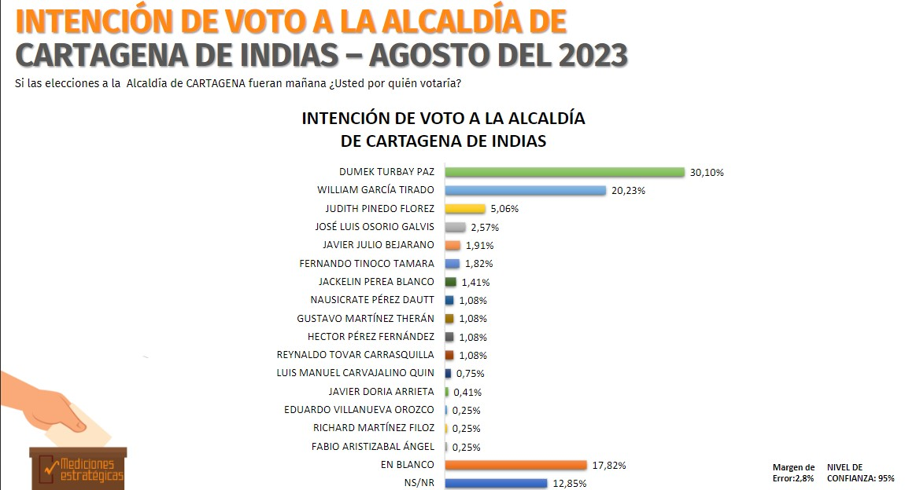
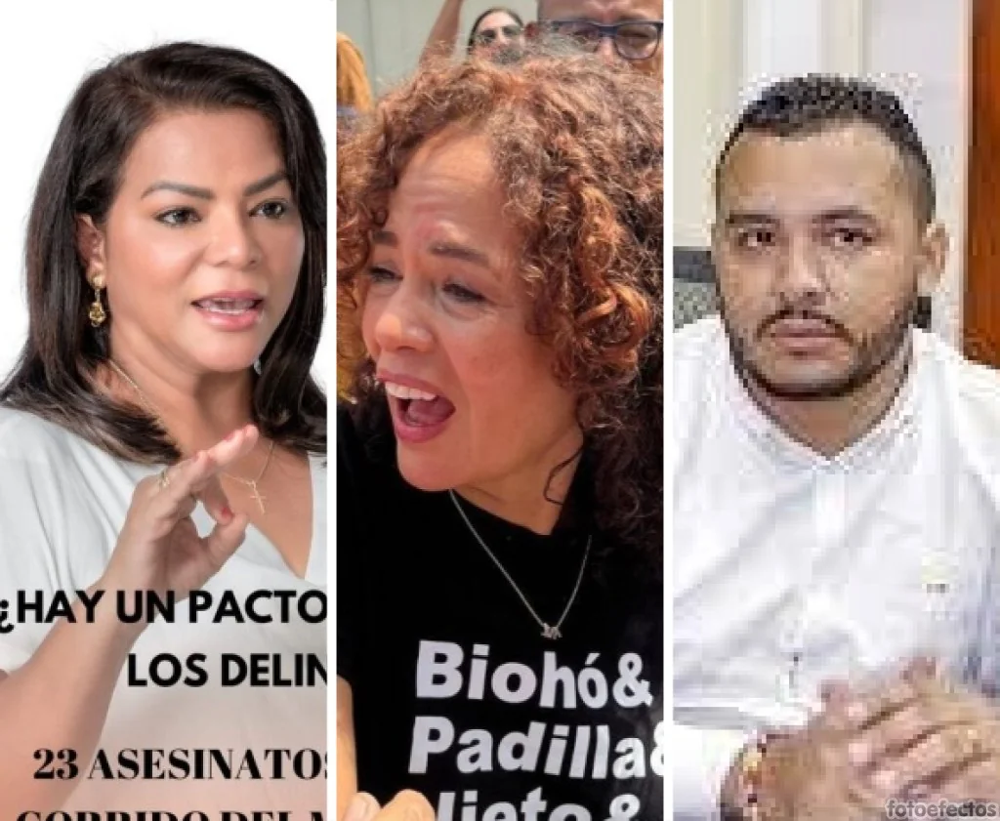
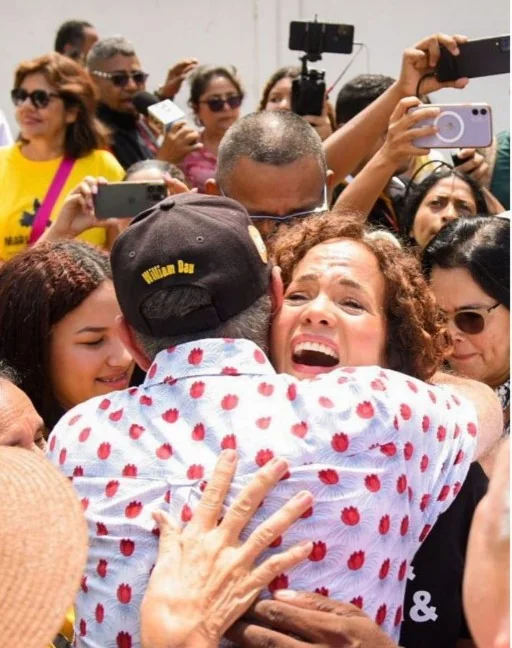
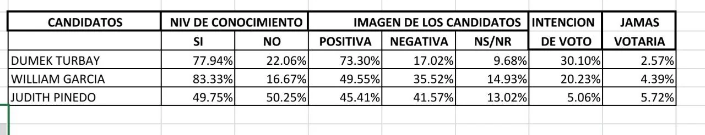

*La razón por la que Turbay y García lideran encuestas en Cartagena. ¡*

¿Por qué el síndrome del **«**abrazo de Dau» benefició a Turbay y García y enterró a **«Mariamulata»**? La última encuesta de **Mediciones Estratégicas**, del reconocido economista, asesor político y exsecretario de Hacienda Distrital, **Oscar Brieva**, confirma una tendencia del comportamiento de los potenciales votantes en las principales ciudades de la región Caribe. Respecto a la alcaldía de Cartagena, las preferencias son lideradas en su orden por el exgobernador **Dumek Turbay Paz y (30,10%**) y el exparlamentario **William García Tirado (20,23%)**. Sigue en su orden descendente la **«Mariamulata»** (5,06) con una diferencia de menos 25 puntos respecto al primero y 15 con el segundo.  

En ese sentido, el análisis responderá a tres preguntas. ¿Cuál es la razón por la que Turbay está en solitario con una cómoda ventaja sobre su inmediato perseguidor? ¿Cómo se puede modificar el panorama? ¿Se podría organizar una tercería y en cabeza de quien? Este análisis busca orientar a la opinión pública frente a lo que pueda suceder después del 8 de septiembre, fecha en la cual se vence el plazo para las adhesiones y el desmonte de candidaturas.

**«**El abrazo de Dau», como cualquier virus que periódicamente azota la salud de nuestra población, enterró la candidatura de Judith Pinedo y Julio Bejarano. Dau fue un sol para ellos, hasta el punto que los achicharró. Aquí explicaremos este fenómeno para que los estrategas de Dumek y William García tomen las decisiones acertadas.

Te puede interesar: [William García, el emprendedor](/articulos/william-garcia-el-emprendedor/)

## Esta es la intención de voto

*En esta medición se aplicaron 1306 encuestas en Cartagena. ¿La ineptitud de Dau incide sobre estos resultados?*

Empecemos por analizar los estudios del mercado electoral. La encuesta de **Mediciones Estratégicas** define tendencias que se pueden intuir de los resultados que arrojó la del **Centro Nacional de Consultoría-CNC**. Por ejemplo, **Jacqueline Perea** aparecía con la cuarta mejor intención de votos, empatada técnicamente con **Judith del Carmen**. En aquel momento se dijo que la tendencia de Jacqueline es subir y la de **«Mariamulata»** es bajar. Esto tiene su explicación, ya que _la mujer con pantalones_ viene cuestionando la administración casi desde sus inicios.

En la encuesta del CNC, **Jacqueline** superaba a **Julio Bejarano** y se acercaba a **Judith**. Pero, en la medida que el debate se polariza, Dumek se está transformando en el antagonista de El Buitre. No tanto por Dumek, sino por la torpeza del mediocre alcalde que tenemos. El 79%, según la encuesta, no votaría por el candidato del alcalde. Por esta razón, cada vez que Dau arremete contra Dumek, sepulta a Judith Pinedo, su candidata, y eleva a Dumek, su antagonista.

Ahora bien. Del pelotón, técnicamente están empatados cuatro candidatos con menos del 2%. No tienen nada que hacer. Ni siquiera uniéndose todos a Judith con el fin de crear una tercería. Solo un candidato supera el 2%, **José Luis Osorio Galvis** (2,57%). Llama la atención lo mal que le va a **Javier Julio Bejarano** de la coalición Pacto Histórico (1,91%). Está prácticamente empatado con el rector de IAFIC, **Fernando Tinoco Támara** (1,82%), quien con su nadadito de perro va avanzando. Los 5 candidatos que no llegaron al 1% en la encuesta del CNE y de Mediciones Estratégicas, pueden estar considerando el desmonte de sus candidaturas.

## ¿Si desmontan a Bejarano también a **«Mariamulata»**?

*¿La tercería? se va al fondo.*

En política hay que tomar decisiones libres de emociones, de lo contrario, nos lleva al fracaso. Colombia Humana debe analizar muy bien a quién apoyar. Es un hecho que la candidatura de Julio Bejarano sea desmontada, al decir de Carmen Anachury. Pero, lo más importante no es si lo desmontan o no. Lo fundamental es hacía dónde van Colombia Humana y el Pacto Histórico.

Hasta ahora, la candidatura del Pacto Histórico es un fracaso rotundo. Como la candidatura de la Alianza Verde. Para evitar un fracaso total de la coalición de gobierno, debería adherirse a uno de los candidatos que lideran las encuestas. Como coalición del presidente de la República, se esperaba mucho, por lo menos disputando una tercería.

La marquilla presidencial tiene peso, por lo cual se espera mucho de los candidatos del Pacto Histórico, ya que el potencial de votantes en Cartagena es altísimo. Esto se demostró con los votos de la representante **Dorina Hernández** del Pacto Histórico de Bolívar. En su municipio, Mahates, solo obtuvo 364 (3,2%). Mientras que el Partido Conservador alcanzó 5.227 votos (46%). Ni qué decir en su pueblo natal, Palenque, recibió 60 votos. En Cartagena, Dorina alcanzó **59,680 votos**, el segundo mejor resultado (20% de la votación), detrás del partido Conservador. La gente no votó por Dorina, votó por la marquilla.

No obstante, las mediciones del mercado electoral son factores reales que uno debe tener en cuenta al momento de analizar y tomar decisiones políticas. Las encuestas dicen que los candidatos del Pacto Histórico (Julio Bejarano) y de Alianza Verde (Judith) no han despertado ningún fervor para una tercería ¿por qué insistir? La candidatura de **Judith Pinedo**, quien para entrar en la pelea, hoy debía estar por encima del 12%. No lo consiguió ni en el CNC ni en Mediciones Estratégicas de agosto. Está condenada al fracaso lo mismo que le sucedió a Araújo en las pasadas elecciones.

## El **«**abrazo de Dau» acabó con una tercería

*El «abrazo de Dau» que sepultó una tercería para la alcaldía de Cartagena.*

Lo primero a resaltar en este análisis: **se esfuma cada día la posibilidad de una tercería**. El abrazo de Dau fue un desastre para Judith Pinedo y la tercería. En las elecciones anteriores, donde todo estaba dado para que la tercería fuera **Fernando Araújo** frente a **William García y Yolanda Wong**, surgió la sorpresa de El Zambiloco. En aquel momento, las encuestas no le favorecieron a Araújo y, al final, recibió una pírrica votación. Hoy **—**no sé mañana**—** no hay ninguna posibilidad de alguna sorpresa. ¡Excepto que haya un fraude! **Las elecciones a la alcaldía tienen un solo ganador que está entre William García y Dumek Turbay**. **¿Quién será ese ganador?** (En la próxima entrega analizaremos las fortalezas y debilidades de estas dos candidaturas).

En estas elecciones la **«Mariamulata»** no levanta vuelo. Sus alas están empapadas del virus de El Zambiloco. El golpe de ala de El Buitre fue tan fuerte en aquel abrazo fatídico que **VoxPopuli Digital** dio a conocer. Abrazo mortal en el día de su liberación que se convirtió, a la postre, en la tumba de su candidatura. ¡Nació muerta! William Dau tiene un 80% de imagen negativa y el 79% no votaría por el candidato que él apoye, dice la encuesta. Ese día, William García y Dumek Turbay respiraron tranquilos, porque sabían del lastre que arrastra el alcalde de Cartagena que está apoyando a Judith Pinedo Flórez. Veamos estos números:

*Tabla elaborada por Mediciones Estratégicas.*

Esto es clave. Los tres candidatos más conocidos en su orden, según la encuesta, son: **William García** (**83,33%**), **Dumek Turbay** (**77,94**%), y **Judith Pinedo** (**49,75%**). Hasta ahora no hay ninguna posibilidad de que Judith remonte a Dumek y García. **Ni siquiera que Julio Bejarano y José Osorio se les unan.** El impacto en la opinión pública sería casi nulo, porque el candidato del Pacto Histórico no goza de simpatía al interior de Colombia Humana, tal como se demostró en los audios que se filtraron de una reunión donde participó la vicepresidenta, Carmen Anachury.

## ¿Pacto Histórico se adhiere a Judith Pinedo o William García?

La idea de Anachury es que el Pacto se adhiera a **«Mariamulata»** en Cartagena, y a Yamilito Arana para la gobernación de Bolívar. Pero, otro sector mayoritario está pensando en la propuesta de que el Pacto debe unirse a William García y a Yamilito con el fin de crear un impacto ganador entre los simpatizantes que nunca se irían con Dumek. Si esto sucede, seguramente el candidato de _Los tres golpes_ se dispararía en la opinión pública y pondría en aprietos a el exgobernador.

En efecto, existen tres razones poderosas para que el Pacto Histórico se una a William García y no a Dumek, de acuerdo a la opinión de muchos lideres de esa coalición.

**Primera.** Las propuestas de William García están alineadas a las estrategias y objetivos del Plan de Desarrollo Potencia Mundial para la Vida. Es el único candidato con firmas y posibilidades de victoria.

**Segund**a. William García y Yamilito Arana tienen un acuerdo político. El Pacto Histórico seguramente se adherirá a Yamilito, según la misma declaración de Carmen Anachury en los audios que se filtraron. Si esto sucede, harían moñona con un solo esfuerzo para la alcaldía de Cartagena y la gobernación de Bolívar.

**Tercera razón**. Una coalición en crisis, como lo es el caso del Pacto Histórico, puede redimirse con una candidatura viva que con una muerta. Si el Pacto se une a William García podría remontar la poderosa candidatura de Dumek Turbay Paz y alzarse con la victoria.

Si bien, la imagen positiva de Dumek es superior con 73,30%, William García puede remontarse si logra convencer a sus indecisos (no sabe no/responde) que es del 15%. García podría aprovechar que lo conocen más para que se traduzca esa ventaja en una imagen positiva y supere en la final a Dumek.

Te puede interesar: [Apoyo de W. García a Yamilito ¿precipitará acuerdos electorales?](/articulos/apoyo-de-w-garcia-a-yamilito-precipitara-acuerdos-electorales/)

## **«El abrazo de Dau»**, una elección para aprender

En efecto, la primera pregunta que nos hicimos al principio, no deja de ser problemática en la medida en que busca explorar las razones por las cuales un candidato, pese a los cuestionamientos judiciales que tiene y le endilgan sus contrarios y los medios de comunicación, hoy se encuentra encumbrado en las mediciones. Así lo señalan encuestas como la del Centro Nacional de Consultoría (CNC) para la revista Semana y, por supuesto, de **Mediciones Estratégicas** para Canal Cartagena, **VoxPopuli Digital** y otros medios periodísticos.

El alza de la imagen de Dumek es proporcional al decrecimiento de la imagen del alcalde. La ley del karma, como se dice coloquialmente. Determina que lo que uno hace, afecta a otro. Dau hizo su campaña a la alcaldía contra Dumek acusándolo de malandrín, y extendió tal descalificación a todos los políticos de Cartagena y de Bolívar. Hoy, en contraprestación, Dumek acciona judicialmente al Zambiloco, y recibe el beneficio en perjuicio de su contrario. Debió retractarse en todo.

Sin duda, Dumek Turbay y Judith Pinedo están sufriendo las consecuencias del síndrome del **«abrazo de Dau»** . Es un virus que se metió en el ADN de Dumek y Turbay, y por eso tienen sus consecuencias. Por un lado, cavó la tumba de la candidatura de **«Mariamulata»** y, al mismo tiempo, le dio vida a Dumek.