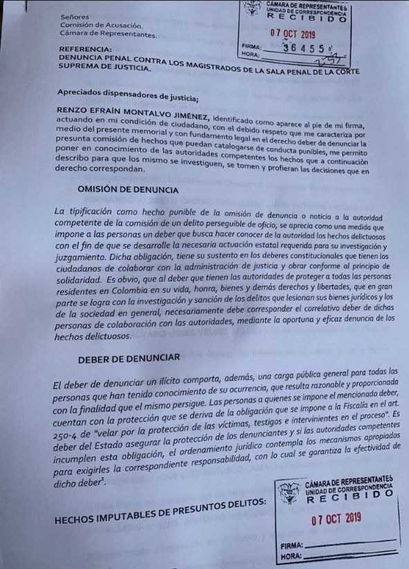
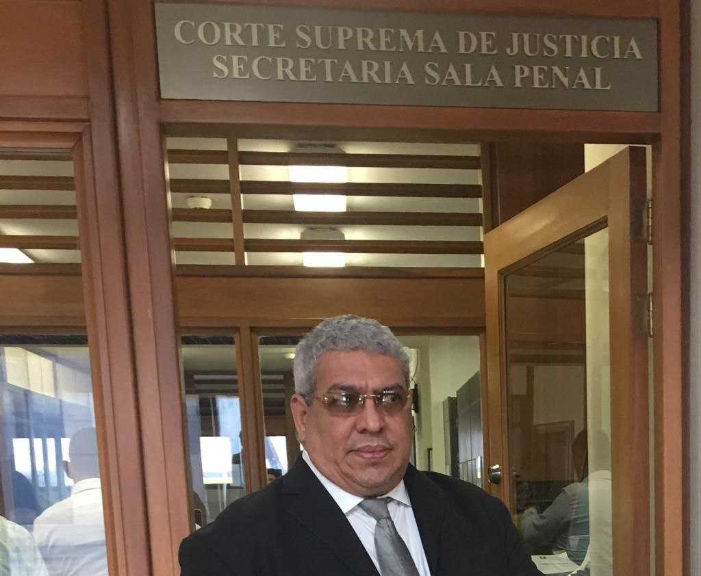

*De izquierda a derecha, el magistrado (CSJ) Francisco Javier Farfán Molina, el exmagistrado (CSJ) José Luis Barceló y el procesado, el expresidente del senado Arturo Char Chaljub.*

Detrás del connotado abogado Iván Cancino _—_el penalista que dio la cara en la defensa del «rey**»** **Arturo Char Chaljub**, expresidente del senado_—_ no solo está la expresidenta de Findeter **Sandra Gómez Arias**. También el cerebro de la nueva estrategia jurídica de su defensa, el exmagistrado de la Sala de Casación de la Corte Suprema de Justicia (CSJ), [**José Luis Barceló Camacho**](https://luciotorres.local/corte/index.php/presidente/). Todo apunta al viejo truco para torcerle el pescuezo a la justicia. Esto es, buscar que se declare el impedimento del magistrado [Francisco Farfán Molina](https://luciotorres.local/corte/index.php/2019/06/18/francisco-javier-farfan-molina-2/) de la Sala de Instrucción de esa corporación, antes de proferir cualquier acto que incumbe a este sonado proceso de corrupción política y electoral.

Inclusive, a juicio de especialistas, **José Luis Barceló Camacho** fue un _magistrado de bolsillo_ de la familia Char y de sus aliados. Por lo menos en tres procesos que conoció en el ejercicio de esa magistratura, demostró su alto grado de parcialidad en _contravía_ de la jurisprudencia y del acervo probatorio. Por estos hechos, el abogado **Renzo Efrain Montalvo Jiménez**, lo denunció en 2019, ante la Comisión de Acusaciones de la cámara de representantes. Esto, por supuesto, no solo es amoral sino ilegal. Porque, presuntamente, emitió fallos preñados de ilegalidad con barniz de legalidad. A todas luces, fueron fallos contrario a la jurisprudencia. Es decir, que pudo prevaricar haciendo nula toda su actuación como administrador de la máxima justicia poniéndola al servicio de los _delincuentes de cuello blanco_.

## Impedimento del magistrado, la vieja estrategia

El magnate del Junior, **Fuad Ricardo Char Abdala**, enroló en su fila de primera defensa técnica a un centro delantero dispuesto a meterle el gol a la justicia y liberar momentáneamente al «rey» Arturo de tanta presión jurídica y mediática. Don Fuad, exsenador y exministro, gran estratega de las finanzas y de la política, con esta jugada maestra pretende sacar de su cubilete, la varita mágica que blindará a su familia de la arremetida judicial. Al llegar el exmagistrado Barceló Molina a la defensa técnica dirigida por el **bufete de Iván Cancino**, lo primero que tendría que deliberar la Sala de Instrucción, es el supuesto impedimento del magistrado Farfán que por oficio lo puede hacer a pedido de la parte.

Además, y esto puede ser lo fundamental, busca dilatar el proceso para que se declare el impedimento del magistrado Farfán Molina en este caso y en todos los casos que tengan que ver con la familia Char. Así Don Fuad lograría dos hechos de suma importancia. **Primero,** el proceso se dilataría y se alargaría más allá de las elecciones del 29 de octubre. **Segundo**, podrían sustituir a Farfán Molina por un magistrado de sus entrañas o afín.

¿Cuál es el as que sacarán del cubilete de Don Fuad? Sencillo, que como José Luis Barceló participó en la selección de Francisco Javier Farfán como magistrado de la Sala de Instrucción de la Corte Suprema de Justicia y quien tiene el caso penal de Fuad, Arturo y Alejandro Char, se debería declarar impedido para seguir conociendo el proceso. Para esto, los Char podrían buscar a un falso veedor o abogado de su _roster_ y presentar el supuesto impedimento de Farfán.

## El conflicto de intereses de Barceló

Por esa razón, las autoridades competentes y la misma Corte deben advertir este posible conflicto de intereses del abogado de Arturo Char, exmagistrado **José Luis Barceló**, para tomar dicho caso. Rechazar el nombre de Barceló no significa vulnerar su derecho al trabajo y a representar a un ciudadano que necesite de sus servicios profesionales. Por el contrario, existe un derecho superior, cual es la moralidad pública y el derecho de una justicia imparcial, transparente e independiente.

## La norma del impedimento del magistrado

Como saben los especialistas, el artículo 30 del Código Contencioso Administrativo (CCA) lo reformó el artículo 309 de la Ley 1437 de 2011, que en una de sus partes dice:

> > «A los funcionarios que deban realizar investigaciones, practicar pruebas o pronunciar decisiones definitivas, se aplicarán, además de las causales de recusación previstas para los jueces en el Código de Procedimiento Civil, las siguientes:  
> > 2\. Haber sido recomendado por él para llegar al cargo que ocupa el funcionario o haber sido designado por éste como referencia con el mismo fin».

## Barceló, el muñeco de la defensa

*Capture de pantalla. Aquí esta el radicado de la denuncia impetrada por el abogado Renzo Montalvo contra los magistrados de la Sala Penal de la CSJ, entre ellos, José Luis Barceló.*

Como quiera que la Corte tiene el acervo probatorio suficiente y eficaz de la responsabilidad penal del expresidente del senado, determinó recluirlo en La Picota y no en ninguna otra parte. Por lo menos, en esta etapa del proceso.

En ese sentido, respetando la investidura y la capacidad del exmagistrado José Luis Barceló Camacho, se le hace la advertencia desde la sociedad civil para que no permita que lo transformen en un muñeco jurídico. Es necesario que recapacite y se dé cuenta que estaría siendo instrumentalizado por el poder del dinero en forma de honorarios para conseguir un efecto jurídico en este caso del expresidente del senado.  La ética del abogado i**ncluye honestidad, integridad, confidencialidad, lealtad, independencia y respeto a los derechos y normas legales**, tal como lo dice la propia Universidad Militar Nueva Granada, de la cual es egresado.

La Sala Especial de Instrucción, al momento de dictar la orden de captura, señaló que las pruebas recaudadas en la investigación proveen el estándar mínimo para sustentar de manera adecuada la razonabilidad de la medida de aseguramiento contra Arturo Char Chaljub. Es una medida idónea, necesaria y urgente. Por tanto, dice la Corte, no es procedente sustituirla por una detención domiciliaria, ni por medidas no privativas de la libertad.

## El «rey**»** **Arturo** tiene nacionalidad estadounidense

El «rey**»** **Arturo** había fijado su residencia en Miami después de que su familia resolvió los problemas con la justicia norteamericana. Al parecer, llegaron a un acuerdo económico para que le otorgaran el respectivo visado que se le había negado a los hermanos Char Abdala, entre ellos al patriarca Don Fuad. El primero que fijó su residencia en el país del norte fue Antonio, el presidente del junior.

No obstante, aparte de ese acervo probatorio, la determinación también obedece al comportamiento del investigado que pone en duda su normal comparecencia al proceso. Así como a riesgos advertidos en la práctica probatoria y en la actividad investigativa. Quiere decir, que como el «rey**»** **Arturo** fijó su residencia en Miami y se hizo nacional de los Estados Unidos, existe un alto porcentaje de que pueda torear la justicia desde ese país como lo han hecho muchos procesados.

## El abogado Renzo contra Barceló

*El abogado Renzo Montalvo Jiménez, litigante ante las altas cortes. Aquí en la Sala Penal de la Corte Suprema de Justicia.*

Para demostrar la tesis del conflicto de intereses de Barceló y que se abstenga de asumir la defensa de Arturo Char, es urgente y necesario apelar a la denuncia entablada (octubre de 2019) por el abogado barranquillero **Renzo Efrain Montalvo Jiménez**. La denuncia la presentó ante la Comisión de Acusaciones de la cámara de representantes contra los tres magistrados de la Sala Penal de la Corte Suprema de Justicia. Estos son: José Luis Barceló Camacho, Fernando Castro Caballero y Luis Antonio Hernández Barbosa.

Frente a esa denuncia, la Comisión de Acusaciones tomó la decisión de avocar la investigación mediante auto de sustanciación con **radicado No 5375 del 2 de julio de 2020**. El representante investigador se designó en su momento a Gabriel Santos García del Centro Democrático, e hijo del exvicepresidente Francisco Santos.

El parlamentario investigador avocó el conocimiento de las diligencias en contra de los magistrados señalados en el auto de sustanciación. Luego resolvió iniciar la investigación previa conforme a lo indicado por el artículo 424 de la ley 600 de 2000. De igual manera, ofició a la Procuraduría y a la misma Corte para que le certificara si los mencionados magistrados participaron en el algún proceso administrativo o electoral de esa Corporación.

## La prueba de fuego: evitar el impedimento del magistrado

**VoxPopuli Digital** está haciendo los esfuerzos necesarios para entrevistar al exmagistrado **José Luis Barceló** con el fin de plantearle todos estos elementos que pone a prueba su capacidad de autocrítica desde el punto de vista de la filosofía del derecho y, en particular, de la ética profesional del ejercicio de la abogacía. Pero también, es una prueba de fuego de la Sala de Instrucción de la Corte Suprema de Justicia para demostrar que a los _delincuentes de cuello blanco_ también le cae el peso de la justicia en el momento justo.

## Próxima entrega: _Los tres casos del magistrado Baceló que favoreció a la familia Char_