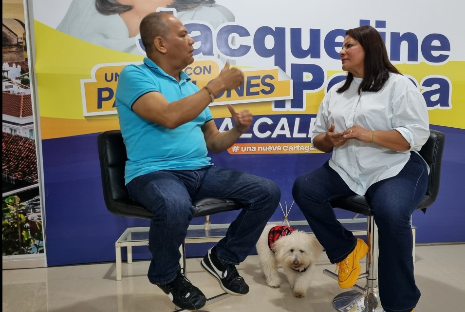

*Aquí con Jacqueline Perea, una mujer con pantalones.*

Son dos mujeres las pretendientes de ser alcaldesa de Cartagena de Indias. Una de ellas es **Janqueline Perea Blanco**. Se hace llamar jocosamente _la mujer con pantalones_. Es una manera de expresar la falta de autoridad reinante, especialmente del alcalde actual, la peor pesadilla que desde hace 3 años y 8 meses viene soportando la _Ciudad Heroica_.

**Jacqueline Perea** se hizo esposa, madre y abuela. Tiene una linda mascota, Mateo Jose. Su esposo, Pepe del Toro, es su asesor político, exalcalde de la localidad No 3. Es la mamá de Majo. Se hizo abogada. Especialización en Gerencia Social y una Maestría en Ciencias Políticas.

## Jacqueline Perea: Dau, un alcalde sin pantalones

En esta entrevista conocemos la faceta humana de Jacqueline Perea. Su sororidad, su lengua vivaz y audaz, es el tormento que tiene el acalde William Dau. Esto implica que esté bien enfrentada a **Judith Pinedo Flórez**, la que se supone que es la candidata del alcalde.

https://youtu.be/C92efj4kWN0?feature=shared

Jacqueline Perea, una entrevista sabrosa.

La lengua de Dau queda apagada frente a la de Jacque, como popularmente la conocen sus amigos. Por dos razones. **Primera razón**: Habla firme y fuerte. Sin gaguear. Con autoridad. **Segunda razón**: Cada señalamiento suyo contra la administración, tiene la prueba detrás. Esto es lo más importante, porque no es una _pelea de pretil a pretil._ Ella le enrostra la evidencia al alcalde **William Dau**, quien tiene que callarse ante las evidencias.

Desde el comienzo de esta administración, Jacqueline Perea se convirtió en la verdadera oposición de William Dau. Enfrentó a las famosas bodegas digitales usadas para perseguir a los críticos de la mala gestión del alcalde. Animó el frustrado proceso de revocatoria del alcalde. Frustrado, porque si bien el pueblo firmó y se recolectaron las firmas necesarias, la Registraduría no las validó. Este hecho se interpretó como una decisión política de respaldo a un gobierno que siempre ha estado contrario a los intereses de las comunidades de esta ciudad.

Si quieres conocer a Jacqueline, es ineludible que la veas en esta entrevista. Una entrevista sabrosa y con altura.