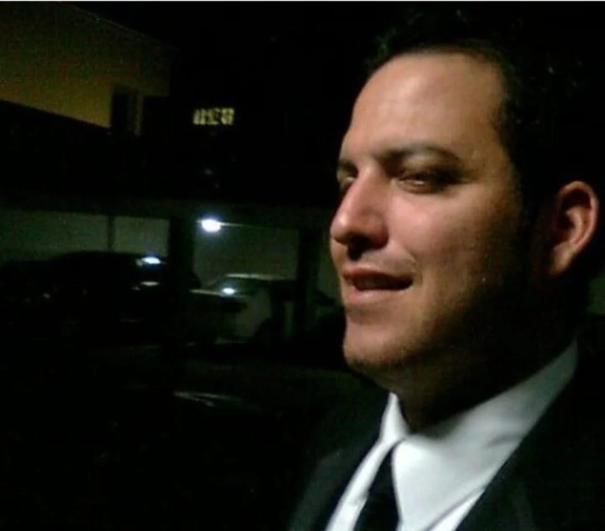

*Veedores amenazados capturan en cámara a sospechoso que tomaba foto y grababa.*

Los veedores amenazados y objeto de un complot gestado desde las mismas canchas de golf del **Club Campestre de Cartagena**, entre ellos **Erick Urueta Benavides**, denunciaron hoy que, al parecer, personas desconocidas les están haciendo seguimiento de sus actividades. Para sustentar esta sospecha, Urueta mostró los videos de la grabación obtenida de las cámaras de vigilancia instaladas en su residencia.

Efectivamente, allí se puede observar a un motorizado que, en la noche del 31 de agosto, tomando fotos y videos a la casa donde reside el reconocido veedor de la ciudad. Por esta razón, el líder sindical y social, manifestó que en las próximas horas presentará la denuncia penal respectiva, ya que él junto al abogado **Héctor Pérez y Enaldo Tovar**, vienen siendo víctimas de amenazas y complot para asesinarlo.

Para Erick Urueta, quien narra el movimiento del motorizado, la actitud del sujeto es sospechosa de todo punto de vista. Sobre todo, porque la conducta se produjo en el momento en que entró un familiar a su residencia. Esta situación la reportó a la policía y a las autoridades correspondientes.

**Te puede interesar**: [Venganza pasional de Fanny Batista aclararía complot contra Héctor Pérez (II)](/articulos/venganza-pasional-de-fanny-batista-aclararia-complot-contra-hector-perez-ii/)

## Los veedores amenazados

https://youtu.be/rqCZ1bVrnPs

Vea el video de la conducta sospechosa del desconocido en la residencia de **Erick Urueta**, quien junto a **Héctor Pérez**, se encuentran en una situación de riesgo.

Como se recuerda, los líderes sociales se encuentran amenazados. Es la razón fundamental para que se prendan las alarmas. El complot, que **VoxPopuli Digital** viene documentando en varias entregas, al parecer, indica que fuerzas oscuras asociadas al empresario **Jhon Villamizar Gómez** querían organizar un plan para asesinar al abogado Héctor Pérez y otros líderes sociales.

Ese macabro plan lo organizaron socios del Club Campestre de Cartagena. Ante esta situación, señalamos en la tercera entrega que su presidente, **Miguel E. Desmoineaux Glen, y el conjunto de su directiva,** deben aclarar ante la opinión pública lo que pasó en su organización. Se dijo, que si bien los directivos no tienen nada que ver con este plan criminal, por lo menos tienen la responsabilidad de aclarar ante la opinión por qué razón tomaron represalias contra uno de los socios (Adolfo Vergara) que fue capaz de denunciar dicha situación.

**Te puede interesar**: [Denuncian a Villamizar y Lemus por plan para asesinar a Héctor Pérez](/articulos/denuncian-a-villamizar-y-lemus-poplan-para-asesinar-a-hector-perez/)

## La tutela

*Luis Fernando Lemus presentó denuncia contra lideres y periodistas que denunciaron el complot para asesinar a Héctor Pérez.*

**VoxPopuli Digital** publicó la primera entrega cuando el veedor **Erick Urueta Benavides** presentó la denuncia del supuesto complot ante la Fiscalía. En ese momento se dijo:

> Aunque la denuncia dice que va contra personas indeterminadas, se relacionó a los presuntos determinadores del plan, vale decir, los empresarios **Jhon Villamizar Gómez, **Luis Fernando Lemus González, Juan Pablo Girón** y Fanny Batista**.

Sin embargo, **Luis Fernando Lemus González**, contrató a un abogado y presentó una denuncia contra los líderes sociales y este periodista. Además, previamente **Jhon Villamizar y Fanny Batista Quintero** presentaron una acción de tutela (**Rad. No 13001-31-05-008-2023-00-220-00**) contra el periodista de VoxPopuli Digital y Humberto Mercado de Frente a Frente. Pero, el juez Octavo Laboral del Circuito de Cartagena, **Issa Rafael Ulloque**, la desestimó porque no advirtió ninguna prueba que indicara que se le había violado algunos de los derechos fundamentales.

**Próxima entrega**: **_El débil contraataque de Lemus_**

**Te puede interesar**: [En el Club Campestre planeaban asesinar a Héctor Pérez (III)](/articulos/el-golpe-de-chuleta-en-el-club-campestre-de-cartagena/)