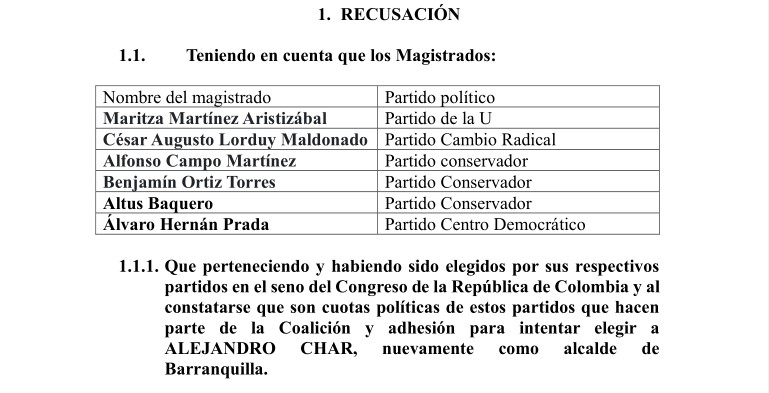

*Usan los niños para su proselitismo político. Alejandro Char y Eduardo Verano están moralmente inhabilitados. Hoy CNE pone en vilo a Alex Char.*

A menos de dos días, la candidatura de **Alejandro Char** sigue en vilo. La estrategia de manipulación de la verdad, omitiendo hechos reales y anticipándose a las decisiones de la autoridad electoral que se vino a pronunciar el pasado 23 de octubre, su campaña electoral llevó a información falseada de la Gran Prensa el 22 de octubre. Solo hoy, 27 de octubre, se dará a conocer la decisión definitiva del **Consejo Nacional Electoral-CNE** al conocer el recurso de reposición de este periodista que solicitó la revocatoria de su candidatura.

Si el CNE confirma la resolución recusada, se procederá a solicitar un recurso de nulidad por cuanto violáría los principios que rigen el debido proceso, el cual es un derecho fundamental que se puede reclamar vía tutela. Esta sería la razón por la cual la candidatura de Char seguiría en vilo.

Al mismo tiempo, se solicitó la recusación de seis (6) magistrados de esa corporación: Maritza Martínez Aristizábal, César Augusto Lorduy, Alfosno Campo, Benjamin Ortiz Torres, Altus Baquero y Álvaro Hernán Prada.

La magistrada ponente, Maritza Martinez, se encuentra incurso en un conflicto de intereses al aceptar decidir sobre la inhabilidad de Alejandro Char. Si bien ella fue senadora por el partido de la U, tiene una intima relación política con el jefe de Cambio Radical Germán Vargas Lleras. Lo acompañó en su campaña a la presidencia de la República. Germán Vargas Lleras, es el padrino político y de su esposo **Luis Carlos Torres**, exgobernador y exsenador por Cambio Radical.

La Gran prensa difundió la versión de la campaña de Alejandro Char, según la cual el CNE había ratificado la validez de la candidatura a la alcaldía de Alejandro Char. Esa versión técnicamente no era cierta, porque la resolución fue objeto de un recurso de reposición y solo hoy el CNE lo resolverá.

Te puede interesar: [¿Pumarejo contrató con Serfinanza y se tiró la candidatura de Alex Char? (IV)](/articulos/pumarejo-contrato-con-serfinanza-y-se-tiro-la-candidatura-de-alex-char-iv/)

## ANÁLISIS DE LUCIO TORRES

https://youtu.be/W4lYuzBRdM0?feature=shared

Hoy el CNE define la validez de la candidatura de Alejandro Char.

## EN VILO CANDIDATURA DE ALEJANDRO CHAR

Por otra parte, también están recusados seis (6) magistrados. Uno de los cuales. como se dijio, César Lorduy Maldonado, se declaró impedido en el pleno de la Sala del pasado **23 de octubre de 2023.** De hecho, para votar la reposición, el CNE debe resolver la recusación de los otros cinco (5) magistrados. Si no lo hace, cualquiera que sea su decisión, sería nula de toda nulidad.

Te puede interesar: /articulos/los-10-hechos-inhabilitantes-de-alex-char-que-juzgara-el-cne-ii/

## Hoy CNE pone en vilo a Alex Char: Transmisión

https://fb.watch/nXzDodTk40/