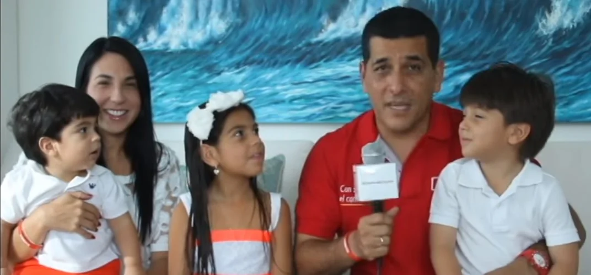
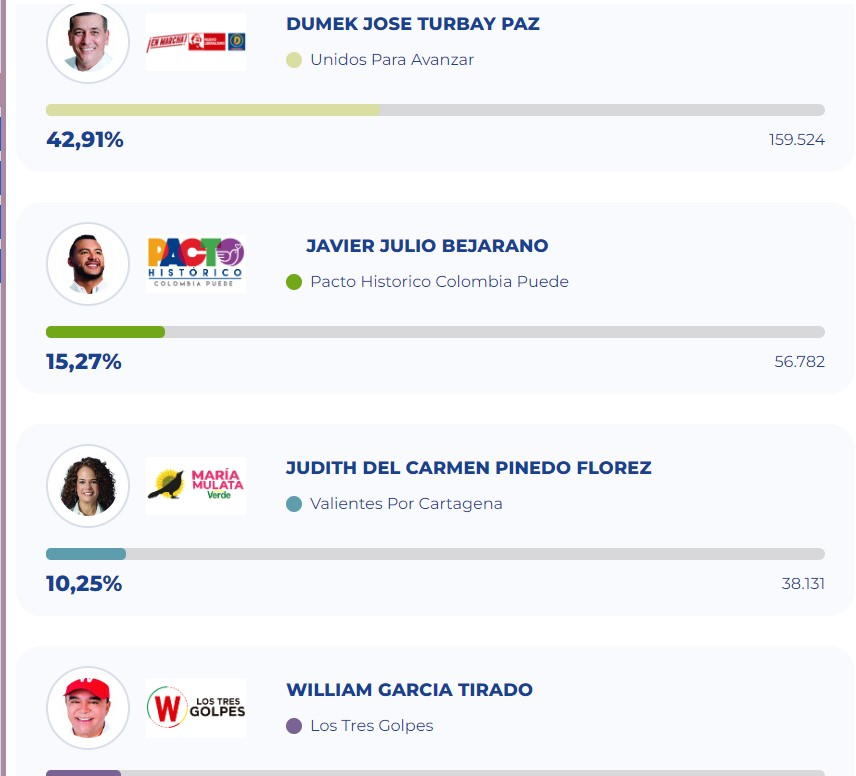

*Dumek Turbay, su esposa Liliana Majana y sus hijos. ¡Conjurada la maldición!Cortesía.*

¡Se acabó la improvisación! También la estupidez hecha pasta en Cartagena. **¡Dumek, alcalde electo**! ¡Conjurada la maldición! Su triunfo fue contundente e inobjetable. Dejó atrás todas las encuestas y alcanzó una cifra cercana al 43% de los resultados electorales de una ciudad sumida en el caos, el desgobierno y la inmoralidad político-administrativa. Ahora, Dumek Turbay tiene el reto de superar con creces la mala obra del _**Tractor**_ que se convirtió en una _**carretilla desguañangada**_ y en una pesadilla a lo _Fredy Kruger_.

En la mañana de este 29 de octubre de 2023, llovía copiosamente como hacía 16 años. Parecía un mal presagio para el candidato Dumek Turbay igual que en esas elecciones de octubre de 2007 cuando se produjo lo que ahora se conoce como el _síndrome Juan Carlos Gossaín_, quien aparentemente tenía todo resuelto con los líderes políticos de los barrios, por lo que cerró su tienda de campaña electoral anticipadamente. Pero fue derrotado sorpresivamente por _Mariamulata_. Ella pretendía hacer lo mismo en el día de hoy.

Tomando en cuenta los últimos resultados emitidos por la Registraduría Nacional, la victoria del candidato de la coalición política **Unidos para Avanzar**, **Dumek José Turbay Paz**, fue imparable. Lo mismo que hizo **Yamil Hernando Arana Padauí** en la gobernación de Bolívar. Dejaron regados a todos sus perseguidores. Se hicieron inalcanzables. Dumek, por ejemplo, demostró que los pronósticos estaban acertados en cuanto a su victoria, contrario a lo que desde hace 16 años sucedía con los candidatos de las maquinarias políticas de Cartagena.

**El artículo que advirtió la maldición:** [¿Dumek romperá la maldición política en Cartagena? (I)](/articulos/dumek-rompera-la-maldicion-politica-en-cartagena-i/)

## ¡Conjurada la maldición! Estos son los resultados.

*William García decepcionó. Turbay triplica a su segundo, Javier Julio Bejarano y quintuplica a Maríamulata. No hubo tercería.*

¡Conjurada la maldición! El pasado 8 de octubre publicamos un artículo que prendió las alarmas en la campaña de Dumek Turbay. Desde hacía 16 años ninguno de los candidatos de las maquinarias había triunfado pese a lo que indicaban las encuestas. Le sucedió a **Juan Carlos Gossaín** en 2007, a la difunta María del **Socorro Bustamente** en dos oportunidades y a William García hace 4 años.

De hecho, la victoria de Dumek conjuró esa maldición al no cerrar las puertas de su campaña en la parte final de las elecciones. Atendió a _Raimundo y todo el mundo_ y estuvo atento al vaivén político. Supo atraer los votos de William García, neutralizó los intentos de fraude y detuvo el ascenso de Julio Bejarano y de Judith Pinedo.

Esa fue la razón fundamental por la cual hoy su victoria no tiene ninguna tacha. Ni siquiera los intentos de fraude que se habían diseñado en esta ocasión tuvieron éxito, como hace cuatro años. Dumek lo tenía todo fríamente calculado y dispuso las medidas preventivas para no tener ninguna sorpresa. Él mismo vivió el trago amargo de la derrota de Juan Carlos Gossaín en 2007. Pero ahora estaba preparado para conjurar esa _maldición política_. De ahora en adelante, en Cartagena los líderes políticos deben cambiar de estrategia.

Te puede interesar: [Los delfines del próximo concejo de Cartagena](/articulos/los-delfines-del-proximo-concejo-de-cartagena/)

## Dumek superó a Campo

Las cifras no mienten. **Dumek Turbay** obtuvo **el 42.91%** de los resultados electorales. En términos de números redondos, su votación es de 159.254 votos. Tuvo una marca histórica. Superó por más de mil votos lo alcanzado por **Campo Elías Terán Dix** (octubre de 2011), que **fue de 158.000** sufragios. O sea, Dumek Turbay es hoy el candidato que más votos ha recibido en toda la historia electoral de Cartagena de Indias.

Romper el récord de Campo Elías obliga a Dumek Turbay a asumir un reto mayor. Y esto lo dejó sentado en su breve discurso pronunciado en la noche de este 29 de octubre en el barrio obrero de Blas de Lezo.

Además, como si fuera una carrera ciclística, dejó regados a sus rivales. Triplicó a su segundo, **Javier Julio Bejarano**, uno de sus más enconados rivales. Julio Bejarano aseguró con ese lugar su paso al concejo de Cartagena. Y quintuplicó a Judith Pinedo Flórez y a William García.

## El reto de Dumek

*En Blas de Lezo, barrio obrero, donde nació la ilusión del triunfo, recibió el agradecimiento del triunfador. Aquí el veedor David López abraza a Dumek.*

Después de agradecer a Dios y a su familia, su esposa **Liliana Majana** y a sus hijos, Dumek dijo que asumirá el reto que deberá enfrentar los próximos 4 años. El alcalde electo dijo en su breve discurso que el reto es asumir los grandes desafíos en materia de desarrollo económico y social que enfrenta nuestra amada Cartagena:

> _"A partir de este momento soy el alcalde de todos los cartageneros (aplausos) . . . Un buen gobierno no puede distinguir entre amigos y enemigos. Hago un llamado cordial a todas las fuerzas políticas y ciudadanas a hacer un frente común para que Cartagena recupere el brillo y el esplendor uniendo esfuerzo y voluntades_.

Después de la batalla electoral, como si fuera un guerrero en reposo y con su espada envainada, Dumek fue humilde en la victoria. Al respecto, dijo:

> Depongo cualquier diferencia que haya surgido en esta campaña. Tengo un corazón lleno de ilusiones. Tengo un corazón lleno de afectos. Quiero invitarlos a que emprendamos juntos la tarea".

Después de su discurso en Blas de Lezo, una fuente nos informó que se fue a cumplir una cita que le había prometido a su abuelita de más de 90 años.

## Se acabaron 4 años de la otra maldición

Los resultados fueron evidentes. No cabe una pizca de duda sobre el triunfo de **Dumek Turbay**. De esta manera, Cartagena saldrá del peor alcalde que haya tenido en toda la historia. Después de cuatro años de farsa, bufonería y corrupción galopante, el electorado cartagenero quería salir de William Dau a como diera lugar.

¿Fue una salida desesperada? ¡No! La más inteligente. El elegido es inteligente, preparado en la administración pública y con una carrera política que apenas comienza. **Lo que se puede decir con franqueza es que Dumek José Turbay lo hará mil veces mejor que el bufón demente, un loquillo al** que tendremos como alcalde hasta el 31 de diciembre de 2023. ¿Por qué no renuncia?

Esa fue la peor maldición política conjurada por el triunfo de Dumek José, una maldición que dejó profundas heridas en la ciudad y en el pueblo cartagenero. Y para más piedra, pese a los 60 procesos penales y disciplinarios, nos lo dejaron 4 años, como para que esa maldición causara todos los estragos que causó.