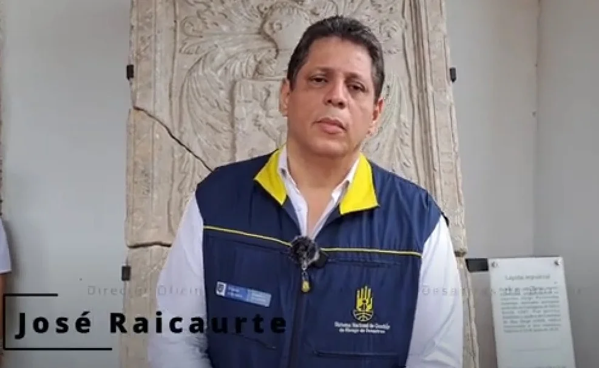

*Intensas lluvias provocan inundaciones y desastres. Mitigación ante aguaceros, anuncia José Ricaurte, director Oficina Asesora para la la Gestión del Riesgo de Desastres de Bolívar.*

Intensifican mitigación ante aguaceros. Las intensas lluvias del 29 de octubre provocaron un retraso de dos horas de la jornada electoral en Cartagena de Indias. En tanto, sigue la búsqueda de un joven desaparecido en uno de los cales de El Pozón.

Por esta razón el director de la Oficina Asesora para la Gestión del Riesgo de Desastres de Bolívar, **José Raimundo Ricaurte Gómez**, se puso al frente con acciones para mitigar el impacto negativo sobre las elecciones.

## Desaparece menor

La Oficina Asesora para la Gestión del Riesgo de Desastres de Cartagena (OAGRD) informó que continúa la búsqueda del joven de 17 años, Daniel Graterol Castillo. El adolescentes se lanzó a nadar en el canal Chiamaría 2 del barrio El Pozón el pasado sábado en medio de la lluvia. Y está desaparecido.

Esta temporada de lluvia está haciendo estragos en Cartagena y en gran parte del departamento de Bolívar. Laspoblaciones más afectadas son las que quedan a orillas de los caños,lagunas y ciénagas. Ante esta situación se prendieron las alarmas. De igual manera la Oficina viene realizando un censo con el fin de caracterizar a la población damnificada y establecer un plan de atención integral

Se están limpiando caños y canales por parte de Cardique para evitar sus desbordamiento.

## José Raimundo Ricaurte en VoxPopuli Digital

https://youtu.be/mA\_B50dsjVw

Tres días de intensas lluvias sobre cartagena de Indias