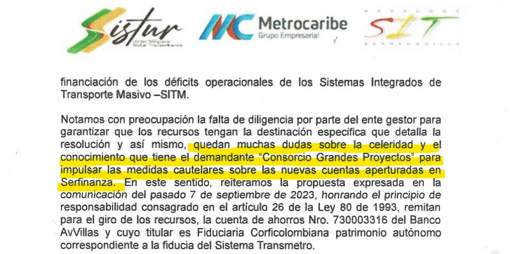

*Los 10 hechos inhabilitantes de Alex Char. Sin duda, existe una inhabilidad que salta a la vista. Veremos si el CNE.*

Desde este lunes **2 de octubre de 2023, el Consejo Nacional Electoral**_—_CNE analizará los **10 hechos inhabilitantes** de **Alex Char Chaljub** que le impiden ser candidato a la alcaldía de Barranquilla. Este organismo deberá definir en los próximos días su inhabilidad. **En la solicitud de revocatoria que redactamos y presentamos como defensores de los derechos humanos y de los derechos colectivos de la sociedad,** contiene incontrovertibles evidencias de que al **inscribirse el pasado 28 de julio** ante la Registraduría Nacional, rompió el régimen de inhabilidades e incompatibilidades determinado por la **Ley 136 de 1994**, modificada por el artículo 37 de la **Ley 617 de 2000**.

La solicitud de revocatoria se presentó el pasado viernes 29 de septiembre, último día para recibir solicitudes de ese carácter. Pero, solo el lunes recibirá la secretaría del CNE la solicitud para luego escoger, vía sorteo, al magistrado ponente de este imbricado tema. ¿Qué se busca con esta iniciativa? Se pretende poner sobre la mesa de trabajo de esa corporación electoral la continuidad de Alex Char en su disputa por tercera vez de la alcaldía distrital de Barranquilla. ¿Por qué? Se lo explicaremos en esta segunda entrega sobre su inhabilidad.

Te puede interesar: [Serfinanza y Valorcon, la Corte cierra el cerco financiero del «rey» Arturo (VII)](/articulos/serfinanza-y-valorcon-la-corte-cierra-el-cerco-financiero-del-rey-arturo/)

## La solicitud de revocatoria

*Este es captura de pantalla del envío de la solicitud de revocatoria de la candidatura de Alejandro Char enviado a las 3:14 pm al CNE.*

En este caso concreto, **la evidente inhabilidad de Alejandro Char Chaljub salta a la vista**. Está relacionada no solo con los **contratos financieros suscritos entre Serfinanza** y el Estado, en el orden nacional, departamental y distrital. También existen otros hechos que analizaremos en las próximas entregas. Hoy, solo se hace una reseña de **los 10 hechos inhabilitantes de Alex Char**.

En la solicitud se enumeraron ocho hechos. Pero, en la adición que se presentará el lunes, se agregaron dos hechos que ya tienen antecedentes en el mismo CNE con los fallos de la última semana. Resulta que existe un **contrato de arriendo del estadio metropolitano con la Corporación Popular Deportiva Junior de Barranquilla**, propiedad de la familia Char, que debe pagar tan **solo $5,4 millones** al Distrito por concepto de uso y disfrute de esa infraestructura. Llama la atención la sentencia que revoca la inscripción de la candidatura a la gobernación del Valle de **Tulio Gómez** del partido Alianza Verde. El hecho inhabilitante es la firma de un contrato de arriendo de un local del estadio perteneciente a la alcaldía municipal y administrado por la Secretaría del Deporte de Cali, a la Corporación Deportiva América de Cali, donde el candidato es accionista mayoritario.

Sin embargo, si el CNE obra con pulcritud, los primeros 8 hechos inhabilitantes son suficientes para que se revoque la inscripción a la alcaldía de Barranquilla de **Alejandro Char Chaljub**. La ponencia debe tramitarse en las dos primeras semanas de octubre para que no afecte el tarjetón en el supuesto caso de que se revoque la inscripción del candidato de Cambio Radical.

Te puede interesar: [¿CNE revocaría inscripción de Alex Char por inhabilidad? (I)](/articulos/cne-revocaria-inscripcion-de-alex-char-por-inhabilidad/)

## Los 10 hechos inhabilitantes

1.  Es un hecho que **ALEJANDRO CHAR CHALJUB** se inscribió como candidato a la alcaldía de Distrital y Metropolitana de Barranquilla el 28 de julio de 2023**.**
2.  **El Aspirante** al cargo de alcalde de la ciudad de Barranquilla, siendo accionista de SERFINANZA y en su papel de alcalde metropolitano de Barranquilla, firmó un acuerdo del área metropolitana en 2016 con el fin de crear el **Fondo Metropolitano de Estabilización Tarifaria del Sistema Masivo de Transporte_—_Transmetro.**  Igualmente autorizó al director del Área Metropolitana para contratar un encargo Fiduciario que administrara los recursos de este fondo.
3.  Ese acuerdo fue reemplazado (pique allí para leer la prueba) por el **No 003 de 2019** (documento no disponible)**,** con la firma de **Jorge Padilla Sundheim**, asesor jurídico y amigo de ALEJANDRO CHAR, quien de manera directa benefició a la empresa SERFINANZA, donde es accionista el hoy candidato.
4.  El 23 de marzo de 2023 se abrieron cuentas de ahorros y corrientes en Serfinanza, tal como lo señalan las cartas del representante legal de Recaudos SIT, **Fernando Álvarez Rangel**, al gerente de Serfinanza, **Jean Piero Celia**. La motivación de esos oficios se debe al embargo del giro de Minhacienda por la suma de **$27.286 millones**. Las otras cuentas también fueron embargadas. El otro hecho que se debe tener en cuenta es el pronunciamiento del **Tribunal Administrativo de Atlántico Sección C**. Igualmente, el director del Área Metropolitana de Barranquilla, **Libardo García,** dijo a los medios de comunicación del momento lo siguiente:

> «Desde su creación en el 2016 se han recaudado **$93.618.035.169**, que han servido para dar sostenibilidad a Transmetro. Ha sido la salvación para Transmetro, para poder mitigar el impacto de la diferencia entre la tarifa técnica y la tarifa que se le cobra al usuario».

Te puede interesar: [Expediente No 114: La fortuna de los Char proviene de su sociedad con «el Caracol»](/articulos/expediente-no-114-la-fortuna-de-los-char-proviene-de-su-sociedad-con-el-caracol/)

## Los otros hechos inhabilitantes

5\. De acuerdo al último informe de gobierno corporativo de Serfinanza del mes de enero de 2023, la entidad pertenece en un 97% de sus acciones a la familia Char. El mismo candidato a la alcaldía Alejandro Char Charjub tiene 41,4 millones de acciones. (Dele clic aquí: informe de gobierno corporativo de Serfinanza (documento no disponible)).

6\. El 7 de septiembre de 2023 explotó en los medios de comunicación de Barranquilla un hecho que estaba en secreto. Los **$27.286 millones girados** por el ministerio de Hacienda y Crédito Público al Fondo de Estabilización Tarifaria y que debía llegar a Corficolombiana, la entidad que se había contratado inicialmente para el encargo fiduciario, extrañamente apareció en una cuenta de ahorros de Serfinanza. Transmetro SAS tiene varias cuentas financieras en ese banco de los Char. Además, tenía una cuenta en AvVillas del Grupo Aval. Esta situación salió a la luz pública, debido a que los dineros al llegar a una cuenta embargada, el representante de Recaudos SIT (en liquidación), **Fernando Álvarez Rangel**, solicitó al gerente de Serfinanza, **Jean Piero Celia**, no atender la solicitud de embargo. (Ver Carta de no embargo del 11 de septiembre de 2023 al gerente de Serfinanza jean Piero Celia).

7\. En la carta que **Fernán Álvarez Rangel** le envía al gerente de Transmetro SAS se evidencia que la cuenta enviada por esa entidad correspondía al banco Serfinanza. Es decir, que los dineros girados por Minhacienda al Fondo de Estabilización para resolver el déficit no llegaban a su destino, como lo determinó la Resolución No. 2446 del 4 de septiembre de 22023 del Ministerio de Hacienda y Crédito Público. Esta maniobra, al parecer, se hace por intermedio del banco Serfinanza. (Ver aquí: carta de **Fernán Álvarez Rangel** al gerente de Transmetro). Nótese lo que en ella se dice sobre las dudas acerca de las cuentas aperturadas en Serfinanza:

*Carta firmada por Fernán Álvarez Rangel al gerente de Transmetro.*

## Los 10 hechos inhabilitantes de Alex Char: el octavo

El octavo hecho inhabilitante que tiene Alejandro Char Chaljub para ser candidato es aún más contundente, siempre y cuando el CNE pruebe que existe una renovación del contrato suscrito en 2020 por el alcalde **Jaime Pumarejo Heins**, socio de Alejandro Char en _El Heraldo_ y otras entidades que se han beneficiado con los recursos del Distrito de Barranquilla. Es un sistema de entramado empresarial que usa la familia Char para captar los recursos oficiales destinados a sus empresas que luego los reciclan. Por ejemplo, existen evidencias de que _El Heraldo_ tiene acciones en la **Triple A** con el fin de no generar incompatibilidades. Pero, al parecer, el alcalde Pumarejo y su familia son accionistas del periódico.

Un hecho evidente es que el alcalde del Distrito de Barranquilla **pignoró los ingresos de libre destinación a través de un contrato crediticio con Serfinanza**. ¿Para que empeñó los ingresos del Distrito? Ahora no se trata de responder a esa pregunta, pero denota cómo la familia Char usa las finanzas públicas a su antojo y necesidades, que son distintas a las necesidades y prioridades de la ciudad. Si bien este contrato se firmó el **18 de junio de 2020**, existen sospechas de que fue renovado recientemente, dentro del período inhabilitante del 29 de octubre de 2023. ([Pique aquí el contrato de crédito y pignoración](/articulos/documento/contrato-de-emprestito-interno-y-de-pignoracion-de-rentas-celebrado-entre-el-distrito-especial-industrial-y-portuario-de-barranquilla-y-banco-serfinanza-s-a/)).

## El solicitante

**¿Por qué Edison Lucio Torres Moreno (mi nombre completo) hizo la solicitud de revocatoria?** Es la pregunta que se hacen de boca en boca en Barranquilla y en algunas partes del país. Si le revocan la inscripción, se evitaría un golpe más fuerte a la ciudad y a la misma familia Char con el inevitable encarcelamiento de Alejandro. Sería un golpe más profundo para Fuad Char, su padre, quien debe estar sufriendo el dolor de ver a su hijo Arturo en La Picota. ¿Soportará su corazón de padre tener otro hijo encarcelado por el ejercicio de la política? ¿Soportaría un titular como este?:

> «Encarcelado el alcalde de Barranquilla, Alex Char».

Sea lo que sea, la ciudad no merecería que a su alcalde lo metieran preso. Recuerden, el próximo año tendremos nuevo fiscal y no será de Cambio Radical.

Por otra parte, al periodista le cuesta muy duro hablar de sí mismo y, especialmente, de su trayectoria profesional. Antes que nada soy un ciudadano que ama, que es padre y abuelo. **¡Un abuelo que hace el amor!** Y vive un tiempo extendido después de que «Jorge 40» lo iba a matar. Hace 15 días recibí en Bogotá el galardón de mejor periodista de investigación (y análisis, que no es lo mismo, agrego) a manos de **_Gacetas de Colombia_**, dirigido por **José Gámez**. Fue el mejor homenaje al cumplir _—_este 2023_—_, ¡**40 años**! de ejercicio profesional del periodismo. Jamás he participado en concursos de periodismo. Por una sola razón: **el ejercicio del periodismo no es ninguna competencia.** Es un servicio vocacional a las personas y a la sociedad.

## Mi trayectoria

Los que conocen mi trayectoria de vida, saben que ejerzo esta profesión con **independencia absoluta**. Pero, sobre todo, con coraje y consideración. **Coraje ,** porque se necesita valentía para circunscribirse a los hechos verdaderos y a los principios integrales que rigen mi vida moral y espiritual. **Consideración**, porque es la expresión de humildad para tomar en cuenta al Otro, que de una u otra forma, se afecta con mi trabajo profesional.

Algunas personas no saben que, además de periodista, soy emprendedor, experto en comunicaciones estratégicas y asertivas, ejerzo la docencia y la defensa de los derechos humanos. En 2004 fui galardonado por la Defensoría del Pueblo y la Universidad Externado de Colombia como el docente más destacado en un **alto curso de derechos humanos** (DDHH) dirigido por el magistrado auxiliar de la Corte Constitucional en ese entonces, **Alexei Julio Estrada**.

Hoy, Julio es el director legal de la Comisión Interamericana de Derechos Humanos_—_CIDH. A él le debo mi capacidad para argumentar en teoría de los derechos humanos desde la perspectiva constitucional y del bloque de constitucionalidad. **Todos mis trabajos de argumentación recibieron calificación Triple A Plus (AAA+).** Eso me valió un premio: una beca para estudiar derechos humanos en Washington.

Te puede interesar: [La mala suerte del «rey» Arturo y el fin del Califato  Daes—Char (V)](/articulos/la-mala-suerte-del-rey-arturo-y-el-fin-del-califato-daes-char/)

En la próxima edición, te presentaremos los dos hechos restantes de los 10 que son inhabilitantes de Alex Char.

## Conozca la petición de revocatoria de la inscripción de Alex Char