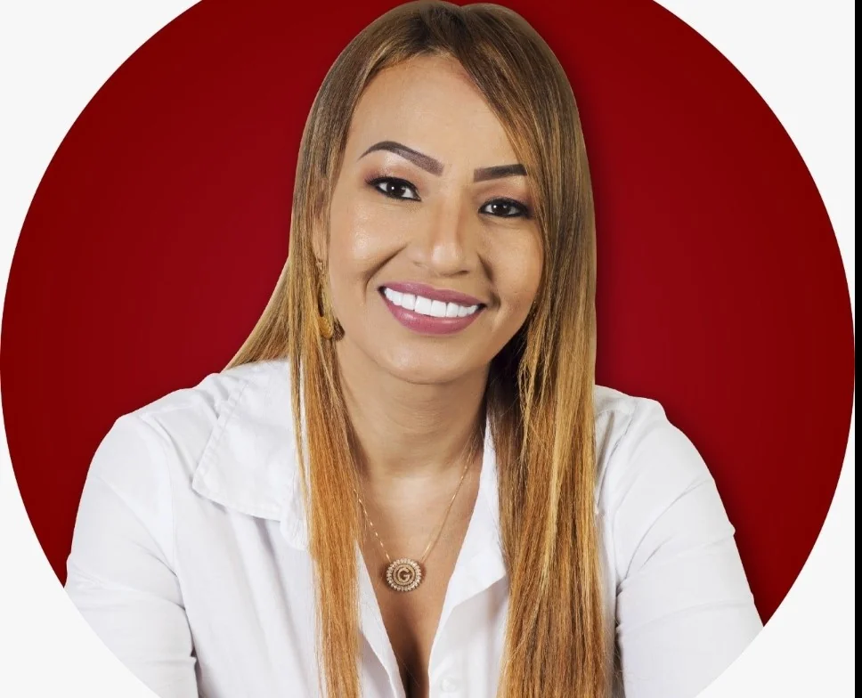
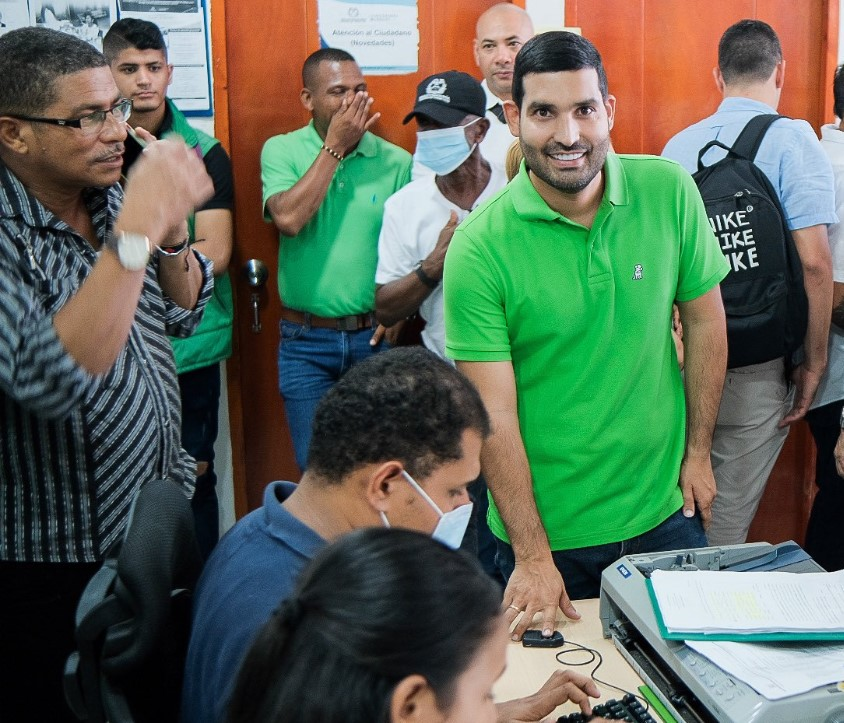
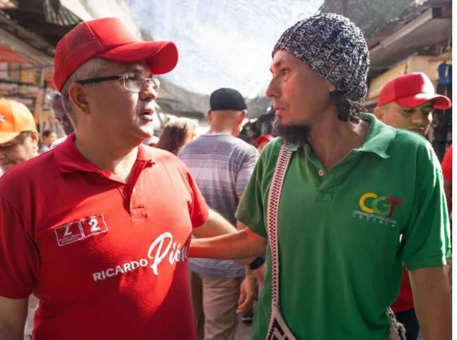

*Algunos de los delfines: Carlos Raad (A.V. No 9), Laura Díaz (A.V. No 2) y Ricardo Pión (Liberal 2).*

Cartagena, como muchas otras ciudades, no tiene suerte con su concejo. Las decisiones que toma, casi siempre van en contravía de lo que la gente quiere. Ejercen un control político condicionado a los intereses del alcalde de turno. Por esta razón, los delfines pretenden llegar con nuevas iniciativas. Algunos de ellos son hijos de concejales o de familia de tradición política: **Carlos Raad** (hijo del exconcejal Adolfo), **Laura Díaz** (hija del exalcalde Carlos Díaz y de la notaria Eudenis Casas), **Ricardo Pión** (hijo del concejal César Pión) y **Wadi Romano** (de la familia Romano).

Te puede interesar: [¡Última encuesta! Predicciones electorales en la Costa Caribe](/articulos/ultima-encuesta-predicciones-electorales-en-la-costa-caribe/)

## Alfredo Díaz, el exdecano del concejo

https://youtu.be/6IVgKR3sPrU

Alfredo Diaz quiere regresar al concejo acompañando a Yamilito Arana a la gobernación. Cortesía.

Al mismo tiempo, algunos veteranos quieren regresar. Es el caso del que fuera el decano de los concejales de Cartagena. Nos referimos al dirigente del otrora Movimiento Madera, **Alfredo Díaz Ramirez**. Si a Díaz Ramirez lo elijen, sería el mejor homenaje que su electorado le haría a uno de los hombres que más se destacó en la corporación. Es un audaz político que, por su veteranía, sería un aporte de su experiencia a jóvenes que buscan la renovación del concejo de La Heroica.

## La resurrección de Gloria

*La resurrección de Gloria Estrada No 10 del partido Liberal. Cortesía.*

Se quiere destacar a la concejal **Gloria Estrada** (partido Liberal No 10). Una mujer que sufrió el ataque criminal atribuido al ahora candidato al concejo **Pedro Aponte**, actual edil de la localidad No 2 de la Ciénaga de la Virgen. Gloria, víctima del complot, al parecer, diseñado por Aponte, sufrió cárcel igual que su compañero sentimental Martín Barreto. Información no oficial de la Fiscalía, indica que existen pruebas irrefutables de que fue el individuo que preparó el complot con la complicidad de un oficial y varios agentes de Policía del Distrito de Cartagena.

Te puede interesar: [Conspiradores narcopolíticos ¿”pies en polvorosa”? (II)](/articulos/conspiradores-narcopoliticos-pies-en-polvorosa/)

## ¡Los delfines al poder!

https://youtu.be/Uuxl4i\_Tg1M?feature=shared

Como se dijo, son varios jóvenes designados a continuar la línea política de sus familias. ¡Los delfines al poder! Y tienen madera para la práctica política. Aquí reseñamos algunos de ellos.

## Los delfines y la dinastía de los Raad,

*Carlos Raad (Alianza verde No 9) al concejo de Cartagena. ¿Los delfines se tomarán el concejo? Cortesía.*

Carlos Raad (Alianza Verde No 9), un joven con una capacidad política evidente refleja la cara de los delfines. Refleja en cada uno de sus planteamientos electorales la línea dinástica de los Raad. No necesita ser presentado como hijo de Adolfo Raad, exconcejal que jugó un papel destacado en el control político de los alcaldes de turno. Carlos Raad, también sobrino de Miguel Raad, el único gobernador de elección popular que tiene Magangué en la historia de Bolívar, quiere seguir el camino de la dinastía que en algún momento inició su abuelo **Juancho Raad**, un destacado líder del conservatismo magangueleño. Tal vez quiere superar los pasos de su padre. Pero podría llegar más allá de las metas alcanzadas por **sus tíos Miguel, Elías y Alfredo**. Elias raad, quien fuera representante a la Cámara por el partido de la U, en los últimos años regresó a su partido madre, el Conservador, ejerciendo la dirección del mismo.

## Laura Díaz Casas, la esperanza de los Díaz

*El entusiasmo de Laura Díaz (Alianza Verde No 2) la cara de los Diaz Casas.*

La joven Laura (Alianza Verde No 2) quiere ser concejal. Lo será. Tiene madera. Carisma. Es atractiva en su expresión política. Tampoco necesita decir que es hija del exalcalde y exconcejal **Carlos Díaz Redondo** para que la escuchen. ¡Los delfines al poder! Si bien es la delfin de los Díaz Redondo, se lo gana por sus propios méritos. La veo recorrer diferentes barrios, aunque ella no lo sabe. Solo hasta ahora. Pero, la que está bien entusiasmada es a su madre, **Eudenis Casas**. La última vez que hablé con su madre fue en un almuerzo brindado por una amiga común. El bocachico que cada uno devorábamos, se enredaba con las palabras sobre el quehacer político. Sin duda, Laura estará en el concejo renovando la vieja política.

## Ricardo Pión

*Ricardo Pión, es uno de los delfines que le quiere dar continuidad a la labor de su padre César Pión.*

Por la familia Pión toma el relevo Ricardo, el hijo mayor del concejal César Pión. Diferente a su padre, el primogénito se inscribió con el número 2 del partido Liberal. Aunque siempre había sido de la colectividad de su padre. Ricardo Pión Botero, no solo sigue la experiencia de su padre sino también del legado dejado por su abuelo, el legendario dirigente cívico de Magangué, **Antonio Botero**.

## Wadi Romano

*Wadi Romano, se encadenó por los usuarios de Afinia.*

Los Romano son muy conocidos en esta ciudad. Además de políticos, algunos hicieron carrera en lo judicial y otras áreas del servicio público. Wadi Romano (partido Conservador No 19) espera regresar al concejo. En esta oportunidad se encadenó para protestar contra Afinia y llamar la atención de los usuarios que son víctimas del cobro desmedido de esta empresa. Hay que escuchar a Wadi.

Son muchos los candidatos a Concejo y Asamblea que se podría destacar de Cartagena. Pero comprendan, no es posible. Lo que sí tenemos tiempo es para aclarar que lo dicho aquí no es ninguna propaganda política. Es simplemente una reseña voluntaria del consejo de redacción de **VoxPopuli Digital**.