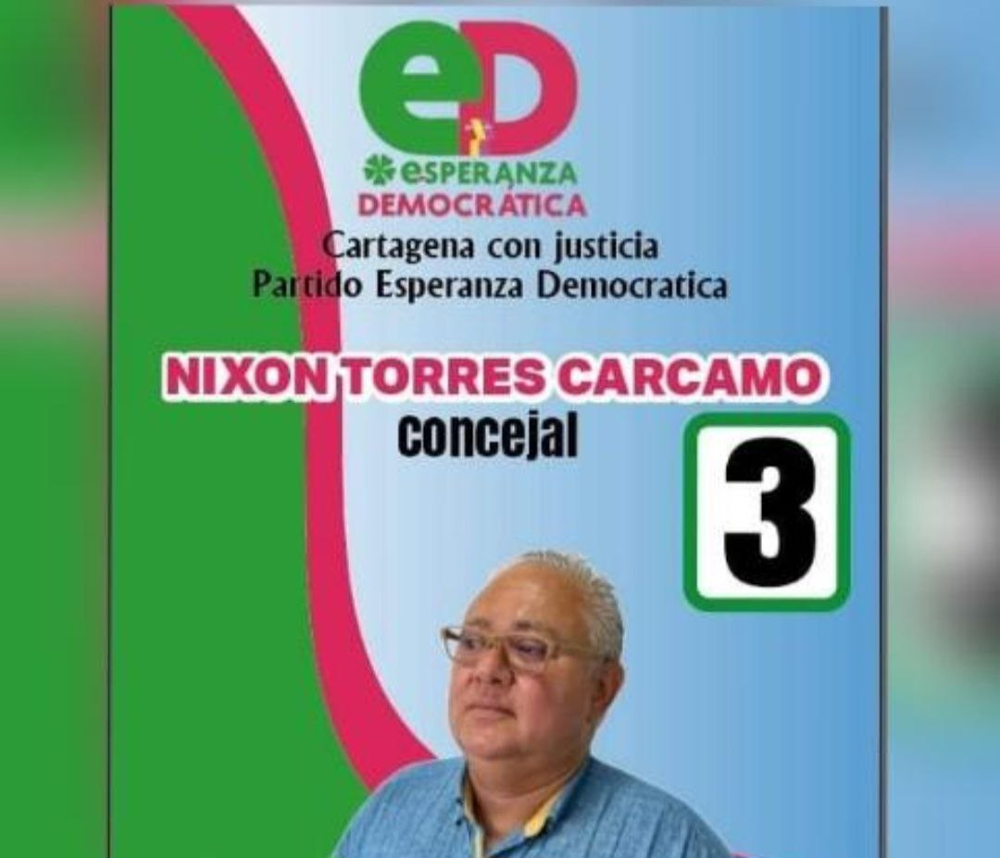

*Nixon Torres, la Esperanza Democrática del concejo de Cartagena*

El constitucionalista y administrativista, **Nixon Torres Cárcamo**, es el principal candidato (**No 3 en la lista**) que tiene **Esperanza Democrática** en su lista al concejo de Cartagena. Si es elegido, sería un salto cualitativo que daría la corporación en los próximos cuatro años, en el entendido de que su capacidad intelectual y su independencia política, demostrada en la práctica, son garantías para un verdadero control político al alcalde de turno.

En efecto, Nixon Torres es un destacado abogado y, al mismo tiempo, activista político. Acompañó varios movimientos en Cartagena y Bolívar. Se le recuerda, entre otros, su papel como impulsor para detener el cobro de los peajes. Presentó una acción ciudadana ante la Corte Constitucional y acompañó al **movimiento antipeaje**.

Te puede interesar: [Los peajes no cumplen con el marco tarifario](/articulos/el-cobro-de-los-peajes-no-cumplen-con-el-marco-tarifario/)

## VEA LA PROPUESTA DE ESPERANZA DEMOCRÁTICA EN EL CONCEJO

https://youtu.be/8qjr7ti7K6w?feature=shared

Nixón Torres propone tres elementos para construir la Esperanza Democrática en el concejo de Cartagena.

Como se recuerda, el Pacto Histórico carece de una lista unificada en el concejo. Se pensaba que podía constituir una fuerza capaz de obtener 60 mil votos, y arrastrar con ello, por lo menos 5 concejales. Pero, la disputa por la candidatura a la alcaldía de Cartagena, provocó una lucha canibalesca que terminó rompiendo cualquier unidad, incluso, para las corporaciones públicas. No tiene lista para asamblea mucho menos para concejo.

La candidatura de **Javier Julio Bejarano** no cohesionó al Pacto Histórico en Cartagena. Por el contrario, ¡Implosionó su unidad! Quedó vuelta añicos. Además, se dio una disputa del centro del poder del Pacto Histórico y varias organizaciones de Bolívar. Algunos directivos nacionales querían a Mariamulata con Alianza Verde para construir una tercería a la alcaldía que hiciera frente a Dumek y a García. Otros apoyaban a **Liner Campo**, quien ganó la consulta de Colombia Humana. Pero, el pulso lo ganó una fuerza constituida por 5 de las 12 organizaciones que constituían la coalición que apoyaba a **Julio Bejarano**, quien llegó a la candidatura **sin la unidad de la coalición**.

Lo anterior sería la causa de una derrota inminente del Pacto Histórico y de los demás candidatos procedentes del petrismo y del sector alternativo de Cartagena y Bolívar.

Te puede interesar: [¡Rebelión del PH Bolívar! Piden al supremo jefe Petro respetar participación territorial](/articulos/rebelion-del-ph-bolivar-piden-al-supremo-jefe-petro-respetar-participacion-territorial/)

## Nixon Torres en el concejo

Si la izquierda y todos los sectores alternativos que no se pudieron agrupar en torno a una lista al concejo del Pacto Histórico y un **candidato unitario**, por lo menos, pueden encontrar en **Nixón Torres**, la alternativa de Esperanza Democrática. No es fácil. Se necesita una campaña digital intensiva para que la lista sea conocida entre los mismos de la izquierda y de los alternativos.

Si logran promover la lista de Esperanza Democrática intensivamente, seguramente tendrían una significativa votación que podría superar el umbral, y después a esperar que la cifra repartidora de curules le sea beneficiosa.