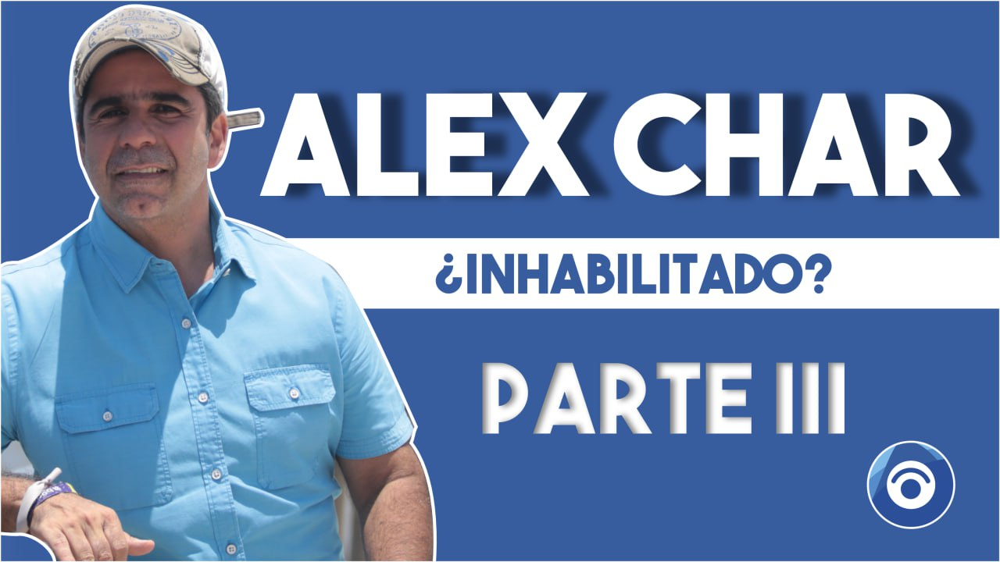

*CNE avoca inhabilidad. Las cuentas fantasmas de Serfinanza que inhabilitan a Char.*

Ya la presunta inhabilidad de Alejandro Char dejó de ser una investigación y análisis periodísticos para convertirse en una investigación de carácter administrativo. El Consejo Nacional Electoral-CNE avoca la investigación contra la inscripción a la alcaldía de Barranquilla de uno de los principales miembros de una familia que domina política, económica y culturalmente a esta gran ciudad. La decisión del tribunal electoral la tomó mediante a**uto No 326-MMA-2023** de la tarde 10 de octubre. Este hecho, se constituye, por sí solo, en un indicio de que francamente el candidato de Cambio Radical **violó flagrantemente el régimen de inhabilidades e incompatibilidades establecido por las leyes 136 de 1994 y 617 de 200**0.

La magistrada ponente del CNE, **Maritza Martínez Aristizabal**, en el artículo primero del mencionado auto, señaló:

> "AVOCAR CONOCIMIENTO de la solicitud de revocatoria de la inscripcion del candidato ALEJANDRO CHAR CHALJUB, identificado con cedula de ciudadanía numero 72.136.235, inscrito por el partido politico CAMBIO RADICAL a la ALCALDlA DE BARRANQUILLA, por presuntamente estar inhabilitado para participar en las elecciones del 29 de octubre de 2023, expediente radicado CNE-E-DG-2023-044564".

## ACLARACIÓN

Evidentemente, es de público conocimiento que la solicitud la presentó este periodista de VoxPopuli Digital, en su calidad de ciudadano y de profesor de derechos humanos. Por esta razón, dejamos esta constancia para que los lectores sopesen la objetividad, transparencia y efectividad del análisis que presentamos.

## CNE avoca inhabilidad

Se presentó una serie de hechos que están reseñados en las entregas anteriores y que fueron sustentadas ante el CNE. Por cuenta de los hechos relacionados, **el candidato estaría inhabilitado para participar en las próximas elecciones territoriales de conformidad con Io establecido en el numeral 3 del articulo 95 de la Ley 136 de 1994**, modificado por el articulo 37 de la Ley 617 de 2000, según el cual no podrá ser inscrito como candidato, ni elegido, ni designado alcalde municipal o distrital:

> “3. Quien dentro del año anterior a la elección haya intervenido en la gestión de negocios ante entidades publicas del nivel municipal o en la celebración de contratos con entidades publicas de cualquier nivel en interés propio o de terceros, siempre que los contratos deban ejecutarse o cumplirse en el respectivo municipio. Asímismo, quien dentro del año anterior a la elección, haya sido representante legal de entidades que administren tributos, tasas o contribuciones, o de las entidades que presten servicios públicos domiciliarios o de seguridad social de salud en el  
> regimen subsidiado en el respectivo municipio."

Según acta de reparto número **085 del 4 de octubre de 2023**, el asunto fue asignado al despacho de la magistrada Maritza Martinez.

## Las cuentas fantasmas de Serfinanza

Estos son contratos financieros vigentes y autorizados por un acuerdo metropolitano, que, si bien fue demandado por la sobretasa que se autorizó cobrar, las facultades delegadas por el alcalde Char fueron renovadas con el acuerdo metropolitano de 2019.  
  
De facto, Serfinanza viene administrando ese encargo fiduciario. Por ejemplo, si ingresó la suma de $93 mil millones hasta corte del 23 de marzo de 2023, como lo anunció al público el propio director del Área Metropolitana, Libardo garcía, ¿cuál fue el provecho personal de Alejandro Char como accionista de Serfinanza? Es evidente que sacó provecho particular como accionista directo y como parte de la familia que es dueña de ese banco donde últimamente se viene manejando los recursos del Fondo de Estabilización Tarifaria de Transmetro?

De esta manera contravino toda la normatividad contractual. Y de contera, al inscribirse a la alcaldía, quedó inhabilitado, ya que anualmente dichos contratos se renuevan y reciben la respectiva liquidación de su rentabilidad. En las arcas personales de Alejandro Char debió llegar en el mes de marzo de 2023 los últimos dividendos de su inversión de 41 millones de acciones en Serfinanza. Este hecho, que es una prueba objetiva e incontrovertible, provoca un desequilibrio material y político con relación a los demás candidatos- También afecta el equilibrio democrático y, de paso, toma una ventaja objetiva en todos los aspectos de la vida pública, particularmente en el aspecto electoral.

## La prueba reina

Igualmente, es un hecho incontrovertible e irrefutable que desde el **banco Serfinanza** se manejan los dineros que el Distrito y la nación le giran a Transmetro. Como se pudo evidenciar en el ultimo giro de **$27,2 millones provenientes del Ministerio de Hacienda y Crédito Público**. Este dinero no llegó a su destino final porque una de las cuentas de la fiduciaria en Serfinanza estaba embargada. ¿Por qué estaban abiertas esas cuentas en el banco de los Char y no en AvVillas de Corficolombiana, entidad que supuestamente administraba el encargo fiduciario?

El hecho es un misterio. Este misterio se le atribuye al alcalde de Barranquilla, **Jaime Pumarejo Heins**, quien ordenó la apertura de esas **cuentas fantasmas**. Pero es irrefutable que esos dineros lo administraban desde cuentas financieras de Serfinanza. Si esto es así, como evidentemente se demostró con el giro hecho por la nación el pasado 4 de septiembre, Alejandro Char entra en conflicto de intereses. Por tanto, viola el régimen de inhabilidad para inscribirse siquiera como candidato a la alcaldía de Barranquilla.

Si el CNE no prevarica, inevitablemente se revocará la inscripción de Alejandro Char. Por tanto, Los barranquilleros deben prepararse para un nuevo alcalde que no será Alejandro Char. ¿Cómo se debe preparar? Proponer un pacto de transición hacía una nueva Barranquilla.