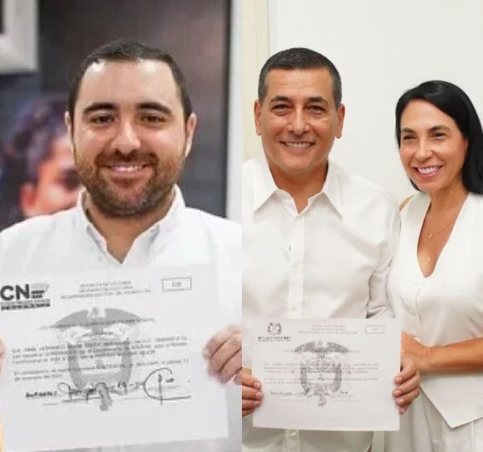
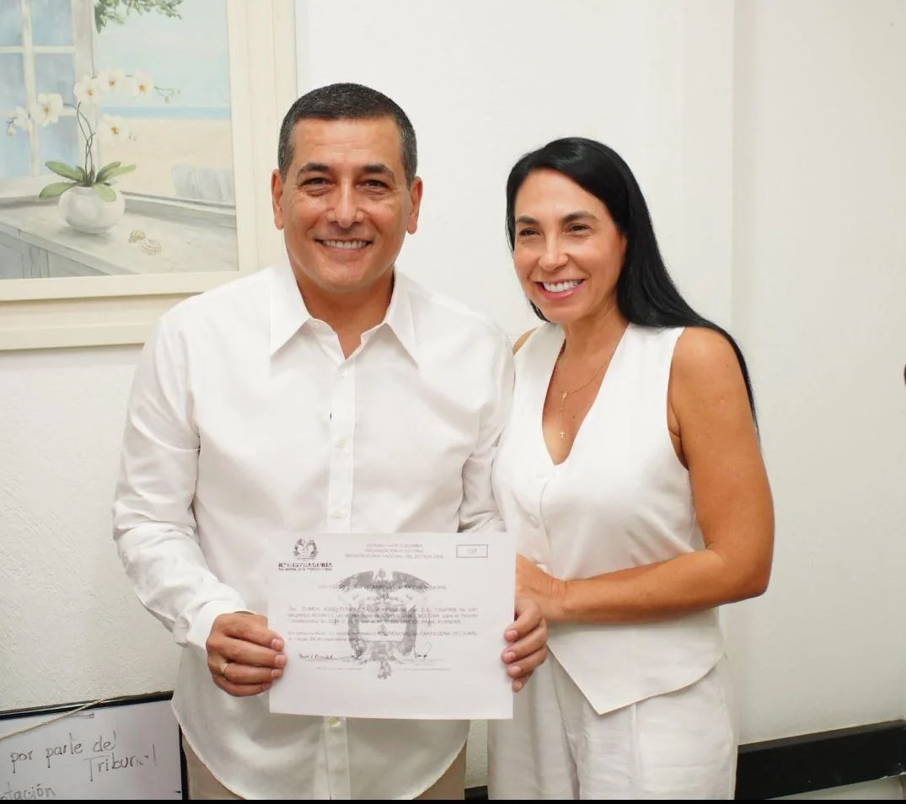
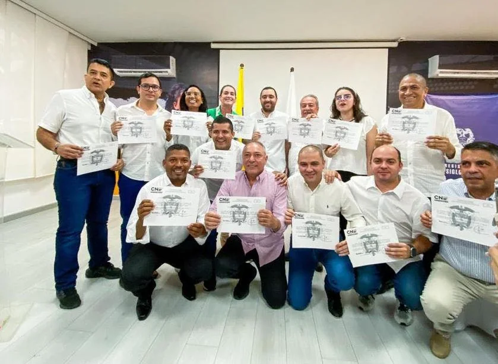

*Dumek y Yamilito recibieron credenciales y comenzó guerra sucia.*

Los mandatarios electos de Bolívar, **Yamil Hernando Arana Padauí**, y de Cartagena, **Dumek José Turbay Paz**, recibieron credenciales hoy martes, ante los delegados especiales de Bolívar y del registrador distrital de Cartagena, respectivamente. En el caso de **Dumek Turbay**, al recibir su credencial, la debió usar como escudo frente a la sistemática _**guerra sucia**_ con falsas noticias que deliberadamente desataron contra él. Campaña grosera y antiética como la conducta del alcalde saliente que es una pesadilla para los cartageneros.

Mientras tanto, **Yamil Arana,** quien recibió la mayor votación (**598.679 votos**) que gobernador alguno de Bolívar haya recibido, dijo con la credencial en manos:

> “Hoy recibo con mucha alegría y responsabilidad esta declaratoria formal como gobernador electo. Los retos y las expectativas son grandes y así mismo lo son nuestras ganas de trabajar con disciplina, sin descanso, por hacer de este sueño una realidad llamada un [#BolívarMejor](/articulos/hashtag/bol%C3%ADvarmejor?__eep__=6&__cft__[0]=AZVfUxB6JXBsFtuaYsRqKidrN9D3bxF5I1nQ9dHMiuMXttGKr3BYhkHXI87_H0djFRXyKSGM8LtALEX9GuIsye2o7AJ-1bVWPH8koLs33BkP-jdEDo5b0G8_SGJwhIMWHpbx_BZScKV9KBKCcl2e6PRBgR1sVcuN6KmzdOL6SUr1CuAyooNZTAWkJhvUDrZvgSA&__tn__=*NK-R)“

Te puede interesar: [Yamilito gobernador: «la gracia es de Dios y de la virgen de la Candelaria»](/articulos/yamilito-gobernador-la-gracia-es-de-dios-y-de-la-virgen-de-la-candelaria/)

## Recibieron credenciales en medio de guerra sucia

*Dumek Turbay, al lado de su esposa Liliana Majana, exibe la credencial de alcalde electo./foto suministrada.*

Los elegidos recibieron credenciales. Pero los detractores de Turbay utilizaron como artillería las investigaciones vigentes contra el nuevo mandatario de los cartageneros. Sin embargo, si bien algunos de esos procesos están vigentes, el nuevo mandatario de los cartageneros está seguro que los resolverá en las primeras de cambio de su administración.

De hecho, se busca enlodar la victoria de Dumek. El exgobernador, quieran o no lo quieran, ganó en franca lid el pasado 29 de octubre con un **resultado histórico**, como lo señalamos ese día. Obtuvo nada más y nada menos que **159.524 votos**. Un récord que lo tenía el difunto **Campo Elías Therán Dix**. Dumek lo rompió dentro la historia electoral de la alcaldía de Cartagena. Y eso denota que no solo fue un voto de maquinaria. También fue el voto castigo contra el pequeño malandrín que pronto saldrá con el rabo entre las piernas.

Pero, al tiempo que Dumek recibía la credencial, por redes sociales soltaron una **noticia falsa y burda:** citación a una supuesta audiencia de imputación y fijación de medida de aseguramiento. Tal parece que la estrategia de sus detractores es crear una sensación de elecciones atípicas afectando la imagen de un franco ganador.

Te puede interesar: [¡Conjurada la maldición! Dumek, alcalde electo de Cartagena (I)](/articulos/conjurada-la-maldicion-dumek-alcalde-electo/)

## Una burda guerra sucia

*Recibieron credenciales en medio de guerra sucia. Dumek aclaró y dijo que es un documento falso.*

Mientras **Dairo Turizo**, registrador distrital, le entregaba la credencial al alcalde electo, este periodista recibió los pantallazos de un supuesto auto emitido por la Corte Suprema de Justicia. Supuestamente, allí se fijaba una citación para el 24 de enero de 2024 donde el alcalde electo debería presentarse para una audiencia de imputación y medida de aseguramiento.

*Dairo Turizo, registrador distrital, entrega la credencial al alcalde electo./Captura de video.*

Si bien, a primera vista se nota la falsedad del documento, puede crear confusión e inducir al error a los periodistas que estén fuera de base. Además, obliga a los medios de comunicación averiguar las diferentes fuentes con el fin de descartar la falsedad. Pero el verdadero sentido de esas falsedades es crear una sensación determinada para disminuir la gobernabilidad del gobernante que, independientemente de sus errores, lo hará mejor, de la tierra a la luna.

En ese sentido, **VoxPopuli Digital** fue a la página de la Corte Suprema de Justicia donde se pudo comprobar que a la fecha de hoy no hubo ningún pronunciamiento. Tampoco en el Tribunal Superior de Cartagena. Mucho menos en la Fiscalía.

Por último, hablamos con Dumek Turbay. El mismo alcalde electo dijo a **VoxPopuli Digital**:

> Es falsa esa noticia. Es un fake. Sigue la guerra sucia. Y así lo seguirán haciendo.

## El gobernador y sus diputados

*Los diputados que recibieron credenciales 2023, junto con el gobernador Yamilito Arana./Foto suministrada.*

Delegados del Consejo Nacional Electoral (CNE) y de la Registraduría Especial del Estado Civil fueron los encargados de declarar oficialmente la elección de Arana Padauí, y delos diputados elegidos el pasado 29 de octubre.  

Además de **Zaith Adechine**, los diputados que recibieron las respectivas credenciales y que estuvieron presentes en la foto histórica que se publica:

Conservadores: **Javid Benavide**s (37.105 votos), **Luis Roberto Ballestas** (35.398 votos), **Juan Mejía López** (29.644 votos), **Alonso Del Río Jiménez** (26.180 votos) y **Eugenio Martínez Mora** (16.204 votos)-

Cambio Radical: **Víctor Mendoza Salem**e (33.639 votos), **Viviana Villalobos** (24.817) y **Karen Cure**.

Partido Liberal: **José Félix García Turbay** (30.992 votos) y **Ever Rico** con 17.986 votos.

Los partidos ASI, la U y Alianza Verde alcanzaron una curul cada uno: **Sofía Andrea Ricardo** (23.220 votos), Jorge **Rodríguez Sosa** (23.137) y **Oscar de León Guerrero**, recibió 6.150 votos.